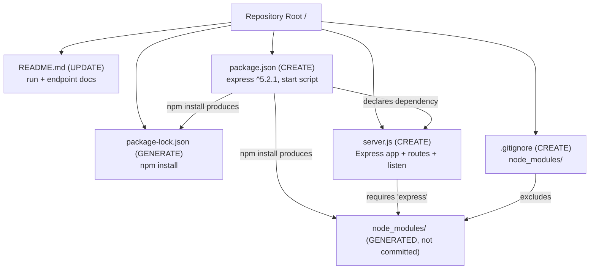

# Technical Specification

# 0. Agent Action Plan

## 0.1 Intent Clarification

This Agent Action Plan translates the user's feature request into a precise, file-level implementation plan for the Blitzy Platform. The request was analyzed against the actual contents of the `Artifact3` repository, and one finding fundamentally shapes the plan: the repository is a documentation-only placeholder containing a single file, `README.md`, whose entire content is the heading `# Artifact3` [README.md:L1]. No Node.js server, package manifest, or source code currently exists in the repository [§1.2.2 Repository Contents Inventory; §1.3.2 Confirmed Absent Artifact Categories]. The "existing tutorial server" the user describes is therefore not present in the codebase, so the plan faithfully establishes that baseline server and then layers on the requested feature.

The user's request is preserved verbatim below.

> User Request (verbatim): "add feature to a existing product. this is a tutorial of node js server hosting one endpoint that returns the response "Hello world". Could you add expressjs into the project and add another endpoint that return the reponse of "Good evening"?"

### 0.1.1 Core Feature Objective

Based on the prompt, the Blitzy platform understands that the new feature requirement is to deliver a runnable Node.js HTTP server built on the Express.js web framework that exposes **two** plain-text endpoints — the user's described baseline endpoint returning `Hello world`, and a **new** endpoint returning `Good evening`.

The requirements, restated with technical precision:

- **R1 — Introduce Express.js:** Add the Express.js web framework as the project's runtime dependency, declared in a package manifest and installed into the project's module tree.
- **R2 — Add the "Good evening" endpoint:** Define a new HTTP `GET` route whose response body is exactly `Good evening`.
- **R3 — Preserve the "Hello world" endpoint:** Continue serving the response body `Hello world` from the server's baseline route, maintaining the behavior the user expects.

Implicit requirements surfaced during analysis (not stated by the user but necessary for a working result):

- **The baseline server must be created, not just modified.** Because the repository contains only `README.md` [README.md:L1] and no source files or manifests [§1.3.2], there is no `Hello world` server to extend. The plan therefore creates the project manifest, the server entry file, and the baseline route from scratch, faithfully reproducing the tutorial the user has in mind.
- **A package manifest (`package.json`) is required** to declare the Express dependency, define a start script, and make the project installable via `npm install`.
- **The Express version must resolve to a real, installable release.** Analysis pins `express` to `^5.2.1`, the current latest stable release on the npm registry.
- **A runnable, documented entrypoint is required** — a start command (`npm start`) and a default listening port (conventionally `3000`) so the tutorial can actually be exercised.
- **Repository hygiene** — a `.gitignore` to exclude the installed `node_modules/` tree, and an updated `README.md` documenting how to install, run, and call both endpoints.

Feature dependencies and prerequisites:

- A Node.js runtime that satisfies Express 5's engine requirement (`node >= 18`); the verified environment provides Node.js v22.22.2, which satisfies this.
- The npm package registry must be reachable to install `express` and generate the lockfile (verified reachable during analysis).

### 0.1.2 Special Instructions and Constraints

- **No user-specified rules, setup instructions, or architectural directives were provided.** The `review_rules` input was empty and no environment setup instructions were attached, so the plan is driven solely by the prompt and by conventions idiomatic to a Node.js/Express tutorial.
- **Backward compatibility is a constraint.** The `Hello world` behavior the user describes must be preserved byte-for-byte; the new endpoint is additive and must not alter the baseline response.
- **Backend-only scope.** There is no graphical user interface, front-end framework, component library, or design system involved; both endpoints return plain-text HTTP bodies.
- **Preserve user examples exactly.** The two response strings are reproduced verbatim wherever they appear in this plan:
    - User Example (existing endpoint response): `Hello world`
    - User Example (new endpoint response): `Good evening`
- **Web search requirements.** The only external research required was confirming the current stable Express.js release and its Node engine requirement; this was performed against the live npm registry (see Section 0.2.2). No further external research is needed to implement the feature.

### 0.1.3 Technical Interpretation

These feature requirements translate to the following technical implementation strategy:

- **To introduce Express.js**, we will create `package.json` declaring `express` at `^5.2.1` plus a `start` script, and create a server entry file (`server.js`) that instantiates an Express application via `const app = express()`. Running `npm install` will resolve the dependency and produce `package-lock.json`.
- **To preserve the `Hello world` endpoint**, we will register `app.get('/', ...)` returning the body `Hello world` so the baseline behavior is served through the new Express routing layer.
- **To add the `Good evening` endpoint**, we will register a second route `app.get('/good-evening', ...)` returning the body `Good evening`.
- **To make the tutorial runnable and documented**, we will bind the app to a configurable port (`process.env.PORT || 3000`) via `app.listen(...)`, create a `.gitignore` excluding `node_modules/`, and update `README.md` with prerequisites, install/run steps, and an endpoint reference.

This approach unifies both endpoints under a single Express routing layer (rather than a hybrid of the native `http` module and Express), which is the most maintainable and idiomatic interpretation of "add expressjs into the project."

## 0.2 Repository Scope Discovery

A complete traversal of the repository was performed using directory listing, version-control inspection, and the repository's own folder summaries. The repository is minimal: it tracks exactly one file, and there are no subdirectories, source files, or manifests to integrate with [README.md:L1; §1.2.2; §1.3.2]. Consequently, every integration point a typical "add feature" task would modify must instead be created as part of this plan.

### 0.2.1 Comprehensive File and Integration-Point Analysis

The full inventory of existing repository contents is as follows:

| Existing Path | Type | Current Content / Role | Disposition in This Plan |
|---------------|------|------------------------|--------------------------|
| `README.md` | Markdown file | Single heading `# Artifact3`; documentation only, no runtime role [README.md:L1; §1.2.2] | **UPDATE** — add run instructions and endpoint reference |
| `.git/` | Directory | Version-control metadata; single "Initial commit" on `main` | Not modified |

Integration-point discovery — the conventional touchpoints an Express feature would attach to, and their status in this repository:

| Integration Point | Conventional Location | Status in `Artifact3` | Action |
|-------------------|-----------------------|------------------------|--------|
| HTTP server bootstrap (`listen`) | server entry file | Does not exist | **CREATE** in `server.js` |
| Route registration layer | router / app routes | Does not exist | **CREATE** routes `GET /` and `GET /good-evening` in `server.js` |
| Dependency manifest | `package.json` | Does not exist [§3.4.1] | **CREATE** with `express` dependency |
| Dependency lockfile | `package-lock.json` | Does not exist | **GENERATE** via `npm install` |
| Database models / migrations | — | Not applicable (no persistence in scope) | None |
| Middleware / interceptors | — | Not applicable (none required) | None |

The key conclusion is that there are **no existing code touchpoints**; the only existing-file modification is documentation (`README.md`). All server logic is net-new.

### 0.2.2 Web Search Research Conducted

External verification was limited to the dependency facts needed to pin a real, installable version. This was confirmed directly against the live npm registry rather than relying on assumed versions:

- **Current stable Express.js release:** the registry `latest` dist-tag resolves to `express@5.2.1`; the `latest-4` dist-tag resolves to `express@4.22.2`.
- **Engine requirement for Express 5.2.1:** the package's `engines` field requires `node >= 18`, which the verified runtime (Node.js v22.22.2) satisfies.
- **Installation/functional validation:** `npm install express` resolved `express@5.2.1` cleanly under Node.js 22, and a minimal two-route Express app returned `Hello world` for `GET /` and `Good evening` for `GET /good-evening` in a smoke test.

No additional research (best-practice patterns, security considerations, or alternative libraries) is required, given the deliberately minimal, tutorial-grade scope.

### 0.2.3 New File Requirements

The following new files will be created to establish the server and the feature:

- `package.json` — project manifest declaring the `express` dependency (`^5.2.1`), the `start` script (`node server.js`), the entrypoint (`main`), and the Node engine constraint (`>=18`).
- `server.js` — the Express server entry: instantiates the app, registers `GET /` (`Hello world`) and `GET /good-evening` (`Good evening`), and listens on `process.env.PORT || 3000`.
- `.gitignore` — excludes the installed dependency tree (`node_modules/`) and common noise (npm debug logs, local `.env`).
- `package-lock.json` — generated by `npm install`; pins `express@5.2.1` and its transitive dependency tree for reproducible installs.

The planned target structure and its relationships are shown below.




## 0.3 Dependency Inventory

This feature introduces exactly one new runtime dependency. Because the repository has no prior manifest [§3.4.1], there are no dependency updates or removals to reconcile — this is a greenfield install with no version conflicts.

### 0.3.1 Package Registry

| Registry | Package | Version | License | Purpose |
|----------|---------|---------|---------|---------|
| npm (registry.npmjs.org) | `express` | `^5.2.1` (resolves to `5.2.1`) | MIT | Web framework providing the HTTP routing and response helpers used by both endpoints |
| Node.js runtime (platform) | `node` | `>=18` (target 22.x LTS; verified v22.22.2) | — | JavaScript runtime hosting the server; declared via `engines.node` |

Notes on version selection:

- `express@5.2.1` is the current npm `latest` dist-tag and the default version installed by `npm install express`; it was verified to install and run under the active Node.js runtime.
- The package's `engines` field requires `node >= 18`, satisfied by the verified Node.js v22.22.2.
- `express@5.2.1` resolves to 28 direct dependencies and approximately 123 total packages in its dependency tree; all are transitive and are pinned automatically by `package-lock.json` at install time. No transitive dependency needs to be declared directly.
- No `devDependencies` are required for this minimal tutorial. (A live-reload tool such as `nodemon` is intentionally excluded from scope unless requested.)

### 0.3.2 Dependency and Reference Updates

- **Import updates:** There are no pre-existing source files and therefore no existing import statements to transform. The new `server.js` will import Express using CommonJS (`const express = require('express')`), consistent with a default `package.json` that does not set `"type": "module"`.
- **External reference updates:** Limited to the two manifest/documentation files this plan already touches — `package.json` (declares the dependency and scripts) and `README.md` (documents install/run). No CI/CD, build, or configuration files exist in the repository, so none require updating.
- **Additions / Removals:** One addition (`express`); zero updates; zero removals.

## 0.4 Integration Analysis

Integration analysis confirms that this feature has no coupling to existing runtime code, because none exists. The single existing artifact, `README.md`, is documentation with no runtime role [§1.2.2]. The feature is therefore self-contained within the new files it introduces.

### 0.4.1 Existing Code Touchpoints

- **Direct code modifications required:** None. There is no application entrypoint, route table, model index, or service container to wire into [§1.3.2]. All server bootstrap, routing, and dependency wiring are created fresh inside `server.js` and `package.json`.
- **Documentation touchpoint (the only existing-file change):**
    - `README.md` — extend the current `# Artifact3` content [README.md:L1] with prerequisites, install/run instructions, and an endpoint reference table for `GET /` (`Hello world`) and `GET /good-evening` (`Good evening`).
- **Dependency injection / service registration:** Not applicable — the tutorial uses direct route handlers on a single Express app instance; there is no DI container or service registry to update.
- **Database / schema updates:** Not applicable — the feature is stateless and introduces no persistence, migrations, or schema [§1.3.2].

The internal integration that *is* established by this plan is the dependency-and-routing wiring among the new files: `package.json` declares `express`, `npm install` materializes it under `node_modules/`, and `server.js` requires `express` and registers both routes on a single app instance bound to a configurable port.

## 0.5 Technical Implementation

This section defines the exact files to create or modify and the approach for each. Every file listed here is required for the feature to function. The route behavior below was validated end-to-end during analysis (both endpoints returned their expected bodies under Express 5.2.1 on Node.js 22).

### 0.5.1 File-by-File Execution Plan

| Mode | Path | Purpose |
|------|------|---------|
| CREATE | `package.json` | Declare `express@^5.2.1`, the `start` script, `main` entrypoint, and `engines.node >= 18` |
| CREATE | `server.js` | Express app: register `GET /` → `Hello world`, `GET /good-evening` → `Good evening`, listen on `process.env.PORT || 3000` |
| CREATE | `.gitignore` | Exclude `node_modules/`, npm debug logs, and local `.env` |
| UPDATE | `README.md` | Add overview, prerequisites, install/run steps, and endpoint reference [README.md:L1] |
| GENERATE | `package-lock.json` | Produced by `npm install`; pins `express@5.2.1` and transitive tree |

There are no file deletions, and no input-sourced REFERENCE files (the prompt cited no external files).

### 0.5.2 Implementation Approach per File

- **`package.json` (CREATE):** Establish the project manifest. Set `name` to `artifact3`, `version` to `1.0.0`, `main` to `server.js`, `scripts.start` to `node server.js`, `dependencies.express` to `^5.2.1`, and `engines.node` to `>=18`. This makes the project installable and runnable via standard npm commands.
- **`server.js` (CREATE):** Establish the server foundation and both routes on a single Express app. The verified core logic is:

```js
const express = require('express');
const app = express();
const PORT = process.env.PORT || 3000;
app.get('/', (req, res) => res.send('Hello world'));
app.get('/good-evening', (req, res) => res.send('Good evening'));
app.listen(PORT, () => console.log(`Server listening on http://localhost:${PORT}`));
```

  Both handlers return plain-text bodies with HTTP 200, reproducing the user's strings exactly. The entry filename `server.js` is used throughout; `index.js` or `app.js` are equivalent alternatives provided `package.json`'s `main`/`start` are kept consistent.
- **`.gitignore` (CREATE):** Prevent the installed dependency tree from being committed by ignoring `node_modules/`, plus `npm-debug.log*` and `.env` defensively.
- **`README.md` (UPDATE):** Retain the `# Artifact3` heading [README.md:L1] and append an overview (Node.js + Express tutorial), prerequisites (Node.js `>=18`, 22 LTS recommended), install (`npm install`) and run (`npm start`) instructions, and an endpoint table mapping `GET /` → `Hello world` and `GET /good-evening` → `Good evening`.
- **`package-lock.json` (GENERATE):** Created automatically by `npm install`; committed for reproducible installs. No manual authoring.

Implementation sequence (describing how, not when): create `package.json`, `server.js`, and `.gitignore`; run `npm install` to add Express and generate the lockfile; start the server and verify both endpoints; update `README.md`.

### 0.5.3 User Interface Design Applicability

User interface design is **not applicable** to this feature. `Artifact3` is a backend HTTP service that returns plain-text response bodies; there is no graphical user interface, front-end framework, templating layer, static assets, component library, or design system involved, and no Figma or visual design references were provided. The only "interface" is the HTTP contract — two `GET` routes (`/` returning `Hello world` and `/good-evening` returning `Good evening`) — which is fully specified in Sections 0.5.1 and 0.5.2. The Design System Alignment Protocol does not apply.

## 0.6 Scope Boundaries

The scope below is complete and closed: every requirement maps to a concrete file action, and no future-work placeholders remain.

### 0.6.1 Exhaustively In Scope

- Project manifest and lockfile:
    - `package.json` (CREATE) — `express@^5.2.1`, `start` script, `engines.node >=18`
    - `package-lock.json` (GENERATE via `npm install`) — pinned dependency tree
- Server source:
    - `server.js` (CREATE) — Express app, routes `GET /` and `GET /good-evening`, `app.listen(...)`
- Repository hygiene:
    - `.gitignore` (CREATE) — `node_modules/`, npm debug logs, `.env`
- Documentation:
    - `README.md` (UPDATE) — install/run steps and endpoint reference
- Generated, not committed:
    - `node_modules/**` — produced by `npm install`, excluded by `.gitignore`

Requirement coverage check:

- R1 (add Express.js) → `package.json` dependency + `npm install` + `require('express')` in `server.js` — covered.
- R2 (new "Good evening" endpoint) → `server.js` route `GET /good-evening` — covered.
- R3 (preserve "Hello world") → `server.js` route `GET /` — covered.

### 0.6.2 Explicitly Out of Scope

- Any additional endpoints or routes beyond `GET /` and `GET /good-evening`.
- Authentication, authorization, sessions, or security middleware (not requested).
- Databases, persistence, ORMs, or migrations (not requested; none exist).
- Front-end/UI, templating, static assets, or any design system (backend-only service).
- Test suites or test frameworks (not requested; may be added in a later iteration).
- CI/CD pipelines, Dockerfiles, infrastructure-as-code, and deployment configuration.
- TypeScript/transpilation, linters, formatters, or build tooling.
- Developer experience tooling such as `nodemon` / hot reload.
- Performance tuning, clustering, structured logging frameworks, or configuration libraries beyond reading `process.env.PORT`.
- Any modification to `.git/` internals or unrelated repository metadata.

Assumptions adopted where the prompt was silent (adjustable on request): the new endpoint is exposed at `GET /good-evening`; the server listens on port `3000` by default; the module style is CommonJS; and the entry file is named `server.js`.

## 0.7 Rules for Feature Addition

No explicit user-specified rules were provided (the rules input was empty, and no setup instructions were attached). The following governing conventions are therefore derived from the prompt's intent and standard Node.js/Express practice, and must be honored during implementation:

- **Verbatim responses:** The endpoint bodies must match the user's strings exactly — `Hello world` and `Good evening` — with no additional formatting, punctuation, or wrapping.
- **Backward compatibility:** The baseline `Hello world` behavior must be preserved as an additive change; introducing the new endpoint must not alter or remove the existing one.
- **Idiomatic Express integration:** Serve both endpoints through a single Express application and routing layer (the most direct reading of "add expressjs into the project"), rather than mixing the native `http` module with Express.
- **Real, pinned versions only:** Use the verified `express@^5.2.1` and a Node.js engine constraint of `>=18`; do not use placeholder versions such as `latest` or `1.0.0`.
- **Runnable tutorial:** The result must be installable and runnable with standard commands (`npm install`, then `npm start`), and the `README.md` must document how to run it and call both endpoints — consistent with the user's framing of the project as a tutorial.
- **Minimal footprint:** Keep the implementation small and dependency-light; do not introduce frameworks, tooling, or abstractions beyond what the two endpoints require (see Section 0.6.2).

## 0.8 Attachments

No attachments were provided with this request. The `review_attachments` input returned no items — there are no PDFs, images, documents, or other uploaded files associated with this project.

No Figma designs were provided — there are no Figma frames, screens, or URLs to catalog, and no design-to-system mapping is required.

All requirements for this Agent Action Plan were derived solely from the user's text prompt (reproduced in Section 0.1) and from direct inspection of the repository.

