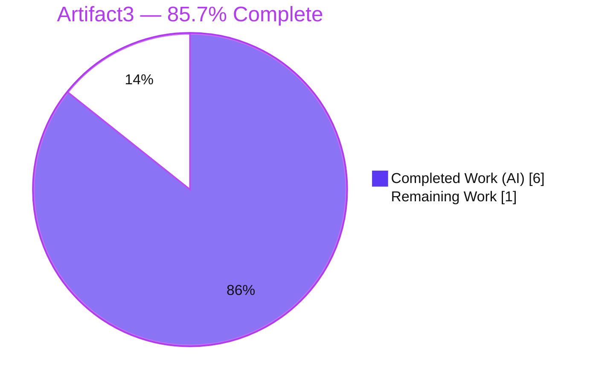
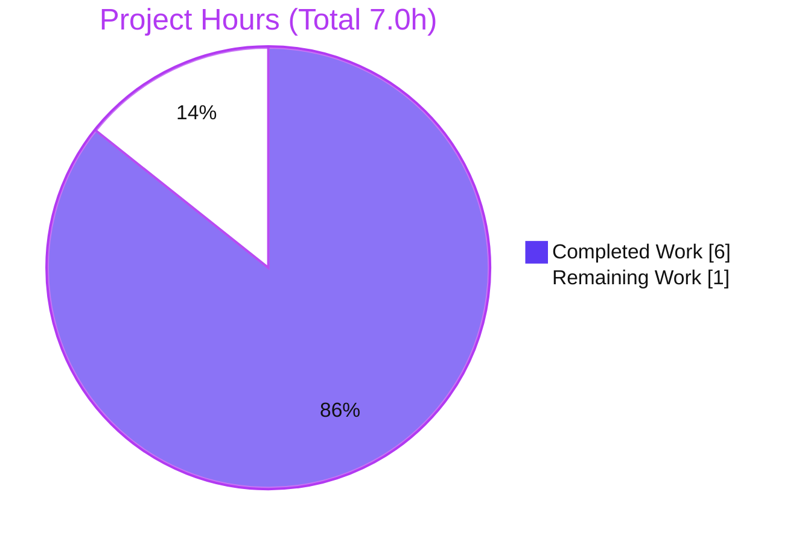

# Blitzy Project Guide — Artifact3 (Node.js + Express.js Tutorial Server)

> **Branch:** `blitzy-6b6f0c67-9860-453e-9caa-aab10b02e919` · **HEAD:** `aff00de` · **Runtime:** Node.js v20.20.2 / npm 11.1.0 · **Status:** Production-ready (pending human review & merge)

---

## 1. Executive Summary

### 1.1 Project Overview

`Artifact3` is a minimal, dependency-light **Node.js HTTP server built on Express.js** that serves two plain-text `GET` endpoints. The project began as a documentation-only repository (a single `README.md` containing the heading `# Artifact3`); the Blitzy agents created the entire runnable server from scratch. The objective was to introduce the Express.js framework and expose a **new** `GET /good-evening` endpoint returning `Good evening`, while preserving the tutorial's baseline `GET /` endpoint returning `Hello world`. The target audience is developers learning Node.js/Express. Technical scope is backend-only: no UI, database, or authentication — just two routes returning verbatim plain-text bodies on a configurable port.

### 1.2 Completion Status



| Metric | Hours |
|--------|-------|
| **Total Project Hours** | **7.0** |
| Completed Hours (AI + Manual) | 6.0 (AI: 6.0 · Manual: 0.0) |
| Remaining Hours | 1.0 |
| **Percent Complete** | **85.7%** |

> **How to read this:** 100% of the AAP-scoped engineering deliverables are complete and validated with zero defects. The remaining **1.0 h** is the human review-and-merge governance gate (genuine path-to-production work). By the hours arithmetic of a very small project, this yields **85.7%** complete. Colors: **Completed = Dark Blue `#5B39F3`**, **Remaining = White `#FFFFFF`**.

### 1.3 Key Accomplishments

- ✅ **Express.js introduced (R1)** — `express@^5.2.1` declared in `package.json`, installed (66 packages, **0 vulnerabilities**), and pinned to `5.2.1` in `package-lock.json`.
- ✅ **New `GET /good-evening` endpoint added (R2)** — returns the exact body `Good evening` (HTTP 200, 12 bytes).
- ✅ **Baseline `GET /` endpoint preserved (R3)** — returns the exact body `Hello world` (HTTP 200, 11 bytes), now served through Express.
- ✅ **Runnable tutorial delivered** — `npm install` → `npm start` boots the server on `http://localhost:3000`; `PORT` override verified.
- ✅ **Repository hygiene** — `.gitignore` excludes `node_modules/`; the dependency tree is not committed.
- ✅ **Documentation** — `README.md` rewritten with overview, prerequisites, install/run steps, `PORT` override, and an endpoint reference table.
- ✅ **Autonomous end-to-end validation** — 5 production-readiness gates passed; both endpoints verified via `curl` and Chrome (zero JS errors); 3 screenshots captured.
- ✅ **Zero defects** — the Final Validator made **zero modifications**; every in-scope file was already correct.

### 1.4 Critical Unresolved Issues

| Issue | Impact | Owner | ETA |
|-------|--------|-------|-----|
| _None_ | No critical unresolved issues identified. All AAP deliverables are complete, compile cleanly, and pass functional/runtime validation with zero defects. | — | — |

### 1.5 Access Issues

| System/Resource | Type of Access | Issue Description | Resolution Status | Owner |
|-----------------|----------------|-------------------|-------------------|-------|
| _None_ | — | **No access issues identified.** The npm registry was reachable for install, the repository/branch is accessible, and no third-party credentials or service permissions are required by this project. | N/A | — |

### 1.6 Recommended Next Steps

1. **[High]** Perform final human code review and acceptance verification of the 5-file changeset — read the diff, run `npm ci`, `npm start`, and `curl` both endpoints to confirm exact bodies. *(~0.5 h)*
2. **[Medium]** Merge the validated branch `blitzy-6b6f0c67-9860-453e-9caa-aab10b02e919` into `main` and tag/record the release. *(~0.5 h)*
3. **[Low]** *(Optional, beyond current AAP scope — not counted in project hours)* If productionizing beyond a local tutorial, add a minimal endpoint smoke test (`node:test` + `supertest`).
4. **[Low]** *(Optional, beyond current AAP scope)* Add a CI workflow (install + smoke test on push/PR) and a deployment artifact (Dockerfile / Procfile / host config).
5. **[Low]** *(Optional, beyond current AAP scope)* Add operational hardening (graceful `SIGTERM` shutdown, a `/health` endpoint, structured request logging) before public hosting.

---

## 2. Project Hours Breakdown

### 2.1 Completed Work Detail

| Component | Hours | Description |
|-----------|-------|-------------|
| `package.json` (R1) | 0.5 | Project manifest: Express `^5.2.1` version research/pinning, `start` script, `main`, `engines.node >=18`, MIT license. |
| Dependency install + `package-lock.json` (R1) | 0.5 | `npm install` to resolve Express, generate the lockfile (lockfileVersion 3, pins `5.2.1`), and materialize `node_modules/` (65 packages). |
| `server.js` (R2 + R3) | 1.5 | Express app on a single instance: `GET /` → `Hello world`, `GET /good-evening` → `Good evening`, `PORT` config (`process.env.PORT \|\| 3000`), `app.listen`, plus thorough JSDoc/inline documentation. |
| `.gitignore` | 0.25 | Repository hygiene: ignore `node_modules/`, `npm-debug.log*`, `.env`. |
| `README.md` | 1.0 | Comprehensive tutorial docs: overview, prerequisites, install/run, `PORT` override, endpoint reference table, `curl` examples. |
| Autonomous validation & verification | 2.25 | 5 readiness gates (dependency install, compilation, runtime, functional) + Chrome browser verification + 3 screenshots + `npm audit` + results documentation. |
| **Total Completed** | **6.0** | |

### 2.2 Remaining Work Detail

| Category | Hours | Priority |
|----------|-------|----------|
| Final human review & acceptance verification of the changeset (run install/start, exercise both endpoints) | 0.5 | High |
| Merge validated branch to `main` & record/tag release | 0.5 | Medium |
| **Total Remaining** | **1.0** | |

> **Note on optional enhancements:** Test suites, CI/CD, Docker/IaC, deployment config, and operational hardening are **explicitly out of scope** per AAP §0.6.2 ("not requested; may be added in a later iteration"). Per the AAP-scoped completion methodology, these are *not* counted in the project's remaining hours; they are surfaced as optional `[Low]` recommendations in Sections 1.6 and 8 (indicative effort ≈ 7 h if pursued).

### 2.3 Hours Calculation

```
Completion % = Completed Hours / (Completed Hours + Remaining Hours) × 100
             = 6.0 / (6.0 + 1.0) × 100
             = 6.0 / 7.0 × 100
             = 85.7%
```

---

## 3. Test Results

The project contains **no formal automated test suite** — test frameworks are explicitly out of scope per AAP §0.6.2. The table below aggregates the **autonomous validation checks executed by Blitzy's validation systems** (all entries originate from Blitzy's autonomous validation logs for this project and were independently re-verified in the container).

| Test Category | Framework / Tool | Total Checks | Passed | Failed | Coverage % | Notes |
|---------------|------------------|--------------|--------|--------|-----------|-------|
| Dependency Install | `npm ci` + `npm audit` | 1 | 1 | 0 | N/A | 66 packages added; **0 vulnerabilities**; `express@5.2.1` resolved. |
| Static Compilation | `node --check` + JSON parse | 3 | 3 | 0 | N/A | `server.js` syntax OK; `package.json` & `package-lock.json` valid JSON. |
| Functional (HTTP) | `curl` exact-body/status assertions | 4 | 4 | 0 | 100% of in-scope routes | `GET /`→200 "Hello world"; `GET /good-evening`→200 "Good evening"; undefined route→404; `X-Powered-By: Express`. |
| Runtime / Startup | `node` / `npm start` | 2 | 2 | 0 | N/A | Default `:3000` startup + `PORT=8080` override (port 3000 stays free). |
| Browser / UI Render | Chrome DevTools | 2 | 2 | 0 | N/A | Both endpoints render exact text; single StaticText a11y node; **0 JS errors**. |
| Unit / Integration (formal) | — | 0 | 0 | 0 | 0% | Out of scope per AAP §0.6.2 (not requested). |
| **Total** | | **12** | **12** | **0** | — | **100% pass rate** across all autonomous validation checks. |

---

## 4. Runtime Validation & UI Verification

**Legend:** ✅ Operational · ⚠ Partial / Informational · ❌ Failing

**Runtime health**
- ✅ Server starts cleanly: `npm start` logs `Server listening on http://localhost:3000`; clean startup and shutdown.
- ✅ Configurable port honored: `PORT=8080 npm start` listens on 8080; port 3000 remains free (`process.env.PORT || 3000`).

**HTTP / API verification**
- ✅ `GET /` → HTTP **200**, body exactly `Hello world` (11 bytes, no trailing newline).
- ✅ `GET /good-evening` → HTTP **200**, body exactly `Good evening` (12 bytes, no trailing newline).
- ✅ `GET /<undefined>` → HTTP **404** — confirms exactly the two in-scope routes exist (no extra endpoints).
- ✅ Response header `X-Powered-By: Express` confirms Express serves both routes.

**UI / Browser verification (Chrome)**
- ✅ Both endpoints render their exact text in the browser; accessibility tree shows a single `StaticText` node per endpoint.
- ✅ **Zero JavaScript errors** in the console. Screenshots saved to `blitzy/screenshots/`.
- ⚠ A benign **"Quirks Mode"** console notice appears — expected for a bare-string `res.send()` (no DOCTYPE). Accepted by design: wrapping the body in HTML would violate the AAP §0.7 verbatim-response rule.

**External API integrations**
- ✅ N/A — the service has no external/database/third-party integrations by design.

---

## 5. Compliance & Quality Review

Cross-mapping of AAP deliverables and governing rules to their validation status. **Fixes applied during autonomous validation: none** — every in-scope file was already correct (zero defects).

| Benchmark / AAP Item | Requirement | Status | Progress | Notes |
|----------------------|-------------|--------|----------|-------|
| R1 — Introduce Express.js | `express ^5.2.1` declared + installed + required | ✅ Pass | 100% | Lockfile pins `5.2.1`; `require('express')` in `server.js`. |
| R2 — `GET /good-evening` | Returns `Good evening` | ✅ Pass | 100% | HTTP 200, 12 bytes. |
| R3 — Preserve `GET /` | Returns `Hello world` | ✅ Pass | 100% | HTTP 200, 11 bytes; served via Express. |
| Verbatim responses (§0.7) | Byte-exact bodies | ✅ Pass | 100% | No extra formatting/whitespace. |
| Backward compatibility (§0.7) | `/` preserved additively | ✅ Pass | 100% | New route is purely additive. |
| Idiomatic Express (§0.7) | Single Express app/routing layer | ✅ Pass | 100% | No native `http` module mixing. |
| Real, pinned versions (§0.7) | `express 5.2.1`, `node >=18` | ✅ Pass | 100% | No `latest`/placeholder versions. |
| Runnable tutorial (§0.7) | `npm install` + `npm start` | ✅ Pass | 100% | Validated end-to-end. |
| Repository hygiene | `.gitignore` excludes `node_modules/` | ✅ Pass | 100% | Dependency tree not committed. |
| Documentation | README install/run/endpoints | ✅ Pass | 100% | Heading preserved + full tutorial docs. |
| Dependency security | `npm audit` clean | ✅ Pass | 100% | **0 vulnerabilities**. |
| Code documentation (CQ2) | Inline comments / JSDoc | ✅ Pass | 100% | `server.js` thoroughly documented. |
| Zero placeholder policy | No TODO/stub/dead code | ✅ Pass | 100% | Complete, production-ready implementation. |

**Outstanding compliance items:** Human review & merge (governance gate) — see Section 2.2.

---

## 6. Risk Assessment

All identified risks are **Low** or **Informational**; none are blocking. Open items are explicitly-accepted consequences of the deliberately minimal AAP scope.

| Risk | Category | Severity | Probability | Mitigation | Status |
|------|----------|----------|-------------|------------|--------|
| T1 — Caret range `^5.2.1` could auto-bump on a fresh `npm install` | Technical | Low | Low | `package-lock.json` pins the exact tree; use `npm ci` for reproducible installs. | Mitigated |
| T2 — No automated tests; future `server.js` edits could silently break endpoints | Technical | Low | Medium | Optional smoke test (beyond AAP scope §0.6.2). | Accepted (per scope) |
| T3 — Browser "Quirks Mode" notice (bare-string body, no DOCTYPE) | Technical | Informational | N/A | None — HTML wrapping would violate the §0.7 verbatim-response rule. | Accepted by design |
| S1 — Dependency vulnerabilities in the Express tree | Security | Low | Low | `npm audit` = **0 vulnerabilities** at validation; schedule periodic re-audit. | Mitigated |
| S2 — No security middleware; `X-Powered-By: Express` exposed | Security | Low | Low | Add `helmet`/CORS/rate-limiting if publicly exposed (beyond scope). | Accepted (per scope) |
| S3 — No authentication/authorization | Security | Low | N/A | Not required — public plain-text tutorial, no sensitive data. | Accepted by design |
| O1 — No graceful `SIGTERM` shutdown | Operational | Low | Low | Add a `SIGTERM` handler if deployed under an orchestrator. | Accepted (localhost) |
| O2 — No `/health` endpoint or structured logging/monitoring | Operational | Low | Low | Optional, beyond AAP scope. | Accepted (per scope) |
| O3 — Single process, no clustering/horizontal scaling | Operational | Low | Low | Out of scope for a tutorial. | Accepted by design |
| I1 — npm registry reachability required for a fresh install | Integration | Low | Low | Committed `package-lock.json` enables `npm ci`; vendor `node_modules/` if air-gapped. | Mitigated |
| I2 — `engines.node >=18` declared but not enforced | Integration | Low | Low | Documented prerequisite; optionally add `.nvmrc` / `engine-strict`. | Mitigated |
| I3 — No external service/DB/third-party API integrations exist | Integration | N/A | N/A | None by design. | N/A |

**Overall risk posture: LOW.** No high/medium-severity risks; no blockers.

---

## 7. Visual Project Status

**Project hours breakdown** (Completed = Dark Blue `#5B39F3`, Remaining = White `#FFFFFF`):



**Remaining work by priority** (sums to the 1.0 h Remaining total):

| Priority | Hours | Tasks |
|----------|-------|-------|
| 🔵 High | 0.5 | Final human review & acceptance verification |
| 🔵 Medium | 0.5 | Merge to `main` & record release |
| ⚪ Low | 0.0 | *(Optional enhancements are out of AAP scope — not counted)* |
| **Total** | **1.0** | |

> **Integrity:** The "Remaining Work" value (1.0 h) equals the Remaining Hours in Section 1.2 and the sum of the Section 2.2 "Hours" column.

---

## 8. Summary & Recommendations

**Achievements.** The Blitzy agents transformed a documentation-only repository into a complete, runnable Node.js + Express.js tutorial server across 3 commits. All three explicit requirements are met and validated: Express.js is introduced (R1), the new `GET /good-evening` → `Good evening` endpoint is added (R2), and the baseline `GET /` → `Hello world` endpoint is preserved (R3). All five AAP file deliverables (`package.json`, `server.js`, `.gitignore`, `README.md`, `package-lock.json`) exist, compile/parse cleanly, and pass functional, runtime, and browser validation with **zero defects** and **zero dependency vulnerabilities**.

**Remaining gaps.** None within the AAP engineering scope. The only remaining work is the **human review-and-merge governance gate** (1.0 h) — the standard path-to-production step that follows autonomous delivery.

**Critical path to production.** (1) Human acceptance review (run install/start, exercise both endpoints) → (2) merge the validated branch into `main` → (3) tag/record release. Optional, explicitly out-of-scope hardening (tests, CI/CD, containerization, `/health`, graceful shutdown) is recommended *only* if the project is taken beyond a local tutorial.

**Success metrics.** Both endpoints return their exact required bodies (HTTP 200); undefined routes return 404; `npm ci` reports 0 vulnerabilities; the server starts on the default and overridden ports.

**Production-readiness assessment.** The codebase is **production-ready for its defined tutorial scope**. The project is **85.7% complete** by the AAP-scoped hours methodology — 100% of engineering deliverables are done; the residual 14.3% (1.0 h) is the human review-and-merge gate. Recommendation: **approve and merge.**

| Metric | Value |
|--------|-------|
| AAP requirements met (R1/R2/R3) | 3 of 3 (100%) |
| File deliverables complete | 5 of 5 (100%) |
| Autonomous validation checks passed | 12 of 12 (100%) |
| Dependency vulnerabilities | 0 |
| Completion (by hours) | 85.7% |
| Remaining (human gate) | 1.0 h |

---

## 9. Development Guide

A complete, copy-pasteable guide to build, run, and troubleshoot the server. **Every command below was executed successfully** in the validation environment.

### 9.1 System Prerequisites

- **Node.js `>= 18`** (Node.js 22 LTS recommended; validated on **v20.20.2**). Check: `node --version`.
- **npm** (bundled with Node.js; validated on **11.1.0**). Check: `npm --version`.
- **Internet connection** for the initial install (to fetch Express from the npm registry).
- ~50 MB free disk for `node_modules/`.

### 9.2 Environment Setup

```bash
# From the repository root (no .env file is required):
node --version   # expect v18+ (v20.20.2 validated)
npm --version    # expect 9+ (11.1.0 validated)

# Optional: choose a custom port (defaults to 3000)
export PORT=3000
```

### 9.3 Dependency Installation

```bash
# Reproducible install from the committed lockfile (preferred):
npm ci

# — or — standard install:
npm install
```

**Expected output:** `added 66 packages, and audited 67 packages ... found 0 vulnerabilities`. Verify Express resolved: `npm ls express` → `express@5.2.1`.

### 9.4 Application Startup

```bash
# Start on the default port (3000):
npm start
# -> Server listening on http://localhost:3000

# Start on a custom port:
PORT=8080 npm start
# -> Server listening on http://localhost:8080
```

`npm start` runs `node server.js`. Stop the server with `Ctrl+C` (foreground) or `kill <pid>` (background).

### 9.5 Verification

```bash
# Optional static syntax check (read-only):
node --check server.js          # (no output = OK)

# With the server running, exercise both endpoints:
curl http://localhost:3000/                 # -> Hello world
curl http://localhost:3000/good-evening     # -> Good evening

# Negative test (undefined route should 404):
curl -s -o /dev/null -w "%{http_code}\n" http://localhost:3000/nope   # -> 404
```

### 9.6 Example Usage

```bash
# Inspect status + headers:
curl -i http://localhost:3000/
# HTTP/1.1 200 OK
# X-Powered-By: Express
# Content-Type: text/html; charset=utf-8
# ...
# Hello world
```

You can also open `http://localhost:3000/` and `http://localhost:3000/good-evening` in a browser to see the plain-text responses.

### 9.7 Troubleshooting

| Symptom | Cause | Resolution |
|---------|-------|------------|
| `Error: listen EADDRINUSE :::3000` | Port 3000 already in use | Start on another port: `PORT=8080 npm start`, or free port 3000. |
| `Error: Cannot find module 'express'` | Dependencies not installed | Run `npm ci` (or `npm install`) from the repository root. |
| `npm ci` fails: lockfile mismatch | `package.json`/`package-lock.json` out of sync | Run `npm install` to regenerate the lockfile, then commit it. |
| Server exits immediately / engine error | Node.js version `< 18` | Upgrade Node.js to `>=18` (`engines.node` requirement). |
| Browser console shows "Quirks Mode" | Bare-string `res.send()` has no DOCTYPE | **Benign/expected** — no action needed (HTML wrapping would change the verbatim body). |

---

## 10. Appendices

### A. Command Reference

| Command | Purpose |
|---------|---------|
| `npm ci` | Reproducible dependency install from `package-lock.json`. |
| `npm install` | Install/resolve dependencies; (re)generate the lockfile. |
| `npm start` | Start the server (`node server.js`) on `PORT` or 3000. |
| `npm ls express` | Confirm the installed Express version (`express@5.2.1`). |
| `npm audit` | Check dependencies for known vulnerabilities (expect 0). |
| `node --check server.js` | Read-only syntax validation of the entry file. |
| `curl http://localhost:3000/` | Call the baseline endpoint (`Hello world`). |
| `curl http://localhost:3000/good-evening` | Call the new endpoint (`Good evening`). |

### B. Port Reference

| Port | Service | Configurable Via | Default |
|------|---------|------------------|---------|
| 3000 | Express HTTP server | `PORT` env var (`process.env.PORT \|\| 3000`) | Yes |

### C. Key File Locations

| Path | Role |
|------|------|
| `server.js` | Express app entry point; registers `GET /` and `GET /good-evening`; `app.listen`. |
| `package.json` | Manifest: `express ^5.2.1`, `start` script, `main`, `engines.node >=18`. |
| `package-lock.json` | Pinned dependency tree (lockfileVersion 3; `express@5.2.1`). |
| `.gitignore` | Excludes `node_modules/`, `npm-debug.log*`, `.env`. |
| `README.md` | Tutorial documentation (overview, install/run, endpoints). |
| `node_modules/` | Installed dependencies (generated; git-ignored, not committed). |
| `blitzy/` | Validation artifacts (logs + screenshots); untracked, not committed. |

### D. Technology Versions

| Technology | Version | Source |
|------------|---------|--------|
| Node.js | `>=18` required; validated on **v20.20.2** (22 LTS recommended) | `engines.node` |
| npm | 11.1.0 (validated) | bundled |
| Express.js | **5.2.1** (range `^5.2.1`) | `package.json` / lockfile |
| Lockfile format | lockfileVersion 3 | `package-lock.json` |
| Module system | CommonJS (`require`) | no `"type":"module"` |
| License | MIT | `package.json` |

### E. Environment Variable Reference

| Variable | Required | Default | Description |
|----------|----------|---------|-------------|
| `PORT` | No | `3000` | TCP port the HTTP server listens on. |

### F. Developer Tools Guide

| Tool | Use in This Project |
|------|---------------------|
| `curl` | Exercise/verify both endpoints and inspect status/headers. |
| `node --check` | Read-only syntax validation of `server.js`. |
| `npm audit` | Dependency vulnerability scanning (0 found). |
| Chrome DevTools | Browser render verification of both endpoints (a11y tree, console). |
| Git / Git LFS | Version control; LFS hooks are no-ops (no `.gitattributes`). |

### G. Glossary

| Term | Definition |
|------|------------|
| **AAP** | Agent Action Plan — the authoritative, file-level specification of project scope. |
| **Endpoint** | An HTTP route (here, `GET /` and `GET /good-evening`) returning a plain-text body. |
| **Verbatim response** | A response body matching the user's string byte-for-byte (`Hello world`, `Good evening`). |
| **Path-to-production** | Standard activities (here, human review + merge) required to deploy delivered work. |
| **Lockfile** | `package-lock.json` — pins the exact dependency tree for reproducible installs. |
| **`npm ci`** | Clean, reproducible install strictly from the lockfile. |

---

*Generated by the Blitzy Platform. Completion (85.7%) reflects AAP-scoped engineering deliverables plus the required path-to-production human review-and-merge gate. Optional enhancements beyond AAP scope are listed as recommendations and excluded from the hours total.*