# Technical Specification

# 1. Introduction

This document constitutes the Technical Specification for the project identified within this repository as **Artifact3**. The Introduction section establishes the documented baseline of available project artifacts, the boundaries of what can be factually asserted about the system at this point in the project lifecycle, and the framework within which subsequent sections will provide additional detail as the repository matures.

The contents of this section are derived exclusively from observable repository evidence. Where a topic typically addressed by a Technical Specification Introduction cannot be substantiated by the present state of the repository, that gap is explicitly disclosed rather than filled with assumed or inferred content. This evidence-based approach preserves the integrity of the specification and ensures that downstream consumers of this document — engineers, architects, product managers, auditors, and operational stakeholders — are not misled by content that lacks repository grounding.

## 1.1 Executive Summary

### 1.1.1 Project Overview

The project is identified by the name **Artifact3**, as declared by the single-line first-level Markdown heading present in the repository's `README.md` file. No additional descriptive prose, mission statement, problem statement, or vision narrative is present in the repository to expand upon this identifier.

The repository currently exists in a pre-implementation, documentation-only state. It contains no executable source code, no build manifests, no configuration artifacts, no infrastructure definitions, and no architectural documentation beyond the project title. The repository root has been fully traversed and contains exactly one file (`README.md`) and zero subdirectories.

#### Project Identification Summary

| Attribute | Value | Evidentiary Source |
|-----------|-------|--------------------|
| Project Name | Artifact3 | `README.md` line 1 (`# Artifact3`) |
| Repository State | Pre-implementation / Placeholder | Full repository root inventory |
| Source Artifacts Present | None | Exhaustive repository traversal |
| Build & Deploy Artifacts | None | Exhaustive repository traversal |

### 1.1.2 Core Business Problem

The repository does not currently contain any artifacts — such as requirements documents, design specifications, user stories, problem statements, or domain models — that articulate a business problem to be solved by the Artifact3 project. Consequently, the core business problem driving this project cannot be factually asserted from the repository evidence at this time.

Stakeholders seeking this information should refer to project initiation documents external to the repository, or contribute such documentation to the codebase to establish the project's business rationale on a verifiable basis.

### 1.1.3 Key Stakeholders and Users

The repository contains no artifacts identifying stakeholders, user personas, target audiences, role definitions, access control models, organizational ownership, or governance structures. Identification of key stakeholders and end users is therefore deferred to subsequent project documentation phases and cannot be enumerated here without fabrication.

### 1.1.4 Expected Business Impact and Value Proposition

No business case, value proposition documentation, return-on-investment analysis, or impact assessment is present within the repository. The expected business impact of the Artifact3 project remains undefined within the documentary scope of this codebase. Future revisions of this specification will incorporate such content as it is introduced into the repository.

## 1.2 System Overview

### 1.2.1 Project Context

#### Business Context and Market Positioning

The repository does not include any documentation describing the business domain, target market, competitive landscape, regulatory environment, or strategic positioning for Artifact3. This contextual information is unavailable from the repository at the time of this specification.

#### Current System Limitations

No legacy system documentation, migration plans, decommissioning targets, or comparative analyses with existing systems are present in the repository. Whether Artifact3 represents a greenfield initiative, a replacement for an existing system, or an enhancement of prior functionality cannot be determined from the available evidence.

#### Integration with Existing Enterprise Landscape

The repository contains no integration specifications, API contracts, message schemas, enterprise architecture diagrams, or references to upstream or downstream systems. Integration topology is therefore undefined at the present time. No external system dependencies, third-party services, or inter-system data flows have been declared in the repository.

### 1.2.2 High-Level Description

#### Primary System Capabilities

No functional specifications, feature lists, use cases, or capability inventories exist in the repository. The system's intended capabilities are not yet documented and cannot be summarized from the available evidence.

#### Major System Components

The repository contains no component diagrams, module structures, service definitions, package boundaries, or architectural artifacts that would identify major system components. No subdirectories exist below the repository root, meaning there is no observable component decomposition to describe.

#### Core Technical Approach

The repository does not declare any programming languages, frameworks, runtime environments, package managers, build tools, or technology stack choices. The absence of package manifests (such as `package.json`, `requirements.txt`, `pyproject.toml`, `Cargo.toml`, `pom.xml`, `build.gradle`, or `go.mod`) means the implementation language and ecosystem are not yet determined within the repository. Consequently, the core technical approach is unestablished from the repository evidence.

#### Repository Contents Inventory

| Path | Type | Declared Purpose | Runtime Role |
|------|------|-------------------|--------------|
| `/` (root) | Directory | Repository entry point | Container only |
| `README.md` | Markdown file | Declares project title | None — not consumed by any build, runtime, or pipeline |

#### Current Repository Structure

The following diagram represents the complete, factually verified structure of the repository at the time of this specification:

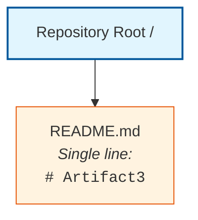

### 1.2.3 Success Criteria

#### Measurable Objectives

No measurable objectives, target metrics, service-level objectives, or quantitative goals are documented in the repository. Success criteria, acceptance tests, and validation frameworks are absent at this stage.

#### Critical Success Factors

No critical success factor inventory, risk register, or dependency catalog is maintained within the repository.

#### Key Performance Indicators

No KPI definitions, metrics catalogs, dashboards, telemetry plans, instrumentation specifications, or measurement frameworks are present.

#### Success Criteria Documentation Status

| Criterion Category | Documented Status | Disposition |
|--------------------|-------------------|-------------|
| Measurable Objectives | Not documented | To be defined in subsequent phases |
| Critical Success Factors | Not documented | To be defined in subsequent phases |
| Key Performance Indicators | Not documented | To be defined in subsequent phases |
| Acceptance Criteria | Not documented | To be defined in subsequent phases |

## 1.3 Scope

### 1.3.1 In-Scope Elements

The repository contains no requirements documentation, feature specifications, user story backlogs, design documents, or implementation artifacts from which an in-scope inventory could be derived. As a consequence, no in-scope features, workflows, integrations, or technical requirements can be enumerated from the current repository evidence.

#### Core Features and Functionalities

| Scope Dimension | Determinable from Repository | Rationale |
|-----------------|------------------------------|-----------|
| Must-Have Capabilities | No | No specifications, requirements, or code present |
| Primary User Workflows | No | No user models, journey maps, or flow definitions present |
| Essential Integrations | No | No integration artifacts, API contracts, or external references present |
| Key Technical Requirements | No | No requirements documents or technical constraints present |

#### Implementation Boundaries

The repository provides no implementation, and therefore the boundaries of the system implementation cannot be established from code-level evidence. The following boundary dimensions remain undefined:

| Boundary Dimension | Status | Rationale |
|--------------------|--------|-----------|
| System Boundaries | Undefined | No system implementation exists |
| User Groups Covered | Undefined | No user-facing artifacts present |
| Geographic / Market Coverage | Undefined | No deployment, localization, or regional configuration data |
| Data Domains Included | Undefined | No schemas, data models, or domain definitions present |

### 1.3.2 Out-of-Scope Elements

Out-of-scope determination conventionally requires an established in-scope baseline against which exclusions can be enumerated. Since no in-scope baseline is currently documented in the repository, no definitive out-of-scope catalog can be produced from repository evidence.

The following categories of artifacts are confirmed absent from the repository through exhaustive traversal. These absences are observational rather than prescriptive — they describe the current repository state and do not by themselves constitute a deliberate exclusion of these elements from future project scope.

#### Confirmed Absent Artifact Categories

| Artifact Category | Presence in Repository |
|-------------------|------------------------|
| Source code (any language) | Absent |
| Package or dependency manifests | Absent |
| Configuration files | Absent |
| Build, CI, or deployment scripts | Absent |
| Test suites or fixtures | Absent |
| Database schemas or migrations | Absent |
| Frontend assets or templates | Absent |
| Infrastructure-as-code definitions | Absent |
| Architectural or design documentation | Absent |

#### Future Phase Considerations

No phase plans, roadmaps, milestone documents, sprint backlogs, or release schedules are maintained in the repository. Future phase considerations are deferred to project planning artifacts that have not yet been introduced into this codebase.

#### Integration Points Not Covered

No integration inventory exists, and therefore no integration points can be designated as not covered. Both the set of supported integrations and the set of excluded integrations are presently empty.

#### Unsupported Use Cases

No use case inventory exists in the repository, and therefore no use cases can be designated as unsupported.

### 1.3.3 Scope Determinability Summary

The following table summarizes the determinability of each scope element typically expected in a Technical Specification Introduction, based on present repository evidence:

| Scope Area | Determinable | Authoritative Source |
|------------|--------------|----------------------|
| In-Scope Features | No | No specifications present |
| Out-of-Scope Features | No | No baseline to exclude from |
| System Boundaries | No | No system implementation exists |
| User Groups | No | No user-facing artifacts present |
| Geographic Coverage | No | No deployment configuration present |
| Data Domains | No | No data models present |

## 1.4 Document Status and Specification Boundary

### 1.4.1 Specification Authoring Basis

This Technical Specification has been authored against the present state of the repository, which consists solely of a placeholder `README.md` declaring the project name. The Introduction section reflects this baseline faithfully and explicitly refrains from attributing business intent, technical direction, stakeholder identity, or feature scope that is not evidenced in the repository.

The author has applied a strict evidence-based standard: each factual assertion in this section is traceable to an observed file, folder, or confirmed-absence finding in the repository. Where evidence is unavailable, the section discloses the gap rather than supplying conjecture.

### 1.4.2 Anticipated Evolution

As the repository matures and additional artifacts are introduced — including but not limited to source code, configuration, dependency manifests, architectural documentation, requirements specifications, and operational runbooks — subsequent revisions of this Introduction section are expected to incorporate the resulting factual content. Until such artifacts are present, the Introduction will remain a boundary statement rather than a substantive system narrative.

### 1.4.3 Reader Guidance

Readers consulting this Technical Specification should treat the present Introduction as a faithful reflection of the repository at the time of authoring. Items marked "Undefined," "Not documented," "Undeterminable," or "To be defined in subsequent phases" indicate the absence of repository evidence, not a negative scoping decision. Project owners are encouraged to introduce the corresponding artifacts into the repository to enable a fully populated specification in future revisions.

## 1.5 References

### 1.5.1 Files Examined

- `README.md` — Sole repository artifact. Contains a single first-level Markdown heading declaring the project name `Artifact3`. Provides the only confirmed factual datum used throughout this Introduction. Not referenced by any build, runtime, or deployment pipeline because none exists in the repository.

### 1.5.2 Folders Explored

- `/` (repository root) — Contains exclusively `README.md`; no subdirectories exist. Full repository traversal completed at depth 0. No additional hierarchy was available to explore.

### 1.5.3 Repository Coverage Summary

| Coverage Metric | Value |
|------------------|-------|
| Files Examined | 1 of 1 (100%) |
| Folders Explored | 1 of 1 (100%) |
| Hierarchy Depth Achieved | 0 (no deeper hierarchy exists) |
| Confirmed-Absent Categories | 9 (enumerated in Section 1.3.2) |

### 1.5.4 Cross-References

No cross-references to other Technical Specification sections are applicable to this Introduction at the present time, as the broader specification is authored against the same empty repository baseline. As subsequent sections are developed alongside repository growth, cross-reference linkages will be added in future revisions of this Introduction.

# 2. Product Requirements

## 2.1 Section Authoring Basis and Evidence Constraint

### 2.1.1 Repository Evidence Baseline

This Product Requirements section is authored against the same repository baseline established in Section 1 of this Technical Specification. The repository consists exclusively of a single `README.md` file containing one first-level Markdown heading declaring the project name `Artifact3`. No source code, package manifests, configuration artifacts, requirements documents, user stories, feature specifications, design documents, or architectural decompositions are present within the repository.

The full repository traversal completed at depth zero, confirming no subdirectories or additional artifacts exist beyond the single placeholder file. The repository coverage summary in Section 1.5.3 verifies a 100% inventory rate against the present codebase.

### 2.1.2 Evidence-Based Authoring Standard

Consistent with the standard articulated in Section 1.4.1, every factual assertion in this section is traceable to an observed file, folder, or confirmed-absence finding in the repository. Where evidence required to populate a standard Product Requirements element is unavailable, this section explicitly discloses the gap rather than supplying conjectural content.

The section prompt for Product Requirements states two operative constraints that this section must honor:

| Operative Constraint | Implication for Section 2 |
|----------------------|----------------------------|
| Only include items actually relevant to this system | No feature catalog can be populated |
| Do not add features of your own | No F-XXX identifiers may be invented |
| Document only feature relationships clearly evident in source | No relationship map can be drawn |
| Do not imagine feature relationships | No integration diagram is producible |

### 2.1.3 Section Disposition

Because the repository contains no requirements, specifications, feature definitions, or implementation artifacts from which product requirements could be derived, this section is authored as an **evidence-based boundary statement**. It catalogs which standard subsections are presently undeterminable, references the absent-artifact inventory documented in Section 1, and defers substantive population to future revisions of this Technical Specification.

## 2.2 Feature Catalog

### 2.2.1 Feature Inventory Status

No features have been identified, declared, specified, or implemented within the repository. The repository contains neither feature specifications nor executable code from which feature behaviors could be inferred. Consequently, **no entries can be authored against the standard Feature Metadata schema** (Unique ID, Feature Name, Feature Category, Priority Level, Status) without fabrication.

### 2.2.2 Feature Catalog Determinability Matrix

The following table enumerates each Feature Metadata element prescribed by the section prompt and discloses its determinability against the present repository:

| Feature Metadata Element | Determinable from Repository | Authoritative Source |
|--------------------------|------------------------------|----------------------|
| Unique ID (F-XXX format) | No | No feature inventory exists |
| Feature Name | No | No feature names declared in any artifact |
| Feature Category | No | No taxonomy, module structure, or categorization present |
| Priority Level | No | No prioritization documentation present |
| Status | No | No development lifecycle artifacts present |

### 2.2.3 Feature Description Determinability Matrix

The Description subsection prescribed by the section prompt is similarly undeterminable, as the following table records:

| Description Element | Determinable from Repository | Authoritative Source |
|---------------------|------------------------------|----------------------|
| Overview | No | No descriptive prose beyond project title |
| Business Value | No | No business case documented (see Section 1.1.4) |
| User Benefits | No | No user personas or benefits documented (see Section 1.1.3) |
| Technical Context | No | No technical context documented (see Section 1.2.2) |

### 2.2.4 Feature Dependencies Determinability Matrix

The Dependencies subsection prescribed by the section prompt requires a populated feature inventory as a precondition. Because no such inventory exists, every dependency category is presently undeterminable:

| Dependency Category | Determinable from Repository | Authoritative Source |
|---------------------|------------------------------|----------------------|
| Prerequisite Features | No | No feature catalog from which prerequisites could be drawn |
| System Dependencies | No | No package manifests, infrastructure, or runtime declarations |
| External Dependencies | No | No third-party service contracts or API references |
| Integration Requirements | No | No integration topology documented (see Section 1.2.1) |

### 2.2.5 Empty Feature Catalog Representation

For completeness, the canonical Feature Catalog table is presented in its current empty state. No rows can be added without violating the evidence-based authoring standard established in Section 1.4.1.

| Feature ID | Feature Name | Category | Status |
|------------|--------------|----------|--------|
| *(none)* | *(none)* | *(none)* | *Not determinable from repository evidence* |

## 2.3 Functional Requirements Table

### 2.3.1 Functional Requirements Status

No functional requirements have been declared in the repository. There are no requirements documents, behavior specifications, API contracts, test fixtures, acceptance test definitions, or code-level signatures from which functional requirements could be derived. The standard `F-XXX-RQ-YYY` requirement identifier schema therefore cannot be populated.

### 2.3.2 Requirement Detail Determinability Matrix

The Requirement Details subsection prescribed by the section prompt is undeterminable across every constituent element:

| Requirement Detail Element | Determinable from Repository | Authoritative Source |
|----------------------------|------------------------------|----------------------|
| Requirement ID (F-XXX-RQ-YYY) | No | No requirements catalog exists |
| Description | No | No requirement descriptions documented |
| Acceptance Criteria | No | No acceptance tests, gherkin specifications, or validation rules present |
| Priority (Must/Should/Could) | No | No prioritization framework documented |
| Complexity | No | No estimation, sizing, or complexity assessment present |

### 2.3.3 Technical Specification Determinability Matrix

The Technical Specifications subsection within Functional Requirements is similarly undeterminable:

| Technical Specification Element | Determinable from Repository | Authoritative Source |
|---------------------------------|------------------------------|----------------------|
| Input Parameters | No | No function signatures, API schemas, or input contracts present |
| Output/Response | No | No return types, response models, or output specifications present |
| Performance Criteria | No | No SLO, SLA, or performance budget documentation (see Section 1.2.3) |
| Data Requirements | No | No data models, schemas, or domain definitions (see Section 1.3.1) |

### 2.3.4 Validation Rules Determinability Matrix

The Validation Rules subsection within Functional Requirements is undeterminable across every constituent element:

| Validation Element | Determinable from Repository | Authoritative Source |
|--------------------|------------------------------|----------------------|
| Business Rules | No | No domain logic documented or implemented |
| Data Validation | No | No schemas, validators, or constraint definitions present |
| Security Requirements | No | No security policies, threat models, or access control documentation |
| Compliance Requirements | No | No regulatory, legal, or compliance documentation present |

### 2.3.5 Empty Functional Requirements Representation

The canonical Functional Requirements table is presented in its current empty state for completeness:

| Requirement ID | Description | Priority | Complexity |
|----------------|-------------|----------|------------|
| *(none)* | *(none)* | *(none)* | *Not determinable from repository evidence* |

## 2.4 Feature Relationships

### 2.4.1 Feature Relationship Status

A Feature Relationships catalog requires, as a precondition, the existence of two or more features whose interactions can be observed in requirements documentation or source code. Because the repository contains zero features (Section 2.2.1), no relationships can exist between features, and no relationship map can be drawn.

The section prompt is explicit on this point: *"Only document feature relationships that are clearly evident in the requirements or source code. Don't imagine any feature relationships of your own."* This instruction directly mandates an empty relationship section under present repository conditions.

### 2.4.2 Relationship Element Determinability Matrix

| Relationship Element | Determinable from Repository | Authoritative Source |
|----------------------|------------------------------|----------------------|
| Feature Dependencies Map | No | No features exist to relate |
| Integration Points | No | No integration artifacts present (see Section 1.2.1) |
| Shared Components | No | No component decomposition exists (see Section 1.2.2) |
| Common Services | No | No service definitions, modules, or shared libraries present |

### 2.4.3 Repository Structural Evidence

The repository structure documented in Section 1.2.2 is reproduced below for reference. It establishes that no component hierarchy, module boundaries, or service decomposition exists from which feature relationships could be inferred:

The single-node, single-edge topology demonstrates that no inter-component relationships exist within the repository. No process flowcharts, sequence diagrams, or interaction maps are referenced because none exist in the codebase.

## 2.5 Implementation Considerations

### 2.5.1 Implementation Considerations Status

Implementation Considerations conventionally describe technical constraints, performance requirements, scalability considerations, security implications, and maintenance requirements that arise from a specific feature implementation. Because no features are implemented or specified within the repository, no implementation-specific considerations can be derived from repository evidence.

The absence of package manifests, configuration files, infrastructure-as-code definitions, and architectural documentation — confirmed in Section 1.3.2 — further precludes any inference about runtime environments, deployment topologies, or operational characteristics.

### 2.5.2 Implementation Consideration Determinability Matrix

| Consideration Category | Determinable from Repository | Authoritative Source |
|------------------------|------------------------------|----------------------|
| Technical Constraints | No | No technology stack declared (see Section 1.2.2) |
| Performance Requirements | No | No performance criteria or SLO documentation (see Section 1.2.3) |
| Scalability Considerations | No | No deployment, capacity, or scaling artifacts present |
| Security Implications | No | No threat models, security controls, or access policies present |
| Maintenance Requirements | No | No operational runbooks, lifecycle documentation, or support models |

### 2.5.3 Cross-Reference to Confirmed-Absent Artifacts

The artifact categories most relevant to Implementation Considerations are documented as confirmed absent in Section 1.3.2 of this Technical Specification. The following abbreviated cross-reference is provided for traceability:

| Artifact Category Required for Consideration | Presence in Repository | Reference |
|----------------------------------------------|------------------------|-----------|
| Package or dependency manifests | Absent | Section 1.3.2 |
| Configuration files | Absent | Section 1.3.2 |
| Build, CI, or deployment scripts | Absent | Section 1.3.2 |
| Infrastructure-as-code definitions | Absent | Section 1.3.2 |
| Architectural or design documentation | Absent | Section 1.3.2 |

## 2.6 Traceability Matrix

### 2.6.1 Traceability Matrix Status

A traceability matrix conventionally links requirement identifiers to feature identifiers, source artifacts, test artifacts, and lifecycle status. Because the repository contains no requirement identifiers, no feature identifiers, no source artifacts beyond the placeholder `README.md`, and no test artifacts, the traceability matrix is presently empty.

### 2.6.2 Empty Traceability Matrix Representation

| Requirement ID | Feature ID | Source Artifact | Status |
|----------------|------------|-----------------|--------|
| *(none)* | *(none)* | *(none available)* | Not determinable |

### 2.6.3 Sole Repository Artifact Reference

For complete traceability, the only artifact present in the repository is recorded below. It establishes the project name but does not contribute requirement, feature, or implementation content:

| Artifact Path | Content | Contributes To Requirements |
|---------------|---------|-----------------------------|
| `README.md` | Single H1 heading: `# Artifact3` | No — provides project name only |

## 2.7 Assumptions, Constraints, and Anticipated Evolution

### 2.7.1 Documented Assumptions

The following assumptions are made explicit to support reader interpretation of this section:

| Assumption | Basis |
|------------|-------|
| The repository state observed at authoring time is authoritative | Exhaustive traversal per Section 1.5.3 |
| Items marked "Not determinable" reflect absence of evidence, not negative scope | Authoring standard per Section 1.4.1 |
| Future repository contributions will introduce requirements artifacts | Anticipated per Section 1.4.2 |
| The project name "Artifact3" does not by itself imply any feature semantics | Section 1.1.1 evidentiary basis |

### 2.7.2 Documented Constraints

The following constraints govern this section's authoring:

| Constraint | Source |
|------------|--------|
| Evidence-based authoring with traceability to repository artifacts | Section 1.4.1 |
| No fabrication of feature identifiers, requirements, or relationships | Section 2 prompt directive |
| Disclosure of gaps in lieu of conjecture | Section 1.4.1 |
| Markdown tables limited to four columns | Section 2 prompt directive |

### 2.7.3 Anticipated Evolution

As subsequent contributions populate the repository with requirements artifacts — including but not limited to business requirements documents (BRDs), product requirements documents (PRDs), user story backlogs, feature specifications, acceptance test suites, and implementation source code — revisions of this Section 2 will incorporate the resulting factual content. The following table enumerates the artifact categories whose introduction would unlock substantive population of each subsection:

| Subsection | Artifact Category That Would Enable Population |
|------------|------------------------------------------------|
| Feature Catalog | Feature specifications, PRDs, or implemented modules |
| Functional Requirements | Requirements documents, API contracts, or test specifications |
| Feature Relationships | Architecture diagrams, module decomposition, or integration specifications |
| Implementation Considerations | Technology stack declarations, infrastructure definitions, or non-functional requirements |
| Traceability Matrix | Linked requirement, feature, source, and test artifacts |

### 2.7.4 Reader Guidance

Readers consulting this section should treat its current form as a faithful reflection of the repository at the time of authoring, consistent with the guidance in Section 1.4.3. Items marked "No," "Not determinable," "None," or "Empty" indicate the absence of repository evidence, not a negative scoping decision against the future Artifact3 product. Project owners are encouraged to introduce the corresponding requirements artifacts into the repository to enable a fully populated Product Requirements section in future revisions.

## 2.8 References

### 2.8.1 Files Examined

- `README.md` — Sole repository artifact. Contains a single first-level Markdown heading declaring the project name `Artifact3`. Examined to confirm absence of any requirement, feature, dependency, acceptance criterion, or implementation content within the repository.

### 2.8.2 Folders Explored

- `/` (repository root) — Contains exclusively `README.md`; no subdirectories exist. Full repository traversal completed at depth 0. No additional hierarchy was available from which feature, module, or component evidence could be derived.

### 2.8.3 Tech Spec Sections Referenced

- **Section 1.1 Executive Summary** — Established the project identification as `Artifact3` and confirmed the pre-implementation repository state.
- **Section 1.2 System Overview** — Confirmed absence of system capabilities, components, technical approach, and success criteria.
- **Section 1.3 Scope** — Confirmed absence of in-scope features, out-of-scope baseline, and the enumerated artifact categories that are confirmed absent from the repository.
- **Section 1.4 Document Status and Specification Boundary** — Established the evidence-based authoring standard applied throughout this section, including the disclosure-over-conjecture principle.
- **Section 1.5 References** — Verified 100% repository coverage (1 of 1 files; 1 of 1 folders) at hierarchy depth 0.

### 2.8.4 Repository Coverage for This Section

| Coverage Metric | Value |
|------------------|-------|
| Files Examined | 1 of 1 (100%) |
| Folders Explored | 1 of 1 (100%) |
| Feature Catalog Entries | 0 (no features derivable from repository) |
| Functional Requirements Entries | 0 (no requirements derivable from repository) |
| Traceability Matrix Entries | 0 (no requirements or features to trace) |

# 3. Technology Stack

## 3.1 SECTION AUTHORING BASIS AND EVIDENCE CONSTRAINT

### 3.1.1 Repository Evidence Baseline

This Technology Stack section is authored against the same repository baseline established in Section 1 and reaffirmed in Section 2 of this Technical Specification. The repository consists exclusively of a single `README.md` file containing one first-level Markdown heading declaring the project name `Artifact3`. Per the Repository Contents Inventory in Section 1.2.2, the repository root contains exactly one artifact and zero subdirectories. The full repository traversal completed at depth zero, with 100% coverage verified in Section 1.5.3 (1 of 1 files; 1 of 1 folders).

No source code, package manifests, configuration artifacts, dependency declarations, lock files, runtime descriptors, infrastructure-as-code definitions, container specifications, build scripts, continuous integration definitions, deployment manifests, or architectural decompositions are present within the repository. These categorical absences are formally enumerated as the nine confirmed-absent artifact categories documented in Section 1.3.2.

### 3.1.2 Evidence-Based Authoring Standard

Consistent with the standard articulated in Section 1.4.1 and reaffirmed in Section 2.1.2, every factual assertion in this Technology Stack section is traceable to an observed file, folder, or confirmed-absence finding in the repository. Where evidence required to populate a standard Technology Stack element is unavailable, this section explicitly discloses the gap rather than supplying conjectural content. This approach is consistent with the disclosure-over-conjecture principle and Section 1.4.3's reader guidance, which directs that "Undefined," "Not documented," "Undeterminable," or "To be defined in subsequent phases" markers indicate absence of repository evidence and not negative scoping decisions.

The section prompt for Technology Stack contains an explicit operative directive that supersedes any default suggestion:

| Operative Directive | Implication for Section 3 |
|---------------------|----------------------------|
| Only include sections and items that are actually relevant to this system, based on your analysis of its requirements | No technology component may be listed without repository evidence |
| Don't add any items that aren't clearly applicable | No language, framework, library, service, datastore, or tooling may be inferred from project name alone |

### 3.1.3 Disposition of the Prompt-Provided Default Technology Stack

The section prompt provides a "Default Technology Stack" enumerating candidate technologies across cloud platform, containerization, infrastructure-as-code, CI/CD, backend language and framework, authentication, database, AI framework, web frontend, CSS framework, cross-platform mobile, and native applications (iOS, Android, macOS, Desktop). Application of the evidence-based authoring standard from Section 1.4.1 produces the following formal disposition of each default candidate against repository evidence:

| Default Stack Component | Default Selection | Repository Evidence | Disposition |
|-------------------------|-------------------|---------------------|-------------|
| Cloud Platform | AWS | No IaC, no provider configuration, no manifests | Not adopted — no evidence |
| Containerization | Docker | No `Dockerfile`, no `docker-compose.yml`, no OCI artifacts | Not adopted — no evidence |
| Infrastructure as Code | Terraform | No `.tf`, `.tfvars`, Pulumi, or CloudFormation files | Not adopted — no evidence |
| CI/CD | GitHub Actions | No `.github/workflows/` directory present | Not adopted — no evidence |
| Backend Primary Language | Python | No `.py` files, `requirements.txt`, `pyproject.toml`, or `Pipfile` | Not adopted — no evidence |
| Backend Framework | Flask | No Python source code or framework declarations | Not adopted — no evidence |
| Authentication | Auth0 | No client SDKs, environment templates, or auth configuration | Not adopted — no evidence |
| Database | MongoDB | No drivers, schemas, migrations, or connection strings | Not adopted — no evidence |
| AI Framework | Langchain | No AI-related code, prompts, agents, or chains present | Not adopted — no evidence |
| Web Frontend | React with TypeScript | No `package.json`, `tsconfig.json`, `.tsx`, or `.jsx` files | Not adopted — no evidence |
| CSS Framework | TailwindCSS | No `tailwind.config.js` or stylesheet artifacts | Not adopted — no evidence |
| Mobile / Cross-platform | React-Native with TypeScript | No mobile project structure or React-Native manifests | Not adopted — no evidence |
| iOS Native | Swift | No `.swift` files, Xcode project, or `Package.swift` | Not adopted — no evidence |
| Android Native | Kotlin | No `.kt` files, Gradle scripts, or Android manifests | Not adopted — no evidence |
| macOS Native | Objective-C | No `.m`, `.mm`, or `.h` files | Not adopted — no evidence |
| Desktop | ElectronJS | No Electron-related manifests or main process scripts | Not adopted — no evidence |

Adopting any item from the Default Technology Stack without supporting repository evidence would constitute a violation of the evidence-based authoring standard binding this specification. The Default Technology Stack is therefore retained only as a reference recommendation for future project initiation and is explicitly excluded from the operative content of this section.

---

## 3.2 TECHNOLOGY STACK DETERMINABILITY STATUS

### 3.2.1 Overall Determinability Statement

No technology stack components — across programming languages, frameworks, libraries, package dependencies, third-party services, databases, storage systems, development tooling, build systems, containerization, or CI/CD pipelines — are derivable from the present repository evidence. This finding is consistent with Section 1.2.2's Core Technical Approach statement that the repository does not declare any programming languages, frameworks, runtime environments, package managers, build tools, or technology stack choices. It is further reinforced by Section 2.5.2's Implementation Consideration Determinability Matrix, which records "No" determinability for Technical Constraints, Performance Requirements, Scalability Considerations, Security Implications, and Maintenance Requirements.

### 3.2.2 Cross-Reference to Confirmed-Absent Artifacts

The artifact categories whose introduction would unlock substantive population of this Technology Stack section are formally documented as confirmed absent in Section 1.3.2. The following abbreviated cross-reference maps each confirmed-absent category to the Technology Stack subsection it would inform:

| Confirmed-Absent Artifact Category | Subsection That Would Be Informed | Reference |
|------------------------------------|-----------------------------------|-----------|
| Source code (any language) | 3.3 Programming Languages | Section 1.3.2 |
| Package or dependency manifests | 3.4 Frameworks and Libraries; 3.5 Open Source Dependencies | Section 1.3.2 |
| Configuration files | 3.6 Third-Party Services | Section 1.3.2 |
| Build, CI, or deployment scripts | 3.8 Development and Deployment | Section 1.3.2 |
| Test suites or fixtures | 3.8 Development and Deployment | Section 1.3.2 |
| Database schemas or migrations | 3.7 Databases and Storage | Section 1.3.2 |
| Frontend assets or templates | 3.4 Frameworks and Libraries (frontend) | Section 1.3.2 |
| Infrastructure-as-code definitions | 3.8 Development and Deployment (cloud / IaC) | Section 1.3.2 |
| Architectural or design documentation | All subsections (contextual grounding) | Section 1.3.2 |

### 3.2.3 Repository Topology Reflecting Empty Technology Inventory

The following diagram reproduces the canonical repository topology established in Section 1.2.2, presented here to visually corroborate the empty technology inventory across every subsection that follows. No technology-bearing artifacts exist beyond the placeholder Markdown file shown.

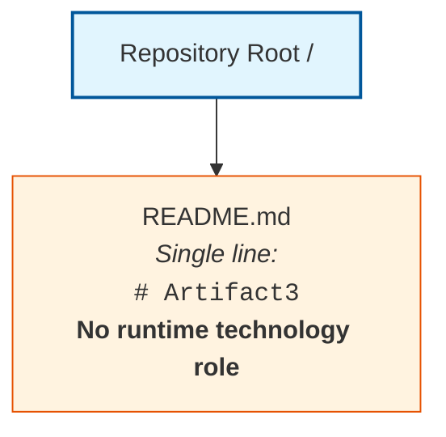

The single `README.md` artifact constitutes documentation only. Markdown is a lightweight markup language for human-readable text and does not constitute a runtime programming language, framework, or dependency. It is not consumed by any build, runtime, packaging, or deployment pipeline because no such pipeline exists in the repository.

---

## 3.3 PROGRAMMING LANGUAGES

### 3.3.1 Programming Languages Determinability Matrix

The following matrix discloses the determinability of each programming-language element prescribed by the section prompt against present repository evidence:

| Programming Language Element | Determinable from Repository | Authoritative Source |
|------------------------------|------------------------------|----------------------|
| Languages by Platform / Component | No | No platform or component decomposition exists (see Section 1.2.2) |
| Backend Language(s) | No | No backend source code, manifests, or runtime declarations present |
| Frontend Language(s) | No | No frontend assets, templates, or framework manifests present |
| Mobile / Native Language(s) | No | No mobile or native project structures present |
| Selection Criteria | No | No architectural decision records (ADRs) or design rationale documents present |
| Constraints or Dependencies | No | No interoperability, regulatory, or compatibility constraints documented |
| Version Specifications | No | No runtime version declarations (e.g., `.nvmrc`, `.python-version`, `.tool-versions`) present |

### 3.3.2 Empty Programming Languages Inventory

For completeness, the canonical Programming Languages inventory is presented in its current empty state, following the empty-table representation precedent established in Section 2.2.5. No rows can be added without violating the evidence-based authoring standard established in Section 1.4.1.

| Language | Version | Platform / Component | Justification |
|----------|---------|----------------------|---------------|
| *(none)* | *(none)* | *(none)* | *Not determinable from repository evidence* |

### 3.3.3 Selection Criteria and Constraints Status

No language selection criteria — such as performance characteristics, ecosystem maturity, team expertise, regulatory mandates, or interoperability requirements — are documented in the repository. No language-level constraints (e.g., minimum runtime versions, deprecated feature bans, polyglot interoperability requirements) are evidenced. Future population of this subsection requires the introduction of architectural decision records, language selection rationale documents, or implementation source code into the repository.

---

## 3.4 FRAMEWORKS AND LIBRARIES

### 3.4.1 Frameworks and Libraries Determinability Matrix

The following matrix discloses the determinability of each framework and library element prescribed by the section prompt:

| Framework / Library Element | Determinable from Repository | Authoritative Source |
|-----------------------------|------------------------------|----------------------|
| Core Framework(s) with Version(s) | No | No package manifests (`package.json`, `requirements.txt`, `pyproject.toml`, `Cargo.toml`, `pom.xml`, `build.gradle`, `go.mod`, `Gemfile`, `composer.json`) present (see Section 1.2.2) |
| Supporting Libraries | No | No dependency declarations present |
| Compatibility Requirements | No | No compatibility matrices, peer dependency manifests, or runtime requirement documents present |
| Justification for Major Choices | No | No architectural decision records or design rationale documents present |
| Frontend Framework(s) | No | No frontend project structure or web framework manifests present |
| Backend Framework(s) | No | No backend project structure or server framework manifests present |
| Testing Framework(s) | No | No test suites, fixtures, or test runner configurations present (see Section 1.3.2) |

### 3.4.2 Empty Frameworks and Libraries Inventory

For completeness, the canonical Frameworks and Libraries inventory is presented in its current empty state.

| Framework / Library | Version | Role | Compatibility Requirements | Justification |
|---------------------|---------|------|----------------------------|---------------|
| *(none)* | *(none)* | *(none)* | *(none)* | *Not determinable from repository evidence* |

### 3.4.3 Compatibility and Versioning Notes

No compatibility constraints, peer-dependency declarations, semantic versioning policies, lockfile pin strategies, or upgrade cadence policies are evidenced in the repository. The absence of package manifests precludes derivation of any framework-to-framework or framework-to-runtime compatibility requirements. Future population of this subsection requires the introduction of dependency manifest files or framework selection documentation into the repository.

---

## 3.5 OPEN SOURCE DEPENDENCIES

### 3.5.1 Open Source Dependencies Determinability Matrix

The following matrix discloses the determinability of each open-source-dependency element prescribed by the section prompt:

| Open Source Dependency Element | Determinable from Repository | Authoritative Source |
|--------------------------------|------------------------------|----------------------|
| Third-Party / Open-Source Libraries Identified | No | No dependency declarations present in any manifest |
| Package Registries Used | No | No `npm`, `PyPI`, `Maven Central`, `crates.io`, `RubyGems`, `Packagist`, or other registry references present |
| Package Versions | No | No version pins, ranges, or lock files (`package-lock.json`, `yarn.lock`, `pnpm-lock.yaml`, `Pipfile.lock`, `poetry.lock`, `Gemfile.lock`, `Cargo.lock`, `composer.lock`) present |
| License Information | No | No SPDX manifests, `LICENSE` files, or license inventory present |
| Vulnerability Scanning Configuration | No | No `.snyk`, Dependabot configuration, or SCA tool configuration present |
| Vendor Directories | No | No `node_modules/`, `vendor/`, `target/`, or `.venv/` directories present |
| Transitive Dependency Graph | No | No lock files from which a transitive graph could be derived |

### 3.5.2 Empty Open Source Dependency Registry

For completeness, the canonical Open Source Dependencies registry is presented in its current empty state. The corresponding finding in Section 2.2.4 ("External Dependencies: No / No third-party service contracts or API references") is consistent with this disposition.

| Dependency | Registry | Version | License | Direct or Transitive |
|------------|----------|---------|---------|----------------------|
| *(none)* | *(none)* | *(none)* | *(none)* | *Not determinable from repository evidence* |

### 3.5.3 Package Manifests and Lock Files

The repository contains no package manifests of any kind. The absence is comprehensive across ecosystems and was explicitly documented in Section 1.2.2 with reference to `package.json`, `requirements.txt`, `pyproject.toml`, `Cargo.toml`, `pom.xml`, `build.gradle`, and `go.mod`. Equivalent absences extend to alternative ecosystem manifests (e.g., `Pipfile`, `setup.py`, `setup.cfg`, `Gemfile`, `composer.json`, `mix.exs`, `rebar.config`, `project.clj`, `Package.swift`). No lock files corresponding to any of these manifests are present.

---

## 3.6 THIRD-PARTY SERVICES

### 3.6.1 Third-Party Services Determinability Matrix

The following matrix discloses the determinability of each third-party-service element prescribed by the section prompt. The findings here are reinforced by Section 1.2.1's explicit statement that "No external system dependencies, third-party services, or inter-system data flows have been declared in the repository."

| Third-Party Service Element | Determinable from Repository | Authoritative Source |
|-----------------------------|------------------------------|----------------------|
| External APIs and Integrations | No | No API client code, SDK initialization, or endpoint references present (see Section 1.2.1) |
| Authentication Services | No | No identity provider configuration, OAuth/OIDC clients, or auth-related secrets present |
| Monitoring Tools | No | No APM agents, logging shippers, metrics exporters, or observability configurations present |
| Cloud Services | No | No cloud SDK initializations, IAM policies, or service bindings present |
| Payment / Billing Services | No | No payment SDK or billing integration artifacts present |
| Email / Notification Services | No | No transactional email, SMS, or push notification configurations present |
| Environment Variable Templates | No | No `.env.example`, `.env.sample`, or similar template files present |

### 3.6.2 Empty External Service Inventory

For completeness, the canonical Third-Party Services inventory is presented in its current empty state.

| Service Name | Category | Integration Method | Authentication Mode |
|--------------|----------|---------------------|---------------------|
| *(none)* | *(none)* | *(none)* | *Not determinable from repository evidence* |

### 3.6.3 Integration Configuration Status

No integration topology, service mesh configuration, API gateway specifications, webhook receivers, or message broker bindings are present in the repository. The integration landscape is therefore undefined at the present time, consistent with the disposition in Section 1.2.1. Future population of this subsection requires the introduction of integration configuration files, API client SDKs, or service contract documentation into the repository.

---

## 3.7 DATABASES AND STORAGE

### 3.7.1 Databases and Storage Determinability Matrix

The following matrix discloses the determinability of each database and storage element prescribed by the section prompt:

| Database / Storage Element | Determinable from Repository | Authoritative Source |
|----------------------------|------------------------------|----------------------|
| Primary Database | No | No database drivers, connection strings, ORM models, or schemas present |
| Secondary Databases | No | No multi-datastore configurations or polyglot persistence artifacts present |
| Data Persistence Strategies | No | No data access layer code, repository pattern implementations, or transaction management artifacts present |
| Caching Solutions | No | No Redis, Memcached, or in-process cache configurations present |
| Storage Services | No | No object storage SDKs (e.g., S3, GCS, Azure Blob) or file-system abstractions present |
| Schema Migrations | No | No migration tools (e.g., Alembic, Flyway, Liquibase, Knex) or migration scripts present (see Section 1.3.2) |
| Backup and Retention Policies | No | No backup configurations or retention documentation present |

### 3.7.2 Empty Data Storage Inventory

For completeness, the canonical Databases and Storage inventory is presented in its current empty state.

| Datastore | Type | Role | Persistence Strategy |
|-----------|------|------|----------------------|
| *(none)* | *(none)* | *(none)* | *Not determinable from repository evidence* |

### 3.7.3 Persistence Strategy Status

No persistence strategy — including selection of relational versus document-oriented stores, consistency models, sharding or partitioning approaches, indexing strategies, cache invalidation policies, or backup-and-restore patterns — is evidenced in the repository. Future population of this subsection requires the introduction of database schemas, ORM model definitions, connection configuration files, or data architecture documentation into the repository.

---

## 3.8 DEVELOPMENT AND DEPLOYMENT

### 3.8.1 Development and Deployment Determinability Matrix

The following matrix discloses the determinability of each development-and-deployment element prescribed by the section prompt:

| Development / Deployment Element | Determinable from Repository | Authoritative Source |
|----------------------------------|------------------------------|----------------------|
| Development Tools | No | No `.editorconfig`, `.vscode/`, `.idea/`, linter, or formatter configurations present |
| Build System | No | No `Makefile`, `build.gradle`, `pom.xml`, `webpack.config.js`, `vite.config.ts`, or equivalent build descriptors present |
| Containerization | No | No `Dockerfile`, `docker-compose.yml`, `Containerfile`, or OCI image manifests present |
| CI/CD Pipelines | No | No `.github/workflows/`, `.gitlab-ci.yml`, `Jenkinsfile`, `azure-pipelines.yml`, `bitbucket-pipelines.yml`, or CircleCI configuration present |
| Infrastructure as Code | No | No Terraform (`.tf`), Pulumi, AWS CDK, CloudFormation, ARM, or Bicep files present (see Section 1.3.2) |
| Deployment Environments | No | No environment manifests, Kubernetes YAML, Helm charts, or environment-specific configurations present |
| Version Control Conventions | No | No `CONTRIBUTING.md`, branch protection metadata, or commit-message conventions documented in repository |
| Pre-commit / Quality Gates | No | No `.pre-commit-config.yaml`, `husky` configuration, or commit hooks present |
| Local Development Bootstrapping | No | No setup scripts, `Procfile`, or development environment definitions present |

### 3.8.2 Empty Development Toolchain Inventory

For completeness, the canonical Development and Deployment inventory is presented in its current empty state.

| Tool / System | Category | Version | Role |
|---------------|----------|---------|------|
| *(none)* | *(none)* | *(none)* | *Not determinable from repository evidence* |

### 3.8.3 Build, CI/CD, and Containerization Status

The absence of build, CI/CD, and containerization artifacts is comprehensive. As Section 1.3.2 formally records, both "Build, CI, or deployment scripts" and "Infrastructure-as-code definitions" are categorically absent from the repository. The README documentation file is not consumed by any build, runtime, or deployment pipeline because no such pipeline exists. Future population of this subsection requires the introduction of build descriptors, container specifications, pipeline definitions, or infrastructure-as-code artifacts into the repository.

---

## 3.9 ANTICIPATED EVOLUTION AND FUTURE POPULATION TRIGGERS

### 3.9.1 Artifact-to-Subsection Mapping

Consistent with Section 1.4.2 and the Anticipated Evolution table in Section 2.7.3, this section will be revised as subsequent contributions populate the repository with the artifacts necessary to derive each Technology Stack subsection. The following table enumerates the artifact categories whose introduction would unlock substantive population of each Technology Stack subsection:

| Subsection | Artifact Category That Would Enable Population |
|------------|------------------------------------------------|
| 3.3 Programming Languages | Source code files in declared languages; runtime version files (`.nvmrc`, `.python-version`, `.tool-versions`); language manifests |
| 3.4 Frameworks and Libraries | Package manifests (`package.json`, `requirements.txt`, `pyproject.toml`, `pom.xml`, `build.gradle`, `Cargo.toml`, `go.mod`, equivalents) declaring framework dependencies |
| 3.5 Open Source Dependencies | Dependency declarations within manifests; lock files (`package-lock.json`, `yarn.lock`, `poetry.lock`, `Cargo.lock`, equivalents); license inventories |
| 3.6 Third-Party Services | Configuration files; environment variable templates (`.env.example`); API client SDK imports; service contract documentation |
| 3.7 Databases and Storage | Database schemas, ORM models, migration scripts, connection configuration; storage SDK initializations |
| 3.8 Development and Deployment | `Dockerfile`, `docker-compose.yml`, CI configuration directories (`.github/workflows/` and equivalents), `Makefile`, IaC files (`.tf`, Pulumi, CloudFormation), build descriptors |

### 3.9.2 Reader Guidance

Readers consulting this section should treat its current form as a faithful reflection of the repository at the time of authoring, consistent with the guidance in Section 1.4.3 and Section 2.7.4. Items marked "No," "Not determinable," "None," or "(none)" indicate the absence of repository evidence, not a negative scoping decision against any candidate technology — including those listed in the prompt-provided Default Technology Stack. Project owners are encouraged to introduce the corresponding implementation, manifest, configuration, and infrastructure artifacts into the repository to enable a fully populated Technology Stack section in future revisions of this Technical Specification.

When such artifacts are introduced, the disposition table in Section 3.1.3 should be revisited: any Default Technology Stack component that becomes evidenced through committed artifacts may transition from "Not adopted — no evidence" to a populated row in the corresponding inventory table, with full version, role, and justification metadata captured per the prompt's guidance.

---

## 3.10 REFERENCES

### 3.10.1 Files Examined

- `README.md` — Sole repository artifact. Contains a single first-level Markdown heading declaring the project name `Artifact3`. Examined to confirm absence of any technology declaration, dependency manifest, configuration directive, framework reference, service binding, datastore connection, build script, or deployment specification within the repository. As Markdown documentation, it carries no runtime technology role and is not consumed by any build, runtime, or pipeline.

### 3.10.2 Folders Explored

- `/` (repository root) — Contains exclusively `README.md`; no subdirectories exist. Full repository traversal completed at depth 0. No additional hierarchy was available from which language, framework, dependency, service, datastore, or deployment evidence could be derived. The absence of conventional technology-bearing directories (e.g., `src/`, `lib/`, `app/`, `services/`, `infra/`, `deploy/`, `.github/`, `config/`, `docs/`) was confirmed by exhaustive traversal.

### 3.10.3 Tech Spec Sections Referenced

- **Section 1.1 Executive Summary** — Established the project identification as `Artifact3` and confirmed the pre-implementation, documentation-only repository state with zero source artifacts and zero build-and-deploy artifacts.
- **Section 1.2 System Overview** — Established the Core Technical Approach disposition (no programming languages, frameworks, runtime environments, package managers, build tools, or technology stack choices declared), provided the canonical Repository Contents Inventory, and reproduced the repository topology diagram replicated in Section 3.2.3.
- **Section 1.3 Scope** — Provided the formal enumeration of nine confirmed-absent artifact categories that constitute the evidentiary basis for every "Not determinable" disposition in this Technology Stack section.
- **Section 1.4 Document Status and Specification Boundary** — Established the evidence-based authoring standard applied throughout this section, including the disclosure-over-conjecture principle and reader guidance on interpreting absence markers.
- **Section 1.5 References** — Verified 100% repository coverage (1 of 1 files; 1 of 1 folders) at hierarchy depth 0, supporting the comprehensiveness claim of this section's empty-state findings.
- **Section 2.1 Section Authoring Basis and Evidence Constraint** — Established the precedent operative-constraint table format reproduced in Section 3.1.2.
- **Section 2.2 Feature Catalog** — Established the Determinability Matrix and Empty Inventory Representation patterns adopted throughout Sections 3.3 through 3.8.
- **Section 2.5 Implementation Considerations** — Most directly adjacent precedent; reaffirmed that no technology stack is declared and that no implementation-specific considerations can be derived. The Implementation Consideration Determinability Matrix in Section 2.5.2 records "No" determinability for Technical Constraints, Performance Requirements, Scalability, Security, and Maintenance — categories that overlap substantively with Technology Stack concerns.
- **Section 2.7 Assumptions, Constraints, and Anticipated Evolution** — Provided the structural model for Section 3.9 (Anticipated Evolution), including the artifact-to-subsection mapping table format.
- **Section 2.8 References** — Provided the structural model for this References subsection, including the Files Examined, Folders Explored, Tech Spec Sections Referenced, and Repository Coverage subdivisions.

### 3.10.4 Repository Coverage for This Section

| Coverage Metric | Value |
|------------------|-------|
| Files Examined | 1 of 1 (100%) |
| Folders Explored | 1 of 1 (100%) |
| Hierarchy Depth Achieved | 0 (no deeper hierarchy exists) |
| Programming Languages Identified | 0 (no source code, no language manifests) |
| Frameworks and Libraries Identified | 0 (no package manifests) |
| Open Source Dependencies Identified | 0 (no dependency declarations or lock files) |
| Third-Party Services Identified | 0 (no configuration files or SDK initializations) |
| Databases and Storage Systems Identified | 0 (no schemas, drivers, or connection configurations) |
| Development and Deployment Tools Identified | 0 (no build descriptors, CI/CD configurations, or IaC artifacts) |
| Default Technology Stack Components Adopted | 0 of 16 (no supporting repository evidence for any candidate) |

### 3.10.5 Authoring Compliance Summary

This section was authored in strict compliance with the evidence-based standard articulated in Section 1.4.1 and the operative directives stated in the Section 3 prompt. No technology component was listed without explicit repository evidence; the prompt-provided Default Technology Stack was retained only as a reference recommendation and formally dispositioned in Section 3.1.3 against repository evidence; and every "Not determinable" disposition is cross-referenced to an authoritative source elsewhere in this Technical Specification. This section will be revised in subsequent specification updates as the repository is populated with the artifact categories enumerated in Section 3.9.1.

# 4. Process Flowchart

## 4.1 SECTION AUTHORING BASIS AND EVIDENCE CONSTRAINT

### 4.1.1 Repository Evidence Baseline

This Process Flowchart section is authored against the same repository baseline established in Section 1, reaffirmed in Section 2.1, and again in Section 3.1 of this Technical Specification. The repository consists exclusively of a single `README.md` file containing one first-level Markdown heading declaring the project name `Artifact3`. Per the Repository Contents Inventory in Section 1.2.2, the repository root contains exactly one artifact and zero subdirectories. The full repository traversal completed at depth zero, with 100% coverage verified in Section 1.5.3 (1 of 1 files; 1 of 1 folders).

No source code, package manifests, configuration artifacts, dependency declarations, workflow definitions, business process specifications, integration contracts, state machine definitions, event handlers, batch job descriptors, or error-handling artifacts are present within the repository. These categorical absences are formally enumerated as the nine confirmed-absent artifact categories documented in Section 1.3.2.

### 4.1.2 Evidence-Based Authoring Standard

Consistent with the standard articulated in Section 1.4.1 and reaffirmed in Sections 2.1.2 and 3.1.2, every factual assertion in this Process Flowchart section is traceable to an observed file, folder, or confirmed-absence finding in the repository. Where evidence required to populate a standard Process Flowchart element is unavailable, this section explicitly discloses the gap rather than supplying conjectural workflows, diagrams, or sequences. This approach is consistent with the disclosure-over-conjecture principle and Section 1.4.3's reader guidance, which directs that "Undefined," "Not documented," "Undeterminable," or "To be defined in subsequent phases" markers indicate absence of repository evidence and not negative scoping decisions.

The Section 4 prompt prescribes the production of multiple Mermaid diagrams (high-level system workflow, detailed process flows, error-handling flowcharts, integration sequence diagrams, state transition diagrams). Application of the evidence-based authoring standard produces the following formal disposition of each prompt-prescribed diagram:

| Operative Constraint | Implication for Section 4 |
|----------------------|----------------------------|
| Only document workflows clearly evidenced in requirements or source | No business processes may be authored without evidence |
| Do not imagine any workflows, integrations, or state transitions | No conjectural flows or sequences may be drawn |
| Reference only related technical requirements that exist | No SLA, timing, or error-recovery references may be fabricated |
| Restrict swim lanes to actors evidenced in the system | No personas or systems may be introduced without artifacts |

### 4.1.3 Section Disposition

Because the repository contains no business process definitions, workflow specifications, integration contracts, event handlers, state machines, error-handling logic, or implementation source code from which process flows could be derived, this section is authored as an **evidence-based boundary statement**. It catalogs which standard subsections are presently undeterminable, references the absent-artifact inventory documented in Section 1.3.2, reproduces the canonical repository topology diagram already established in Sections 1.2.2, 2.4.3, and 3.2.3, and defers substantive population of process flowcharts to future revisions of this Technical Specification.

---

## 4.2 PROCESS FLOWCHART DETERMINABILITY STATUS

### 4.2.1 Overall Determinability Statement

No process flowchart components — across system workflows (core business processes and integration workflows), flowchart workflow elements (start/end points, process steps, decision diamonds, system boundaries, user touchpoints, error states, recovery paths, and timing/SLA considerations), validation rules (business rules, data validation, authorization checkpoints, regulatory compliance checks), technical implementation (state transitions, persistence points, caching, transaction boundaries, retry mechanisms, fallback processes, error notification, recovery procedures), or required Mermaid diagrams — are derivable from the present repository evidence. 

This finding is consistent with Section 1.2.1's explicit statement that "No external system dependencies, third-party services, or inter-system data flows have been declared in the repository." It is corroborated by Section 1.2.2's confirmation that no programming languages, frameworks, runtime environments, package managers, build tools, or technology stack choices are declared. It is further reinforced by Section 2.2.1's verification of zero features, Section 2.4.1's confirmation that no inter-component relationships exist, Section 2.4.3's note that "No process flowcharts, sequence diagrams, or interaction maps are referenced because none exist in the codebase," and Section 3.2.1's finding that no technology stack components are derivable from repository evidence.

### 4.2.2 Cross-Reference to Confirmed-Absent Artifacts

The artifact categories whose introduction would unlock substantive population of this Process Flowchart section are formally documented as confirmed absent in Section 1.3.2. The following cross-reference maps each confirmed-absent category to the Process Flowchart subsection it would inform:

| Confirmed-Absent Artifact Category | Subsection That Would Be Informed | Reference |
|------------------------------------|-----------------------------------|-----------|
| Source code (any language) | 4.3 System Workflows; 4.5 Technical Implementation | Section 1.3.2 |
| Package or dependency manifests | 4.5.2 Error Handling (retry/circuit-breaker libraries) | Section 1.3.2 |
| Configuration files | 4.4.2 Validation Rules; 4.5.1 State Management (caching) | Section 1.3.2 |
| Build, CI, or deployment scripts | 4.3.2 Integration Workflows (batch processing sequences) | Section 1.3.2 |
| Test suites or fixtures | 4.4 Flowchart Requirements (acceptance and validation flows) | Section 1.3.2 |
| Database schemas or migrations | 4.5.1 State Management (persistence points; transaction boundaries) | Section 1.3.2 |
| Frontend assets or templates | 4.3.1 Core Business Processes (user touchpoints) | Section 1.3.2 |
| Infrastructure-as-code definitions | 4.3.2 Integration Workflows (system boundaries) | Section 1.3.2 |
| Architectural or design documentation | All subsections (contextual grounding) | Section 1.3.2 |

### 4.2.3 Canonical Repository Topology

The following diagram reproduces the canonical repository topology established in Section 1.2.2 and reproduced in Sections 2.4.3 and 3.2.3. It is presented here to visually corroborate the absence of any process-bearing artifacts across every subsection that follows. This is the **only valid diagram producible against the present repository evidence**; no workflow, sequence, state, or error-handling Mermaid diagram can be drawn without violating the evidence-based authoring standard.

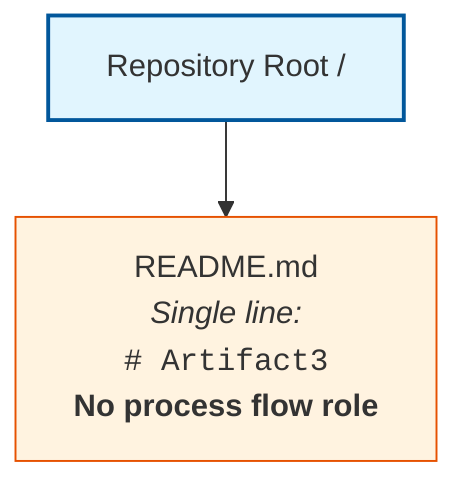

The single `README.md` artifact is documentation only and is not part of any process flow, business workflow, integration sequence, state machine, or error-handling path. No build, runtime, deployment, scheduling, messaging, eventing, or orchestration pipeline exists in the repository to consume or produce process artifacts.

---

## 4.3 SYSTEM WORKFLOWS DETERMINABILITY

### 4.3.1 Core Business Processes Determinability Matrix

The Core Business Processes subsection prescribed by the Section 4 prompt is undeterminable across every constituent element. No user models, journey maps, controllers, handlers, route definitions, business logic modules, or decision tables exist in the repository to support process flow derivation.

| Core Business Process Element | Determinable from Repository | Authoritative Source |
|-------------------------------|------------------------------|----------------------|
| End-to-End User Journeys | No | No user personas, journey maps, or user-facing artifacts (see Section 1.1.3 and Section 1.3.1) |
| System Interactions | No | No system implementation or component decomposition exists (see Section 1.2.2) |
| Decision Points | No | No business logic, conditional branches, or rule engines implemented |
| Error Handling Paths | No | No error taxonomy, exception handlers, or recovery code present |

#### Empty Core Business Process Inventory

For completeness, the canonical Core Business Process catalog is presented in its current empty state. No rows can be added without violating the evidence-based authoring standard established in Section 1.4.1.

| Process Name | Trigger | Actors | Outcome |
|--------------|---------|--------|---------|
| *(none)* | *(none)* | *(none)* | *Not determinable from repository evidence* |

### 4.3.2 Integration Workflows Determinability Matrix

The Integration Workflows subsection prescribed by the Section 4 prompt requires the presence of API contracts, service clients, message brokers, event schemas, or batch job definitions as a precondition. The repository contains none of these artifacts. Section 1.2.1 explicitly states: "No external system dependencies, third-party services, or inter-system data flows have been declared in the repository." Section 3.6 reaffirms the absence of third-party services, APIs, authentication providers, monitoring services, cloud services, payment processors, and notification services.

| Integration Workflow Element | Determinable from Repository | Authoritative Source |
|------------------------------|------------------------------|----------------------|
| Data Flow Between Systems | No | No external system dependencies declared (see Section 1.2.1) |
| API Interactions | No | No API contracts, OpenAPI specs, client SDKs, or endpoint references (see Section 3.6) |
| Event Processing Flows | No | No event handlers, message brokers, stream processors, or event schemas present |
| Batch Processing Sequences | No | No scheduler configurations, cron descriptors, or batch job definitions present |

#### Empty Integration Workflow Inventory

| Integration Name | Direction | Protocol | Counterpart System |
|------------------|-----------|----------|--------------------|
| *(none)* | *(none)* | *(none)* | *Not determinable from repository evidence* |

---

## 4.4 FLOWCHART REQUIREMENTS DETERMINABILITY

### 4.4.1 Workflow Element Determinability Matrix

The Section 4 prompt prescribes that each major workflow include start and end points, process steps, decision diamonds, system boundaries, user touchpoints, error states and recovery paths, and timing/SLA considerations. Each element is undeterminable against the present repository:

| Workflow Element | Determinable from Repository | Authoritative Source |
|------------------|------------------------------|----------------------|
| Start and End Points | No | No workflows exist (see Section 4.3) |
| Process Steps | No | No procedural code or sequence specifications present |
| Decision Diamonds | No | No conditional business logic, rule engines, or decision tables present |
| System Boundaries | No | No system implementation or boundary documentation (see Section 1.3.1) |
| User Touchpoints | No | No user-facing artifacts, frontend assets, or UI templates (see Section 1.3.2) |
| Error States | No | No error taxonomy, exception classes, or fault definitions present |
| Recovery Paths | No | No recovery handlers, compensating transactions, or runbooks (see Section 2.5.2) |
| Timing and SLA Considerations | No | No SLO/SLA documentation, performance budgets, or timing constraints (see Section 1.2.3) |

### 4.4.2 Validation Rules Determinability Matrix

The Validation Rules subsection prescribed by the Section 4 prompt mirrors the Validation Rules subsection in Section 2.3.4, which previously established that no business rules, data validation, security requirements, or compliance requirements are documented in the repository. The following matrix reaffirms this finding in the Process Flowchart context:

| Validation Rule Element | Determinable from Repository | Authoritative Source |
|-------------------------|------------------------------|----------------------|
| Business Rules at Each Step | No | No domain logic documented or implemented (see Section 2.3.4) |
| Data Validation Requirements | No | No schemas, validators, JSON Schema, Pydantic, Zod, or constraint definitions (see Section 2.3.4) |
| Authorization Checkpoints | No | No authentication or authorization configuration, IAM policies, or access control middleware (see Section 3.6) |
| Regulatory Compliance Checks | No | No regulatory, legal, or compliance documentation (see Section 2.3.4) |

#### Empty Validation Rules Inventory

| Rule ID | Step | Rule Type | Enforcement Mechanism |
|---------|------|-----------|------------------------|
| *(none)* | *(none)* | *(none)* | *Not determinable from repository evidence* |

---

## 4.5 TECHNICAL IMPLEMENTATION DETERMINABILITY

### 4.5.1 State Management Determinability Matrix

The State Management subsection prescribed by the Section 4 prompt requires state machine definitions, data models, ORM schemas, cache configurations, or transaction-management artifacts. Section 3.7 documented the complete absence of persistence, caching, and transaction artifacts. The following matrix records the State Management determinability:

| State Management Element | Determinable from Repository | Authoritative Source |
|--------------------------|------------------------------|----------------------|
| State Transitions | No | No state machine definitions (e.g., XState, Statecharts) or stateful components present |
| Data Persistence Points | No | No databases, ORMs, schemas, or persistence layer artifacts (see Section 3.7) |
| Caching Requirements | No | No caching solutions, configurations, or invalidation strategies declared (see Section 3.7) |
| Transaction Boundaries | No | No transaction management artifacts, isolation level declarations, or distributed-transaction configurations (see Section 3.7) |

#### Empty State Management Inventory

| State Object | States | Transitions | Persistence Layer |
|--------------|--------|-------------|--------------------|
| *(none)* | *(none)* | *(none)* | *Not determinable from repository evidence* |

### 4.5.2 Error Handling Determinability Matrix

The Error Handling subsection prescribed by the Section 4 prompt requires retry libraries, circuit-breaker implementations, alerting configurations, or operational runbooks. The repository contains none of these artifacts. Section 2.5.2's Implementation Consideration Determinability Matrix already established that no Technical Constraints, Performance Requirements, Scalability Considerations, Security Implications, or Maintenance Requirements are derivable from repository evidence — all categories that overlap substantially with error-handling concerns.

| Error Handling Element | Determinable from Repository | Authoritative Source |
|------------------------|------------------------------|----------------------|
| Retry Mechanisms | No | No retry policies, exponential-backoff implementations, or resilience libraries (e.g., Polly, Tenacity, resilience4j) present |
| Fallback Processes | No | No circuit breakers, bulkheads, or fallback handlers declared |
| Error Notification Flows | No | No alerting configurations, paging integrations, or monitoring service bindings (see Section 3.6) |
| Recovery Procedures | No | No operational runbooks, disaster-recovery documentation, or incident-response playbooks (see Section 2.5.2) |

#### Empty Error Handling Inventory

| Error Class | Detection Mechanism | Recovery Strategy | Notification Channel |
|-------------|---------------------|-------------------|----------------------|
| *(none)* | *(none)* | *(none)* | *Not determinable from repository evidence* |

---

## 4.6 REQUIRED DIAGRAMS DETERMINABILITY

### 4.6.1 Mermaid Diagram Producibility Matrix

The Section 4 prompt prescribes the generation of five distinct Mermaid diagram families. Application of the evidence-based authoring standard produces the following formal disposition of each prescribed diagram:

| Required Diagram | Producible from Repository | Rationale |
|------------------|-----------------------------|-----------|
| High-Level System Workflow | No | No system components exist (see Section 1.2.2); only repository-topology diagram available |
| Detailed Process Flows (per core feature) | No | Zero features cataloged (see Section 2.2.1 and Section 2.2.5) |
| Error Handling Flowcharts | No | No error-handling logic, exception classes, or recovery paths present (see Section 4.5.2) |
| Integration Sequence Diagrams | No | No integrations declared (see Section 1.2.1 and Section 3.6) |
| State Transition Diagrams | No | No state machines, stateful behavior, or formal state specifications present (see Section 4.5.1) |

### 4.6.2 Disposition of Diagram Generation Request

Producing any of the five prescribed diagram families without supporting repository evidence would constitute a violation of the evidence-based authoring standard binding this Technical Specification. The diagram requests are therefore retained only as a reference checklist for future revisions and are explicitly deferred from the operative content of this section until corresponding implementation, specification, or design artifacts are introduced into the repository.

The single valid Mermaid diagram producible against current evidence is the canonical Repository Topology Diagram reproduced in Section 4.2.3 above. No swim-lane diagram can be drawn because no actors or systems are documented; no timing-annotated flowchart can be drawn because no SLAs or performance budgets exist (see Section 1.2.3); no sequence diagram can be drawn because no message-passing contracts or service interactions are declared (see Section 1.2.1).

---

## 4.7 ANTICIPATED EVOLUTION AND FUTURE POPULATION TRIGGERS

### 4.7.1 Artifact-to-Subsection Mapping

Consistent with Section 1.4.2, Section 2.7.3, and Section 3.9.1, this section will be revised as subsequent contributions populate the repository with the artifacts necessary to derive each Process Flowchart subsection. The following table enumerates the artifact categories whose introduction would unlock substantive population of each subsection and associated diagram:

| Subsection or Diagram | Artifact Category That Would Enable Population |
|------------------------|------------------------------------------------|
| 4.3.1 Core Business Processes | User stories, journey maps, BPMN diagrams, controller/handler source code, route definitions, use-case specifications |
| 4.3.2 Integration Workflows | API contracts (OpenAPI, AsyncAPI, gRPC `.proto`), service client SDKs, event schemas (Avro, JSON Schema), message broker bindings, batch job definitions (cron, Airflow DAGs) |
| 4.4.1 Workflow Elements | Implemented application source code with explicit branching, error handlers, boundary declarations, frontend assets for user touchpoints, SLA/SLO configuration |
| 4.4.2 Validation Rules | Schema definitions (JSON Schema, Pydantic, Zod, class-validator), authorization middleware, IAM policies, compliance documentation, regulatory checklists |
| 4.5.1 State Management | State machine definitions (XState, Statecharts), data models, ORM schemas, migration scripts, cache configuration files, transaction-handling code |
| 4.5.2 Error Handling | Retry/circuit-breaker libraries (Polly, Tenacity, resilience4j), alerting configurations (PagerDuty, Opsgenie), runbooks, fallback handler implementations |
| Diagram: High-Level System Workflow | Architectural decomposition with executable components and integration topology |
| Diagram: Detailed Process Flows | Implemented features (zero currently per Section 2.2.1) with code paths traceable to user goals |
| Diagram: Error Handling Flowcharts | Try/catch logic, error taxonomy documentation, exception hierarchies, dead-letter queue configurations |
| Diagram: Integration Sequence Diagrams | API client code, message broker bindings, sequence specifications, contract tests |
| Diagram: State Transition Diagrams | State machine implementations or formal state specifications (FSM, statechart XML, finite-automaton declarations) |

### 4.7.2 Future Population Triggers

When any artifact in the table above is introduced into the repository, the corresponding subsection of this Section 4 should be revisited and populated using the established Determinability Matrix pattern. Specifically:

1. The relevant Determinability Matrix row should be updated from "No" to "Yes" with the new authoritative source citation.
2. The Empty Inventory placeholder rows should be replaced with factually grounded entries derived from the introduced artifacts.
3. The Mermaid Diagram Producibility Matrix in Section 4.6.1 should be updated to reflect newly producible diagrams.
4. New Mermaid diagrams (workflow, sequence, state, error-handling) should be drawn using swim lanes that correspond to actors and systems evidenced in the introduced artifacts, with timing annotations sourced from any newly introduced SLA/SLO declarations.

### 4.7.3 Reader Guidance

Readers consulting this section should treat its current form as a faithful reflection of the repository at the time of authoring, consistent with the guidance in Section 1.4.3, Section 2.7.4, and Section 3.9.2. Items marked "No," "Not determinable," "None," or "*(none)*" indicate the absence of repository evidence, not a negative scoping decision against any candidate workflow, integration, state model, or error-handling pattern. Project owners are encouraged to introduce the corresponding business process, integration, state, and error-handling artifacts into the repository to enable a fully populated Process Flowchart section in future revisions of this Technical Specification.

---

## 4.8 REFERENCES

### 4.8.1 Files Examined

- `README.md` — Sole repository artifact. Contains a single first-level Markdown heading declaring the project name `Artifact3`. Examined to confirm absence of any business process declaration, workflow specification, integration contract, state machine definition, event handler, batch job descriptor, error-handling routine, or recovery procedure within the repository. As Markdown documentation, it carries no runtime process-flow role and is not consumed by any orchestration, scheduling, messaging, or workflow engine.

### 4.8.2 Folders Explored

- `/` (repository root) — Contains exclusively `README.md`; no subdirectories exist. Full repository traversal completed at depth 0. The absence of conventional process-flow-bearing directories (e.g., `workflows/`, `processes/`, `bpmn/`, `flows/`, `state/`, `events/`, `handlers/`, `integrations/`, `sagas/`, `jobs/`, `scheduler/`, `runbooks/`) was confirmed by exhaustive traversal.

### 4.8.3 Tech Spec Sections Referenced

- **Section 1.1 Executive Summary** — Established the project identification as `Artifact3` and confirmed the pre-implementation, documentation-only repository state, which is the foundational basis for all "Not determinable" dispositions in this section.
- **Section 1.2 System Overview** — Established the Core Technical Approach disposition (no programming languages, frameworks, or runtime declared), provided the canonical Repository Contents Inventory, and stated explicitly that "No external system dependencies, third-party services, or inter-system data flows have been declared in the repository." Provided the canonical repository topology diagram reproduced in Section 4.2.3.
- **Section 1.3 Scope** — Provided the formal enumeration of nine confirmed-absent artifact categories that constitute the evidentiary basis for every "Not determinable" disposition in this Process Flowchart section. Confirmed that no Primary User Workflows or Essential Integrations are present.
- **Section 1.4 Document Status and Specification Boundary** — Established the evidence-based authoring standard applied throughout this section, including the disclosure-over-conjecture principle and reader guidance on interpreting absence markers.
- **Section 1.5 References** — Verified 100% repository coverage (1 of 1 files; 1 of 1 folders) at hierarchy depth 0, supporting the comprehensiveness claim of this section's empty-state findings.
- **Section 2.1 Section Authoring Basis and Evidence Constraint** — Established the precedent operative-constraint table format reproduced in Section 4.1.2.
- **Section 2.2 Feature Catalog** — Established that zero features exist (Section 2.2.1), directly supporting Section 4.6.1's finding that no detailed process flows can be drawn per core feature.
- **Section 2.3 Functional Requirements Table** — Provided the Validation Rules Determinability Matrix (Section 2.3.4) directly mirrored in this section's Section 4.4.2.
- **Section 2.4 Feature Relationships** — Confirmed that no inter-component relationships exist and explicitly noted that "No process flowcharts, sequence diagrams, or interaction maps are referenced because none exist in the codebase."
- **Section 2.5 Implementation Considerations** — Provided the Implementation Consideration Determinability Matrix (Section 2.5.2) supporting the Error Handling determinability findings in Section 4.5.2.
- **Section 2.7 Assumptions, Constraints, and Anticipated Evolution** — Provided the structural model for Section 4.7 (Anticipated Evolution and Future Population Triggers), including the artifact-to-subsection mapping table format.
- **Section 3.1 Section Authoring Basis and Evidence Constraint** — Established the disposition-table pattern (Section 3.1.3) for prompt-prescribed elements, adopted in Sections 4.1.2 and 4.6.2.
- **Section 3.2 Technology Stack Determinability Status** — Provided the Cross-Reference to Confirmed-Absent Artifacts pattern (Section 3.2.2) reproduced in Section 4.2.2; reproduced the canonical repository topology diagram pattern.
- **Section 3.6 Third-Party Services** — Confirmed the absence of APIs, authentication, monitoring, cloud, payment, and notification integrations, supporting Section 4.3.2's Integration Workflows determinability findings.
- **Section 3.7 Databases and Storage** — Confirmed the absence of persistence, caching, and transaction artifacts, supporting Section 4.5.1's State Management determinability findings.
- **Section 3.8 Development and Deployment** — Confirmed the absence of CI/CD, build, containerization, and deployment artifacts, supporting Section 4.3.2's batch processing sequences determinability finding.
- **Section 3.9 Anticipated Evolution and Future Population Triggers** — Provided the artifact-to-subsection mapping template reproduced in Section 4.7.1.
- **Section 3.10 References** — Provided the structural model for this References subsection, including Files Examined, Folders Explored, Tech Spec Sections Referenced, and Repository Coverage subdivisions.

### 4.8.4 Repository Coverage for This Section

| Coverage Metric | Value |
|------------------|-------|
| Files Examined | 1 of 1 (100%) |
| Folders Explored | 1 of 1 (100%) |
| Hierarchy Depth Achieved | 0 (no deeper hierarchy exists) |
| Business Processes Identified | 0 (no process specifications or implementation) |
| Integration Workflows Identified | 0 (no API contracts, event schemas, or batch definitions) |
| State Machines Identified | 0 (no state machine definitions or stateful components) |
| Error-Handling Paths Identified | 0 (no error taxonomy, retry logic, or recovery procedures) |
| Mermaid Diagrams Produced | 1 of 5 prescribed (Repository Topology only; the 5 prompt-prescribed diagrams are deferred per Section 4.6) |
| Determinable Validation Rules | 0 (no business rules, schemas, authorization, or compliance artifacts) |
| Swim Lanes Producible | 0 (no actors or systems documented to populate lanes) |

### 4.8.5 Authoring Compliance Summary

This section was authored in strict compliance with the evidence-based standard articulated in Section 1.4.1 and the operative directives stated in the Section 4 prompt (Notes block: "Document all decision points"; "Include timing constraints where applicable"; "Reference related technical requirements"). No business process, integration workflow, state transition, error-handling path, swim lane, or timing constraint was authored without explicit repository evidence; the prompt-prescribed Mermaid diagram families were formally dispositioned in Section 4.6 against repository evidence; and every "Not determinable" disposition is cross-referenced to an authoritative source elsewhere in this Technical Specification. This section will be revised in subsequent specification updates as the repository is populated with the artifact categories enumerated in Section 4.7.1.

# 5. System Architecture

`markdown
# 5. System Architecture

## 5.1 Section Authoring Basis and Evidence Constraint

### 5.1.1 Repository Evidence Baseline

This System Architecture section is authored against the same repository baseline established in Section 1, reaffirmed in Section 2.1, Section 3.1, and Section 4.1 of this Technical Specification. The repository consists exclusively of a single `README.md` file containing one first-level Markdown heading declaring the project name `Artifact3`. Per the Repository Contents Inventory in Section 1.2.2, the repository root contains exactly one artifact and zero subdirectories. The full repository traversal completed at depth zero, with 100% coverage verified in Section 1.5.3 (1 of 1 files; 1 of 1 folders).

No source code, package manifests, configuration artifacts, dependency declarations, runtime descriptors, infrastructure-as-code definitions, container specifications, build scripts, continuous integration definitions, deployment manifests, architectural decision records, component diagrams, sequence diagrams, state machine definitions, observability configurations, security policies, or design documentation are present within the repository. These categorical absences are formally enumerated as the nine confirmed-absent artifact categories documented in Section 1.3.2.

### 5.1.2 Evidence-Based Authoring Standard

Consistent with the standard articulated in Section 1.4.1 and reaffirmed in Sections 2.1.2, 3.1.2, and 4.1.2, every factual assertion in this System Architecture section is traceable to an observed file, folder, or confirmed-absence finding in the repository. Where evidence required to populate a standard System Architecture element is unavailable, this section explicitly discloses the gap rather than supplying conjectural architecture styles, components, data flows, integration points, decision rationales, or cross-cutting frameworks. This approach is consistent with the disclosure-over-conjecture principle and Section 1.4.3's reader guidance, which directs that "Undefined," "Not documented," "Undeterminable," or "To be defined in subsequent phases" markers indicate absence of repository evidence and not negative scoping decisions.

The Section 5 prompt prescribes the production of architectural narratives, component tables, integration tables, decision records, cross-cutting concern frameworks, and multiple Mermaid diagrams (component interaction, state transition, sequence, decision tree, ADR, and error handling). Application of the evidence-based authoring standard produces the following operative constraints for this section:

| Operative Constraint | Implication for Section 5 |
|----------------------|----------------------------|
| Only include sections and items actually relevant to this system | No architecture component may be listed without repository evidence |
| Don't add any items that aren't clearly applicable | No pattern, style, or component may be inferred from project name alone |
| Ensure all components are clearly defined | No conjectural component may be authored without observable artifact |
| Document all architectural assumptions | Only assumptions traceable to repository evidence may be recorded |

### 5.1.3 Section Disposition

Because the repository contains no source code, component decomposition, service definitions, package boundaries, integration contracts, architectural decision records, state machine definitions, error-handling logic, monitoring configuration, security policies, or deployment topology, this section is authored as an **evidence-based boundary statement**. It catalogs which standard subsections are presently undeterminable, references the absent-artifact inventory documented in Section 1.3.2, reproduces the canonical repository topology diagram already established in Sections 1.2.2, 2.4.3, 3.2.3, and 4.2.3, and defers substantive population of architecture content to future revisions of this Technical Specification.

---

## 5.2 System Architecture Determinability Status

### 5.2.1 Overall Determinability Statement

No system architecture components — across high-level architecture (system overview, core components, data flows, external integration points), component details (purpose, technologies, interfaces, data persistence, scaling considerations), technical decisions (architecture style, communication patterns, data storage, caching strategy, security mechanisms), cross-cutting concerns (monitoring, logging, error handling, authentication and authorization, performance, disaster recovery), or required Mermaid diagrams (component interaction, state transition, sequence, decision tree, ADR, error handling) — are derivable from the present repository evidence.

This finding is consistent with Section 1.2.1's explicit statement that "No external system dependencies, third-party services, or inter-system data flows have been declared in the repository," with Section 1.2.2's confirmation that "The repository contains no component diagrams, module structures, service definitions, package boundaries, or architectural artifacts that would identify major system components," with Section 2.4.1's confirmation that no inter-component relationships exist, with Section 3.1.3's formal rejection of all sixteen Default Technology Stack components as "Not adopted — no evidence," and with Section 4.6.1's Mermaid Diagram Producibility Matrix establishing that none of five prescribed Section 4 diagram families are producible.

### 5.2.2 Cross-Reference to Confirmed-Absent Artifacts

The artifact categories whose introduction would unlock substantive population of this System Architecture section are formally documented as confirmed absent in Section 1.3.2. The following cross-reference maps each confirmed-absent category to the System Architecture subsection it would inform:

| Confirmed-Absent Artifact Category | Subsection That Would Be Informed | Reference |
|------------------------------------|-----------------------------------|-----------|
| Source code (any language) | 5.3 High-Level Architecture; 5.4 Component Details | Section 1.3.2 |
| Package or dependency manifests | 5.4 Component Details (technologies and frameworks) | Section 1.3.2 |
| Configuration files | 5.6 Cross-Cutting Concerns (monitoring, auth, performance) | Section 1.3.2 |
| Build, CI, or deployment scripts | 5.6 Cross-Cutting Concerns (disaster recovery, deployment topology) | Section 1.3.2 |
| Test suites or fixtures | 5.4 Component Details (interface contracts) | Section 1.3.2 |
| Database schemas or migrations | 5.4 Component Details (data persistence); 5.5 Technical Decisions (storage rationale) | Section 1.3.2 |
| Frontend assets or templates | 5.3 High-Level Architecture (user-facing boundaries) | Section 1.3.2 |
| Infrastructure-as-code definitions | 5.3 High-Level Architecture (system boundaries); 5.6 Cross-Cutting Concerns (DR) | Section 1.3.2 |
| Architectural or design documentation | 5.5 Technical Decisions (ADRs); all subsections (contextual grounding) | Section 1.3.2 |

### 5.2.3 Canonical Repository Topology

The following diagram reproduces the canonical repository topology established in Section 1.2.2 and reproduced in Sections 2.4.3, 3.2.3, and 4.2.3. It is presented here to visually corroborate the absence of any architectural artifacts across every subsection that follows. This is the **only valid diagram producible against the present repository evidence**; no component-interaction, state-transition, sequence, decision-tree, ADR, or error-handling Mermaid diagram can be drawn without violating the evidence-based authoring standard.

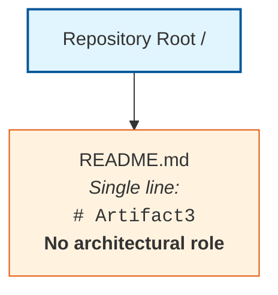

The single `README.md` artifact is documentation only and is not part of any architectural component, service, module, integration topology, deployment pipeline, observability stack, or security boundary. No runtime container, orchestration platform, service mesh, message bus, data store, or compute environment exists in the repository to host or coordinate architectural components.

---

## 5.3 High-Level Architecture Determinability

### 5.3.1 System Overview Determinability Matrix

The High-Level Architecture System Overview prescribed by the Section 5 prompt requires the documentation of overall architecture style, key architectural principles and patterns, and system boundaries with major interfaces. No such material is derivable from repository evidence.

| System Overview Element | Determinable from Repository | Authoritative Source |
|--------------------------|------------------------------|----------------------|
| Overall Architecture Style and Rationale | No | No source code, deployment topology, or design rationale documents present (see Section 1.2.2 and Section 3.1.3) |
| Key Architectural Principles and Patterns | No | No design documentation, pattern declarations, or framework conventions present (see Section 3.4) |
| System Boundaries | No | "System Boundaries: Undefined — No system implementation exists" (see Section 1.3.1) |
| Major Interfaces | No | No API contracts, service interfaces, or boundary declarations present (see Section 1.2.1 and Section 3.6) |

No determination of monolithic, microservices, serverless, event-driven, layered, hexagonal, or any other architectural style may be authored against current evidence. Section 3.1.3 has formally rejected all sixteen Default Technology Stack components — covering cloud platform, containerization, infrastructure-as-code, CI/CD, backend language and framework, authentication, database, AI framework, web frontend, CSS framework, cross-platform mobile, and native applications — as "Not adopted — no evidence," eliminating any basis for asserting a runtime architecture or deployment model.

### 5.3.2 Core Components Determinability and Empty Inventory

The Core Components Table prescribed by the Section 5 prompt requires the enumeration of components with their primary responsibility, key dependencies, integration points, and critical considerations. Section 1.2.2 confirms that "The repository contains no component diagrams, module structures, service definitions, package boundaries, or architectural artifacts that would identify major system components." Section 2.4.1 confirms that no inter-component relationships exist.

| Core Component Element | Determinable from Repository | Authoritative Source |
|-------------------------|------------------------------|----------------------|
| Component Name | No | No source modules, services, or packages exist (see Section 1.2.2) |
| Primary Responsibility | No | No functional specifications or features cataloged (see Section 2.2.1) |
| Key Dependencies | No | No dependency manifests or library declarations present (see Section 3.5) |
| Integration Points | No | No inter-component relationships exist (see Section 2.4.1) |

#### Empty Core Components Inventory

| Component Name | Primary Responsibility | Key Dependencies | Integration Points |
|----------------|------------------------|------------------|---------------------|
| *(none)* | *(none)* | *(none)* | *Not determinable from repository evidence* |

### 5.3.3 Data Flow Determinability and Empty Inventory

The Data Flow Description prescribed by the Section 5 prompt requires documentation of primary data flows between components, integration patterns and protocols, data transformation points, and key data stores and caches. Section 1.2.1 explicitly states: "No external system dependencies, third-party services, or inter-system data flows have been declared in the repository." Section 3.7 confirms the absence of all persistence, caching, and transactional artifacts, and Section 4.3.2 confirms the absence of API interactions, event processing flows, and batch processing sequences.

| Data Flow Element | Determinable from Repository | Authoritative Source |
|--------------------|------------------------------|----------------------|
| Primary Data Flows Between Components | No | No components exist; no flows possible (see Section 1.2.2 and Section 2.4.1) |
| Integration Patterns and Protocols | No | No protocol declarations or messaging artifacts present (see Section 3.6) |
| Data Transformation Points | No | No source code, ETL pipelines, or stream-processing definitions present |
| Key Data Stores and Caches | No | No databases, ORMs, or caching solutions declared (see Section 3.7) |

#### Empty Data Flow Inventory

| Source Component | Destination Component | Transformation | Persistence/Cache |
|------------------|------------------------|----------------|--------------------|
| *(none)* | *(none)* | *(none)* | *Not determinable from repository evidence* |

### 5.3.4 External Integration Points Determinability and Empty Inventory

The External Integration Points Table prescribed by the Section 5 prompt requires the documentation of external systems with their integration type, data exchange pattern, protocol/format, and SLA requirements. Section 3.6.1 has formally established the absence of external APIs, authentication services, monitoring tools, cloud services, payment/billing services, and email/notification services. Section 3.6.2 has presented the canonical empty External Service Inventory.

| External Integration Element | Determinable from Repository | Authoritative Source |
|------------------------------|------------------------------|----------------------|
| System Name | No | No external systems declared (see Section 1.2.1 and Section 3.6.1) |
| Integration Type | No | No integration topology, gateways, or mesh definitions present |
| Data Exchange Pattern | No | No messaging, eventing, or API patterns declared (see Section 4.3.2) |
| Protocol/Format | No | No protocol bindings (REST/gRPC/AMQP/Kafka/etc.) declared |
| SLA Requirements | No | No KPI definitions or SLO documentation present (see Section 1.2.3 and Section 2.5.2) |

#### Empty External Integration Points Inventory

| System Name | Integration Type | Protocol/Format | SLA Requirements |
|-------------|------------------|-----------------|-------------------|
| *(none)* | *(none)* | *(none)* | *Not determinable from repository evidence* |

---

## 5.4 Component Details Determinability

### 5.4.1 Component Specification Determinability Matrix

The Component Details subsection prescribed by the Section 5 prompt requires the specification of purpose and responsibilities, technologies and frameworks, key interfaces and APIs, data persistence requirements, and scaling considerations for each major component. Because no components exist (per Section 1.2.2), every component-detail element is undeterminable.

| Component Detail Element | Determinable from Repository | Authoritative Source |
|---------------------------|------------------------------|----------------------|
| Purpose and Responsibilities | No | No components exist (see Section 1.2.2) |
| Technologies and Frameworks Used | No | No technology stack declared (see Section 3.2.1 and Section 3.1.3) |
| Key Interfaces and APIs | No | No API contracts present (see Section 4.3.2 and Section 3.6) |
| Data Persistence Requirements | No | No databases or storage present (see Section 3.7) |
| Scaling Considerations | No | No deployment, capacity, or scaling artifacts present (see Section 2.5.2) |

#### Empty Component Specification Inventory

| Component | Technology | Interface/API | Persistence |
|-----------|------------|----------------|-------------|
| *(none)* | *(none)* | *(none)* | *Not determinable from repository evidence* |

### 5.4.2 Component Interaction, State, and Sequence Diagram Disposition

The Section 5 prompt prescribes three diagram families under Component Details: detailed component interaction diagrams, state transition diagrams, and sequence diagrams for key flows. The Mermaid Diagram Producibility Matrix established in Section 4.6.1 already determined that none of these diagrams are producible against the present repository evidence:

- Component interaction diagrams cannot be drawn because no components exist (see Section 1.2.2).
- State transition diagrams cannot be drawn because no state machines, stateful components, or formal state specifications are present (see Section 4.5.1).
- Sequence diagrams cannot be drawn because no message-passing contracts, service interactions, or API client code are declared (see Section 1.2.1 and Section 4.6.2).

Producing any of these diagrams without supporting repository evidence would constitute a violation of the evidence-based authoring standard binding this Technical Specification. The diagrams are therefore deferred until corresponding implementation, specification, or design artifacts are introduced into the repository.

---

## 5.5 Technical Decisions Determinability

### 5.5.1 Architectural Decision Determinability Matrix

The Technical Decisions subsection prescribed by the Section 5 prompt requires the documentation and justification of architecture style decisions and tradeoffs, communication pattern choices, data storage solution rationale, caching strategy justification, and security mechanism selection. No architectural decision records, design rationale documents, RFC documents, or technology-selection specifications are present in the repository to support these determinations.

| Technical Decision Element | Determinable from Repository | Authoritative Source |
|-----------------------------|------------------------------|----------------------|
| Architecture Style Decisions and Tradeoffs | No | No ADRs or design rationale documents present (see Section 1.3.2 and Section 3.1.3) |
| Communication Pattern Choices | No | No protocol declarations or messaging artifacts present (see Section 4.3.2) |
| Data Storage Solution Rationale | No | No database selection or persistence artifacts present (see Section 3.7) |
| Caching Strategy Justification | No | No caching solutions, configurations, or invalidation strategies declared (see Section 3.7 and Section 4.5.1) |
| Security Mechanism Selection | No | No threat models, security controls, or access policies present (see Section 2.5.2 and Section 4.4.2) |

#### Empty Architecture Decision Record (ADR) Inventory

| Decision Topic | Selected Option | Considered Alternatives | Rationale |
|----------------|-----------------|--------------------------|-----------|
| *(none)* | *(none)* | *(none)* | *Not determinable from repository evidence* |

### 5.5.2 Decision Tree and ADR Diagram Disposition

The Section 5 prompt prescribes two diagram families under Technical Decisions: decision tree diagrams and architecture decision records (ADRs) rendered as diagrams. Both diagram families are non-producible against current evidence:

- Decision tree diagrams cannot be drawn because no architectural decisions are documented in the repository.
- ADR diagrams cannot be drawn because no ADRs (in any format, including MADR, Y-statements, or Nygard's template) are present in the repository.

Section 3.1.3 has formally rejected all sixteen Default Technology Stack components as "Not adopted — no evidence." Authoring a decision tree or ADR diagram against any of these candidates without supporting evidence would constitute a violation of the evidence-based authoring standard. Both diagram families are therefore deferred until decision documentation artifacts (e.g., files within `/docs/adr/` or `/architecture/decisions/`) are introduced into the repository.

---

## 5.6 Cross-Cutting Concerns Determinability

### 5.6.1 Cross-Cutting Concern Determinability Matrix

The Cross-Cutting Concerns subsection prescribed by the Section 5 prompt requires the documentation of monitoring and observability approach, logging and tracing strategy, error handling patterns, authentication and authorization framework, performance requirements and SLAs, and disaster recovery procedures. Section 3.6.1 has formally established the absence of monitoring tools, observability configurations, authentication services, and notification integrations. Section 4.5.2 has formally established the absence of retry mechanisms, fallback processes, error notification flows, and recovery procedures.

| Cross-Cutting Concern Element | Determinable from Repository | Authoritative Source |
|--------------------------------|------------------------------|----------------------|
| Monitoring and Observability | No | "No APM agents, logging shippers, metrics exporters, or observability configurations present" (Section 3.6.1) |
| Logging and Tracing Strategy | No | No logging frameworks (e.g., Log4j, Winston, Pino) or tracing libraries (e.g., OpenTelemetry, Jaeger, Zipkin) declared (see Section 3.4) |
| Error Handling Patterns | No | No retry, circuit-breaker, bulkhead, or fallback implementations present (see Section 4.5.2) |
| Authentication and Authorization | No | No identity provider configuration, IAM policies, or access control middleware (see Section 4.4.2 and Section 3.6.1) |
| Performance Requirements and SLAs | No | "No KPI definitions, metrics catalogs ... or measurement frameworks are present" (Section 1.2.3; see also Section 2.5.2) |
| Disaster Recovery Procedures | No | "No operational runbooks, disaster-recovery documentation, or incident-response playbooks" (Section 4.5.2) |

#### Empty Cross-Cutting Concern Inventory

| Concern Area | Mechanism/Tool | Configuration | Coverage Scope |
|--------------|-----------------|----------------|------------------|
| *(none)* | *(none)* | *(none)* | *Not determinable from repository evidence* |

### 5.6.2 Error Handling Flow Diagram Disposition

The Section 5 prompt prescribes one diagram family under Cross-Cutting Concerns: error handling flows. The Mermaid Diagram Producibility Matrix established in Section 4.6.1 already determined that error handling flowcharts are not producible because no error-handling logic, exception classes, or recovery paths are present in the repository (see Section 4.5.2). No try/catch logic, error taxonomy documentation, exception hierarchies, dead-letter queue configurations, or alerting bindings exist from which an error-handling flow could be derived. The diagram is therefore deferred until error-handling artifacts are introduced into the repository.

---

## 5.7 Required Diagrams Determinability

### 5.7.1 Mermaid Diagram Producibility Matrix

The Section 5 prompt prescribes the generation of multiple Mermaid diagram families spanning Component Details (component interaction, state transition, sequence diagrams), Technical Decisions (decision tree diagrams, ADR diagrams), and Cross-Cutting Concerns (error handling flows). Application of the evidence-based authoring standard produces the following formal disposition of each prescribed diagram:

| Required Diagram | Producible from Repository | Rationale |
|------------------|-----------------------------|-----------|
| Detailed Component Interaction Diagrams | No | No components exist (see Section 1.2.2 and Section 5.4.1) |
| State Transition Diagrams | No | No state machines or stateful behavior (see Section 4.5.1) |
| Sequence Diagrams for Key Flows | No | No service interactions or message contracts (see Section 1.2.1 and Section 4.6.2) |
| Decision Tree Diagrams | No | No architectural decisions documented (see Section 5.5.1) |
| Architecture Decision Records (ADRs) | No | No ADRs in any format present in repository |
| Error Handling Flows | No | No error-handling logic, exception classes, or recovery paths (see Section 4.5.2) |

### 5.7.2 Disposition of Diagram Generation Request

Producing any of the six prescribed diagram families without supporting repository evidence would constitute a violation of the evidence-based authoring standard binding this Technical Specification. The diagram requests are therefore retained only as a reference checklist for future revisions and are explicitly deferred from the operative content of this section until corresponding implementation, specification, or design artifacts are introduced into the repository.

The single valid Mermaid diagram producible against current evidence is the canonical Repository Topology Diagram reproduced in Section 5.2.3 above, consistent with the determination in Section 4.6.2. No component-interaction diagram can be drawn because no components are documented; no state-transition diagram can be drawn because no states or transitions are defined; no sequence diagram can be drawn because no service interactions are declared (see Section 1.2.1); no decision tree can be drawn because no decisions are recorded; no ADR diagram can be drawn because no ADRs exist; and no error-handling flow can be drawn because no error-handling logic exists (see Section 4.5.2).

---

## 5.8 Anticipated Evolution and Future Population Triggers

### 5.8.1 Artifact-to-Subsection Mapping

Consistent with Section 1.4.2, Section 2.7.3, Section 3.9.1, and Section 4.7.1, this section will be revised as subsequent contributions populate the repository with the artifacts necessary to derive each System Architecture subsection. The following table enumerates the artifact categories whose introduction would unlock substantive population of each subsection and associated diagram:

| Subsection or Diagram | Artifact Category That Would Enable Population |
|------------------------|------------------------------------------------|
| 5.3.1 System Overview | Architectural overview documents, C4 model diagrams, deployment topology specifications, executable entry points (`main`, `index`, server bootstrap files) |
| 5.3.2 Core Components | Source-code module/package structure, service definitions, microservice manifests, application bootstrap files |
| 5.3.3 Data Flow | Service interaction diagrams, OpenAPI/AsyncAPI specs, event schemas, ETL pipeline definitions, data lineage documents |
| 5.3.4 External Integration Points | API client SDKs, integration configuration files, environment variable templates (`.env.example`), webhook bindings, message broker configurations |
| 5.4 Component Details | Source code in declared languages, dependency manifests (`package.json`, `requirements.txt`, `pom.xml`, etc.), framework configuration files |
| 5.5 Technical Decisions | Architecture Decision Records (MADR/Nygard format), design documents, RFC documents, technology-selection rationale |
| 5.6.1 Monitoring and Observability | APM agent configuration (Datadog, New Relic, Dynatrace), metrics exporters (Prometheus), distributed-tracing instrumentation (OpenTelemetry) |
| 5.6.1 Logging and Tracing | Logging framework configuration (Log4j, Winston, Pino), structured-log schemas, log aggregator bindings (ELK, Splunk, Loki) |
| 5.6.1 Error Handling | Retry/circuit-breaker libraries (Polly, Tenacity, resilience4j), error taxonomy documentation, exception hierarchies, dead-letter queue configurations |
| 5.6.1 Authentication and Authorization | IAM policies, OAuth/OIDC client configuration, RBAC/ABAC policy files, auth middleware source code |
| 5.6.1 Performance Requirements and SLAs | SLO/SLI declarations, performance test suites, capacity planning documents, load-test scenarios |
| 5.6.1 Disaster Recovery | Backup/restore configuration, runbooks, failover scripts, RPO/RTO declarations, incident-response playbooks |
| Diagram: Component Interaction | Component decomposition documented in source or design artifacts |
| Diagram: State Transition | State machine definitions (XState, Statecharts) or formal state specifications |
| Diagram: Sequence | API contracts, service client implementations, sequence specifications, contract tests |
| Diagram: Decision Tree / ADR | Architecture Decision Records in repository (e.g., `/docs/adr/`, `/architecture/decisions/`) |
| Diagram: Error Handling Flow | Try/catch logic, exception hierarchies, recovery handler implementations |

### 5.8.2 Future Population Triggers

When any artifact in the table above is introduced into the repository, the corresponding subsection of this Section 5 should be revisited and populated using the established Determinability Matrix pattern. Specifically:

1. The relevant Determinability Matrix row should be updated from "No" to "Yes" with the new authoritative source citation.
2. The Empty Inventory placeholder rows (`*(none)*` markers) should be replaced with factually grounded entries derived from the introduced artifacts.
3. The Mermaid Diagram Producibility Matrix in Section 5.7.1 should be updated to reflect newly producible diagrams.
4. New Mermaid diagrams (component interaction, state transition, sequence, decision tree, ADR, error-handling flow) should be drawn using nodes and edges that correspond to actors, components, and systems evidenced in the introduced artifacts, with timing and SLA annotations sourced from any newly introduced SLO declarations.
5. The disposition table in Section 3.1.3 should be revisited: any Default Technology Stack component that becomes evidenced through committed artifacts may transition from "Not adopted — no evidence" to a populated row in the corresponding Technology Stack inventory, providing the foundation for substantive architectural narrative in this section.

### 5.8.3 Reader Guidance

Readers consulting this section should treat its current form as a faithful reflection of the repository at the time of authoring, consistent with the guidance in Section 1.4.3, Section 2.7.4, Section 3.9.2, and Section 4.7.3. Items marked "No," "Not determinable," "None," or "*(none)*" indicate the absence of repository evidence, not a negative scoping decision against any candidate architecture style, component, integration, data store, security mechanism, observability solution, or disaster-recovery strategy. Project owners are encouraged to introduce the corresponding architectural decomposition, decision records, integration contracts, observability configurations, security controls, and operational documentation into the repository to enable a fully populated System Architecture section in future revisions of this Technical Specification.

---

## 5.9 References

### 5.9.1 Files Examined

- `README.md` — Sole repository artifact. Contains a single first-level Markdown heading declaring the project name `Artifact3`. Examined to confirm absence of any architectural decomposition, component definition, integration topology, technology stack declaration, decision record, observability configuration, security policy, or operational documentation within the repository. As Markdown documentation, it carries no runtime architectural role and is not consumed by any build, deployment, orchestration, or runtime system.

### 5.9.2 Folders Explored

- `/` (repository root) — Contains exclusively `README.md`; no subdirectories exist. Full repository traversal completed at depth 0. The absence of conventional architecture-bearing directories (e.g., `src/`, `app/`, `services/`, `components/`, `modules/`, `architecture/`, `docs/adr/`, `infra/`, `terraform/`, `k8s/`, `helm/`, `deployments/`) was confirmed by exhaustive traversal.

### 5.9.3 Tech Spec Sections Referenced

- **Section 1.1 Executive Summary** — Established the project identification as `Artifact3` and confirmed the pre-implementation, documentation-only repository state, which is the foundational basis for all "Not determinable" dispositions in this section.
- **Section 1.2 System Overview** — Established the absence of business context, integration topology, system components, and technical approach; provided the canonical Repository Contents Inventory and the canonical repository topology diagram reproduced in Section 5.2.3; provided the explicit statement that "No external system dependencies, third-party services, or inter-system data flows have been declared in the repository" (Section 1.2.1), supporting the Data Flow and External Integration Points determinability findings in Sections 5.3.3 and 5.3.4.
- **Section 1.3 Scope** — Provided the formal enumeration of nine confirmed-absent artifact categories that constitute the evidentiary basis for every "Not determinable" disposition in this System Architecture section; confirmed that system boundaries remain undefined.
- **Section 1.4 Document Status and Specification Boundary** — Established the evidence-based authoring standard applied throughout this section, including the disclosure-over-conjecture principle and reader guidance on interpreting absence markers.
- **Section 1.5 References** — Verified 100% repository coverage (1 of 1 files; 1 of 1 folders) at hierarchy depth 0, supporting the comprehensiveness claim of this section's empty-state findings.
- **Section 2.1 Section Authoring Basis and Evidence Constraint** — Established the precedent operative-constraint table format reproduced in Section 5.1.2.
- **Section 2.2 Feature Catalog** — Established that zero features exist in the repository (Section 2.2.1), directly supporting Section 5.3.2's finding that no core components can be enumerated.
- **Section 2.4 Feature Relationships** — Confirmed that no inter-component relationships exist (Section 2.4.1) and reproduced the canonical repository topology diagram, supporting the Data Flow determinability finding in Section 5.3.3.
- **Section 2.5 Implementation Considerations** — Provided the Implementation Consideration Determinability Matrix (Section 2.5.2) supporting the Performance Requirements, Scalability, Security, and Disaster Recovery findings in Section 5.6.1.
- **Section 2.7 Assumptions, Constraints, and Anticipated Evolution** — Provided the structural model for Section 5.8 (Anticipated Evolution and Future Population Triggers), including the artifact-to-subsection mapping table format.
- **Section 3.1 Section Authoring Basis and Evidence Constraint** — Established the disposition-table pattern (Section 3.1.3) for the prompt-prescribed Default Technology Stack and provided the formal rejection of all sixteen Default Technology Stack components as "Not adopted — no evidence," supporting Sections 5.3.1, 5.4.1, and 5.5.1.
- **Section 3.2 Technology Stack Determinability Status** — Confirmed that no technology stack components are derivable from repository evidence, supporting Section 5.4.1's Technologies and Frameworks finding.
- **Section 3.4 Frameworks and Libraries** — Confirmed the absence of all framework and library declarations, supporting the Logging and Tracing Strategy finding in Section 5.6.1.
- **Section 3.5 Open Source Dependencies** — Confirmed the absence of all dependency declarations, supporting the Key Dependencies finding in Section 5.3.2.
- **Section 3.6 Third-Party Services** — Confirmed the absence of external APIs, authentication services, monitoring tools, cloud services, payment processors, and notification services (Section 3.6.1), supporting Sections 5.3.4 and 5.6.1.
- **Section 3.7 Databases and Storage** — Confirmed the absence of persistence, caching, and transaction artifacts, supporting Sections 5.3.3, 5.4.1, and 5.5.1.
- **Section 3.8 Development and Deployment** — Confirmed the absence of CI/CD, build, containerization, and deployment artifacts, supporting the Scaling Considerations and Disaster Recovery findings in Sections 5.4.1 and 5.6.1.
- **Section 3.9 Anticipated Evolution and Future Population Triggers** — Provided the artifact-to-subsection mapping template reproduced in Section 5.8.1.
- **Section 4.1 Section Authoring Basis and Evidence Constraint** — Established the precedent for an evidence-based boundary statement, the operative-constraint table format, and the section-disposition pattern reproduced in Section 5.1.
- **Section 4.2 Process Flowchart Determinability Status** — Provided the Cross-Reference to Confirmed-Absent Artifacts pattern (Section 4.2.2) reproduced in Section 5.2.2 and the canonical repository topology reproduction pattern reproduced in Section 5.2.3.
- **Section 4.3 System Workflows Determinability** — Provided the Integration Workflows determinability findings (Section 4.3.2) supporting Section 5.3.4's External Integration Points determinability.
- **Section 4.4 Flowchart Requirements Determinability** — Provided the Validation Rules and Authorization findings (Section 4.4.2) supporting the Authentication and Authorization determinability in Section 5.6.1.
- **Section 4.5 Technical Implementation Determinability** — Provided the State Management Determinability Matrix (Section 4.5.1) and the Error Handling Determinability Matrix (Section 4.5.2), supporting Section 5.6.1's findings on error handling patterns and Section 5.4.2's disposition of state transition diagrams.
- **Section 4.6 Required Diagrams Determinability** — Established the Mermaid Diagram Producibility Matrix (Section 4.6.1) directly extended in Section 5.7.1 and provided the diagram-deferral pattern reproduced in Sections 5.4.2, 5.5.2, 5.6.2, and 5.7.2.
- **Section 4.7 Anticipated Evolution and Future Population Triggers** — Provided the diagram-population trigger pattern reproduced in Section 5.8.1.

### 5.9.4 Repository Coverage for This Section

| Coverage Metric | Value |
|------------------|-------|
| Files Examined | 1 of 1 (100%) |
| Folders Explored | 1 of 1 (100%) |
| Hierarchy Depth Achieved | 0 (no deeper hierarchy exists) |
| Components Identified | 0 (no source modules, services, or packages exist) |
| External Integrations Identified | 0 (no API contracts, SDKs, or service bindings) |
| Architecture Decision Records Identified | 0 (no ADRs in any format) |
| Cross-Cutting Concern Mechanisms Identified | 0 (no monitoring, logging, auth, or DR configurations) |
| Mermaid Diagrams Produced | 1 of 6+ prescribed (Repository Topology only; the prompt-prescribed diagrams are deferred per Section 5.7) |
| Architecture Styles Identified | 0 (no source code, deployment topology, or design documents) |

### 5.9.5 Authoring Compliance Summary

This section was authored in strict compliance with the evidence-based standard articulated in Section 1.4.1 and the operative directives stated in the Section 5 prompt ("Only include sections and items that are actually relevant to this system, based on your analysis of its requirements"; "Don't add any items that aren't clearly applicable"; "Ensure all components are clearly defined"; "Document all architectural assumptions"; "Include rationale for key decisions"). No architecture style, component, data flow, integration point, technical decision, cross-cutting concern, or Mermaid diagram was authored without explicit repository evidence; the prompt-prescribed Mermaid diagram families were formally dispositioned in Section 5.7 against repository evidence; and every "Not determinable" disposition is cross-referenced to an authoritative source elsewhere in this Technical Specification. This section will be revised in subsequent specification updates as the repository is populated with the artifact categories enumerated in Section 5.8.1.
`

# 6. SYSTEM COMPONENTS DESIGN

## 6.1 Core Services Architecture

### 6.1.1 Applicability Statement

#### 6.1.1.1 Applicability Determination

**Core Services Architecture is not applicable for this system.**

The Section 6.1 prompt provides an explicit guard clause directing the author to declare non-applicability when the system "does not require microservices, distributed architecture, or distinct service components." Application of that guard clause to the present repository evidence produces an unambiguous non-applicability determination on the following grounds:

| Applicability Criterion | Repository Evidence | Determination |
|-------------------------|---------------------|---------------|
| Distinct service components exist | No components, modules, or service definitions present (see Section 1.2.2) | Criterion not met |
| Distributed architecture exists | No external dependencies, third-party services, or inter-system data flows declared (see Section 1.2.1) | Criterion not met |
| Microservices topology exists | No service manifests, container images, or orchestration definitions present (see Section 3.8.1) | Criterion not met |
| Service-bearing technology stack exists | All sixteen Default Technology Stack components formally rejected as "Not adopted — no evidence" (see Section 3.1.3) | Criterion not met |

Because none of the necessary preconditions for a Core Services Architecture exist in the repository, the substantive content prescribed by the Section 6.1 prompt — service boundaries, inter-service communication, service discovery, load balancing, circuit breakers, retry/fallback mechanisms, scaling strategies, capacity planning, fault tolerance, disaster recovery, data redundancy, failover, and service degradation — cannot be derived from repository evidence and is therefore deferred until corresponding artifacts are introduced.

#### 6.1.1.2 Evidentiary Basis for the Non-Applicability Finding

The repository's complete inventory consists of one artifact:

| Path | Type | Content | Architectural Role |
|------|------|---------|--------------------|
| `/` | Directory (root) | Contains only `README.md`; zero subdirectories | Container only |
| `README.md` | Markdown file | Single line: `# Artifact3` | None |

This baseline is identical to the canonical Repository Contents Inventory established in Section 1.2.2 and verified at 100% coverage in Section 1.5.3 (1 of 1 files examined; 1 of 1 folders explored; hierarchy depth achieved: 0). The categorical absence of source code, package manifests, configuration files, build/CI/deployment scripts, test suites, database schemas, frontend assets, infrastructure-as-code definitions, and architectural documentation is formally catalogued in Section 1.3.2 and reaffirmed across the prior sections of this Technical Specification.

The non-applicability determination is consistent with — and required by — prior findings established in:

- **Section 1.1.1**, which characterizes the repository as being in a "pre-implementation, documentation-only state."
- **Section 1.2.1**, which states: "No external system dependencies, third-party services, or inter-system data flows have been declared in the repository."
- **Section 1.2.2**, which states: "The repository contains no component diagrams, module structures, service definitions, package boundaries, or architectural artifacts that would identify major system components."
- **Section 2.5.2**, which records "No" for Technical Constraints, Performance Requirements, Scalability Considerations, Security Implications, and Maintenance Requirements.
- **Section 3.1.3**, which formally rejects all sixteen Default Technology Stack components as "Not adopted — no evidence."
- **Section 3.8.1**, which confirms the absence of containerization, CI/CD pipelines, infrastructure-as-code, deployment environments, and Kubernetes manifests.
- **Section 4.5.2**, which records the empty Error Handling Inventory and confirms the absence of retry policies, circuit breakers, bulkheads, fallback handlers, alerting bindings, operational runbooks, and disaster-recovery documentation.
- **Section 5.6.1**, which records "No" for Monitoring and Observability, Logging and Tracing, Error Handling Patterns, Authentication and Authorization, Performance Requirements and SLAs, and Disaster Recovery Procedures.

---

### 6.1.2 Section Authoring Basis and Evidence Constraint

This Section 6.1 has been authored under the same evidence-based standard articulated in Section 1.4.1 and reaffirmed in Sections 2.1, 3.1, 4.1, and 5.1 of this Technical Specification: each factual assertion is traceable to an observed file, folder, or confirmed-absence finding in the repository, and where evidence is unavailable the section discloses the gap rather than supplying conjecture.

Per Section 1.4.3 reader guidance, all entries marked "No," "Not determinable," "None," "Undefined," or `*(none)*` in the matrices and inventories that follow indicate the absence of repository evidence and **do not constitute negative scoping decisions** against any future service architecture, scaling approach, or resilience pattern. Speculative population of these subsections with conjectural service boundaries, autoscaling rules, circuit-breaker thresholds, or disaster-recovery procedures would violate the binding authoring standard and is therefore deferred to future revisions triggered by repository artifact contributions enumerated in Section 6.1.7 below.

Tables in this section conform to the Section 6.1 output format requirement of no more than four columns and provide clear cross-references to the authoritative findings established in prior sections.

---

### 6.1.3 Service Components Determinability

#### 6.1.3.1 Service Components Determinability Matrix

The Section 6.1 prompt's SERVICE COMPONENTS area prescribes documentation of six sub-topics: service boundaries and responsibilities, inter-service communication patterns, service discovery mechanisms, load balancing strategy, circuit breaker patterns, and retry and fallback mechanisms. Application of the evidence-based authoring standard against the repository produces the following determinability disposition for each sub-topic:

| Service Component Element | Determinable | Authoritative Source |
|---------------------------|--------------|----------------------|
| Service Boundaries and Responsibilities | No | No components, modules, or service definitions present (Section 1.2.2; Section 5.3.2) |
| Inter-Service Communication Patterns | No | No service interactions or message contracts declared (Section 1.2.1; Section 4.6.2) |
| Service Discovery Mechanisms | No | No service registries, DNS configurations, or third-party services present (Section 3.6.1) |
| Load Balancing Strategy | No | No NGINX/HAProxy configs, K8s Ingress, or cloud load-balancer definitions (Section 3.8.1) |
| Circuit Breaker Patterns | No | "No circuit breakers, bulkheads, or fallback handlers declared" (Section 4.5.2) |
| Retry and Fallback Mechanisms | No | "No retry policies, exponential-backoff implementations, or resilience libraries" present (Section 4.5.2) |

#### 6.1.3.2 Empty Service Components Inventory

Consistent with the Empty Inventory pattern established in Sections 4.5.2 and 5.3.2, the service-level inventory derivable from current repository evidence is empty across all four operational dimensions:

| Service Identifier | Communication Pattern | Discovery Method | Resilience Pattern |
|--------------------|------------------------|--------------------|--------------------|
| *(none)* | *(none)* | *(none)* | *Not determinable from repository evidence* |

#### 6.1.3.3 Cross-Reference Summary for Service Components

The following cross-reference maps each Service Components sub-topic to the section(s) that formally established its absence:

| Sub-Topic | Primary Source | Corroborating Source |
|-----------|----------------|-----------------------|
| Service Boundaries | Section 1.2.2 | Section 5.3.2 |
| Inter-Service Communication | Section 1.2.1 | Section 4.6.2 |
| Service Discovery | Section 3.6.1 | Section 3.8.1 |
| Load Balancing | Section 3.8.1 | Section 5.6.1 |
| Circuit Breakers | Section 4.5.2 | Section 5.6.1 |
| Retry / Fallback | Section 4.5.2 | Section 5.6.1 |

---

### 6.1.4 Scalability Design Determinability

#### 6.1.4.1 Scalability Design Determinability Matrix

The Section 6.1 prompt's SCALABILITY DESIGN area prescribes documentation of five sub-topics: horizontal/vertical scaling approach, auto-scaling triggers and rules, resource allocation strategy, performance optimization techniques, and capacity planning guidelines. The Implementation Consideration Determinability Matrix in Section 2.5.2 has already established "No" for Scalability Considerations and Performance Requirements. Application of the evidence-based authoring standard produces the following determinability disposition:

| Scalability Element | Determinable | Authoritative Source |
|---------------------|--------------|----------------------|
| Horizontal / Vertical Scaling Approach | No | "No deployment, capacity, or scaling artifacts present" (Section 2.5.2; Section 5.4.1) |
| Auto-Scaling Triggers and Rules | No | No HPA/VPA manifests, KEDA configs, or cloud autoscaling policies (Section 3.8.1) |
| Resource Allocation Strategy | No | No CPU/memory limits, resource quotas, or container specifications (Section 3.8.1) |
| Performance Optimization Techniques | No | "No KPI definitions, metrics catalogs ... or measurement frameworks are present" (Section 1.2.3; Section 5.6.1) |
| Capacity Planning Guidelines | No | No SLO/SLI declarations, load-test scenarios, or capacity documentation (Section 2.5.2) |

#### 6.1.4.2 Empty Scalability Inventory

Consistent with the Empty Inventory pattern, the scaling-related inventory derivable from current repository evidence is empty across all four operational dimensions:

| Scaling Unit | Trigger / Metric | Min/Max Bounds | Resource Profile |
|--------------|------------------|----------------|------------------|
| *(none)* | *(none)* | *(none)* | *Not determinable from repository evidence* |

#### 6.1.4.3 Cross-Reference Summary for Scalability Design

| Sub-Topic | Primary Source | Corroborating Source |
|-----------|----------------|-----------------------|
| Horizontal / Vertical Scaling | Section 2.5.2 | Section 5.4.1 |
| Auto-Scaling Triggers | Section 3.8.1 | Section 3.6.1 |
| Resource Allocation | Section 3.8.1 | Section 1.2.3 |
| Performance Optimization | Section 1.2.3 | Section 5.6.1 |
| Capacity Planning | Section 2.5.2 | Section 5.6.1 |

---

### 6.1.5 Resilience Patterns Determinability

#### 6.1.5.1 Resilience Patterns Determinability Matrix

The Section 6.1 prompt's RESILIENCE PATTERNS area prescribes documentation of five sub-topics: fault tolerance mechanisms, disaster recovery procedures, data redundancy approach, failover configurations, and service degradation policies. The Error Handling Determinability Matrix in Section 4.5.2 and the Cross-Cutting Concern Determinability Matrix in Section 5.6.1 have already established "No" for the entire resilience surface. The following matrix restates these findings specifically against the Section 6.1 sub-topics:

| Resilience Element | Determinable | Authoritative Source |
|--------------------|--------------|----------------------|
| Fault Tolerance Mechanisms | No | Empty Error Handling Inventory (Section 4.5.2); "Error Handling Patterns: No" (Section 5.6.1) |
| Disaster Recovery Procedures | No | "No operational runbooks, disaster-recovery documentation, or incident-response playbooks" (Section 4.5.2; Section 5.6.1) |
| Data Redundancy Approach | No | No databases, ORMs, schemas, or persistence layer artifacts (Section 3.7; Section 5.4.1) |
| Failover Configurations | No | No failover scripts, multi-AZ/region deployment configs, or recovery procedures (Section 3.8.1; Section 4.5.2) |
| Service Degradation Policies | No | "No circuit breakers, bulkheads, or fallback handlers declared" (Section 4.5.2) |

#### 6.1.5.2 Empty Resilience Inventory

Consistent with the Empty Error Handling Inventory pattern in Section 4.5.2, the resilience-related inventory derivable from current repository evidence is empty across all four operational dimensions:

| Failure Mode | Detection Mechanism | Mitigation Strategy | Recovery SLO |
|--------------|---------------------|---------------------|--------------|
| *(none)* | *(none)* | *(none)* | *Not determinable from repository evidence* |

#### 6.1.5.3 Cross-Reference Summary for Resilience Patterns

| Sub-Topic | Primary Source | Corroborating Source |
|-----------|----------------|-----------------------|
| Fault Tolerance | Section 4.5.2 | Section 5.6.1 |
| Disaster Recovery | Section 4.5.2 | Section 5.6.1 |
| Data Redundancy | Section 3.7 | Section 5.4.1 |
| Failover | Section 3.8.1 | Section 4.5.2 |
| Service Degradation | Section 4.5.2 | Section 5.6.1 |

---

### 6.1.6 Required Diagrams Disposition

#### 6.1.6.1 Diagram Producibility Matrix

The Section 6.1 prompt prescribes three Mermaid diagram families: service interaction diagrams, scalability architecture diagrams, and resilience pattern implementation diagrams. Application of the evidence-based authoring standard — and consistency with the Mermaid Diagram Producibility Matrix already established in Sections 4.6.1 and 5.7.1 — produces the following formal disposition:

| Required Diagram | Producible | Rationale |
|------------------|------------|-----------|
| Service Interaction Diagram | No | No services, no interactions, no message contracts (Section 1.2.1; Section 5.7.1) |
| Scalability Architecture Diagram | No | No deployment topology, no scaling units, no autoscaling rules (Section 2.5.2; Section 3.8.1) |
| Resilience Pattern Implementation Diagram | No | No error-handling logic, no recovery paths, no failover constructs (Section 4.5.2; Section 5.7.1) |

Producing any of these three diagrams without supporting repository evidence would constitute a violation of the binding evidence-based authoring standard, consistent with the disposition recorded in Section 5.7.2. The diagrams are retained only as a reference checklist for future revisions and are explicitly deferred until the corresponding implementation, specification, or design artifacts are introduced into the repository.

#### 6.1.6.2 Canonical Repository Topology Diagram

The single valid Mermaid diagram producible against current evidence is the canonical Repository Topology Diagram reproduced from Sections 1.2.2, 2.4.3, 3.2.3, 4.2.3, and 5.2.3. It is included here to visually corroborate the absence of any service architecture artifacts:

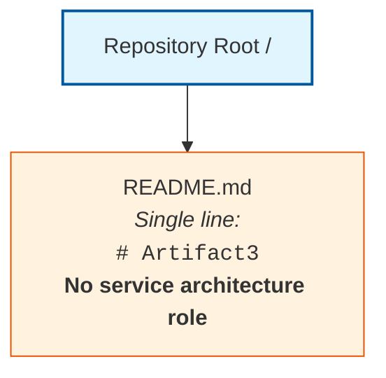

The single `README.md` artifact is documentation only and does not participate in any service component, communication channel, discovery registry, load-balancing tier, circuit-breaker chain, scaling group, resilience perimeter, failover zone, or disaster-recovery configuration. No runtime container, orchestration platform, service mesh, message broker, data store, or compute environment exists in the repository to host or coordinate service-architecture elements.

#### 6.1.6.3 Deferred Diagram Templates for Future Revisions

When the artifact prerequisites enumerated in Section 6.1.7 are introduced into the repository, the three deferred diagrams should be drawn against the established Mermaid syntax conventions used elsewhere in this Technical Specification. The diagram families and their producibility preconditions are:

| Diagram Family | Producibility Precondition |
|----------------|-----------------------------|
| Service Interaction | Source code defining service boundaries; OpenAPI/AsyncAPI specs; gRPC `.proto` files |
| Scalability Architecture | Deployment topology artifacts; HPA/VPA manifests; cloud autoscaling policies; capacity declarations |
| Resilience Pattern Implementation | Retry/circuit-breaker library declarations; runbooks; failover scripts; RPO/RTO specifications |

---

### 6.1.7 Anticipated Evolution and Future Population Triggers

#### 6.1.7.1 Artifact-to-Subsection Mapping

Consistent with the future-population mapping patterns established in Sections 1.4.2, 2.7.3, 3.9.1, 4.7.1, and 5.8.1, this section will be revised as subsequent contributions populate the repository with the artifacts necessary to derive each Core Services Architecture sub-topic. The following table enumerates the artifact categories whose introduction would unlock substantive population of each sub-topic:

| Sub-Topic | Artifact Category That Would Enable Population |
|-----------|------------------------------------------------|
| Service Boundaries and Responsibilities | Source code with service definitions, microservice manifests, bounded-context documentation, C4 model diagrams |
| Inter-Service Communication | OpenAPI/AsyncAPI specifications, gRPC `.proto` files, message broker configurations, event schemas |
| Service Discovery | Consul/Eureka/Zookeeper configurations, Kubernetes Service manifests, DNS-SD records, service mesh declarations |
| Load Balancing | NGINX/HAProxy configurations, Kubernetes Ingress manifests, cloud load-balancer definitions, Envoy/Istio configs |
| Circuit Breaker Patterns | Resilience library declarations (Polly, resilience4j, Hystrix, Tenacity); circuit-breaker policy configurations |
| Retry and Fallback Mechanisms | Retry libraries, exponential-backoff policy declarations, fallback handler source code, dead-letter queue configs |
| Horizontal / Vertical Scaling | Deployment manifests, HPA/VPA YAML, stateful set declarations, cloud autoscaling group definitions |
| Auto-Scaling Triggers | Custom metric definitions, KEDA scaler configurations, CloudWatch/Prometheus rule files, scaling event policies |
| Resource Allocation | Container resource requests/limits, namespace ResourceQuota objects, instance-type declarations |
| Performance Optimization | Profiling configurations, caching policy declarations, performance test suites, optimization design documents |
| Capacity Planning | SLO/SLI declarations, load-test scenarios, capacity model documents, traffic forecast artifacts |
| Fault Tolerance | Exception hierarchy source code, fault-injection test suites, chaos-engineering experiment configurations |
| Disaster Recovery | Backup/restore configurations, runbooks, RPO/RTO declarations, incident-response playbooks |
| Data Redundancy | Database replication configurations, multi-region storage manifests, cross-region replication policies |
| Failover Configurations | Failover scripts, multi-AZ/multi-region deployment manifests, DNS failover policies, leader-election configs |
| Service Degradation | Feature flag declarations, graceful-degradation handler source code, fallback content/response configurations |

#### 6.1.7.2 Future Population Triggers

When any artifact in the table above is introduced into the repository, this Section 6.1 should be revisited and populated using the established Determinability Matrix pattern:

1. The relevant Determinability Matrix row should be updated from "No" to "Yes" with the new authoritative source citation.
2. The Empty Inventory placeholder rows (`*(none)*` markers) in Sections 6.1.3.2, 6.1.4.2, and 6.1.5.2 should be replaced with factually grounded entries derived from the introduced artifacts.
3. The Diagram Producibility Matrix in Section 6.1.6.1 should be updated to reflect newly producible service interaction, scalability architecture, and resilience pattern diagrams.
4. New Mermaid diagrams should be drawn using nodes and edges that correspond to actors, components, and systems evidenced in the introduced artifacts, with capacity, SLA, and recovery-objective annotations sourced from any newly introduced SLO/SLI declarations.
5. The Applicability Determination in Section 6.1.1.1 should be revisited; if any of the criteria therein transitions to "Criterion met," the non-applicability finding should be retracted and substantive content should replace this boundary statement.

#### 6.1.7.3 Reader Guidance

Readers consulting this section should treat its current form as a faithful reflection of the repository at the time of authoring, consistent with the guidance in Sections 1.4.3, 2.7.4, 3.9.2, 4.7.3, and 5.8.3. Entries marked "No," "Not determinable," "None," or `*(none)*` indicate the absence of repository evidence and not a negative scoping decision against any candidate service architecture, scaling strategy, or resilience pattern. Project owners are encouraged to introduce the corresponding service definitions, communication contracts, discovery configurations, load-balancing policies, resilience library bindings, scaling manifests, capacity declarations, fault-tolerance source code, disaster-recovery documentation, replication configurations, failover scripts, and degradation policies into the repository to enable a fully populated Core Services Architecture section in future revisions of this Technical Specification.

---

### 6.1.8 References

#### 6.1.8.1 Files Examined

- `README.md` — The repository's sole artifact; single-line content `# Artifact3`; confirmed to bear no service-architecture role and to declare no services, scaling units, or resilience patterns.

#### 6.1.8.2 Folders Explored

- `/` (repository root, depth 0) — Confirmed to contain exactly one child (`README.md`) and zero subdirectories; provides no service component, scaling unit, or resilience-perimeter structure.

#### 6.1.8.3 Technical Specification Sections Referenced

- **Section 1.1 Executive Summary** — Confirmed the pre-implementation, documentation-only state of the repository and the project identification as `Artifact3`.
- **Section 1.2 System Overview** — Provided the canonical Repository Contents Inventory and the explicit statements that no external system dependencies, third-party services, or inter-system data flows are declared, and that no component diagrams, module structures, service definitions, or package boundaries exist.
- **Section 1.3 Scope** — Established the catalogue of nine confirmed-absent artifact categories that constitute the evidentiary basis for the non-applicability determination in Section 6.1.1.
- **Section 1.4 Document Status and Specification Boundary** — Established the evidence-based authoring standard and reader-guidance conventions inherited by this Section 6.1.
- **Section 1.5 References** — Verified 100% repository coverage (1 of 1 files; 1 of 1 folders) at hierarchy depth 0.
- **Section 2.5 Implementation Considerations** — Provided the Implementation Consideration Determinability Matrix recording "No" for Scalability Considerations, Performance Requirements, and Technical Constraints (directly informing Section 6.1.4).
- **Section 3.1 Section Authoring Basis and Evidence Constraint** — Reaffirmed the evidence-based standard and the formal rejection of all sixteen Default Technology Stack components.
- **Section 3.6 Third-Party Services** — Confirmed the absence of external APIs, authentication, monitoring, and cloud services that could enable service discovery, load balancing, or observability.
- **Section 3.7 Databases and Storage** — Confirmed the absence of persistence, caching, and transaction artifacts that could underpin a data redundancy approach.
- **Section 3.8 Development and Deployment** — Confirmed the absence of containerization, CI/CD, IaC, deployment environments, and Kubernetes manifests that could underpin scaling, failover, or service-discovery topology.
- **Section 4.5 Technical Implementation Determinability** — Provided the Error Handling Determinability Matrix (no retry, no circuit breakers, no fallback, no recovery procedures, no runbooks) that directly underpins Sections 6.1.3.1 and 6.1.5.1.
- **Section 4.6 Required Diagrams Determinability** — Established the Mermaid Diagram Producibility Matrix pattern reused in Section 6.1.6.1.
- **Section 5.2 System Architecture Determinability Status** — Provided the canonical Repository Topology Diagram reproduced in Section 6.1.6.2.
- **Section 5.3 High-Level Architecture Determinability** — Provided the Empty Inventory pattern reused in Sections 6.1.3.2, 6.1.4.2, and 6.1.5.2.
- **Section 5.4 Component Details Determinability** — Established component-level determinability (Purpose, Technologies, Interfaces, Persistence, Scaling all "No").
- **Section 5.6 Cross-Cutting Concerns Determinability** — Provided the most directly applicable findings for Section 6.1.5 (Disaster Recovery, Error Handling Patterns, Performance Requirements all "No").
- **Section 5.7 Required Diagrams Determinability** — Established the Mermaid Diagram Producibility precedent that no service-interaction, sequence, or error-handling diagrams can be drawn.
- **Section 5.8 Anticipated Evolution and Future Population Triggers** — Provided the artifact-to-subsection mapping template reused in Section 6.1.7.1.

## 6.2 Database Design

### 6.2.1 Applicability Statement

#### 6.2.1.1 Applicability Determination

**Database Design is not applicable to this system.**

The Section 6.2 prompt provides an explicit guard clause directing the author to declare non-applicability when "the system does not require or direct database or persistent storage interactions are not clearly evident." Application of that guard clause to the present repository evidence produces an unambiguous non-applicability determination on the following grounds:

| Applicability Criterion | Repository Evidence | Determination |
|-------------------------|---------------------|---------------|
| Direct database interactions are evident | No database drivers, connection strings, ORM models, or schemas present (Section 3.7.1) | Criterion not met |
| Persistent storage interactions are evident | No object storage SDKs or file-system abstractions present (Section 3.7.1) | Criterion not met |
| Schema migration artifacts exist | No migration tools (Alembic, Flyway, Liquibase, Knex) or migration scripts present (Section 1.3.2; Section 3.7.1) | Criterion not met |
| Caching layer artifacts exist | No Redis, Memcached, or in-process cache configurations present (Section 3.7.1; Section 4.5.1) | Criterion not met |

Because none of the necessary preconditions for a Database Design exist in the repository, the substantive content prescribed by the Section 6.2 prompt — entity relationships, data models, indexing strategy, partitioning, replication, backup architecture, migrations, versioning, archival policies, caching policies, retention rules, privacy controls, audit mechanisms, access controls, query optimization, connection pooling, read/write splitting, and batch processing — cannot be derived from repository evidence and is therefore deferred until corresponding artifacts are introduced.

#### 6.2.1.2 Evidentiary Basis for the Non-Applicability Finding

The repository's complete inventory consists of one artifact and bears no database role:

| Path | Type | Content | Database / Persistence Role |
|------|------|---------|------------------------------|
| `/` | Directory (root) | Contains only `README.md`; zero subdirectories | Container only — no role |
| `README.md` | Markdown file | Single line: `# Artifact3` | None — not a database artifact |

This baseline is identical to the canonical Repository Contents Inventory established in Section 1.2.2 and verified at 100% coverage in Section 1.5 (1 of 1 files examined; 1 of 1 folders explored; hierarchy depth achieved: 0). The categorical absence of database schemas, migration scripts, ORM models, persistence-layer code, caching configurations, storage SDK initializations, and backup or retention documentation is formally catalogued in Section 1.3.2 ("Database schemas or migrations: Absent") and reaffirmed throughout this Technical Specification.

The non-applicability determination is consistent with — and required by — prior findings established in:

- **Section 1.1**, which characterizes the repository as being in a pre-implementation, documentation-only state.
- **Section 1.2.2**, which records that no programming languages, frameworks, runtime environments, package managers, build tools, or technology stack choices have been declared in the repository.
- **Section 1.3.2**, which lists "Database schemas or migrations" as a confirmed-absent artifact category.
- **Section 3.1.3**, which formally rejects MongoDB and the other fifteen Default Technology Stack components as "Not adopted — no evidence."
- **Section 3.7.1**, the **primary authoritative source**, whose Databases and Storage Determinability Matrix records "No" for Primary Database, Secondary Databases, Data Persistence Strategies, Caching Solutions, Storage Services, Schema Migrations, and Backup and Retention Policies.
- **Section 3.7.2**, which presents the empty Data Storage Inventory using the `*(none)*` placeholder convention.
- **Section 3.7.3**, which states that "no persistence strategy — including selection of relational versus document-oriented stores, consistency models, sharding or partitioning approaches, indexing strategies, cache invalidation policies, or backup-and-restore patterns — is evidenced in the repository."
- **Section 4.5.1**, which records "No" for State Transitions, Data Persistence Points, Caching Requirements, and Transaction Boundaries.
- **Section 5.4.1**, which records "No" for Data Persistence Requirements at the component level.
- **Section 5.6.1**, which records "No" for Performance Requirements and SLAs and Disaster Recovery Procedures.
- **Section 6.1.5.1**, which records "No" for Data Redundancy Approach, citing the absence of databases, ORMs, schemas, or persistence-layer artifacts.

---

### 6.2.2 Section Authoring Basis and Evidence Constraint

This Section 6.2 has been authored under the same evidence-based standard articulated in Section 1.4 and reaffirmed in Sections 2.1, 3.1, 4.1, 5.1, and 6.1.2 of this Technical Specification: each factual assertion is traceable to an observed file, folder, or confirmed-absence finding in the repository, and where evidence is unavailable the section discloses the gap rather than supplying conjecture.

Per Section 1.4 reader guidance, all entries marked "No," "Not determinable," "None," "Undefined," or `*(none)*` in the matrices and inventories that follow indicate the absence of repository evidence and **do not constitute negative scoping decisions** against any future relational, document, key-value, time-series, graph, columnar, or object storage solution. Speculative population of these subsections with conjectural entity-relationship diagrams, index definitions, partitioning keys, replica topologies, retention windows, encryption modes, audit-log schemas, or connection-pool tuning parameters would violate the binding authoring standard and is therefore deferred to future revisions triggered by repository artifact contributions enumerated in Section 6.2.8 below.

Tables in this section conform to the Section 6.2 output format requirement of no more than four columns and provide clear cross-references to the authoritative findings established in prior sections, particularly Section 3.7 (Databases and Storage), which serves as the primary authoritative source for the non-applicability determination.

---

### 6.2.3 Schema Design Determinability

#### 6.2.3.1 Schema Design Determinability Matrix

The Section 6.2 prompt's SCHEMA DESIGN area prescribes documentation of six sub-topics: entity relationships, data models and structures, indexing strategy, partitioning approach, replication configuration, and backup architecture. Section 3.7.1 has already formally established the absence of every database and storage artifact from which any of these sub-topics could be derived. The following matrix restates these findings specifically against the Section 6.2 Schema Design sub-topics:

| Schema Design Element | Determinable | Authoritative Source |
|-----------------------|--------------|----------------------|
| Entity Relationships | No | No ORM models, ERD documentation, or DDL scripts present (Section 3.7.1; Section 1.3.2) |
| Data Models and Structures | No | No schema files (`.sql`, JSON Schema, Avro, Protobuf) or ORM class definitions (Section 3.7.1) |
| Indexing Strategy | No | No index DDL statements, ORM index decorators, or query profiler outputs (Section 3.7.1; Section 3.7.3) |
| Partitioning Approach | No | "No sharding or partitioning approaches" evidenced (Section 3.7.3; Section 3.7.1) |
| Replication Configuration | No | No replica set configurations or primary-replica topology declarations (Section 3.7.1; Section 6.1.5.1) |
| Backup Architecture | No | "No backup configurations or retention documentation present" (Section 3.7.1) |

#### 6.2.3.2 Empty Schema Design Inventory

Consistent with the Empty Inventory pattern established in Sections 3.7.2, 4.5.1, 5.3.2, 5.4.1, 5.6.1, 6.1.3.2, 6.1.4.2, and 6.1.5.2, the schema-design inventory derivable from current repository evidence is empty across all operational dimensions.

#### Entity and Relationship Inventory

| Entity | Attributes | Relationships | Cardinality |
|--------|------------|---------------|-------------|
| *(none)* | *(none)* | *(none)* | *Not determinable from repository evidence* |

#### Index and Constraint Inventory

| Index / Constraint Name | Target Table / Collection | Type | Purpose |
|-------------------------|---------------------------|------|---------|
| *(none)* | *(none)* | *(none)* | *Not determinable from repository evidence* |

#### Partitioning and Replication Inventory

| Datastore | Partitioning Key | Replication Mode | Backup Strategy |
|-----------|------------------|-------------------|------------------|
| *(none)* | *(none)* | *(none)* | *Not determinable from repository evidence* |

#### 6.2.3.3 Cross-Reference Summary for Schema Design

| Sub-Topic | Primary Source | Corroborating Source |
|-----------|----------------|-----------------------|
| Entity Relationships | Section 3.7.1 | Section 1.3.2 |
| Data Models | Section 3.7.1 | Section 5.4.1 |
| Indexing Strategy | Section 3.7.1 | Section 3.7.3 |
| Partitioning Approach | Section 3.7.3 | Section 3.7.1 |
| Replication Configuration | Section 3.7.1 | Section 6.1.5.1 |
| Backup Architecture | Section 3.7.1 | Section 6.1.5.1 |

---

### 6.2.4 Data Management Determinability

#### 6.2.4.1 Data Management Determinability Matrix

The Section 6.2 prompt's DATA MANAGEMENT area prescribes documentation of five sub-topics: migration procedures, versioning strategy, archival policies, data storage and retrieval mechanisms, and caching policies. Section 3.7.1 records "No" for Schema Migrations and Caching Solutions; Section 4.5.1 records "No" for Data Persistence Points and Caching Requirements. The following matrix consolidates these findings against the Section 6.2 sub-topics:

| Data Management Element | Determinable | Authoritative Source |
|-------------------------|--------------|----------------------|
| Migration Procedures | No | "No migration tools (e.g., Alembic, Flyway, Liquibase, Knex) or migration scripts present" (Section 3.7.1; Section 1.3.2) |
| Versioning Strategy | No | No schema version tables, migration history, or semantic versioning of schemas (Section 3.7.1) |
| Archival Policies | No | "No backup configurations or retention documentation present" (Section 3.7.1) |
| Data Storage and Retrieval Mechanisms | No | "No data access layer code, repository pattern implementations, or transaction management artifacts present" (Section 3.7.1; Section 4.5.1) |
| Caching Policies | No | "No caching solutions, configurations, or invalidation strategies declared" (Section 3.7.1; Section 4.5.1) |

#### 6.2.4.2 Empty Data Management Inventory

#### Migration and Versioning Inventory

| Migration ID | Schema Version | Direction | Applied Timestamp |
|--------------|----------------|-----------|---------------------|
| *(none)* | *(none)* | *(none)* | *Not determinable from repository evidence* |

#### Storage, Retrieval, and Caching Inventory

| Access Pattern | Implementation | Cache Layer | Invalidation Policy |
|----------------|----------------|-------------|---------------------|
| *(none)* | *(none)* | *(none)* | *Not determinable from repository evidence* |

#### 6.2.4.3 Cross-Reference Summary for Data Management

| Sub-Topic | Primary Source | Corroborating Source |
|-----------|----------------|-----------------------|
| Migration Procedures | Section 3.7.1 | Section 1.3.2 |
| Versioning Strategy | Section 3.7.1 | Section 3.7.3 |
| Archival Policies | Section 3.7.1 | Section 3.7.3 |
| Storage and Retrieval | Section 3.7.1 | Section 4.5.1 |
| Caching Policies | Section 3.7.1 | Section 4.5.1 |

---

### 6.2.5 Compliance Considerations Determinability

#### 6.2.5.1 Compliance Considerations Determinability Matrix

The Section 6.2 prompt's COMPLIANCE CONSIDERATIONS area prescribes documentation of five sub-topics: data retention rules, backup and fault tolerance policies, privacy controls, audit mechanisms, and access controls. The Cross-Cutting Concern Determinability Matrix in Section 5.6.1 has already established "No" for Authentication and Authorization and for Disaster Recovery Procedures; the Resilience Patterns Determinability Matrix in Section 6.1.5.1 has established "No" for Fault Tolerance Mechanisms, Disaster Recovery Procedures, and Data Redundancy Approach. The following matrix consolidates these findings:

| Compliance Element | Determinable | Authoritative Source |
|--------------------|--------------|----------------------|
| Data Retention Rules | No | No retention documentation, TTL configurations, or purge scripts (Section 3.7.1) |
| Backup and Fault Tolerance Policies | No | No backup schedules, RPO/RTO declarations, or multi-region replication configs (Section 3.7.1; Section 6.1.5.1) |
| Privacy Controls | No | No encryption-at-rest configs, PII handling code, or GDPR/CCPA compliance documentation (Section 3.7.1; Section 5.6.1) |
| Audit Mechanisms | No | No audit log table definitions, audit event handlers, or compliance reports (Section 3.7.1; Section 5.6.1) |
| Access Controls | No | No database role definitions, row-level security policies, or IAM configurations (Section 5.6.1; Section 3.6) |

#### 6.2.5.2 Empty Compliance Inventory

#### Retention and Backup Inventory

| Data Class | Retention Window | Backup Cadence | Recovery Objective |
|------------|--------------------|------------------|---------------------|
| *(none)* | *(none)* | *(none)* | *Not determinable from repository evidence* |

#### Privacy, Audit, and Access Control Inventory

| Control Domain | Mechanism | Scope | Enforcement Layer |
|----------------|-----------|-------|---------------------|
| *(none)* | *(none)* | *(none)* | *Not determinable from repository evidence* |

#### 6.2.5.3 Cross-Reference Summary for Compliance Considerations

| Sub-Topic | Primary Source | Corroborating Source |
|-----------|----------------|-----------------------|
| Data Retention Rules | Section 3.7.1 | Section 3.7.3 |
| Backup / Fault Tolerance | Section 3.7.1 | Section 6.1.5.1 |
| Privacy Controls | Section 3.7.1 | Section 5.6.1 |
| Audit Mechanisms | Section 3.7.1 | Section 5.6.1 |
| Access Controls | Section 5.6.1 | Section 3.6 |

---

### 6.2.6 Performance Optimization Determinability

#### 6.2.6.1 Performance Optimization Determinability Matrix

The Section 6.2 prompt's PERFORMANCE OPTIMIZATION area prescribes documentation of five sub-topics: query optimization patterns, caching strategy, connection pooling, read/write splitting, and batch processing approach. The Implementation Consideration Determinability Matrix referenced from Section 5.6.1 and the Scalability Design Determinability Matrix in Section 6.1.4.1 have already established "No" for Performance Optimization Techniques and Performance Requirements and SLAs. The following matrix consolidates these findings against Section 6.2's database-specific performance sub-topics:

| Performance Optimization Element | Determinable | Authoritative Source |
|-----------------------------------|--------------|----------------------|
| Query Optimization Patterns | No | No query plans, indexing strategies, or performance test suites (Section 3.7.1; Section 3.7.3) |
| Caching Strategy | No | "No caching solutions, configurations, or invalidation strategies declared" (Section 3.7.1; Section 4.5.1) |
| Connection Pooling | No | No connection pool configurations (e.g., HikariCP, pgBouncer) present (Section 3.7.1) |
| Read / Write Splitting | No | No read replica configurations or query routing logic (Section 3.7.1; Section 6.1.5.1) |
| Batch Processing Approach | No | No batch job definitions or ETL pipeline configurations (Section 3.7.1; Section 5.3) |

#### 6.2.6.2 Empty Performance Optimization Inventory

#### Query and Connection Performance Inventory

| Query / Workload | Optimization Technique | Connection Pool | Target Latency |
|------------------|------------------------|------------------|------------------|
| *(none)* | *(none)* | *(none)* | *Not determinable from repository evidence* |

#### Caching and Workload Distribution Inventory

| Cache Tier | Strategy | Read/Write Split | Batch Mechanism |
|------------|----------|--------------------|-------------------|
| *(none)* | *(none)* | *(none)* | *Not determinable from repository evidence* |

#### 6.2.6.3 Cross-Reference Summary for Performance Optimization

| Sub-Topic | Primary Source | Corroborating Source |
|-----------|----------------|-----------------------|
| Query Optimization | Section 3.7.1 | Section 3.7.3 |
| Caching Strategy | Section 3.7.1 | Section 4.5.1 |
| Connection Pooling | Section 3.7.1 | Section 5.4.1 |
| Read / Write Splitting | Section 3.7.1 | Section 6.1.5.1 |
| Batch Processing | Section 3.7.1 | Section 5.6.1 |

---

### 6.2.7 Required Diagrams Disposition

#### 6.2.7.1 Diagram Producibility Matrix

The Section 6.2 prompt prescribes three Mermaid diagram families: database schema diagrams (including entity-relationship diagrams, or ERDs), data flow diagrams, and replication architecture diagrams. Application of the evidence-based authoring standard — and consistency with the Mermaid Diagram Producibility Matrix established in Sections 4.6, 5.7.1, and 6.1.6.1 — produces the following formal disposition:

| Required Diagram | Producible | Rationale |
|------------------|------------|-----------|
| Database Schema / ERD Diagram | No | No ORM models, DDL scripts, or schema documentation exist (Section 3.7.1; Section 1.3.2) |
| Data Flow Diagram | No | No service interaction definitions, ETL pipeline declarations, or inter-datastore flows (Section 3.7.1; Section 5.7.1) |
| Replication Architecture Diagram | No | No replication topology configurations or multi-region manifests (Section 3.7.1; Section 6.1.5.1) |

Producing any of these three diagrams without supporting repository evidence would constitute a violation of the binding evidence-based authoring standard, consistent with the disposition recorded in Sections 5.7.2 and 6.1.6.1. The diagrams are retained only as a reference checklist for future revisions and are explicitly deferred until the corresponding implementation, specification, or design artifacts are introduced into the repository.

#### 6.2.7.2 Canonical Repository Topology Diagram

The single valid Mermaid diagram producible against current evidence is the canonical Repository Topology Diagram reproduced from Sections 1.2.2, 2.4.3, 3.2.3, 4.2.3, 5.2.3, and 6.1.6.2. It is included here, annotated with database-specific framing, to visually corroborate the absence of any database design artifacts:

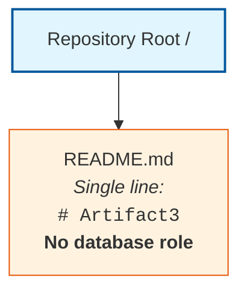

The single `README.md` artifact is documentation only and does not participate in any schema definition, entity relationship, index structure, partition map, replica topology, backup configuration, migration history, archival policy, caching tier, retention rule, encryption boundary, audit log, access-control matrix, query path, connection pool, read/write router, or batch pipeline. No runtime database engine, ORM, object store, message broker, cache provider, or data lake exists in the repository to host or coordinate database-design elements.

#### 6.2.7.3 Deferred Diagram Templates for Future Revisions

When the artifact prerequisites enumerated in Section 6.2.8 are introduced into the repository, the three deferred diagrams should be drawn against the established Mermaid syntax conventions used elsewhere in this Technical Specification. The diagram families and their producibility preconditions are:

| Diagram Family | Producibility Precondition |
|----------------|-----------------------------|
| Database Schema / ERD | ORM model definitions; DDL scripts (`.sql`); JSON Schema, Avro, or Protobuf definitions; schema documentation files |
| Data Flow | Service interaction diagrams; ETL pipeline definitions; stream-processing topologies; data lineage documentation |
| Replication Architecture | Replica set configurations; primary-replica topology declarations; multi-region replication manifests |

---

### 6.2.8 Anticipated Evolution and Future Population Triggers

#### 6.2.8.1 Artifact-to-Subsection Mapping

Consistent with the future-population mapping patterns established in Sections 1.4, 2.7, 3.9, 4.7, 5.8, and 6.1.7.1, this section will be revised as subsequent contributions populate the repository with the artifacts necessary to derive each Database Design sub-topic. The following tables enumerate, by sub-topic area, the artifact categories whose introduction would unlock substantive population.

#### Schema Design Triggers

| Sub-Topic | Artifact Category That Would Enable Population |
|-----------|------------------------------------------------|
| Entity Relationships | ORM model definitions, ERD diagrams, DDL scripts, bounded-context documentation |
| Data Models and Structures | Schema files (`.sql`, JSON Schema, Avro, Protobuf), ORM class definitions, data dictionaries |
| Indexing Strategy | Index DDL statements, ORM index decorators, query profiler outputs, EXPLAIN plan archives |
| Partitioning Approach | Sharding configurations, partition DDL, distributed-database manifests, partition-key declarations |
| Replication Configuration | Replica set configurations, primary-replica topology declarations, replication lag SLOs |
| Backup Architecture | Backup configurations, snapshot policies, restore scripts, point-in-time recovery declarations |

#### Data Management Triggers

| Sub-Topic | Artifact Category That Would Enable Population |
|-----------|------------------------------------------------|
| Migration Procedures | Migration scripts (Alembic, Flyway, Liquibase, Knex, Prisma); migration runner configuration |
| Versioning Strategy | Schema version tables, migration history files, semantic versioning of schemas |
| Archival Policies | Archival policy documents, data lifecycle scripts, cold-storage configurations |
| Storage and Retrieval | Repository pattern implementations, data access layer code, query builders, DAO classes |
| Caching Policies | Cache configurations (Redis, Memcached), cache invalidation policies, TTL declarations |

#### Compliance Considerations Triggers

| Sub-Topic | Artifact Category That Would Enable Population |
|-----------|------------------------------------------------|
| Data Retention Rules | Retention policy documents, TTL configurations, purge scripts, lifecycle rules |
| Backup / Fault Tolerance | Backup schedules, RPO/RTO declarations, multi-region replication configurations |
| Privacy Controls | Encryption-at-rest configurations, PII handling code, GDPR/CCPA compliance documentation |
| Audit Mechanisms | Audit log table definitions, audit event handlers, change-data-capture configurations |
| Access Controls | Database role definitions, row-level security policies, IAM configurations, GRANT statements |

#### Performance Optimization Triggers

| Sub-Topic | Artifact Category That Would Enable Population |
|-----------|------------------------------------------------|
| Query Optimization | Query plans, indexing strategies, performance test suites, slow-query log analyses |
| Caching Strategy | Cache configuration files, cache hit/miss telemetry, multi-tier cache topologies |
| Connection Pooling | Connection pool configurations (HikariCP, pgBouncer, PgPool, ProxySQL) |
| Read / Write Splitting | Read replica configurations, query routing logic, primary/replica DSN declarations |
| Batch Processing | Batch job definitions, ETL pipeline configurations, scheduler declarations (cron, Airflow DAGs) |

#### Required Diagram Triggers

| Diagram | Artifact Category That Would Enable Production |
|---------|--------------------------------------------------|
| Schema / ERD | ORM models, DDL scripts, schema documentation, JSON/Avro/Protobuf definitions |
| Data Flow | Service interaction diagrams, ETL pipeline definitions, stream-processing topologies |
| Replication Architecture | Replication topology configurations, multi-region manifests, leader-election declarations |

#### 6.2.8.2 Future Population Triggers

When any artifact in the tables above is introduced into the repository, this Section 6.2 should be revisited and populated using the established Determinability Matrix pattern:

1. The relevant Determinability Matrix row in Sections 6.2.3.1, 6.2.4.1, 6.2.5.1, or 6.2.6.1 should be updated from "No" to "Yes" with the new authoritative source citation.
2. The Empty Inventory placeholder rows (`*(none)*` markers) in Sections 6.2.3.2, 6.2.4.2, 6.2.5.2, and 6.2.6.2 should be replaced with factually grounded entries derived from the introduced artifacts, including the documentation of all indexes and constraints required by the Section 6.2 output format.
3. The Diagram Producibility Matrix in Section 6.2.7.1 should be updated to reflect newly producible schema, data flow, and replication architecture diagrams.
4. New Mermaid diagrams (including ERDs) should be drawn using nodes and edges that correspond to entities, relationships, datastores, and replication paths evidenced in the introduced artifacts, with cardinality, key, and replica-role annotations sourced directly from the introduced schema and configuration files.
5. The Applicability Determination in Section 6.2.1.1 should be revisited; if any of the criteria therein transitions to "Criterion met," the non-applicability finding should be retracted and substantive content should replace this boundary statement.
6. Section 3.7 (the primary authoritative source for this determination) should be updated in lockstep so that the two sections remain consistent.

#### 6.2.8.3 Reader Guidance

Readers consulting this section should treat its current form as a faithful reflection of the repository at the time of authoring, consistent with the guidance in Sections 1.4, 2.7, 3.9, 4.7, 5.8, and 6.1.7.3. Entries marked "No," "Not determinable," "None," or `*(none)*` indicate the absence of repository evidence and not a negative scoping decision against any candidate relational, document, key-value, time-series, graph, columnar, or object storage solution. Project owners are encouraged to introduce the corresponding schema definitions, ORM models, migration scripts, indexing declarations, partitioning manifests, replication configurations, backup policies, retention rules, encryption configurations, audit-log designs, access-control policies, query-plan artifacts, cache configurations, connection-pool tunings, read/write routing declarations, and batch-processing pipelines into the repository to enable a fully populated Database Design section in future revisions of this Technical Specification.

---

### 6.2.9 References

#### 6.2.9.1 Files Examined

- `README.md` — The repository's sole artifact; single-line content `# Artifact3`; confirmed to bear no database role, declare no schemas, hold no connection strings, and reference no ORM, migration tool, cache provider, or storage service.

#### 6.2.9.2 Folders Explored

- `/` (repository root, depth 0) — Confirmed to contain exactly one child (`README.md`) and zero subdirectories; provides no schema directory, migration folder, ORM model package, configuration directory, or storage-related substructure.

#### 6.2.9.3 Technical Specification Sections Referenced

- **Section 1.1 Executive Summary** — Established the pre-implementation, documentation-only state of the repository and the project identification as `Artifact3`.
- **Section 1.2 System Overview** — Provided the canonical Repository Contents Inventory and confirmed the absence of all data domains, components, and technology stack declarations.
- **Section 1.3 Scope** — Established the catalogue of nine confirmed-absent artifact categories, explicitly listing "Database schemas or migrations" as Absent.
- **Section 1.4 Document Status and Specification Boundary** — Established the evidence-based authoring standard and reader-guidance conventions inherited by this Section 6.2.
- **Section 1.5 References** — Verified 100% repository coverage (1 of 1 files; 1 of 1 folders) at hierarchy depth 0.
- **Section 3.1 Section Authoring Basis and Evidence Constraint** — Formally rejected MongoDB and all sixteen Default Technology Stack components as "Not adopted — no evidence."
- **Section 3.7 Databases and Storage** — **Primary authoritative source**: established the empty Database and Storage inventory with all seven elements (Primary Database, Secondary Databases, Data Persistence Strategies, Caching Solutions, Storage Services, Schema Migrations, and Backup and Retention Policies) marked "No"; also established that "no persistence strategy — including selection of relational versus document-oriented stores, consistency models, sharding or partitioning approaches, indexing strategies, cache invalidation policies, or backup-and-restore patterns — is evidenced in the repository."
- **Section 4.5 Technical Implementation Determinability** — Provided the State Management Determinability Matrix recording "No" for State Transitions, Data Persistence Points, Caching Requirements, and Transaction Boundaries, all cross-referenced to Section 3.7.
- **Section 5.3 High-Level Architecture Determinability** — Provided the Empty Data Flow Inventory pattern reused for the data flow diagram disposition.
- **Section 5.4 Component Details Determinability** — Recorded "No" for Data Persistence Requirements at the component level, cross-referenced to Section 3.7.
- **Section 5.6 Cross-Cutting Concerns Determinability** — Recorded "No" for Authentication and Authorization, Performance Requirements and SLAs, and Disaster Recovery Procedures, directly informing Sections 6.2.5 and 6.2.6.
- **Section 5.7 Required Diagrams Determinability** — Established the Mermaid Diagram Producibility precedent reused in Section 6.2.7.1.
- **Section 5.8 Anticipated Evolution and Future Population Triggers** — Provided the artifact-to-subsection mapping template reused in Section 6.2.8.1.
- **Section 6.1 Core Services Architecture** — **Critical structural precedent**: established the complete template for handling "Not applicable" determinations in Section 6.x, including Applicability Statement, Authoring Basis, Determinability Matrices, Empty Inventories, Diagram Producibility Matrix, Anticipated Evolution Mapping, and References sub-structure; Section 6.1.5.1 specifically recorded "No" for Data Redundancy Approach, directly corroborating the Section 6.2 non-applicability finding.

## 6.3 Integration Architecture

### 6.3.1 Applicability Statement

#### 6.3.1.1 Applicability Determination

**Integration Architecture is not applicable for this system.**

The Section 6.3 prompt provides an explicit guard clause directing the author to declare non-applicability when "the system does not require integration with external systems or services." Application of that guard clause to the present repository evidence produces an unambiguous non-applicability determination on the following grounds:

| Applicability Criterion | Repository Evidence | Determination |
|-------------------------|---------------------|---------------|
| External system dependencies exist | "No external system dependencies, third-party services, or inter-system data flows have been declared in the repository" (Section 1.2.1) | Criterion not met |
| API contracts or service interfaces exist | "No API contracts, OpenAPI specs, client SDKs, or endpoint references" present (Section 4.3.2; Section 5.3.4) | Criterion not met |
| Message processing infrastructure exists | "No event handlers, message brokers, stream processors, or event schemas present" (Section 4.3.2) | Criterion not met |
| Third-party service integrations exist | All seven Third-Party Service elements (External APIs, Authentication, Monitoring, Cloud, Payment, Email/Notification, Environment Templates) recorded as "No" (Section 3.6.1) | Criterion not met |
| API gateway or integration topology exists | "No integration topology, service mesh configuration, API gateway specifications, webhook receivers, or message broker bindings are present" (Section 3.6.3) | Criterion not met |

Because none of the necessary preconditions for an Integration Architecture exist in the repository, the substantive content prescribed by the Section 6.3 prompt — protocol specifications, authentication methods, authorization framework, rate limiting strategy, versioning approach, documentation standards, event processing patterns, message queue architecture, stream processing design, batch processing flows, error handling strategy, third-party integration patterns, legacy system interfaces, API gateway configuration, and external service contracts — cannot be derived from repository evidence and is therefore deferred until corresponding artifacts are introduced.

#### 6.3.1.2 Evidentiary Basis for the Non-Applicability Finding

The repository's complete inventory consists of one artifact and bears no integration role:

| Path | Type | Content | Integration Role |
|------|------|---------|------------------|
| `/` | Directory (root) | Contains only `README.md`; zero subdirectories | Container only — no role |
| `README.md` | Markdown file | Single line: `# Artifact3` | None — not an integration artifact |

This baseline is identical to the canonical Repository Contents Inventory established in Section 1.2.2 and verified at 100% coverage in Section 1.5 (1 of 1 files examined; 1 of 1 folders explored; hierarchy depth achieved: 0). The categorical absence of integration artifacts — including API specifications, protocol bindings, authentication configurations, message queues, third-party SDKs, external service contracts, API gateways, and environment variable templates — is formally catalogued across the prior sections of this Technical Specification.

The non-applicability determination is consistent with — and required by — prior findings established in:

- **Section 1.1**, which characterizes the repository as being in a pre-implementation, documentation-only state.
- **Section 1.2.1**, which states: "The repository contains no integration specifications, API contracts, message schemas, enterprise architecture diagrams, or references to upstream or downstream systems. Integration topology is therefore undefined at the present time. No external system dependencies, third-party services, or inter-system data flows have been declared in the repository."
- **Section 1.2.1** (Current System Limitations), which further records: "No legacy system documentation, migration plans, decommissioning targets, or comparative analyses with existing systems are present in the repository."
- **Section 1.3.2**, which records "Essential Integrations: No" against the in-scope dimensions and explicitly notes: "No integration inventory exists, and therefore no integration points can be designated as not covered. Both the set of supported integrations and the set of excluded integrations are presently empty."
- **Section 3.6.1**, the **primary authoritative source**, whose Third-Party Services Determinability Matrix records "No" for External APIs and Integrations, Authentication Services, Monitoring Tools, Cloud Services, Payment/Billing Services, Email/Notification Services, and Environment Variable Templates.
- **Section 3.6.2**, which presents the empty External Service Inventory using the `*(none)*` placeholder convention.
- **Section 3.6.3**, which states: "No integration topology, service mesh configuration, API gateway specifications, webhook receivers, or message broker bindings are present in the repository."
- **Section 4.3.2**, the **primary authoritative source for message processing**, whose Integration Workflows Determinability Matrix records "No" for Data Flow Between Systems, API Interactions, Event Processing Flows, and Batch Processing Sequences.
- **Section 4.5.2**, which records the empty Error Handling Inventory and confirms the absence of retry policies, circuit breakers, bulkheads, fallback handlers, alerting bindings, and operational runbooks.
- **Section 4.6.1**, which formally records Integration Sequence Diagrams as "No" (not producible) in the Mermaid Diagram Producibility Matrix.
- **Section 5.3.3**, which records "Integration Patterns and Protocols: No" and presents the empty Data Flow Inventory.
- **Section 5.3.4**, which records "Protocol/Format: No" with the rationale "No protocol bindings (REST/gRPC/AMQP/Kafka/etc.) declared" and presents the empty External Integration Points Inventory.
- **Section 5.6.1**, which records "Authentication and Authorization: No" with the rationale "No identity provider configuration, IAM policies, or access control middleware."
- **Section 6.1.3.1**, which records "Inter-Service Communication Patterns: No" with the rationale "No service interactions or message contracts declared."

---

### 6.3.2 Section Authoring Basis and Evidence Constraint

This Section 6.3 has been authored under the same evidence-based standard articulated in Section 1.4 and reaffirmed in Sections 2.1, 3.1, 4.1, 5.1, 6.1.2, and 6.2.2 of this Technical Specification: each factual assertion is traceable to an observed file, folder, or confirmed-absence finding in the repository, and where evidence is unavailable the section discloses the gap rather than supplying conjecture.

Per Section 1.4 reader guidance, all entries marked "No," "Not determinable," "None," "Undefined," or `*(none)*` in the matrices and inventories that follow indicate the absence of repository evidence and **do not constitute negative scoping decisions** against any future API protocol, authentication framework, authorization model, rate-limiting policy, versioning convention, documentation standard, message broker, stream processor, batch scheduler, error-handling strategy, third-party SDK, legacy system adapter, API gateway, or external service contract. Speculative population of these subsections with conjectural REST/gRPC bindings, OAuth/OIDC client manifests, JWT signing configurations, RBAC matrices, rate-limit thresholds, OpenAPI definitions, Kafka/RabbitMQ topologies, retry policy declarations, Stripe/Twilio SDK initializations, Kong/Apigee gateway configurations, or webhook receiver endpoints would violate the binding authoring standard and is therefore deferred to future revisions triggered by repository artifact contributions enumerated in Section 6.3.7 below.

Tables in this section conform to the Section 6.3 output format requirement of no more than four columns and provide clear cross-references to the authoritative findings established in prior sections, particularly Sections 3.6 (Third-Party Services) and 4.3 (System Workflows Determinability), which together serve as the primary authoritative sources for the non-applicability determination.

---

### 6.3.3 API Design Determinability

#### 6.3.3.1 API Design Determinability Matrix

The Section 6.3 prompt's API DESIGN area prescribes documentation of six sub-topics: protocol specifications, authentication methods, authorization framework, rate limiting strategy, versioning approach, and documentation standards. Section 3.6.1 has already formally established the absence of every external API, identity provider, and SDK initialization from which any of these sub-topics could be derived. Section 5.3.4 has established the absence of every protocol binding. The following matrix restates these findings specifically against the Section 6.3 API Design sub-topics:

| API Design Element | Determinable | Authoritative Source |
|--------------------|--------------|----------------------|
| Protocol Specifications | No | "No protocol bindings (REST/gRPC/AMQP/Kafka/etc.) declared" (Section 5.3.4); no API client code, SDK initialization, or endpoint references (Section 3.6.1) |
| Authentication Methods | No | "No identity provider configuration, OAuth/OIDC clients, or auth-related secrets present" (Section 3.6.1); "Authentication and Authorization: No" (Section 5.6.1) |
| Authorization Framework | No | "No identity provider configuration, IAM policies, or access control middleware" (Section 5.6.1); no RBAC/ABAC policy files present |
| Rate Limiting Strategy | No | No rate-limit middleware, throttling rules, quota declarations, or token-bucket configurations present (Section 1.3.2 lists Configuration files as Absent) |
| Versioning Approach | No | "No API contracts, OpenAPI specs, client SDKs, or endpoint references" (Section 3.6.1; Section 4.3.2); no URL/header versioning conventions present |
| Documentation Standards | No | No OpenAPI/Swagger, AsyncAPI, GraphQL SDL, Redoc, or API blueprint files present (Section 3.6.1; Section 4.3.2) |

#### 6.3.3.2 Empty API Inventory

Consistent with the Empty Inventory pattern established in Sections 3.6.2, 4.3.2, 5.3.4, 6.1.3.2, and 6.2.3.2, the API-level inventory derivable from current repository evidence is empty across all operational dimensions.

#### Protocol and Endpoint Inventory

| Endpoint / Operation | Protocol | Authentication Mode | Versioning Scheme |
|----------------------|----------|----------------------|--------------------|
| *(none)* | *(none)* | *(none)* | *Not determinable from repository evidence* |

#### Authorization and Rate-Limiting Inventory

| Resource / Scope | Authorization Model | Rate Limit | Enforcement Layer |
|------------------|---------------------|------------|--------------------|
| *(none)* | *(none)* | *(none)* | *Not determinable from repository evidence* |

#### API Documentation Inventory

| Specification Artifact | Format | Coverage Surface | Publication Channel |
|------------------------|--------|--------------------|----------------------|
| *(none)* | *(none)* | *(none)* | *Not determinable from repository evidence* |

#### 6.3.3.3 Cross-Reference Summary for API Design

| Sub-Topic | Primary Source | Corroborating Source |
|-----------|----------------|-----------------------|
| Protocol Specifications | Section 5.3.4 | Section 3.6.1 |
| Authentication Methods | Section 3.6.1 | Section 5.6.1 |
| Authorization Framework | Section 5.6.1 | Section 3.6.1 |
| Rate Limiting Strategy | Section 1.3.2 | Section 5.6.1 |
| Versioning Approach | Section 3.6.1 | Section 4.3.2 |
| Documentation Standards | Section 3.6.1 | Section 4.3.2 |

---

### 6.3.4 Message Processing Determinability

#### 6.3.4.1 Message Processing Determinability Matrix

The Section 6.3 prompt's MESSAGE PROCESSING area prescribes documentation of five sub-topics: event processing patterns, message queue architecture, stream processing design, batch processing flows, and error handling strategy. Section 4.3.2 has already formally established the absence of every event-processing and integration-workflow artifact. Section 4.5.2 has formally established the absence of every error-handling primitive. The following matrix restates these findings specifically against the Section 6.3 Message Processing sub-topics:

| Message Processing Element | Determinable | Authoritative Source |
|----------------------------|--------------|----------------------|
| Event Processing Patterns | No | "No event handlers, message brokers, stream processors, or event schemas present" (Section 4.3.2) |
| Message Queue Architecture | No | "No event handlers, message brokers, stream processors" (Section 4.3.2); "no webhook receivers, or message broker bindings are present" (Section 3.6.3) |
| Stream Processing Design | No | "No event handlers, message brokers, stream processors, or event schemas present" (Section 4.3.2); no Kafka Streams, Flink, or Spark Streaming configurations |
| Batch Processing Flows | No | "No scheduler configurations, cron descriptors, or batch job definitions present" (Section 4.3.2) |
| Error Handling Strategy | No | "No retry policies, exponential-backoff implementations, or resilience libraries" (Section 4.5.2); "No circuit breakers, bulkheads, or fallback handlers declared" (Section 4.5.2) |

#### 6.3.4.2 Empty Message Processing Inventory

Consistent with the Empty Inventory pattern established in Sections 4.3.2, 4.5.2, 5.3.3, 6.1.3.2, and 6.2.3.2, the message-processing inventory derivable from current repository evidence is empty across all operational dimensions.

#### Event and Queue Inventory

| Event / Message Class | Broker / Topic | Producer | Consumer |
|-----------------------|------------------|----------|----------|
| *(none)* | *(none)* | *(none)* | *Not determinable from repository evidence* |

#### Stream and Batch Processing Inventory

| Pipeline / Job | Processing Mode | Schedule / Trigger | Downstream Sink |
|----------------|------------------|---------------------|-------------------|
| *(none)* | *(none)* | *(none)* | *Not determinable from repository evidence* |

#### Message Error Handling Inventory

| Failure Mode | Retry Policy | Dead-Letter Destination | Alerting Channel |
|--------------|--------------|---------------------------|--------------------|
| *(none)* | *(none)* | *(none)* | *Not determinable from repository evidence* |

#### 6.3.4.3 Cross-Reference Summary for Message Processing

| Sub-Topic | Primary Source | Corroborating Source |
|-----------|----------------|-----------------------|
| Event Processing Patterns | Section 4.3.2 | Section 3.6.3 |
| Message Queue Architecture | Section 4.3.2 | Section 3.6.3 |
| Stream Processing Design | Section 4.3.2 | Section 5.3.3 |
| Batch Processing Flows | Section 4.3.2 | Section 5.6.1 |
| Error Handling Strategy | Section 4.5.2 | Section 6.1.5.1 |

---

### 6.3.5 External Systems Determinability

#### 6.3.5.1 External Systems Determinability Matrix

The Section 6.3 prompt's EXTERNAL SYSTEMS area prescribes documentation of four sub-topics: third-party integration patterns, legacy system interfaces, API gateway configuration, and external service contracts. Section 3.6 has formally established the absence of every external API, identity provider, monitoring service, cloud service, payment service, notification service, and environment template. Section 1.2.1 has formally established that no legacy system documentation or comparative analyses exist. The following matrix restates these findings specifically against the Section 6.3 External Systems sub-topics:

| External Systems Element | Determinable | Authoritative Source |
|--------------------------|--------------|----------------------|
| Third-Party Integration Patterns | No | "No external system dependencies, third-party services, or inter-system data flows have been declared" (Section 1.2.1); empty External Service Inventory (Section 3.6.2) |
| Legacy System Interfaces | No | "No legacy system documentation, migration plans, decommissioning targets, or comparative analyses with existing systems are present in the repository" (Section 1.2.1) |
| API Gateway Configuration | No | "No integration topology, service mesh configuration, API gateway specifications, webhook receivers, or message broker bindings are present" (Section 3.6.3); no Kong/Apigee/Tyk/Amazon API Gateway artifacts |
| External Service Contracts | No | Empty External Service Inventory (Section 3.6.2); empty External Integration Points Inventory (Section 5.3.4); no contract test suites, consumer-driven contracts, or service-level agreements |

#### 6.3.5.2 Empty External Systems Inventory

Consistent with the Empty Inventory pattern established in Sections 3.6.2, 5.3.4, and 6.2.3.2, the external-systems inventory derivable from current repository evidence is empty across all operational dimensions.

#### Third-Party Service Inventory

| Service Name | Category | Integration Method | Authentication Mode |
|--------------|----------|---------------------|---------------------|
| *(none)* | *(none)* | *(none)* | *Not determinable from repository evidence* |

#### Legacy and Gateway Inventory

| External / Legacy System | Interface Type | Gateway Mediation | Data Exchange Format |
|--------------------------|-----------------|---------------------|------------------------|
| *(none)* | *(none)* | *(none)* | *Not determinable from repository evidence* |

#### External Service Contract Inventory

| Counterparty System | Contract Type | SLA / SLO | Versioning Discipline |
|---------------------|----------------|------------|------------------------|
| *(none)* | *(none)* | *(none)* | *Not determinable from repository evidence* |

#### 6.3.5.3 Cross-Reference Summary for External Systems

| Sub-Topic | Primary Source | Corroborating Source |
|-----------|----------------|-----------------------|
| Third-Party Integration Patterns | Section 1.2.1 | Section 3.6.1 |
| Legacy System Interfaces | Section 1.2.1 | Section 1.3.2 |
| API Gateway Configuration | Section 3.6.3 | Section 3.8.1 |
| External Service Contracts | Section 3.6.2 | Section 5.3.4 |

---

### 6.3.6 Required Diagrams Disposition

#### 6.3.6.1 Diagram Producibility Matrix

The Section 6.3 prompt prescribes three Mermaid diagram families: integration flow diagrams, API architecture diagrams, and message flow diagrams (with sequence diagrams for key flows as a sub-requirement). Application of the evidence-based authoring standard — and consistency with the Mermaid Diagram Producibility Matrix established in Sections 4.6.1, 5.7.1, 6.1.6.1, and 6.2.7.1 — produces the following formal disposition:

| Required Diagram | Producible | Rationale |
|------------------|------------|-----------|
| Integration Flow Diagram | No | "No integrations declared" (Section 4.6.1); "Integration Sequence Diagrams: No" (Section 4.6.1); no external system dependencies declared (Section 1.2.1) |
| API Architecture Diagram | No | "No API contracts, OpenAPI specs, client SDKs, or endpoint references" (Section 3.6.1); "No protocol bindings (REST/gRPC/AMQP/Kafka/etc.) declared" (Section 5.3.4) |
| Message Flow Diagram | No | "No event handlers, message brokers, stream processors, or event schemas present" (Section 4.3.2); no message-passing contracts or service interactions declared (Section 4.6.2) |
| Sequence Diagrams for Key Flows | No | "no sequence diagram can be drawn because no message-passing contracts or service interactions are declared" (Section 4.6.2; Section 5.7.1) |

Producing any of these diagrams without supporting repository evidence would constitute a violation of the binding evidence-based authoring standard, consistent with the disposition recorded in Sections 4.6.2, 5.7.2, 6.1.6.1, and 6.2.7.1. The diagrams are retained only as a reference checklist for future revisions and are explicitly deferred until the corresponding implementation, specification, or design artifacts are introduced into the repository.

#### 6.3.6.2 Canonical Repository Topology Diagram

The single valid Mermaid diagram producible against current evidence is the canonical Repository Topology Diagram reproduced from Sections 1.2.2, 2.4.3, 3.2.3, 4.2.3, 5.2.3, 6.1.6.2, and 6.2.7.2. It is included here, annotated with integration-architecture-specific framing, to visually corroborate the absence of any integration artifacts:

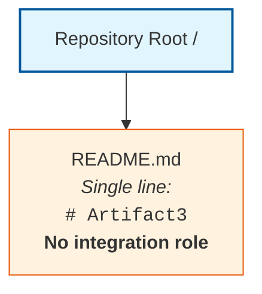

The single `README.md` artifact is documentation only and does not participate in any API endpoint, protocol binding, authentication handshake, authorization decision, rate-limit budget, version negotiation, OpenAPI specification, message queue, event topic, stream pipeline, batch schedule, retry envelope, third-party SDK initialization, legacy system adapter, API gateway route, webhook receiver, or external service contract. No runtime API server, message broker, stream processor, batch scheduler, identity provider, API gateway, service mesh, or third-party SDK exists in the repository to host or coordinate integration-architecture elements.

#### 6.3.6.3 Deferred Diagram Templates for Future Revisions

When the artifact prerequisites enumerated in Section 6.3.7 are introduced into the repository, the deferred diagrams should be drawn against the established Mermaid syntax conventions used elsewhere in this Technical Specification. The diagram families and their producibility preconditions are:

| Diagram Family | Producibility Precondition |
|----------------|-----------------------------|
| Integration Flow | External service contracts; webhook receiver endpoints; third-party SDK initializations; API client modules |
| API Architecture | OpenAPI/Swagger/AsyncAPI specifications; gRPC `.proto` files; GraphQL SDL; API gateway route declarations |
| Message Flow | Message broker configurations (Kafka, RabbitMQ, SQS, Pub-Sub, NATS); event schemas (Avro, JSON Schema, Protobuf); stream-processor topologies |
| Sequence Diagrams | Service interaction contracts; request/response specifications; message-passing contracts; choreography or orchestration declarations |

---

### 6.3.7 Anticipated Evolution and Future Population Triggers

#### 6.3.7.1 Artifact-to-Subsection Mapping

Consistent with the future-population mapping patterns established in Sections 1.4, 2.7, 3.9, 4.7, 5.8, 6.1.7.1, and 6.2.8.1, this section will be revised as subsequent contributions populate the repository with the artifacts necessary to derive each Integration Architecture sub-topic. The following tables enumerate, by sub-topic area, the artifact categories whose introduction would unlock substantive population.

#### API Design Triggers

| Sub-Topic | Artifact Category That Would Enable Population |
|-----------|------------------------------------------------|
| Protocol Specifications | OpenAPI/Swagger specifications, AsyncAPI specs, GraphQL SDL files, gRPC `.proto` files, REST/SOAP endpoint declarations |
| Authentication Methods | Auth0/Okta/Keycloak client configurations, OAuth/OIDC client manifests, JWT signing key configurations, SAML metadata, mTLS certificate declarations |
| Authorization Framework | RBAC/ABAC policy files, OPA/Rego policy bundles, Casbin model files, scope declarations, permission matrices |
| Rate Limiting Strategy | Rate-limit middleware (nginx `limit_req`, API gateway throttling rules, Redis token buckets, Envoy rate-limit filters), quota declarations |
| Versioning Approach | URL versioning conventions, header-versioning declarations, content-negotiation schemes, deprecation policies |
| Documentation Standards | Swagger UI, Redoc, API blueprint files, AsyncAPI Studio configurations, developer portal declarations |

#### Message Processing Triggers

| Sub-Topic | Artifact Category That Would Enable Population |
|-----------|------------------------------------------------|
| Event Processing Patterns | Event handler source code, event-sourcing framework declarations, CQRS command/query separations, saga orchestrator definitions |
| Message Queue Architecture | Kafka/RabbitMQ/SQS/Pub-Sub/NATS configurations, queue declarations, topic schemas, consumer group definitions |
| Stream Processing Design | Apache Flink, Kafka Streams, Spark Streaming, or Apache Beam pipeline definitions; windowing and aggregation declarations |
| Batch Processing Flows | Airflow DAGs, Argo Workflows, cron descriptors, batch job definitions, ETL pipeline configurations |
| Error Handling Strategy | Dead-letter queue configurations, retry/circuit-breaker libraries (Polly, Tenacity, resilience4j), exponential-backoff policy declarations, poison-message handlers |

#### External Systems Triggers

| Sub-Topic | Artifact Category That Would Enable Population |
|-----------|------------------------------------------------|
| Third-Party Integration Patterns | Third-party SDK initializations (Stripe, Twilio, SendGrid, AWS SDK, GCP SDK), adapter modules, anti-corruption layer code |
| Legacy System Interfaces | Legacy system adapters, ESB configurations, screen-scraping clients, JDBC/ODBC bridges, file-based exchange definitions |
| API Gateway Configuration | Kong, Amazon API Gateway, Apigee, Tyk, Azure API Management, Envoy/Istio gateway configurations; route, plugin, and policy declarations |
| External Service Contracts | Consumer-driven contract tests (Pact), service-level agreements, OpenAPI references to external services, environment variable templates (`.env.example`, `.env.sample`) |

#### Required Diagram Triggers

| Diagram | Artifact Category That Would Enable Production |
|---------|--------------------------------------------------|
| Integration Flow | External service contracts; webhook receiver endpoints; third-party SDK initializations; integration test suites |
| API Architecture | OpenAPI/Swagger/AsyncAPI/GraphQL SDL specifications; gRPC `.proto` files; API gateway route definitions |
| Message Flow | Message broker configurations; event schemas; producer/consumer source code; stream-processing topologies |
| Sequence Diagrams | Service interaction contracts; request/response specifications; orchestration or choreography declarations |

#### 6.3.7.2 Future Population Triggers

When any artifact in the tables above is introduced into the repository, this Section 6.3 should be revisited and populated using the established Determinability Matrix pattern:

1. The relevant Determinability Matrix row in Sections 6.3.3.1, 6.3.4.1, or 6.3.5.1 should be updated from "No" to "Yes" with the new authoritative source citation.
2. The Empty Inventory placeholder rows (`*(none)*` markers) in Sections 6.3.3.2, 6.3.4.2, and 6.3.5.2 should be replaced with factually grounded entries derived from the introduced artifacts, with each Markdown table preserving the four-column limit prescribed by the Section 6.3 output format.
3. The Diagram Producibility Matrix in Section 6.3.6.1 should be updated to reflect newly producible integration flow, API architecture, message flow, and sequence diagrams.
4. New Mermaid diagrams should be drawn using nodes and edges that correspond to actors, components, gateways, and external systems evidenced in the introduced artifacts, with protocol, authentication, throughput, and SLA annotations sourced directly from the introduced specifications and configuration files.
5. The Applicability Determination in Section 6.3.1.1 should be revisited; if any of the criteria therein transitions to "Criterion met," the non-applicability finding should be retracted and substantive content should replace this boundary statement.
6. Section 3.6 (the primary authoritative source for third-party services), Section 4.3 (the primary authoritative source for integration workflows), and Section 5.3.4 (the primary authoritative source for external integration points) should be updated in lockstep so that the sections remain consistent across the Technical Specification.

#### 6.3.7.3 Reader Guidance

Readers consulting this section should treat its current form as a faithful reflection of the repository at the time of authoring, consistent with the guidance in Sections 1.4, 2.7, 3.9, 4.7, 5.8, 6.1.7.3, and 6.2.8.3. Entries marked "No," "Not determinable," "None," or `*(none)*` indicate the absence of repository evidence and not a negative scoping decision against any candidate API protocol, authentication framework, authorization model, rate-limiting policy, versioning convention, documentation standard, message broker, stream processor, batch scheduler, error-handling strategy, third-party integration, legacy system interface, API gateway, or external service contract. Project owners are encouraged to introduce the corresponding API specifications, identity provider configurations, authorization policy files, rate-limit middleware, version-negotiation declarations, OpenAPI/AsyncAPI documentation, message broker configurations, event schemas, stream-processor topologies, batch job definitions, retry/circuit-breaker libraries, third-party SDK initializations, legacy system adapters, API gateway configurations, and consumer-driven contract tests into the repository to enable a fully populated Integration Architecture section in future revisions of this Technical Specification.

---

### 6.3.8 References

#### 6.3.8.1 Files Examined

- `README.md` — The repository's sole artifact; single-line content `# Artifact3`; confirmed to bear no integration role, declare no API contracts, hold no protocol bindings, and reference no identity provider, message broker, stream processor, batch scheduler, third-party SDK, legacy system adapter, API gateway, or external service contract.

#### 6.3.8.2 Folders Explored

- `/` (repository root, depth 0) — Confirmed to contain exactly one child (`README.md`) and zero subdirectories; provides no API specification directory, no integrations folder, no SDK directory, no gateway-configuration directory, no message-broker configuration directory, and no environment variable template files.

#### 6.3.8.3 Technical Specification Sections Referenced

- **Section 1.1 Executive Summary** — Established the pre-implementation, documentation-only state of the repository and the project identification as `Artifact3`.
- **Section 1.2 System Overview** — Provided the canonical Repository Contents Inventory and the explicit statements that "No external system dependencies, third-party services, or inter-system data flows have been declared in the repository" and that "No legacy system documentation, migration plans, decommissioning targets, or comparative analyses with existing systems are present."
- **Section 1.3 Scope** — Established the catalogue of nine confirmed-absent artifact categories (including Configuration files), recorded "Essential Integrations: No" against the in-scope dimensions, and noted that "No integration inventory exists, and therefore no integration points can be designated as not covered."
- **Section 1.4 Document Status and Specification Boundary** — Established the evidence-based authoring standard and reader-guidance conventions inherited by this Section 6.3.
- **Section 1.5 References** — Verified 100% repository coverage (1 of 1 files; 1 of 1 folders) at hierarchy depth 0.
- **Section 3.1 Section Authoring Basis and Evidence Constraint** — Formally rejected all sixteen Default Technology Stack components (including Auth0) as "Not adopted — no evidence."
- **Section 3.6 Third-Party Services** — **Primary authoritative source for API Design and External Systems**: established the empty Third-Party Services inventory with all seven elements (External APIs and Integrations, Authentication Services, Monitoring Tools, Cloud Services, Payment/Billing Services, Email/Notification Services, Environment Variable Templates) marked "No"; established the empty External Service Inventory in Section 3.6.2; and stated in Section 3.6.3 that "No integration topology, service mesh configuration, API gateway specifications, webhook receivers, or message broker bindings are present in the repository."
- **Section 3.8 Development and Deployment** — Confirmed the absence of API gateway, Kubernetes Ingress, CI/CD, and IaC artifacts.
- **Section 4.3 System Workflows Determinability** — **Primary authoritative source for Message Processing**: established the empty Integration Workflows Determinability Matrix with all four elements (Data Flow Between Systems, API Interactions, Event Processing Flows, Batch Processing Sequences) marked "No," including the explicit findings that "No event handlers, message brokers, stream processors, or event schemas present" and "No scheduler configurations, cron descriptors, or batch job definitions present."
- **Section 4.5 Technical Implementation Determinability** — Provided the Error Handling Determinability Matrix (no retry mechanisms, no fallback processes, no error notification flows, no recovery procedures) that directly underpins Section 6.3.4.1's Error Handling Strategy row.
- **Section 4.6 Required Diagrams Determinability** — Established the Mermaid Diagram Producibility Matrix with "Integration Sequence Diagrams: No" and stated that "no sequence diagram can be drawn because no message-passing contracts or service interactions are declared."
- **Section 5.3 High-Level Architecture Determinability** — Provided the Empty Data Flow Inventory pattern (Section 5.3.3) and the Empty External Integration Points Inventory (Section 5.3.4) with the explicit finding that "No protocol bindings (REST/gRPC/AMQP/Kafka/etc.) declared."
- **Section 5.6 Cross-Cutting Concerns Determinability** — Recorded "Authentication and Authorization: No" with the rationale "No identity provider configuration, IAM policies, or access control middleware," directly informing Section 6.3.3.1's Authentication and Authorization rows.
- **Section 5.7 Required Diagrams Determinability** — Established the Mermaid Diagram Producibility precedent that no sequence diagrams can be drawn.
- **Section 6.1 Core Services Architecture** — **Critical structural precedent**: established the complete template for handling "Not applicable" determinations in Section 6.x, including Applicability Statement, Authoring Basis, Determinability Matrices, Empty Inventories, Diagram Producibility Matrix, Canonical Repository Topology Diagram, Anticipated Evolution Mapping, and References sub-structure. Section 6.1.3.1 specifically recorded "Inter-Service Communication Patterns: No," directly corroborating the Section 6.3 non-applicability finding.
- **Section 6.2 Database Design** — **Second critical structural precedent**: provided the second application of the Section 6.x non-applicability template, refining the multi-table Empty Inventory pattern reused in Sections 6.3.3.2, 6.3.4.2, and 6.3.5.2.

## 6.4 Security Architecture

### 6.4.1 Applicability Statement

#### 6.4.1.1 Applicability Determination

**Detailed Security Architecture is not applicable for this system.**

The Section 6.4 prompt provides an explicit guard clause directing the author to declare non-applicability when "the system does not require specific security considerations beyond standard practices." Application of that guard clause to the present repository evidence produces an unambiguous non-applicability determination on the following grounds:

| Applicability Criterion | Repository Evidence | Determination |
|-------------------------|---------------------|---------------|
| Authentication framework artifacts exist | "No identity provider configuration, OAuth/OIDC clients, or auth-related secrets present" (Section 3.6.1) | Criterion not met |
| Authorization system artifacts exist | "No authentication or authorization configuration, IAM policies, or access control middleware" (Section 4.4.2) | Criterion not met |
| Data protection artifacts exist | "No encryption-at-rest configs, PII handling code, or GDPR/CCPA compliance documentation" (Section 6.2.5.1) | Criterion not met |
| Security mechanisms or threat models exist | "No threat models, security controls, or access policies present" (Section 2.5.2; Section 5.5.1) | Criterion not met |

Because none of the necessary preconditions for a substantive Security Architecture exist in the repository, the content prescribed by the Section 6.4 prompt — identity management, multi-factor authentication, session management, token handling, password policies, role-based access control, permission management, resource authorization, policy enforcement points, audit logging, encryption standards, key management, data masking rules, secure communication, and compliance controls — cannot be derived from repository evidence and is therefore deferred until corresponding artifacts are introduced.

Regarding the prompt's secondary instruction to "explain which standard security practices will be followed instead," the binding evidence-based authoring standard precludes prescriptive declarations about future implementations. No source code, configuration files, identity provider bindings, IAM policies, encryption configurations, or compliance documentation exist from which any specific standard practice could be claimed as adopted by this system. A reference checklist of standard security practices that future implementations may consider is provided in Section 6.4.7 below, consistent with the deferred-content treatment used in Sections 6.1.6.3, 6.2.7.3, and 6.3.6.3.

#### 6.4.1.2 Evidentiary Basis for the Non-Applicability Finding

The repository's complete inventory consists of one artifact and bears no security role:

| Path | Type | Content | Security Role |
|------|------|---------|---------------|
| `/` | Directory (root) | Contains only `README.md`; zero subdirectories | Container only — no role |
| `README.md` | Markdown file | Single line: `# Artifact3` | None — not a security artifact |

This baseline is identical to the canonical Repository Contents Inventory established in Section 1.2.2 and verified at 100% coverage in Section 1.5 (1 of 1 files examined; 1 of 1 folders explored; hierarchy depth achieved: 0). The categorical absence of source code, package or dependency manifests, configuration files, build/CI/deployment scripts, test suites, database schemas or migrations, frontend assets or templates, infrastructure-as-code definitions, and architectural or design documentation — all of which are direct prerequisites for any security architecture artifact — is formally catalogued in Section 1.3.2 and reaffirmed throughout this Technical Specification.

The non-applicability determination is consistent with — and required by — prior findings established in:

- **Section 1.1**, which characterizes the repository as being in a pre-implementation, documentation-only state.
- **Section 1.2.1**, which states: "No external system dependencies, third-party services, or inter-system data flows have been declared in the repository."
- **Section 1.3.2**, which lists nine confirmed-absent artifact categories (source code, dependency manifests, configuration files, build/CI scripts, test suites, database schemas, frontend assets, IaC definitions, and architectural documentation) — all of which are direct prerequisites for substantive security architecture content.
- **Section 2.5.2**, which records "No" for Security Implications with the rationale "No threat models, security controls, or access policies present."
- **Section 3.1.3**, which formally rejects Auth0 and the other fifteen Default Technology Stack components as "Not adopted — no evidence," with the auth-specific rationale "No client SDKs, environment templates, or auth configuration."
- **Section 3.6.1**, the **primary authoritative source for authentication services**, whose Third-Party Services Determinability Matrix records "No" for Authentication Services with the rationale "No identity provider configuration, OAuth/OIDC clients, or auth-related secrets present"; and "No" for Environment Variable Templates with the rationale "No `.env.example`, `.env.sample`, or similar template files present."
- **Section 4.4.2**, the **primary authoritative source for authorization checkpoints**, whose Validation Rules Determinability Matrix records "No" for Authorization Checkpoints, Data Validation Requirements, and Regulatory Compliance Checks.
- **Section 5.5.1**, which records "No" for Security Mechanism Selection with the rationale "No threat models, security controls, or access policies present (see Section 2.5.2 and Section 4.4.2)."
- **Section 5.6.1**, the **primary authoritative source for cross-cutting security concerns**, which records "No" for Authentication and Authorization with the rationale "No identity provider configuration, IAM policies, or access control middleware (see Section 4.4.2 and Section 3.6.1)."
- **Section 6.2.5.1**, the **primary authoritative source for database-layer security and compliance**, which records "No" for Privacy Controls ("No encryption-at-rest configs, PII handling code, or GDPR/CCPA compliance documentation"), Audit Mechanisms ("No audit log table definitions, audit event handlers, or compliance reports"), and Access Controls ("No database role definitions, row-level security policies, or IAM configurations").
- **Section 6.3.3.1**, which records "No" for Authentication Methods, Authorization Framework, and Rate Limiting Strategy at the integration-API layer.

---

### 6.4.2 Section Authoring Basis and Evidence Constraint

This Section 6.4 has been authored under the same evidence-based standard articulated in Section 1.4 and reaffirmed in Sections 2.1, 3.1, 4.1, 5.1, 6.1.2, 6.2.2, and 6.3.2 of this Technical Specification: each factual assertion is traceable to an observed file, folder, or confirmed-absence finding in the repository, and where evidence is unavailable the section discloses the gap rather than supplying conjecture.

Per Section 1.4.3 reader guidance, all entries marked "No," "Not determinable," "None," "Undefined," or `*(none)*` in the matrices and inventories that follow indicate the absence of repository evidence and **do not constitute negative scoping decisions** against any future identity provider, authentication protocol, multi-factor authentication mechanism, session-management strategy, token-handling convention, password policy, role-based or attribute-based access control model, permission matrix, resource-authorization scheme, policy enforcement point, audit-logging facility, encryption-at-rest or encryption-in-transit configuration, key-management service binding, data-masking or tokenization rule, secure-communication protocol, or compliance control. Speculative population of these subsections with conjectural OAuth/OIDC client manifests, JWT signing key configurations, SAML metadata, mTLS certificate declarations, MFA enrollment policies, session-store bindings, password-policy regular expressions, RBAC/ABAC policy files, OPA/Rego bundles, Casbin model files, scope declarations, permission matrices, audit-event handler source code, KMS integrations, TLS cipher suite configurations, PII handling code, data classification taxonomies, GDPR/CCPA compliance documentation, or DPIA references would violate the binding authoring standard and is therefore deferred to future revisions triggered by repository artifact contributions enumerated in Section 6.4.8 below.

Tables in this section conform to the Section 6.4 output format requirement of no more than four columns and provide clear cross-references to the authoritative findings established in prior sections, particularly Sections 3.6 (Third-Party Services), 4.4 (Flowchart Requirements Determinability), 5.5 (Technical Decisions Determinability), 5.6 (Cross-Cutting Concerns Determinability), and 6.2.5 (Database Compliance Considerations), which collectively serve as the primary authoritative sources for the non-applicability determination.

---

### 6.4.3 Authentication Framework Determinability

#### 6.4.3.1 Authentication Framework Determinability Matrix

The Section 6.4 prompt's AUTHENTICATION FRAMEWORK area prescribes documentation of five sub-topics: identity management, multi-factor authentication, session management, token handling, and password policies. Section 3.6.1 has already formally established the absence of every identity-provider, OAuth/OIDC, and auth-related secret from which any of these sub-topics could be derived. Section 5.6.1 reaffirms this finding at the cross-cutting concerns layer. The following matrix restates these findings specifically against the Section 6.4 Authentication Framework sub-topics:

| Authentication Element | Determinable | Authoritative Source |
|------------------------|--------------|----------------------|
| Identity Management | No | "No identity provider configuration, OAuth/OIDC clients, or auth-related secrets present" (Section 3.6.1); "Authentication and Authorization: No" (Section 5.6.1) |
| Multi-Factor Authentication | No | "Authentication Services: No" (Section 3.6.1); no TOTP, WebAuthn, FIDO2, SMS-OTP, or push-notification MFA configurations declared |
| Session Management | No | No session-store configurations (Redis sessions, JWT refresh-token stores), no cookie/CSRF middleware, no session-timeout declarations (Section 1.3.2 lists Configuration files as Absent; Section 4.5.1 records no Data Persistence Points) |
| Token Handling | No | "No identity provider configuration, OAuth/OIDC clients, or auth-related secrets present" (Section 3.6.1); no JWT signing key configurations, no token issuer/audience declarations, no refresh-token rotation policies |
| Password Policies | No | No password-policy declarations (regex, zxcvbn configurations, complexity rules), no credential-storage code (bcrypt, Argon2, scrypt), no breach-detection integrations (Section 1.3.2; Section 4.4.2) |

#### 6.4.3.2 Empty Authentication Inventory

Consistent with the Empty Inventory pattern established in Sections 3.6.2, 4.4.2, 5.6.1, 6.1.3.2, 6.2.3.2, and 6.3.3.2, the authentication-framework inventory derivable from current repository evidence is empty across all operational dimensions.

#### Identity Management and MFA Inventory

| Identity Provider | Authentication Method | MFA Mechanism | Federation Protocol |
|-------------------|------------------------|----------------|----------------------|
| *(none)* | *(none)* | *(none)* | *Not determinable from repository evidence* |

#### Session and Token Inventory

| Session / Token Class | Storage / Issuer | Lifetime | Rotation Policy |
|-----------------------|------------------|----------|------------------|
| *(none)* | *(none)* | *(none)* | *Not determinable from repository evidence* |

#### Password Policy Inventory

| Policy Domain | Complexity Rule | Storage Algorithm | Breach Detection |
|---------------|------------------|----------------------|--------------------|
| *(none)* | *(none)* | *(none)* | *Not determinable from repository evidence* |

#### 6.4.3.3 Cross-Reference Summary for Authentication Framework

| Sub-Topic | Primary Source | Corroborating Source |
|-----------|----------------|-----------------------|
| Identity Management | Section 3.6.1 | Section 5.6.1 |
| Multi-Factor Authentication | Section 3.6.1 | Section 5.6.1 |
| Session Management | Section 3.6.1 | Section 4.5.1 |
| Token Handling | Section 3.6.1 | Section 6.3.3.1 |
| Password Policies | Section 1.3.2 | Section 4.4.2 |

---

### 6.4.4 Authorization System Determinability

#### 6.4.4.1 Authorization System Determinability Matrix

The Section 6.4 prompt's AUTHORIZATION SYSTEM area prescribes documentation of five sub-topics: role-based access control, permission management, resource authorization, policy enforcement points, and audit logging. Section 4.4.2 has already formally established the absence of every authorization checkpoint, IAM policy, and access-control middleware. Section 5.6.1 reaffirms this finding at the cross-cutting concerns layer. Section 6.2.5.1 formally establishes the absence of database-level access controls and audit mechanisms. The following matrix consolidates these findings specifically against the Section 6.4 Authorization System sub-topics:

| Authorization Element | Determinable | Authoritative Source |
|-----------------------|--------------|----------------------|
| Role-Based Access Control | No | "No identity provider configuration, IAM policies, or access control middleware" (Section 5.6.1); no RBAC/ABAC policy files, no role definitions, no permission decorators present (Section 6.3.3.1) |
| Permission Management | No | "No authentication or authorization configuration, IAM policies, or access control middleware" (Section 4.4.2); no permission matrices or scope declarations present |
| Resource Authorization | No | "No database role definitions, row-level security policies, or IAM configurations" (Section 6.2.5.1); no resource-scoped guard expressions or object-level ACLs declared |
| Policy Enforcement Points | No | "No identity provider configuration, IAM policies, or access control middleware" (Section 5.6.1); no API gateway policy plugins, no service-mesh authorization filters, no admission controllers present (Section 6.3.5.1) |
| Audit Logging | No | "No audit log table definitions, audit event handlers, or compliance reports" (Section 6.2.5.1); "Logging and Tracing Strategy: No" (Section 5.6.1); no SIEM integrations, structured log shippers, or audit-event schemas declared |

#### 6.4.4.2 Empty Authorization Inventory

Consistent with the Empty Inventory pattern established in Sections 4.4.2, 5.6.1, 6.1.3.2, 6.2.3.2, 6.2.5.2, and 6.3.3.2, the authorization-system inventory derivable from current repository evidence is empty across all operational dimensions.

#### Role and Permission Inventory

| Role / Principal | Permissions | Resource Scope | Authorization Model |
|------------------|-------------|----------------|----------------------|
| *(none)* | *(none)* | *(none)* | *Not determinable from repository evidence* |

#### Policy Enforcement Inventory

| Enforcement Layer | Policy Engine | Decision Point | Policy Format |
|--------------------|----------------|-----------------|------------------|
| *(none)* | *(none)* | *(none)* | *Not determinable from repository evidence* |

#### Audit Logging Inventory

| Audit Event Class | Source Component | Destination Sink | Retention Window |
|-------------------|-------------------|---------------------|--------------------|
| *(none)* | *(none)* | *(none)* | *Not determinable from repository evidence* |

#### 6.4.4.3 Cross-Reference Summary for Authorization System

| Sub-Topic | Primary Source | Corroborating Source |
|-----------|----------------|-----------------------|
| Role-Based Access Control | Section 5.6.1 | Section 6.3.3.1 |
| Permission Management | Section 4.4.2 | Section 6.2.5.1 |
| Resource Authorization | Section 6.2.5.1 | Section 5.6.1 |
| Policy Enforcement Points | Section 5.6.1 | Section 4.4.2 |
| Audit Logging | Section 6.2.5.1 | Section 5.6.1 |

---

### 6.4.5 Data Protection Determinability

#### 6.4.5.1 Data Protection Determinability Matrix

The Section 6.4 prompt's DATA PROTECTION area prescribes documentation of five sub-topics: encryption standards, key management, data masking rules, secure communication, and compliance controls. Section 6.2.5.1 has already formally established the absence of every encryption-at-rest configuration, PII handling artifact, and GDPR/CCPA compliance document. Section 3.6.1 formally establishes the absence of secret-management bindings and integration configurations. Section 4.4.2 formally establishes the absence of regulatory compliance checks. The following matrix consolidates these findings specifically against the Section 6.4 Data Protection sub-topics:

| Data Protection Element | Determinable | Authoritative Source |
|--------------------------|--------------|----------------------|
| Encryption Standards | No | "No encryption-at-rest configs, PII handling code, or GDPR/CCPA compliance documentation" (Section 6.2.5.1); no TLS configuration files, no cipher-suite declarations, no AES/RSA library bindings present (Section 1.3.2 lists Configuration files as Absent) |
| Key Management | No | "No identity provider configuration, OAuth/OIDC clients, or auth-related secrets present" (Section 3.6.1); no KMS integrations (AWS KMS, GCP KMS, Azure Key Vault), no HashiCorp Vault bindings, no JWT signing key configurations present (Section 6.3.7.1) |
| Data Masking Rules | No | "No PII handling code" (Section 6.2.5.1); no data classification taxonomies, no tokenization libraries, no field-level redaction policies declared (Section 4.4.2) |
| Secure Communication | No | "No external system dependencies, third-party services, or inter-system data flows have been declared" (Section 1.2.1); "No protocol bindings (REST/gRPC/AMQP/Kafka/etc.) declared" (Section 5.3.4); no TLS certificates, no mTLS configurations, no HSTS/CSP header declarations present (Section 3.8.1) |
| Compliance Controls | No | "No regulatory, legal, or compliance documentation" (Section 4.4.2); "No GDPR/CCPA compliance documentation" (Section 6.2.5.1); no PCI-DSS, HIPAA, SOC 2, ISO 27001, or DPIA artifacts present |

#### 6.4.5.2 Empty Data Protection Inventory

Consistent with the Empty Inventory pattern established in Sections 6.2.5.2, 6.3.3.2, and 6.3.5.2, the data-protection inventory derivable from current repository evidence is empty across all operational dimensions.

#### Encryption and Key Management Inventory

| Data Class | Encryption Algorithm | Key Custodian | Rotation Schedule |
|------------|------------------------|----------------|---------------------|
| *(none)* | *(none)* | *(none)* | *Not determinable from repository evidence* |

#### Data Masking and Secure Communication Inventory

| Sensitive Field | Masking Strategy | Transport Protocol | Channel Security |
|------------------|--------------------|----------------------|---------------------|
| *(none)* | *(none)* | *(none)* | *Not determinable from repository evidence* |

#### Compliance Controls Inventory

| Compliance Framework | Applicable Scope | Control Mechanism | Attestation Evidence |
|----------------------|--------------------|---------------------|------------------------|
| *(none)* | *(none)* | *(none)* | *Not determinable from repository evidence* |

#### 6.4.5.3 Cross-Reference Summary for Data Protection

| Sub-Topic | Primary Source | Corroborating Source |
|-----------|----------------|-----------------------|
| Encryption Standards | Section 6.2.5.1 | Section 1.3.2 |
| Key Management | Section 3.6.1 | Section 6.3.7.1 |
| Data Masking Rules | Section 6.2.5.1 | Section 4.4.2 |
| Secure Communication | Section 1.2.1 | Section 5.3.4 |
| Compliance Controls | Section 6.2.5.1 | Section 4.4.2 |

---

### 6.4.6 Required Diagrams Disposition

#### 6.4.6.1 Diagram Producibility Matrix

The Section 6.4 prompt prescribes three Mermaid diagram families: authentication flow diagrams, authorization flow diagrams, and security zone diagrams. Application of the evidence-based authoring standard — and consistency with the Mermaid Diagram Producibility Matrix established in Sections 4.6.1, 5.7.1, 6.1.6.1, 6.2.7.1, and 6.3.6.1 — produces the following formal disposition:

| Required Diagram | Producible | Rationale |
|------------------|------------|-----------|
| Authentication Flow Diagram | No | "No identity provider configuration, OAuth/OIDC clients, or auth-related secrets present" (Section 3.6.1); "Authentication and Authorization: No" (Section 5.6.1); no login handlers, callback endpoints, or token-exchange flows declared |
| Authorization Flow Diagram | No | "No authentication or authorization configuration, IAM policies, or access control middleware" (Section 4.4.2); no policy decision points, no permission evaluation paths, no access-decision sequences declared (Section 5.6.1) |
| Security Zone Diagram | No | "No deployment, capacity, or scaling artifacts present" (Section 2.5.2); "No integration topology, service mesh configuration, API gateway specifications, webhook receivers, or message broker bindings are present" (Section 3.6.3); no network segmentation, VPC/subnet definitions, DMZ boundaries, or security-group declarations present (Section 3.8.1) |

Producing any of these three diagrams without supporting repository evidence would constitute a violation of the binding evidence-based authoring standard, consistent with the disposition recorded in Sections 5.7.2, 6.1.6.1, 6.2.7.1, and 6.3.6.1. The diagrams are retained only as a reference checklist for future revisions and are explicitly deferred until the corresponding implementation, specification, or design artifacts are introduced into the repository.

#### 6.4.6.2 Canonical Repository Topology Diagram

The single valid Mermaid diagram producible against current evidence is the canonical Repository Topology Diagram reproduced from Sections 1.2.2, 2.4.3, 3.2.3, 4.2.3, 5.2.3, 6.1.6.2, 6.2.7.2, and 6.3.6.2. It is included here, annotated with security-architecture-specific framing, to visually corroborate the absence of any security architecture artifacts:

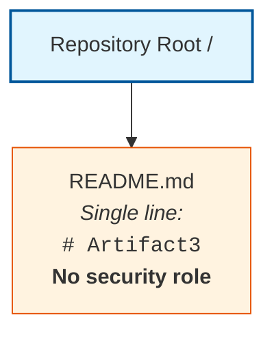

The single `README.md` artifact is documentation only and does not participate in any identity assertion, credential exchange, session establishment, token issuance or validation, password verification, role assignment, permission evaluation, resource authorization decision, policy enforcement point, audit event emission, cryptographic operation, key custody, data masking transformation, secure transport handshake, or compliance attestation. No runtime authentication service, identity provider, authorization engine, policy decision point, audit log sink, key management service, encryption module, secret store, security gateway, or compliance reporting facility exists in the repository to host or coordinate security-architecture elements.

#### 6.4.6.3 Deferred Diagram Templates for Future Revisions

When the artifact prerequisites enumerated in Section 6.4.8 are introduced into the repository, the three deferred diagrams should be drawn against the established Mermaid syntax conventions used elsewhere in this Technical Specification. The diagram families and their producibility preconditions are:

| Diagram Family | Producibility Precondition |
|----------------|-----------------------------|
| Authentication Flow | Identity provider configurations; OAuth/OIDC client manifests; login/callback/token-exchange endpoint declarations; SAML/OIDC sequence specifications |
| Authorization Flow | RBAC/ABAC policy files; OPA/Rego policy bundles; access-control middleware source code; policy decision point declarations |
| Security Zone | Network topology declarations; VPC/subnet definitions; security group rules; service mesh authorization filters; DMZ/trust-boundary specifications |

---

### 6.4.7 Standard Security Practices Disclosure

#### 6.4.7.1 Disclosure Constraint

The Section 6.4 prompt's guard clause instructs the author to "explain which standard security practices will be followed instead" when declaring non-applicability. The binding evidence-based authoring standard articulated in Section 1.4.1 and reaffirmed in Sections 2.1, 3.1, 4.1, 5.1, 6.1.2, 6.2.2, and 6.3.2 precludes prescriptive declarations about future implementations. No source code, configuration files, identity provider bindings, IAM policies, encryption configurations, secret-management bindings, or compliance documentation exist in the repository from which any specific standard practice could be claimed as adopted by this system. Consistent with the deferred-content treatment used in Sections 6.1.6.3, 6.2.7.3, and 6.3.6.3, the enumeration below is provided strictly as a reference checklist of standard security practice categories that future implementations may consider — not as a declaration that any specific practice has been or will be adopted by this system.

#### 6.4.7.2 Reference Checklist of Standard Security Practice Categories

The following reference checklist enumerates widely recognized categories of standard security practice that future contributors may evaluate when the repository is populated with implementation, configuration, or deployment artifacts. Each entry identifies the practice category and the artifact class whose introduction would enable a substantive determination in future revisions of this section.

#### Authentication Practice Categories

| Practice Category | Enabling Artifact Class |
|-------------------|--------------------------|
| Federated identity using OAuth 2.0 / OIDC | Identity-provider client manifests; redirect URI declarations |
| SAML 2.0 single sign-on integration | SAML metadata files; service-provider configurations |
| Multi-factor authentication enrollment | TOTP, WebAuthn, FIDO2, or push-notification provider bindings |
| Credential storage with adaptive hashing | bcrypt, Argon2id, or scrypt library declarations with cost-factor configuration |

#### Authorization Practice Categories

| Practice Category | Enabling Artifact Class |
|-------------------|--------------------------|
| Role-based access control (RBAC) | Role/permission tables, policy files, middleware decorators |
| Attribute-based access control (ABAC) | Policy engines (OPA/Rego, Casbin), attribute-resolution code |
| Principle of least privilege at infrastructure layer | IAM policies with narrow scopes, namespace ResourceQuota, RBAC role bindings |
| Centralized audit logging | Audit event schemas, structured log shippers, SIEM integrations |

#### Data Protection Practice Categories

| Practice Category | Enabling Artifact Class |
|-------------------|--------------------------|
| Encryption in transit (TLS 1.2+ / mTLS) | TLS certificates, cipher-suite configurations, HSTS/CSP header declarations |
| Encryption at rest | Database TDE configurations, cloud storage SSE bindings, KMS integrations |
| Key management with separation of duties | KMS integrations (AWS KMS, GCP KMS, Azure Key Vault), HashiCorp Vault bindings |
| Data classification and masking | Classification taxonomies, tokenization libraries, field-level redaction policies |

#### Compliance Practice Categories

| Practice Category | Enabling Artifact Class |
|-------------------|--------------------------|
| Data subject rights (GDPR / CCPA) | DSAR handlers, consent registries, privacy policy documents, DPIAs |
| Payment data handling (PCI-DSS) | Tokenization gateways, scoped storage zones, attestation artifacts |
| Healthcare data handling (HIPAA) | BAA references, ePHI handling code, access audit logs |
| Service-organization controls (SOC 2 / ISO 27001) | Control matrices, attestation reports, evidence repositories |

#### 6.4.7.3 Application of the Checklist

The checklist in Section 6.4.7.2 should be interpreted as a forward-looking inventory of practice categories whose adoption status will become determinable once corresponding artifacts are committed to the repository. Until such artifacts exist, no row in any inventory of this section can be transitioned from `*(none)*` to a populated value without violating the evidence-based authoring standard. Reaffirmation of this constraint is provided in Section 6.4.8.3 below.

---

### 6.4.8 Anticipated Evolution and Future Population Triggers

#### 6.4.8.1 Artifact-to-Subsection Mapping

Consistent with the future-population mapping patterns established in Sections 1.4, 2.7, 3.9, 4.7, 5.8, 6.1.7.1, 6.2.8.1, and 6.3.7.1, this section will be revised as subsequent contributions populate the repository with the artifacts necessary to derive each Security Architecture sub-topic. The following tables enumerate, by sub-topic area, the artifact categories whose introduction would unlock substantive population.

#### Authentication Framework Triggers

| Sub-Topic | Artifact Category That Would Enable Population |
|-----------|------------------------------------------------|
| Identity Management | Auth0/Okta/Keycloak/Azure AD client configurations; OAuth/OIDC client manifests; SAML metadata files; LDAP/Active Directory connector configurations |
| Multi-Factor Authentication | TOTP enrollment policies; WebAuthn/FIDO2 registration handlers; SMS-OTP provider bindings (Twilio Verify, AWS SNS); push-notification MFA SDK initializations |
| Session Management | Session-store configurations (Redis sessions, Memcached); cookie/CSRF middleware declarations; JWT refresh-token rotation policies; session-timeout/idle-expiration declarations |
| Token Handling | JWT signing key configurations; token issuer/audience declarations; revocation list integrations; mTLS certificate declarations; PASETO/Macaroon library bindings |
| Password Policies | Password complexity declarations (regex, zxcvbn configurations); credential-storage code (bcrypt, Argon2id, scrypt); breach-detection integrations (HaveIBeenPwned API); reset-flow handler source code |

#### Authorization System Triggers

| Sub-Topic | Artifact Category That Would Enable Population |
|-----------|------------------------------------------------|
| Role-Based Access Control | RBAC policy files; role/permission table DDL; permission decorators (Spring Security `@PreAuthorize`, Express middleware, Django `@permission_required`) |
| Permission Management | Permission matrices; scope declarations; OAuth scope manifests; Casbin model files |
| Resource Authorization | OPA/Rego policy bundles; row-level security policies; object-level ACL declarations; resource-scoped guard expressions |
| Policy Enforcement Points | API gateway policy plugins (Kong, Apigee, Tyk); service-mesh authorization filters (Envoy RBAC, Istio AuthorizationPolicy); admission controllers (OPA Gatekeeper, Kyverno) |
| Audit Logging | Audit log table DDL; audit event handler source code; structured log shippers (Fluent Bit, Vector); SIEM integrations (Splunk, Elastic SIEM, Datadog Cloud SIEM); change-data-capture configurations |

#### Data Protection Triggers

| Sub-Topic | Artifact Category That Would Enable Population |
|-----------|------------------------------------------------|
| Encryption Standards | TLS configuration files; cipher-suite declarations; database TDE configurations; cloud storage SSE bindings (AWS S3 SSE, GCS CMEK); AES/RSA library bindings |
| Key Management | KMS integrations (AWS KMS, GCP KMS, Azure Key Vault); HashiCorp Vault bindings; Doppler/AWS Secrets Manager/1Password Connect declarations; JWT signing key rotation configurations |
| Data Masking Rules | Data classification taxonomies; tokenization library bindings; field-level redaction policies; format-preserving encryption configurations |
| Secure Communication | TLS certificate declarations; mTLS configurations; HSTS/CSP/X-Frame-Options header declarations; VPN/private-link bindings; service-mesh mTLS policies |
| Compliance Controls | GDPR/CCPA compliance documentation; PCI-DSS attestation artifacts; HIPAA BAA references; SOC 2/ISO 27001 control matrices; Data Protection Impact Assessments (DPIAs) |

#### Required Diagram Triggers

| Diagram | Artifact Category That Would Enable Production |
|---------|--------------------------------------------------|
| Authentication Flow | Identity provider configurations; OAuth/OIDC client manifests; login/callback/token-exchange endpoint declarations; SAML/OIDC sequence specifications |
| Authorization Flow | RBAC/ABAC policy files; access-control middleware source code; policy decision point declarations; permission evaluation paths |
| Security Zone | Network topology declarations; VPC/subnet definitions; security group rules; DMZ/trust-boundary specifications; deployment topology artifacts |

#### 6.4.8.2 Future Population Triggers

When any artifact in the tables above is introduced into the repository, this Section 6.4 should be revisited and populated using the established Determinability Matrix pattern:

1. The relevant Determinability Matrix row in Sections 6.4.3.1, 6.4.4.1, or 6.4.5.1 should be updated from "No" to "Yes" with the new authoritative source citation.
2. The Empty Inventory placeholder rows (`*(none)*` markers) in Sections 6.4.3.2, 6.4.4.2, and 6.4.5.2 should be replaced with factually grounded entries derived from the introduced artifacts, with each Markdown table preserving the four-column limit prescribed by the Section 6.4 output format.
3. The Diagram Producibility Matrix in Section 6.4.6.1 should be updated to reflect newly producible authentication flow, authorization flow, and security zone diagrams.
4. New Mermaid diagrams should be drawn using nodes and edges that correspond to identity providers, policy decision/enforcement points, key custodians, trust boundaries, and security zones evidenced in the introduced artifacts, with cipher-suite, key-rotation, scope, and compliance-control annotations sourced directly from the introduced specifications and configuration files.
5. The Applicability Determination in Section 6.4.1.1 should be revisited; if any of the criteria therein transitions to "Criterion met," the non-applicability finding should be retracted and substantive content should replace this boundary statement.
6. The Standard Security Practices Disclosure in Section 6.4.7 should be revised to declare which specific practice categories have been adopted (with citations to the introduced artifacts), and the reference checklist in Section 6.4.7.2 should be updated to distinguish adopted from non-adopted categories.
7. Section 3.6 (the primary authoritative source for authentication services), Section 4.4 (the primary authoritative source for authorization checkpoints), Section 5.6 (the primary authoritative source for cross-cutting security concerns), and Section 6.2.5 (the primary authoritative source for database-layer compliance) should be updated in lockstep so that the sections remain consistent across the Technical Specification.

#### 6.4.8.3 Reader Guidance

Readers consulting this section should treat its current form as a faithful reflection of the repository at the time of authoring, consistent with the guidance in Sections 1.4, 2.7, 3.9, 4.7, 5.8, 6.1.7.3, 6.2.8.3, and 6.3.7.3. Entries marked "No," "Not determinable," "None," or `*(none)*` indicate the absence of repository evidence and not a negative scoping decision against any candidate identity provider, authentication protocol, multi-factor authentication mechanism, session-management strategy, token-handling convention, password policy, role-based or attribute-based access control model, permission matrix, resource-authorization scheme, policy enforcement point, audit-logging facility, encryption standard, key-management service, data-masking rule, secure-communication protocol, or compliance control. Project owners are encouraged to introduce the corresponding identity-provider configurations, OAuth/OIDC client manifests, SAML metadata, MFA enrollment policies, session-store configurations, JWT signing key configurations, password policy declarations, credential-storage code, RBAC/ABAC policy files, OPA/Rego policy bundles, Casbin model files, permission matrices, audit-event handler source code, KMS integrations, secret-management bindings, TLS certificate configurations, mTLS configurations, data classification taxonomies, tokenization library bindings, and compliance documentation into the repository to enable a fully populated Security Architecture section in future revisions of this Technical Specification.

---

### 6.4.9 References

#### 6.4.9.1 Files Examined

- `README.md` — The repository's sole artifact; single-line content `# Artifact3`; confirmed to bear no security role, declare no identity provider, hold no authentication or authorization configuration, reference no encryption library, key management service, secret store, or compliance framework, and contain no audit logging, data masking, or secure communication declarations.

#### 6.4.9.2 Folders Explored

- `/` (repository root, depth 0) — Confirmed to contain exactly one child (`README.md`) and zero subdirectories; provides no authentication directory, authorization policy folder, IAM configuration package, encryption key store, secret management directory, audit log schema folder, compliance documentation directory, or any security-related substructure.

#### 6.4.9.3 Technical Specification Sections Referenced

- **Section 1.1 Executive Summary** — Established the pre-implementation, documentation-only state of the repository and the project identification as `Artifact3`.
- **Section 1.2 System Overview** — Provided the canonical Repository Contents Inventory and the explicit statement that "No external system dependencies, third-party services, or inter-system data flows have been declared in the repository," directly informing the Secure Communication row in Section 6.4.5.1.
- **Section 1.3 Scope** — Established the catalogue of nine confirmed-absent artifact categories (including Configuration files and Architectural or design documentation), which are direct prerequisites for substantive security architecture content.
- **Section 1.4 Document Status and Specification Boundary** — Established the evidence-based authoring standard and reader-guidance conventions inherited by this Section 6.4.
- **Section 1.5 References** — Verified 100% repository coverage (1 of 1 files; 1 of 1 folders) at hierarchy depth 0.
- **Section 2.5 Implementation Considerations** — Recorded "No" for Security Implications with the rationale "No threat models, security controls, or access policies present," directly informing the Applicability Determination in Section 6.4.1.1.
- **Section 3.1 Section Authoring Basis and Evidence Constraint** — Formally rejected Auth0 and all sixteen Default Technology Stack components as "Not adopted — no evidence," establishing that no authentication-service technology stack is evidenced.
- **Section 3.6 Third-Party Services** — **Primary authoritative source for Authentication Framework**: established that Authentication Services and Environment Variable Templates are not determinable, with the rationale "No identity provider configuration, OAuth/OIDC clients, or auth-related secrets present" and "No `.env.example`, `.env.sample`, or similar template files present."
- **Section 3.8 Development and Deployment** — Confirmed the absence of containerization, CI/CD, IaC, deployment environments, and Kubernetes manifests, directly informing the Security Zone Diagram disposition in Section 6.4.6.1.
- **Section 4.4 Flowchart Requirements Determinability** — **Primary authoritative source for Authorization Checkpoints**: recorded "No" for Authorization Checkpoints, Data Validation Requirements, and Regulatory Compliance Checks, with the rationale "No authentication or authorization configuration, IAM policies, or access control middleware."
- **Section 4.5 Technical Implementation Determinability** — Confirmed the absence of session/state artifacts that would underpin Session Management determination in Section 6.4.3.1.
- **Section 5.3 High-Level Architecture Determinability** — Provided the Empty External Integration Points Inventory and the finding "No protocol bindings (REST/gRPC/AMQP/Kafka/etc.) declared" directly informing the Secure Communication row in Section 6.4.5.1.
- **Section 5.5 Technical Decisions Determinability** — Recorded "No" for Security Mechanism Selection with the rationale "No threat models, security controls, or access policies present (see Section 2.5.2 and Section 4.4.2)."
- **Section 5.6 Cross-Cutting Concerns Determinability** — **Primary authoritative source for cross-cutting security concerns**: recorded "No" for Authentication and Authorization with the rationale "No identity provider configuration, IAM policies, or access control middleware," and "No" for Logging and Tracing Strategy, directly informing Sections 6.4.3.1, 6.4.4.1, and 6.4.6.1.
- **Section 5.7 Required Diagrams Determinability** — Established the Mermaid Diagram Producibility precedent reused in Section 6.4.6.1.
- **Section 5.8 Anticipated Evolution and Future Population Triggers** — Provided the artifact-to-subsection mapping template reused in Section 6.4.8.1, including the Authentication and Authorization trigger artifacts ("IAM policies, OAuth/OIDC client configuration, RBAC/ABAC policy files, auth middleware source code").
- **Section 6.1 Core Services Architecture** — **First critical structural precedent**: established the complete template for handling non-applicability determinations in Section 6.x, including Applicability Statement, Authoring Basis, Determinability Matrices, Empty Inventories, Diagram Producibility Matrix, Canonical Repository Topology Diagram, Anticipated Evolution Mapping, and References sub-structure.
- **Section 6.2 Database Design** — **Second critical structural precedent**: provided the multi-table Empty Inventory pattern reused in Sections 6.4.3.2, 6.4.4.2, and 6.4.5.2. **Primary authoritative source for database-layer security and compliance**: Section 6.2.5.1 recorded "No" for Privacy Controls ("No encryption-at-rest configs, PII handling code, or GDPR/CCPA compliance documentation"), Audit Mechanisms ("No audit log table definitions, audit event handlers, or compliance reports"), and Access Controls ("No database role definitions, row-level security policies, or IAM configurations").
- **Section 6.3 Integration Architecture** — **Third critical structural precedent and most directly adjacent security-content precedent**: Section 6.3.3.1 recorded "No" for Authentication Methods, Authorization Framework, and Rate Limiting Strategy; Section 6.3.7.1 enumerated the comprehensive auth-adjacent trigger artifact lists (Auth0/Okta/Keycloak client configurations, OAuth/OIDC client manifests, JWT signing key configurations, SAML metadata, mTLS certificate declarations, RBAC/ABAC policy files, OPA/Rego policy bundles, Casbin model files, scope declarations, permission matrices, rate-limit middleware) reused in Section 6.4.8.1.

## 6.5 Monitoring and Observability

### 6.5.1 Applicability Statement

#### 6.5.1.1 Applicability Determination

**Detailed Monitoring Architecture is not applicable for this system.**

The Section 6.5 prompt provides an explicit guard clause directing the author to declare non-applicability when "the system does not require specific monitoring beyond basic health checks." Application of that guard clause to the present repository evidence produces an unambiguous non-applicability determination on the following grounds:

| Applicability Criterion | Repository Evidence | Determination |
|-------------------------|---------------------|---------------|
| Monitoring infrastructure artifacts exist | "No APM agents, logging shippers, metrics exporters, or observability configurations present" (Section 3.6.1) | Criterion not met |
| Observability instrumentation exists | "Monitoring and Observability: No" and "Logging and Tracing Strategy: No" (Section 5.6.1) | Criterion not met |
| Alert routing or notification flows exist | "No alerting configurations, paging integrations, or monitoring service bindings" (Section 4.5.2) | Criterion not met |
| Performance metrics or SLA artifacts exist | "No KPI definitions, metrics catalogs, dashboards, telemetry plans, instrumentation specifications, or measurement frameworks are present" (Section 1.2.3) | Criterion not met |
| Incident response procedures exist | "No operational runbooks, disaster-recovery documentation, or incident-response playbooks" (Section 4.5.2) | Criterion not met |
| Runnable system surface that could be probed exists | No source code, build artifacts, container images, deployment targets, or HTTP/RPC endpoints present (Section 1.3.2; Section 3.8.1) | Criterion not met |

Because none of the necessary preconditions for a Detailed Monitoring Architecture exist in the repository, the substantive content prescribed by the Section 6.5 prompt — metrics collection, log aggregation, distributed tracing, alert management, dashboard design, health checks, performance metrics, business metrics, SLA monitoring, capacity tracking, alert routing, escalation procedures, runbooks, post-mortem processes, and improvement tracking — cannot be derived from repository evidence and is therefore deferred until corresponding artifacts are introduced.

Regarding the prompt's secondary instruction to "explain which basic monitoring practices will be followed instead," the binding evidence-based authoring standard precludes prescriptive declarations about future implementations. No source code, configuration files, APM agent bindings, logging shippers, metrics exporters, tracing instrumentation, alerting configurations, dashboard definitions, runbooks, or post-mortem templates exist in the repository from which any specific basic practice could be claimed as adopted by this system. A reference checklist of basic monitoring practice categories that future implementations may consider is provided in Section 6.5.7 below, consistent with the deferred-content treatment used in Sections 6.1.6.3, 6.2.7.3, 6.3.6.3, and 6.4.7.

#### 6.5.1.2 Evidentiary Basis for the Non-Applicability Finding

The repository's complete inventory consists of one artifact and bears no observability role:

| Path | Type | Content | Observability Role |
|------|------|---------|---------------------|
| `/` | Directory (root) | Contains only `README.md`; zero subdirectories | Container only — no role |
| `README.md` | Markdown file | Single line: `# Artifact3` | None — not an observability artifact |

This baseline is identical to the canonical Repository Contents Inventory established in Section 1.2.2 and verified at 100% coverage in Section 1.5 (1 of 1 files examined; 1 of 1 folders explored; hierarchy depth achieved: 0). The categorical absence of source code, package or dependency manifests, configuration files, build/CI/deployment scripts, test suites, database schemas or migrations, frontend assets or templates, infrastructure-as-code definitions, and architectural or design documentation — all of which are direct prerequisites for any monitoring or observability artifact — is formally catalogued in Section 1.3.2 and reaffirmed throughout this Technical Specification.

The non-applicability determination is consistent with — and required by — prior findings established in:

- **Section 1.1**, which characterizes the repository as being in a pre-implementation, documentation-only state.
- **Section 1.2.1**, which states: "No external system dependencies, third-party services, or inter-system data flows have been declared in the repository," establishing that no external observability endpoints, metrics sinks, or log destinations exist.
- **Section 1.2.3**, which records: "No KPI definitions, metrics catalogs, dashboards, telemetry plans, instrumentation specifications, or measurement frameworks are present" and "No measurable objectives, target metrics, service-level objectives, or quantitative goals are documented in the repository."
- **Section 1.3.2**, which lists nine confirmed-absent artifact categories (source code, dependency manifests, configuration files, build/CI scripts, test suites, database schemas, frontend assets, IaC definitions, and architectural documentation) — all of which are direct prerequisites for substantive monitoring and observability content.
- **Section 2.5.2**, which records "No" for Performance Requirements ("No performance criteria or SLO documentation"), Scalability Considerations ("No deployment, capacity, or scaling artifacts present"), and Maintenance Requirements ("No operational runbooks, lifecycle documentation, or support models").
- **Section 3.1.3**, which formally rejects all sixteen Default Technology Stack components as "Not adopted — no evidence."
- **Section 3.6.1**, the **primary authoritative source for Monitoring Tools**, whose Third-Party Services Determinability Matrix records "No" for Monitoring Tools with the rationale "No APM agents, logging shippers, metrics exporters, or observability configurations present," and "No" for Email / Notification Services with the rationale "No transactional email, SMS, or push notification configurations present."
- **Section 3.8.1**, which confirms the absence of containerization (`Dockerfile`, `docker-compose.yml`), CI/CD pipelines (`.github/workflows/`, `.gitlab-ci.yml`, `Jenkinsfile`), infrastructure-as-code, deployment environments, and Kubernetes manifests — eliminating any platform layer from which liveness/readiness probes or sidecar exporters could be declared.
- **Section 4.5.2**, the **primary authoritative source for alerting and recovery**, whose Error Handling Determinability Matrix records "No" for Error Notification Flows ("No alerting configurations, paging integrations, or monitoring service bindings") and "No" for Recovery Procedures ("No operational runbooks, disaster-recovery documentation, or incident-response playbooks").
- **Section 5.6.1**, the **primary authoritative source for cross-cutting observability concerns**, whose Cross-Cutting Concern Determinability Matrix records "No" for Monitoring and Observability, "No" for Logging and Tracing Strategy ("No logging frameworks (e.g., Log4j, Winston, Pino) or tracing libraries (e.g., OpenTelemetry, Jaeger, Zipkin) declared"), "No" for Performance Requirements and SLAs, and "No" for Disaster Recovery Procedures.
- **Section 6.1.4.1**, which records "No" for Performance Optimization Techniques with the rationale "No KPI definitions, metrics catalogs ... or measurement frameworks are present" and "No" for Capacity Planning Guidelines with the rationale "No SLO/SLI declarations, load-test scenarios, or capacity documentation."

---

### 6.5.2 Section Authoring Basis and Evidence Constraint

This Section 6.5 has been authored under the same evidence-based standard articulated in Section 1.4.1 and reaffirmed in Sections 2.1, 3.1, 4.1, 5.1, 6.1.2, 6.2.2, 6.3.2, and 6.4.2 of this Technical Specification: each factual assertion is traceable to an observed file, folder, or confirmed-absence finding in the repository, and where evidence is unavailable the section discloses the gap rather than supplying conjecture.

Per Section 1.4.3 reader guidance, all entries marked "No," "Not determinable," "None," "Undefined," or `*(none)*` in the matrices and inventories that follow indicate the absence of repository evidence and **do not constitute negative scoping decisions** against any future APM platform, metrics collector, time-series database, structured-logging framework, log aggregator, distributed-tracing toolkit, alert manager, paging integration, dashboard system, health-check probe, SLO/SLI declaration, capacity-planning model, alert routing tree, escalation policy, on-call rotation, runbook, post-mortem template, or improvement-tracking workflow. Speculative population of these subsections with conjectural Prometheus exporters, OpenTelemetry SDK initializations, Datadog/New Relic/Dynatrace agent configurations, Grafana/Kibana dashboard JSON, Alertmanager routing trees, PagerDuty/Opsgenie/VictorOps integrations, Kubernetes liveness/readiness probe specifications, `/health` endpoint handlers, SLO burn-rate alert configurations, error budget policy files, or RCA workflow templates would violate the binding authoring standard and is therefore deferred to future revisions triggered by repository artifact contributions enumerated in Section 6.5.8 below.

Tables in this section conform to the Section 6.5 output format requirement of no more than four columns and provide clear cross-references to the authoritative findings established in prior sections, particularly Sections 3.6 (Third-Party Services), 4.5 (Technical Implementation Determinability), 5.6 (Cross-Cutting Concerns Determinability), 6.1.4 (Scalability Design Determinability), and 6.1.5 (Resilience Patterns Determinability), which collectively serve as the primary authoritative sources for the non-applicability determination.

The alert threshold matrices and SLA requirement tables required by the Section 6.5 prompt are present in this section as structural artifacts populated with the `*(none)*` placeholder convention established in Sections 3.6.2, 4.5.2, 5.3.4, 5.6.1, 6.1.3.2, 6.1.4.2, 6.1.5.2, 6.2.3.2, 6.3.3.2, 6.3.4.2, 6.3.5.2, 6.4.3.2, 6.4.4.2, and 6.4.5.2, consistent with the absence finding established in Section 1.2.3.

---

### 6.5.3 Monitoring Infrastructure Determinability

#### 6.5.3.1 Monitoring Infrastructure Determinability Matrix

The Section 6.5 prompt's MONITORING INFRASTRUCTURE area prescribes documentation of five sub-topics: metrics collection, log aggregation, distributed tracing, alert management, and dashboard design. Section 3.6.1 has already formally established the absence of every APM agent, logging shipper, metrics exporter, and observability configuration from which any of these sub-topics could be derived. Section 5.6.1 reaffirms this finding at the cross-cutting concerns layer. The following matrix restates these findings specifically against the Section 6.5 Monitoring Infrastructure sub-topics:

| Monitoring Element | Determinable | Authoritative Source |
|--------------------|--------------|----------------------|
| Metrics Collection | No | "No APM agents, logging shippers, metrics exporters, or observability configurations present" (Section 3.6.1); no Prometheus exporters, StatsD clients, OpenTelemetry SDK initializations, or CloudWatch agent configurations declared |
| Log Aggregation | No | "No logging frameworks (e.g., Log4j, Winston, Pino) or tracing libraries declared" (Section 5.6.1); no Fluent Bit, Vector, Logstash, Filebeat, ELK/EFK stack manifests, or Splunk forwarder configurations present |
| Distributed Tracing | No | "No logging frameworks ... or tracing libraries (e.g., OpenTelemetry, Jaeger, Zipkin) declared" (Section 5.6.1); no W3C Trace Context bindings or trace-propagation declarations present |
| Alert Management | No | "No alerting configurations, paging integrations, or monitoring service bindings" (Section 4.5.2); no Alertmanager rules, PagerDuty/Opsgenie/VictorOps integrations, or escalation policy configurations present |
| Dashboard Design | No | "No KPI definitions, metrics catalogs, dashboards, telemetry plans, instrumentation specifications, or measurement frameworks are present" (Section 1.2.3); no Grafana, Kibana, Datadog, or CloudWatch dashboard JSON present |

#### 6.5.3.2 Empty Monitoring Infrastructure Inventory

Consistent with the Empty Inventory pattern established in Sections 3.6.2, 4.5.2, 5.6.1, 6.1.3.2, 6.2.3.2, 6.3.3.2, 6.4.3.2, and 6.4.4.2, the monitoring-infrastructure inventory derivable from current repository evidence is empty across all operational dimensions.

#### Metrics Collection Inventory

| Metric Source | Collection Mechanism | Time-Series Backend | Scrape / Push Interval |
|---------------|----------------------|---------------------|-------------------------|
| *(none)* | *(none)* | *(none)* | *Not determinable from repository evidence* |

#### Log Aggregation Inventory

| Log Source | Shipper / Agent | Aggregation Backend | Retention Window |
|------------|-----------------|---------------------|-------------------|
| *(none)* | *(none)* | *(none)* | *Not determinable from repository evidence* |

#### Distributed Tracing Inventory

| Trace Producer | Instrumentation SDK | Collector / Backend | Sampling Strategy |
|----------------|---------------------|---------------------|-------------------|
| *(none)* | *(none)* | *(none)* | *Not determinable from repository evidence* |

#### Alert Management Inventory

| Alert Rule | Severity | Notification Channel | Routing Policy |
|------------|----------|----------------------|----------------|
| *(none)* | *(none)* | *(none)* | *Not determinable from repository evidence* |

#### Dashboard Design Inventory

| Dashboard | Target Audience | Panels / Widgets | Hosting Platform |
|-----------|-----------------|------------------|-------------------|
| *(none)* | *(none)* | *(none)* | *Not determinable from repository evidence* |

#### 6.5.3.3 Cross-Reference Summary for Monitoring Infrastructure

| Sub-Topic | Primary Source | Corroborating Source |
|-----------|----------------|-----------------------|
| Metrics Collection | Section 3.6.1 | Section 5.6.1 |
| Log Aggregation | Section 5.6.1 | Section 3.6.1 |
| Distributed Tracing | Section 5.6.1 | Section 3.6.1 |
| Alert Management | Section 4.5.2 | Section 5.6.1 |
| Dashboard Design | Section 1.2.3 | Section 5.6.1 |

---

### 6.5.4 Observability Patterns Determinability

#### 6.5.4.1 Observability Patterns Determinability Matrix

The Section 6.5 prompt's OBSERVABILITY PATTERNS area prescribes documentation of five sub-topics: health checks, performance metrics, business metrics, SLA monitoring, and capacity tracking. Section 1.2.3 has already formally established the absence of every KPI definition, metrics catalog, dashboard, telemetry plan, and instrumentation specification. Section 2.5.2 has formally established the absence of Performance Requirements and Scalability Considerations. Section 6.1.4.1 has formally established the absence of Performance Optimization Techniques and Capacity Planning Guidelines. The following matrix consolidates these findings specifically against the Section 6.5 Observability Patterns sub-topics:

| Observability Element | Determinable | Authoritative Source |
|-----------------------|--------------|----------------------|
| Health Checks | No | No Kubernetes liveness/readiness probe declarations, `/health` endpoint handlers, or container health-check directives present (Section 3.8.1); no executable surface to probe (Section 1.3.2) |
| Performance Metrics | No | "No KPI definitions, metrics catalogs ... or measurement frameworks are present" (Section 1.2.3); "Performance Requirements: No" (Section 2.5.2); "Performance Optimization Techniques: No" (Section 6.1.4.1) |
| Business Metrics | No | "No KPI definitions, metrics catalogs, dashboards, telemetry plans, instrumentation specifications, or measurement frameworks are present" (Section 1.2.3); no conversion funnel instrumentation or business-event tracking present |
| SLA Monitoring | No | "No measurable objectives, target metrics, service-level objectives, or quantitative goals are documented in the repository" (Section 1.2.3); "Performance Requirements and SLAs: No" (Section 5.6.1); no SLO/SLI declarations or error budget policy files present |
| Capacity Tracking | No | "No deployment, capacity, or scaling artifacts present" (Section 2.5.2); "Capacity Planning Guidelines: No" with the rationale "No SLO/SLI declarations, load-test scenarios, or capacity documentation" (Section 6.1.4.1) |

#### 6.5.4.2 Empty Observability Patterns Inventory

Consistent with the Empty Inventory pattern established in Sections 3.6.2, 4.5.2, 5.6.1, 6.1.4.2, 6.3.3.2, and 6.4.3.2, the observability-patterns inventory derivable from current repository evidence is empty across all operational dimensions.

#### Health Check Inventory

| Health Check Name | Endpoint / Probe Type | Frequency | Failure Threshold |
|-------------------|------------------------|-----------|---------------------|
| *(none)* | *(none)* | *(none)* | *Not determinable from repository evidence* |

#### Performance Metrics Inventory

| Metric Name | Measurement Method | Unit | Target / Threshold |
|-------------|---------------------|------|---------------------|
| *(none)* | *(none)* | *(none)* | *Not determinable from repository evidence* |

#### Business Metrics Inventory

| Business KPI | Source Event | Aggregation Function | Reporting Cadence |
|--------------|--------------|----------------------|---------------------|
| *(none)* | *(none)* | *(none)* | *Not determinable from repository evidence* |

#### SLA Requirements Inventory

| Service / Surface | SLI Definition | SLO Target | Error Budget Policy |
|-------------------|----------------|------------|----------------------|
| *(none)* | *(none)* | *(none)* | *Not determinable from repository evidence* |

#### Capacity Tracking Inventory

| Capacity Dimension | Current Utilization Signal | Forecast Model | Replenishment Trigger |
|--------------------|----------------------------|----------------|-------------------------|
| *(none)* | *(none)* | *(none)* | *Not determinable from repository evidence* |

#### 6.5.4.3 Cross-Reference Summary for Observability Patterns

| Sub-Topic | Primary Source | Corroborating Source |
|-----------|----------------|-----------------------|
| Health Checks | Section 3.8.1 | Section 1.3.2 |
| Performance Metrics | Section 1.2.3 | Section 2.5.2 |
| Business Metrics | Section 1.2.3 | Section 5.6.1 |
| SLA Monitoring | Section 1.2.3 | Section 5.6.1 |
| Capacity Tracking | Section 6.1.4.1 | Section 2.5.2 |

---

### 6.5.5 Incident Response Determinability

#### 6.5.5.1 Incident Response Determinability Matrix

The Section 6.5 prompt's INCIDENT RESPONSE area prescribes documentation of five sub-topics: alert routing, escalation procedures, runbooks, post-mortem processes, and improvement tracking. Section 4.5.2 has already formally established the absence of every alerting configuration, paging integration, and operational runbook. Section 5.6.1 has formally established the absence of Disaster Recovery Procedures. The following matrix consolidates these findings specifically against the Section 6.5 Incident Response sub-topics:

| Incident Response Element | Determinable | Authoritative Source |
|---------------------------|--------------|----------------------|
| Alert Routing | No | "No alerting configurations, paging integrations, or monitoring service bindings" (Section 4.5.2); no Alertmanager routing trees, PagerDuty/Opsgenie routing rules, or on-call schedule declarations present |
| Escalation Procedures | No | "No operational runbooks, disaster-recovery documentation, or incident-response playbooks" (Section 4.5.2); no escalation policy documents, on-call rotation declarations, or paging-tier definitions present |
| Runbooks | No | "No operational runbooks, disaster-recovery documentation, or incident-response playbooks" (Section 4.5.2); no `RUNBOOK.md`, incident playbook, or operational procedure documents present (Section 1.3.2) |
| Post-Mortem Processes | No | "Disaster Recovery Procedures: No" (Section 5.6.1); no post-mortem templates, incident retrospective documents, or RCA workflow declarations present (Section 1.3.2) |
| Improvement Tracking | No | "Recovery Procedures: No" (Section 4.5.2); no action-item trackers, follow-up issue templates, or error-budget review workflow declarations present |

#### 6.5.5.2 Empty Incident Response Inventory

Consistent with the Empty Inventory pattern established in Sections 4.5.2, 5.6.1, 6.1.5.2, 6.3.4.2, and 6.4.4.2, the incident-response inventory derivable from current repository evidence is empty across all operational dimensions.

#### Alert Routing and Escalation Inventory

| Alert Severity | Primary Recipient | Escalation Tier | Acknowledgment Window |
|----------------|-------------------|------------------|-------------------------|
| *(none)* | *(none)* | *(none)* | *Not determinable from repository evidence* |

#### Runbook Inventory

| Incident Scenario | Runbook Document | Validation Step | Owner Role |
|-------------------|------------------|------------------|-------------|
| *(none)* | *(none)* | *(none)* | *Not determinable from repository evidence* |

#### Post-Mortem and Improvement Tracking Inventory

| Post-Mortem Artifact | Trigger Condition | Action-Item Sink | Review Cadence |
|----------------------|--------------------|---------------------|------------------|
| *(none)* | *(none)* | *(none)* | *Not determinable from repository evidence* |

#### 6.5.5.3 Alert Threshold Matrix

The Section 6.5 prompt requires inclusion of an alert threshold matrix. Per the non-applicability findings established in Sections 4.5.2 ("No alerting configurations, paging integrations, or monitoring service bindings") and 1.2.3 ("No measurable objectives, target metrics, service-level objectives, or quantitative goals are documented in the repository"), no thresholds are derivable from repository evidence. The matrix is therefore presented in its empty, structurally complete form below:

| Signal | Warning Threshold | Critical Threshold | Notification Target |
|--------|-------------------|---------------------|----------------------|
| *(none)* | *(none)* | *(none)* | *Not determinable from repository evidence* |

#### 6.5.5.4 Cross-Reference Summary for Incident Response

| Sub-Topic | Primary Source | Corroborating Source |
|-----------|----------------|-----------------------|
| Alert Routing | Section 4.5.2 | Section 3.6.1 |
| Escalation Procedures | Section 4.5.2 | Section 5.6.1 |
| Runbooks | Section 4.5.2 | Section 5.6.1 |
| Post-Mortem Processes | Section 5.6.1 | Section 4.5.2 |
| Improvement Tracking | Section 4.5.2 | Section 6.1.5.1 |

---

### 6.5.6 Required Diagrams Disposition

#### 6.5.6.1 Diagram Producibility Matrix

The Section 6.5 prompt prescribes three Mermaid diagram families: monitoring architecture, alert flow diagrams, and dashboard layouts. Application of the evidence-based authoring standard — and consistency with the Mermaid Diagram Producibility Matrix established in Sections 4.6.1, 5.7.1, 6.1.6.1, 6.2.7.1, 6.3.6.1, and 6.4.6.1 — produces the following formal disposition:

| Required Diagram | Producible | Rationale |
|------------------|------------|-----------|
| Monitoring Architecture | No | "No APM agents, logging shippers, metrics exporters, or observability configurations present" (Section 3.6.1); no deployment topology, container manifests, or Kubernetes artifacts from which a monitoring topology could be derived (Section 3.8.1) |
| Alert Flow Diagram | No | "No alerting configurations, paging integrations, or monitoring service bindings" (Section 4.5.2); no notification channel declarations, alert routing trees, or escalation policy artifacts (Section 5.6.1) |
| Dashboard Layout | No | "No KPI definitions, metrics catalogs, dashboards, telemetry plans, instrumentation specifications, or measurement frameworks are present" (Section 1.2.3); no panel definitions, widget configurations, or visualization specifications present |

Producing any of these three diagrams without supporting repository evidence would constitute a violation of the binding evidence-based authoring standard, consistent with the disposition recorded in Sections 5.7.2, 6.1.6.1, 6.2.7.1, 6.3.6.1, and 6.4.6.1. The diagrams are retained only as a reference checklist for future revisions and are explicitly deferred until the corresponding implementation, specification, or design artifacts are introduced into the repository.

#### 6.5.6.2 Canonical Repository Topology Diagram

The single valid Mermaid diagram producible against current evidence is the canonical Repository Topology Diagram reproduced from Sections 1.2.2, 2.4.3, 3.2.3, 4.2.3, 5.2.3, 6.1.6.2, 6.2.7.2, 6.3.6.2, and 6.4.6.2. It is included here, annotated with monitoring-and-observability-specific framing, to visually corroborate the absence of any monitoring or observability artifacts:

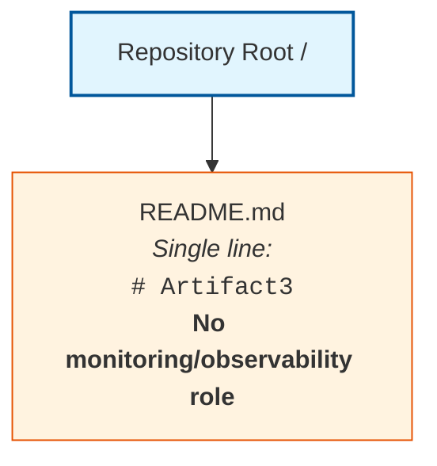

The single `README.md` artifact is documentation only and does not emit any metric, log line, trace span, health-check response, alert, escalation event, runbook reference, post-mortem record, or improvement-tracking artifact. No runtime process, container, agent, exporter, collector, time-series database, log aggregator, tracing backend, alert manager, paging integration, dashboard server, on-call scheduler, or runbook repository exists in the repository to host or coordinate monitoring-and-observability elements. Accordingly, no monitoring architecture topology, alert routing tree, or dashboard panel layout can be drawn from the evidence currently available.

#### 6.5.6.3 Deferred Diagram Templates for Future Revisions

When the artifact prerequisites enumerated in Section 6.5.8 are introduced into the repository, the three deferred diagrams should be drawn against the established Mermaid syntax conventions used elsewhere in this Technical Specification. The diagram families and their producibility preconditions are:

| Diagram Family | Producibility Precondition |
|----------------|-----------------------------|
| Monitoring Architecture | APM agent configurations; Prometheus exporter declarations; OpenTelemetry SDK initializations; collector and backend bindings; deployment topology artifacts |
| Alert Flow | Alertmanager rule files; PagerDuty/Opsgenie/VictorOps routing configurations; on-call schedule declarations; escalation policy documents |
| Dashboard Layout | Grafana/Kibana/Datadog/CloudWatch dashboard JSON; panel and widget definitions; KPI catalogs; metric-query specifications |

---

### 6.5.7 Basic Monitoring Practices Disclosure

#### 6.5.7.1 Disclosure Constraint

The Section 6.5 prompt's guard clause instructs the author to "explain which basic monitoring practices will be followed instead" when declaring non-applicability. The binding evidence-based authoring standard articulated in Section 1.4.1 and reaffirmed in Sections 2.1, 3.1, 4.1, 5.1, 6.1.2, 6.2.2, 6.3.2, and 6.4.2 precludes prescriptive declarations about future implementations. No source code, configuration files, APM agent bindings, logging shippers, metrics exporters, tracing instrumentation, alerting configurations, dashboard definitions, runbooks, post-mortem templates, or compliance documentation exist in the repository from which any specific basic practice could be claimed as adopted by this system. Consistent with the deferred-content treatment used in Sections 6.1.6.3, 6.2.7.3, 6.3.6.3, and 6.4.7, the enumeration below is provided strictly as a reference checklist of basic monitoring practice categories that future implementations may consider — not as a declaration that any specific practice has been or will be adopted by this system.

#### 6.5.7.2 Reference Checklist of Basic Monitoring Practice Categories

The following reference checklist enumerates widely recognized categories of basic monitoring practice that future contributors may evaluate when the repository is populated with implementation, configuration, or deployment artifacts. Each entry identifies the practice category and the artifact class whose introduction would enable a substantive determination in future revisions of this section.

#### Health Check Practice Categories

| Practice Category | Enabling Artifact Class |
|-------------------|--------------------------|
| Liveness probes | Kubernetes `livenessProbe` directives; Docker `HEALTHCHECK` instructions; orchestrator health-check declarations |
| Readiness probes | Kubernetes `readinessProbe` directives; load-balancer health-check endpoints; service-mesh readiness gates |
| Startup probes | Kubernetes `startupProbe` directives; initialization-phase health-check handlers |
| Synthetic monitoring | External probe definitions (Pingdom, Uptime Robot, Datadog Synthetics); user-journey scripts |

#### Metrics and Logging Practice Categories

| Practice Category | Enabling Artifact Class |
|-------------------|--------------------------|
| Application metrics emission | Prometheus client libraries; StatsD clients; OpenTelemetry Metrics SDK; CloudWatch custom-metric calls |
| Infrastructure metrics collection | Node exporter, cAdvisor, kube-state-metrics; cloud provider agents (CloudWatch Agent, Azure Monitor Agent, GCP Ops Agent) |
| Structured application logging | Logging framework configurations (Log4j, Winston, Pino, Serilog, Zerolog); JSON/key-value log formatters |
| Log shipping and aggregation | Fluent Bit, Vector, Logstash, Filebeat configurations; ELK/EFK/Loki/Splunk forwarder declarations |

#### Tracing and SLO Practice Categories

| Practice Category | Enabling Artifact Class |
|-------------------|--------------------------|
| Distributed tracing instrumentation | OpenTelemetry SDK initializations; Jaeger/Zipkin/Tempo client libraries; W3C Trace Context propagation declarations |
| RED method instrumentation | Rate/Errors/Duration metric declarations on request handlers; HTTP middleware instrumentation |
| USE method instrumentation | Utilization/Saturation/Errors metric declarations on resources; system-resource exporters |
| SLO/SLI declarations | SLO YAML files (e.g., Sloth, Pyrra, Nobl9); error-budget policy documents; burn-rate alert configurations |

#### Alerting and Incident Response Practice Categories

| Practice Category | Enabling Artifact Class |
|-------------------|--------------------------|
| Alert rule definitions | Prometheus AlertManager rules; CloudWatch Alarms; Datadog Monitors; New Relic alert conditions |
| Paging integrations | PagerDuty, Opsgenie, VictorOps, Splunk On-Call configuration; on-call rotation declarations |
| Runbook authoring | `RUNBOOK.md` files; incident-response playbooks; troubleshooting procedure documents |
| Post-mortem workflows | Post-mortem template files; blameless retrospective procedures; RCA workflow declarations; action-item trackers |

#### 6.5.7.3 Application of the Checklist

The checklist in Section 6.5.7.2 should be interpreted as a forward-looking inventory of practice categories whose adoption status will become determinable once corresponding artifacts are committed to the repository. Until such artifacts exist, no row in any inventory of this section can be transitioned from `*(none)*` to a populated value without violating the evidence-based authoring standard. Reaffirmation of this constraint is provided in Section 6.5.8.3 below.

---

### 6.5.8 Anticipated Evolution and Future Population Triggers

#### 6.5.8.1 Artifact-to-Subsection Mapping

Consistent with the future-population mapping patterns established in Sections 1.4, 2.7, 3.9, 4.7, 5.8, 6.1.7.1, 6.2.8.1, 6.3.7.1, and 6.4.8.1, this section will be revised as subsequent contributions populate the repository with the artifacts necessary to derive each Monitoring and Observability sub-topic. The mapping below extends Section 5.8.1's entries for Monitoring and Observability and Logging and Tracing with additional categories specific to incident response, dashboards, SLA monitoring, and capacity tracking. The following tables enumerate, by sub-topic area, the artifact categories whose introduction would unlock substantive population.

#### Monitoring Infrastructure Triggers

| Sub-Topic | Artifact Category That Would Enable Population |
|-----------|------------------------------------------------|
| Metrics Collection | Prometheus exporters; StatsD clients; OpenTelemetry Metrics SDK initializations; CloudWatch/Azure Monitor/GCP Ops agent configurations; APM agents (Datadog, New Relic, Dynatrace, AppDynamics) |
| Log Aggregation | Logging framework configurations (Log4j, Winston, Pino, Serilog); Fluent Bit, Vector, Logstash, Filebeat configurations; ELK/EFK stack manifests; Splunk forwarders; Loki bindings |
| Distributed Tracing | OpenTelemetry/Jaeger/Zipkin/Tempo instrumentation; trace context propagation declarations; W3C Trace Context bindings; service-mesh tracing configurations (Istio, Linkerd) |
| Alert Management | Alertmanager rule files; CloudWatch Alarms; Datadog Monitors; New Relic alert conditions; PagerDuty/Opsgenie/VictorOps integrations; alert routing tree definitions |
| Dashboard Design | Grafana dashboards JSON; Kibana saved searches; Datadog dashboard definitions; CloudWatch dashboard JSON; Splunk dashboard XML; Looker/Tableau model files |

#### Observability Patterns Triggers

| Sub-Topic | Artifact Category That Would Enable Population |
|-----------|------------------------------------------------|
| Health Checks | Kubernetes liveness/readiness/startup probe declarations; Docker `HEALTHCHECK` instructions; `/health`, `/healthz`, `/readyz` endpoint handlers; synthetic probe definitions |
| Performance Metrics | APM instrumentation; custom metric declarations; RED/USE method dashboards; HTTP middleware timing instrumentation; database query duration histograms |
| Business Metrics | Custom metric definitions; conversion funnel instrumentation; KPI tracking declarations; business-event emission code; analytics SDK initializations |
| SLA Monitoring | SLO/SLI YAML declarations (Sloth, Pyrra, Nobl9); error budget policy files; SLO burn-rate alert configurations; SLA reporting query definitions |
| Capacity Tracking | Resource utilization dashboards; capacity-planning models; growth forecasting artifacts; load-test scenarios; right-sizing recommendation reports |

#### Incident Response Triggers

| Sub-Topic | Artifact Category That Would Enable Population |
|-----------|------------------------------------------------|
| Alert Routing | Alertmanager configuration trees; PagerDuty/Opsgenie routing rules; on-call schedule declarations; notification channel mappings |
| Escalation Procedures | Escalation policy documents; on-call rotation declarations; paging tier definitions; severity-to-tier mapping documents |
| Runbooks | `RUNBOOK.md` files; incident playbooks; operational procedure documents; troubleshooting guides; recovery scripts |
| Post-Mortem Processes | Post-mortem template files; incident retrospective documents; RCA workflow declarations; blameless retrospective procedure documents |
| Improvement Tracking | Action item trackers; follow-up issue templates; error budget review processes; reliability improvement backlog documents |

#### Required Diagram Triggers

| Diagram | Artifact Category That Would Enable Production |
|---------|--------------------------------------------------|
| Monitoring Architecture | APM agent configurations; Prometheus exporter declarations; OpenTelemetry collector configurations; deployment topology artifacts; sidecar/DaemonSet manifests |
| Alert Flow | Alertmanager routing trees; PagerDuty/Opsgenie integration declarations; on-call schedule definitions; escalation policy documents |
| Dashboard Layout | Grafana/Kibana/Datadog/CloudWatch dashboard JSON; panel definitions; widget specifications; metric-query declarations |

#### 6.5.8.2 Future Population Triggers

When any artifact in the tables above is introduced into the repository, this Section 6.5 should be revisited and populated using the established Determinability Matrix pattern:

1. The relevant Determinability Matrix row in Sections 6.5.3.1, 6.5.4.1, or 6.5.5.1 should be updated from "No" to "Yes" with the new authoritative source citation.
2. The Empty Inventory placeholder rows (`*(none)*` markers) in Sections 6.5.3.2, 6.5.4.2, and 6.5.5.2 should be replaced with factually grounded entries derived from the introduced artifacts, with each Markdown table preserving the four-column limit prescribed by the Section 6.5 output format.
3. The Alert Threshold Matrix in Section 6.5.5.3 should be populated with concrete warning and critical thresholds derived from the introduced alert rule files, and the SLA Requirements Inventory in Section 6.5.4.2 should be populated with concrete SLI definitions, SLO targets, and error budget policies derived from the introduced SLO declarations.
4. The Diagram Producibility Matrix in Section 6.5.6.1 should be updated to reflect newly producible monitoring architecture, alert flow, and dashboard layout diagrams.
5. New Mermaid diagrams should be drawn using nodes and edges that correspond to metric sources, collectors, time-series backends, log aggregators, tracing backends, alert managers, paging integrations, on-call tiers, and dashboard surfaces evidenced in the introduced artifacts, with threshold, severity, sampling rate, retention, and SLO annotations sourced directly from the introduced specifications and configuration files.
6. The Applicability Determination in Section 6.5.1.1 should be revisited; if any of the criteria therein transitions to "Criterion met," the non-applicability finding should be retracted and substantive content should replace this boundary statement.
7. The Basic Monitoring Practices Disclosure in Section 6.5.7 should be revised to declare which specific practice categories have been adopted (with citations to the introduced artifacts), and the reference checklist in Section 6.5.7.2 should be updated to distinguish adopted from non-adopted categories.
8. Section 3.6 (the primary authoritative source for monitoring tools), Section 4.5 (the primary authoritative source for error notification flows and recovery procedures), Section 5.6 (the primary authoritative source for cross-cutting observability concerns), and Section 6.1.4 / 6.1.5 (the primary authoritative sources for performance and resilience determinations) should be updated in lockstep so that the sections remain consistent across the Technical Specification.

#### 6.5.8.3 Reader Guidance

Readers consulting this section should treat its current form as a faithful reflection of the repository at the time of authoring, consistent with the guidance in Sections 1.4, 2.7, 3.9, 4.7, 5.8, 6.1.7.3, 6.2.8.3, 6.3.7.3, and 6.4.8.3. Entries marked "No," "Not determinable," "None," or `*(none)*` indicate the absence of repository evidence and not a negative scoping decision against any candidate APM platform, metrics exporter, logging framework, log aggregator, distributed-tracing toolkit, alert manager, paging integration, dashboard system, health-check probe, SLO/SLI declaration, capacity-planning model, alert routing tree, escalation policy, on-call rotation, runbook, post-mortem template, or improvement-tracking workflow. Project owners are encouraged to introduce the corresponding APM agent configurations, metrics exporter declarations, OpenTelemetry SDK initializations, logging framework configurations, log shipper bindings, tracing instrumentation, alert rule files, paging integration configurations, dashboard JSON, liveness/readiness probe declarations, `/health` endpoint handlers, SLO/SLI YAML declarations, error budget policy files, capacity-planning models, alert routing trees, escalation policy documents, on-call schedule declarations, runbook documents, post-mortem templates, and improvement-tracking workflows into the repository to enable a fully populated Monitoring and Observability section in future revisions of this Technical Specification.

---

### 6.5.9 References

#### 6.5.9.1 Files Examined

- `README.md` — The repository's sole artifact; single-line content `# Artifact3`; confirmed to bear no monitoring or observability role, declare no APM agent, hold no metrics exporter, logging shipper, or tracing instrumentation, reference no alert manager, paging integration, or dashboard system, and contain no health-check probe, SLO declaration, runbook, or post-mortem template.

#### 6.5.9.2 Folders Explored

- `/` (repository root, depth 0) — Confirmed to contain exactly one child (`README.md`) and zero subdirectories; provides no `observability/`, `monitoring/`, `metrics/`, `logging/`, `tracing/`, `alerts/`, `dashboards/`, `runbooks/`, `slos/`, `postmortems/`, or any monitoring-related substructure.

#### 6.5.9.3 Technical Specification Sections Referenced

- **Section 1.1 Executive Summary** — Established the pre-implementation, documentation-only state of the repository and the project identification as `Artifact3`.
- **Section 1.2 System Overview** — Provided the canonical Repository Contents Inventory and the explicit statements that "No external system dependencies, third-party services, or inter-system data flows have been declared" (Section 1.2.1) and that "No KPI definitions, metrics catalogs, dashboards, telemetry plans, instrumentation specifications, or measurement frameworks are present" and "No measurable objectives, target metrics, service-level objectives, or quantitative goals are documented in the repository" (Section 1.2.3), directly informing the Performance Metrics, Business Metrics, SLA Monitoring, and Dashboard Design rows in Sections 6.5.3.1 and 6.5.4.1.
- **Section 1.3 Scope** — Established the catalogue of nine confirmed-absent artifact categories (including Configuration files and Architectural or design documentation), which are direct prerequisites for substantive monitoring and observability content.
- **Section 1.4 Document Status and Specification Boundary** — Established the evidence-based authoring standard and reader-guidance conventions inherited by this Section 6.5.
- **Section 1.5 References** — Verified 100% repository coverage (1 of 1 files; 1 of 1 folders) at hierarchy depth 0.
- **Section 2.5 Implementation Considerations** — Recorded "No" for Performance Requirements ("No performance criteria or SLO documentation"), Scalability Considerations ("No deployment, capacity, or scaling artifacts present"), and Maintenance Requirements ("No operational runbooks, lifecycle documentation, or support models"), directly informing Sections 6.5.4.1 and 6.5.5.1.
- **Section 3.1 Section Authoring Basis and Evidence Constraint** — Formally rejected all sixteen Default Technology Stack components as "Not adopted — no evidence," establishing that no observability technology stack is evidenced.
- **Section 3.6 Third-Party Services** — **Primary authoritative source for Monitoring Infrastructure**: established that Monitoring Tools and Email / Notification Services are not determinable, with the rationale "No APM agents, logging shippers, metrics exporters, or observability configurations present" and "No transactional email, SMS, or push notification configurations present."
- **Section 3.8 Development and Deployment** — Confirmed the absence of containerization (`Dockerfile`, `docker-compose.yml`), CI/CD (`.github/workflows/`, `.gitlab-ci.yml`, `Jenkinsfile`), infrastructure-as-code, deployment environments, and Kubernetes manifests, directly informing the Health Checks and Monitoring Architecture rows in Sections 6.5.4.1 and 6.5.6.1.
- **Section 4.5 Technical Implementation Determinability** — **Primary authoritative source for Alert Routing, Runbooks, and Incident Response**: recorded "No" for Error Notification Flows ("No alerting configurations, paging integrations, or monitoring service bindings") and "No" for Recovery Procedures ("No operational runbooks, disaster-recovery documentation, or incident-response playbooks"), directly informing all five rows of Section 6.5.5.1.
- **Section 5.6 Cross-Cutting Concerns Determinability** — **Primary authoritative source for cross-cutting observability concerns**: recorded "No" for Monitoring and Observability ("No APM agents, logging shippers, metrics exporters, or observability configurations present"), "No" for Logging and Tracing Strategy ("No logging frameworks (e.g., Log4j, Winston, Pino) or tracing libraries (e.g., OpenTelemetry, Jaeger, Zipkin) declared"), "No" for Performance Requirements and SLAs, and "No" for Disaster Recovery Procedures, directly informing Sections 6.5.3.1, 6.5.4.1, 6.5.5.1, and 6.5.6.1.
- **Section 5.7 Required Diagrams Determinability** — Established the Mermaid Diagram Producibility precedent reused in Section 6.5.6.1.
- **Section 5.8 Anticipated Evolution and Future Population Triggers** — Provided the artifact-to-subsection mapping template reused in Section 6.5.8.1, including the explicit triggers for Monitoring and Observability ("APM agent configuration (Datadog, New Relic, Dynatrace), metrics exporters (Prometheus), distributed-tracing instrumentation (OpenTelemetry)") and Logging and Tracing ("Logging framework configuration (Log4j, Winston, Pino), structured-log schemas, log aggregator bindings (ELK, Splunk, Loki)").
- **Section 6.1 Core Services Architecture** — **First critical structural precedent**: established the complete template for handling non-applicability determinations in Section 6.x, including Applicability Statement, Authoring Basis, Determinability Matrices, Empty Inventories, Diagram Producibility Matrix, Canonical Repository Topology Diagram, Anticipated Evolution Mapping, and References sub-structure. Sections 6.1.4.1 and 6.1.5.1 specifically recorded "No" for Performance Optimization Techniques, Capacity Planning Guidelines, Fault Tolerance Mechanisms, Disaster Recovery Procedures, and Service Degradation Policies, directly corroborating the Section 6.5 non-applicability finding.
- **Section 6.2 Database Design** — **Second critical structural precedent**: provided the multi-table Empty Inventory pattern reused in Sections 6.5.3.2, 6.5.4.2, and 6.5.5.2.
- **Section 6.3 Integration Architecture** — **Third critical structural precedent**: provided the multi-table empty inventory and reference-checklist pattern, including the Empty Message Error Handling Inventory whose `Dead-Letter Destination` and `Alerting Channel` columns directly correspond to the absence findings reused in Section 6.5.5.
- **Section 6.4 Security Architecture** — **Most directly applicable structural precedent**: provided the canonical pattern for handling a Section 6.x prompt with a guard clause that includes "explain which standard practices will be followed instead" (Section 6.4.7), reused as the template for Section 6.5.7's Basic Monitoring Practices Disclosure. Sections 6.4.4.1 and 6.4.4.2 specifically recorded "No" for Audit Logging with the rationale "No audit log table definitions, audit event handlers, or compliance reports" and "Logging and Tracing Strategy: No," directly corroborating the Section 6.5.3.1 Log Aggregation row.

## 6.6 Testing Strategy

### 6.6.1 Applicability Statement

#### 6.6.1.1 Applicability Determination

**Detailed Testing Strategy is not applicable for this system.**

The Section 6.6 prompt provides an explicit guard clause directing the author to declare non-applicability when "the system is a simple library, tool, or does not require comprehensive testing," and in that case to "clearly state 'Detailed Testing Strategy is not applicable for this system' and explain why, then document only the basic unit testing approach that will be used." Application of that guard clause to the present repository evidence produces an unambiguous non-applicability determination on the following grounds:

| Applicability Criterion | Repository Evidence | Determination |
|-------------------------|---------------------|---------------|
| Testable source code exists | "Source code (any language): Absent" (Section 1.3.2); no executable units, modules, or library entry points present | Criterion not met |
| Test suites or fixtures exist | "Test suites or fixtures: Absent" (Section 1.3.2); no `tests/`, `__tests__/`, `spec/`, or `src/test/` directory present | Criterion not met |
| Testing framework or runner declared | All sixteen Default Technology Stack components rejected (Section 3.1.3); no test runner declared in Section 3.4 | Criterion not met |
| Build, CI, or deployment scripts exist | "No `.github/workflows/`, `.gitlab-ci.yml`, `Jenkinsfile`, `azure-pipelines.yml`, `bitbucket-pipelines.yml`, or CircleCI configuration present" (Section 3.8.1) | Criterion not met |
| Quality gates or pre-commit hooks exist | "No `.pre-commit-config.yaml`, `husky` configuration, or commit hooks present" (Section 3.8.1) | Criterion not met |
| Quantitative coverage or success-rate targets exist | "No KPI definitions, metrics catalogs, dashboards, telemetry plans, instrumentation specifications, or measurement frameworks are present" (Section 1.2.3) | Criterion not met |

Because none of the necessary preconditions for a comprehensive Testing Strategy exist in the repository, the substantive content prescribed by the Section 6.6 prompt — testing frameworks and tools, test organization structure, mocking strategy, code coverage requirements, test naming conventions, test data management, service integration test approach, API testing strategy, database integration testing, external service mocking, test environment management, end-to-end test scenarios, UI automation approach, test data setup and teardown, performance testing requirements, cross-browser testing strategy, CI/CD test integration, automated test triggers, parallel test execution, test reporting, failed test handling, flaky test management, code coverage targets, test success rate requirements, performance test thresholds, quality gates, and documentation requirements — cannot be derived from repository evidence and is therefore deferred until corresponding artifacts are introduced.

Regarding the prompt's secondary instruction to "document only the basic unit testing approach that will be used," the binding evidence-based authoring standard precludes prescriptive declarations about future implementations. No source code, package or dependency manifests, configuration files, test runner declarations, mocking-library bindings, coverage-tool configurations, CI/CD pipeline definitions, or test data fixtures exist in the repository from which any specific framework, runner, or convention could be claimed as adopted by this system. Moreover, no programming language or runtime is declared in Section 1.2.2 or Section 3.3, which means the appropriate "basic unit testing approach" — being inherently language-dependent — cannot itself be derived from evidence. A reference checklist of basic unit testing practice categories that future implementations may consider is provided in Section 6.6.9 below, consistent with the deferred-content treatment used in Sections 6.1.6.3, 6.2.7.3, 6.3.6.3, 6.4.7, and 6.5.7.

#### 6.6.1.2 Evidentiary Basis for the Non-Applicability Finding

The repository's complete inventory consists of one artifact and bears no testing role:

| Path | Type | Content | Testing Role |
|------|------|---------|--------------|
| `/` | Directory (root) | Contains only `README.md`; zero subdirectories | Container only — no role |
| `README.md` | Markdown file | Single line: `# Artifact3` | None — not a testing artifact |

This baseline is identical to the canonical Repository Contents Inventory established in Section 1.2.2 and verified at 100% coverage in Section 1.5 (1 of 1 files examined; 1 of 1 folders explored; hierarchy depth achieved: 0). The categorical absence of source code, package or dependency manifests, configuration files, build/CI/deployment scripts, test suites, database schemas or migrations, frontend assets or templates, infrastructure-as-code definitions, and architectural or design documentation — all of which are direct prerequisites for any test suite, fixture, mock, harness, runner, or pipeline integration — is formally catalogued in Section 1.3.2 and reaffirmed throughout this Technical Specification.

The non-applicability determination is consistent with — and required by — prior findings established in:

- **Section 1.1**, which characterizes the repository as being in a pre-implementation, documentation-only state.
- **Section 1.2.1**, which states: "No external system dependencies, third-party services, or inter-system data flows have been declared in the repository," establishing that no external systems to mock, contract-test, or integrate against are evidenced.
- **Section 1.2.2**, which establishes the absence of programming languages, frameworks, runtime environments, package managers, build tools, and technology stack choices — directly precluding the prescriptive selection of any test framework, mocking library, or runner.
- **Section 1.2.3**, which states: "No measurable objectives, target metrics, service-level objectives, or quantitative goals are documented in the repository" and "No KPI definitions, metrics catalogs, dashboards, telemetry plans, instrumentation specifications, or measurement frameworks are present," directly precluding any code coverage target, test success rate requirement, performance test threshold, or quality gate.
- **Section 1.3.2**, which lists nine confirmed-absent artifact categories — explicitly including the entry "**Test suites or fixtures: Absent**" as the most directly applicable observation, alongside the absent Source code, Package or dependency manifests, Configuration files, Build/CI/deployment scripts, Database schemas or migrations, Frontend assets or templates, Infrastructure-as-code definitions, and Architectural or design documentation entries.
- **Section 2.5.2**, which records "No" for Technical Constraints, Performance Requirements, Scalability Considerations, Security Implications, and Maintenance Requirements — directly precluding the derivation of performance testing requirements, security testing requirements, and maintenance-aligned test plans.
- **Section 3.1.3**, which formally rejects all sixteen Default Technology Stack components as "Not adopted — no evidence," establishing that no test framework, runner, mocking library, coverage tool, or contract-testing platform is evidenced.
- **Section 3.4**, which records the absence of declared frameworks and libraries — including the absence of any test framework declaration (pytest, JUnit, Jest, Mocha, RSpec, NUnit, xUnit.net, Go test, etc.).
- **Section 3.6.1**, which records "No" for Monitoring Tools ("No APM agents, logging shippers, metrics exporters, or observability configurations present"), directly precluding test telemetry, performance probe integration, and synthetic monitoring bindings.
- **Section 3.7**, which records the absence of databases, ORMs, schemas, and persistence layer artifacts — directly precluding database integration testing, Testcontainers configuration, and database fixture loading.
- **Section 3.8.1**, the **primary authoritative source for Test Automation**, which confirms the absence of containerization (`Dockerfile`, `docker-compose.yml`), CI/CD pipelines (`.github/workflows/`, `.gitlab-ci.yml`, `Jenkinsfile`, `azure-pipelines.yml`, `bitbucket-pipelines.yml`, or CircleCI), infrastructure-as-code, deployment environments, Kubernetes manifests, build descriptors (`Makefile`, `build.gradle`, `pom.xml`, `webpack.config.js`, `vite.config.ts`), and pre-commit hooks (`.pre-commit-config.yaml`, `husky`) — eliminating every platform layer from which automated test triggers, parallel test execution, test reporting, failed test handling, and flaky test management could be derived.
- **Section 4.3.2**, which records "No" for Data Flow Between Systems, API Interactions, Event Processing Flows, and Batch Processing Sequences — directly precluding service integration tests and event-driven test scenarios.
- **Section 4.5.2**, the **primary authoritative source for alerting and recovery**, which records "No" for Error Notification Flows and "No" for Recovery Procedures — directly precluding failed test alerting, flaky test escalation, and post-test incident response.
- **Section 5.6.1**, which records "No" for Monitoring and Observability, "No" for Logging and Tracing Strategy, "No" for Performance Requirements and SLAs, and "No" for Disaster Recovery Procedures — directly precluding test telemetry, test result reporting destinations, and performance test threshold derivation.
- **Section 6.1.4.1**, which records "No" for Performance Optimization Techniques and "No" for Capacity Planning Guidelines ("No SLO/SLI declarations, load-test scenarios, or capacity documentation") — directly precluding performance testing requirements and load-test scenario derivation.
- **Section 6.2** (Database Design), whose non-applicability finding directly precludes database integration testing and the population of database fixture, seed, or migration test patterns.
- **Section 6.3** (Integration Architecture), whose non-applicability finding directly precludes service integration testing, API contract testing, external service mocking, and consumer-driven contract test derivation.
- **Section 6.4** (Security Architecture), whose non-applicability finding directly precludes security testing requirements (SAST, DAST, dependency scanning, secrets detection) and authentication/authorization test derivation.
- **Section 6.5** (Monitoring and Observability), whose non-applicability finding directly precludes test reporting destinations, alert routing for failed tests, and dashboard integration of test metrics.

---

### 6.6.2 Section Authoring Basis and Evidence Constraint

This Section 6.6 has been authored under the same evidence-based standard articulated in Section 1.4.1 and reaffirmed in Sections 2.1, 3.1, 4.1, 5.1, 6.1.2, 6.2.2, 6.3.2, 6.4.2, and 6.5.2 of this Technical Specification: each factual assertion is traceable to an observed file, folder, or confirmed-absence finding in the repository, and where evidence is unavailable the section discloses the gap rather than supplying conjecture.

Per Section 1.4.3 reader guidance, all entries marked "No," "Not determinable," "None," "Undefined," or `*(none)*` in the matrices and inventories that follow indicate the absence of repository evidence and **do not constitute negative scoping decisions** against any future test framework, runner, harness, mocking library, fakes/stubs strategy, coverage tool, mutation testing tool, snapshot testing tool, property-based testing library, contract testing platform, performance testing tool, load testing framework, security testing scanner, UI automation framework, browser automation toolkit, page-object library, fixture/factory framework, seed script, container-based test infrastructure, CI/CD platform, build system, parallel test executor, test reporter, retry/quarantine plugin, flaky-test tracker, code coverage target, test success rate requirement, performance budget, quality gate, or documentation standard. Speculative population of these subsections with conjectural pytest/JUnit/Jest/Mocha/RSpec/NUnit configurations, mock library declarations (unittest.mock, Mockito, Sinon, Jasmine spies, gomock), service virtualization manifests (WireMock, Mountebank, MSW), Testcontainers configurations, coverage tool configurations (coverage.py, Istanbul/nyc, JaCoCo, simplecov), mutation testing setups (Stryker, mutmut, PIT), contract testing harnesses (Pact, Spring Cloud Contract), E2E framework installations (Cypress, Playwright, Selenium, Puppeteer), load testing scripts (k6, JMeter, Locust, Gatling), security testing pipelines (OWASP ZAP, Bandit, npm audit, Snyk), CI workflow definitions, retry plugins (pytest-retry, jest-retry), or coverage thresholds would violate the binding authoring standard and is therefore deferred to future revisions triggered by repository artifact contributions enumerated in Section 6.6.10 below.

Tables in this section conform to the Section 6.6 output format requirement of no more than four columns and provide clear cross-references to the authoritative findings established in prior sections, particularly Sections 1.3 (Scope — confirming "Test suites or fixtures: Absent"), 3.4 (Frameworks and Libraries), 3.8 (Development and Deployment — confirming absence of CI/CD, build systems, pre-commit hooks), 4.5 (Technical Implementation Determinability — confirming absence of alerting flows and recovery procedures), 5.6 (Cross-Cutting Concerns Determinability), and 6.1.4 / 6.1.5 (Scalability and Resilience), which collectively serve as the primary authoritative sources for the non-applicability determination.

The test strategy matrix, alert threshold matrix, coverage threshold table, and SLA-equivalent test requirement tables required by the Section 6.6 prompt are present in this section as structural artifacts populated with the `*(none)*` placeholder convention established in Sections 3.6.2, 3.8.2, 4.5.2, 5.3.4, 5.6.1, 6.1.3.2, 6.1.4.2, 6.1.5.2, 6.2.3.2, 6.3.3.2, 6.3.4.2, 6.3.5.2, 6.4.3.2, 6.4.4.2, 6.4.5.2, 6.5.3.2, 6.5.4.2, and 6.5.5.2, consistent with the absence findings established in Sections 1.2.3 and 1.3.2.

---

### 6.6.3 Unit Testing Determinability

#### 6.6.3.1 Unit Testing Determinability Matrix

The Section 6.6 prompt's UNIT TESTING area prescribes documentation of six sub-topics: testing frameworks and tools, test organization structure, mocking strategy, code coverage requirements, test naming conventions, and test data management. Section 1.3.2 has already formally established the absence of every test suite and fixture; Section 3.4 has established the absence of every framework declaration; Section 3.8.1 has established the absence of every pre-commit hook and quality gate configuration. The following matrix restates these findings specifically against the Section 6.6 Unit Testing sub-topics:

| Unit Testing Element | Determinable | Authoritative Source |
|----------------------|--------------|----------------------|
| Testing Frameworks and Tools | No | "Test suites or fixtures: Absent" (Section 1.3.2); all sixteen Default Technology Stack components rejected (Section 3.1.3); no test runner declared (Section 3.4); no language or runtime declared from which the appropriate xUnit-family framework could be inferred (Section 1.2.2; Section 3.3) |
| Test Organization Structure | No | No `tests/`, `__tests__/`, `spec/`, `src/test/`, `test/` or any test directory present; zero subdirectories under repository root (Section 1.2.2; Section 1.3.2) |
| Mocking Strategy | No | No mock library bindings (unittest.mock, Mockito, Sinon, Jasmine spies, gomock, moq) declared; no service virtualization configurations (WireMock, Mountebank, MSW, nock) present (Section 1.3.2; Section 3.4) |
| Code Coverage Requirements | No | "No KPI definitions, metrics catalogs ... or measurement frameworks are present" (Section 1.2.3); no coverage tool configurations (`.coveragerc`, `jest.config.js` coverage settings, JaCoCo descriptors) present (Section 1.3.2; Section 3.8.1) |
| Test Naming Conventions | No | No `CONTRIBUTING.md`, linter configurations, formatter declarations, or convention documents present (Section 3.8.1); no test files from which conventions could be inferred (Section 1.3.2) |
| Test Data Management | No | "Test suites or fixtures: Absent" (Section 1.3.2); no `fixtures/`, `factories/`, or seed-data directories present; no Factory Boy / FactoryBot / fishery declarations evidenced |

#### 6.6.3.2 Empty Unit Testing Inventory

Consistent with the Empty Inventory pattern established in Sections 3.6.2, 3.8.2, 4.5.2, 5.6.1, 6.1.3.2, 6.2.3.2, 6.3.3.2, 6.4.3.2, and 6.5.3.2, the unit-testing inventory derivable from current repository evidence is empty across all operational dimensions.

#### Unit Test Framework Inventory

| Framework / Runner | Language Binding | Configuration File | Discovery Pattern |
|---------------------|-------------------|---------------------|--------------------|
| *(none)* | *(none)* | *(none)* | *Not determinable from repository evidence* |

#### Mocking and Test Double Inventory

| Mock / Stub Target | Mocking Library | Isolation Boundary | Verification Style |
|---------------------|------------------|---------------------|----------------------|
| *(none)* | *(none)* | *(none)* | *Not determinable from repository evidence* |

#### Code Coverage Inventory

| Coverage Surface | Measurement Tool | Threshold | Enforcement Layer |
|-------------------|-------------------|-----------|---------------------|
| *(none)* | *(none)* | *(none)* | *Not determinable from repository evidence* |

#### Test Data and Naming Convention Inventory

| Test Data Class | Source / Factory | Naming Convention | Lifecycle Scope |
|------------------|--------------------|---------------------|--------------------|
| *(none)* | *(none)* | *(none)* | *Not determinable from repository evidence* |

#### 6.6.3.3 Cross-Reference Summary for Unit Testing

| Sub-Topic | Primary Source | Corroborating Source |
|-----------|----------------|-----------------------|
| Testing Frameworks and Tools | Section 1.3.2 | Section 3.4 |
| Test Organization Structure | Section 1.3.2 | Section 1.2.2 |
| Mocking Strategy | Section 1.3.2 | Section 3.4 |
| Code Coverage Requirements | Section 1.2.3 | Section 3.8.1 |
| Test Naming Conventions | Section 3.8.1 | Section 1.3.2 |
| Test Data Management | Section 1.3.2 | Section 3.7 |

---

### 6.6.4 Integration Testing Determinability

#### 6.6.4.1 Integration Testing Determinability Matrix

The Section 6.6 prompt's INTEGRATION TESTING area prescribes documentation of five sub-topics: service integration test approach, API testing strategy, database integration testing, external service mocking, and test environment management. Section 6.3 has already formally established the non-applicability of Integration Architecture; Section 6.2 has formally established the non-applicability of Database Design; Section 3.8.1 has established the absence of every deployment environment and infrastructure-as-code artifact. The following matrix consolidates these findings specifically against the Section 6.6 Integration Testing sub-topics:

| Integration Testing Element | Determinable | Authoritative Source |
|-----------------------------|--------------|----------------------|
| Service Integration Test Approach | No | "No service interactions or message contracts declared" (Section 6.1.3.1); "No external system dependencies, third-party services, or inter-system data flows have been declared" (Section 1.2.1; Section 6.3.1.1) |
| API Testing Strategy | No | "No API contracts, OpenAPI specs, client SDKs, or endpoint references" (Section 3.6.1; Section 6.3.3.1); "No protocol bindings (REST/gRPC/AMQP/Kafka/etc.) declared" (Section 5.3.4); no Postman/Newman, supertest, REST Assured, or Karate harnesses evidenced |
| Database Integration Testing | No | Database Design not applicable (Section 6.2.1.1); no databases, ORMs, schemas, or migrations present (Section 3.7); no Testcontainers configurations or in-memory database bindings (H2, SQLite) declared |
| External Service Mocking | No | "No external system dependencies, third-party services, or inter-system data flows have been declared" (Section 1.2.1); empty External Service Inventory (Section 3.6.2); no WireMock stubs, MSW handlers, nock interceptors, or VCR cassettes present |
| Test Environment Management | No | "No deployment environments, Kubernetes YAML, Helm charts, or environment-specific configurations present" (Section 3.8.1); no Docker Compose test stacks, ephemeral environment definitions, or CI environment manifests evidenced |

#### 6.6.4.2 Empty Integration Testing Inventory

Consistent with the Empty Inventory pattern established in Sections 3.6.2, 4.3.2, 4.5.2, 6.1.3.2, 6.2.3.2, 6.3.3.2, 6.3.4.2, and 6.3.5.2, the integration-testing inventory derivable from current repository evidence is empty across all operational dimensions.

#### Service and API Integration Test Inventory

| Integration Surface | Test Harness | Contract Source | Execution Mode |
|----------------------|---------------|-------------------|------------------|
| *(none)* | *(none)* | *(none)* | *Not determinable from repository evidence* |

#### Database Integration Test Inventory

| Persistence Target | Test Infrastructure | Fixture Loader | Cleanup Strategy |
|---------------------|-----------------------|--------------------|---------------------|
| *(none)* | *(none)* | *(none)* | *Not determinable from repository evidence* |

#### External Service Mocking Inventory

| External Counterparty | Mocking Tool | Stub Catalog | Recording / Replay Mode |
|------------------------|----------------|-----------------|---------------------------|
| *(none)* | *(none)* | *(none)* | *Not determinable from repository evidence* |

#### Test Environment Inventory

| Environment Name | Provisioning Method | Lifetime / Scope | Configuration Source |
|-------------------|----------------------|--------------------|------------------------|
| *(none)* | *(none)* | *(none)* | *Not determinable from repository evidence* |

#### 6.6.4.3 Cross-Reference Summary for Integration Testing

| Sub-Topic | Primary Source | Corroborating Source |
|-----------|----------------|-----------------------|
| Service Integration Test Approach | Section 6.3.1.1 | Section 6.1.3.1 |
| API Testing Strategy | Section 6.3.3.1 | Section 5.3.4 |
| Database Integration Testing | Section 6.2.1.1 | Section 3.7 |
| External Service Mocking | Section 3.6.2 | Section 6.3.5.1 |
| Test Environment Management | Section 3.8.1 | Section 1.3.2 |

---

### 6.6.5 End-to-End Testing Determinability

#### 6.6.5.1 End-to-End Testing Determinability Matrix

The Section 6.6 prompt's END-TO-END TESTING area prescribes documentation of five sub-topics: E2E test scenarios, UI automation approach, test data setup and teardown, performance testing requirements, and cross-browser testing strategy. Sections 1.3.2 ("Frontend assets or templates: Absent"), 2.2 (no features declared), 2.5.2 ("Performance Requirements: No"), 4.3 (no system workflows), and 6.1.4.1 (no capacity planning, no load-test scenarios) collectively establish the absence of every artifact required to derive any of these sub-topics. The following matrix restates these findings specifically against the Section 6.6 End-to-End Testing sub-topics:

| End-to-End Testing Element | Determinable | Authoritative Source |
|----------------------------|--------------|----------------------|
| E2E Test Scenarios | No | No system workflows declared (Section 4.3); no user journeys, use cases, or feature inventory (Section 2.2); no executable system surface from which an end-to-end path could be traced (Section 1.3.2) |
| UI Automation Approach | No | "Frontend assets or templates: Absent" (Section 1.3.2); no HTML/CSS/JavaScript files, no SPA framework manifests, no Cypress/Playwright/Selenium/Puppeteer installations evidenced |
| Test Data Setup and Teardown | No | "Test suites or fixtures: Absent" (Section 1.3.2); no persistence layer (Section 3.7); no fixture loaders, seed scripts, transaction rollback patterns, or database snapshot tools declared |
| Performance Testing Requirements | No | "Performance Requirements: No" (Section 2.5.2); "No KPI definitions, metrics catalogs ... or measurement frameworks are present" (Section 1.2.3); "Capacity Planning Guidelines: No" with rationale "No SLO/SLI declarations, load-test scenarios, or capacity documentation" (Section 6.1.4.1); no k6, JMeter, Locust, or Gatling artifacts present |
| Cross-Browser Testing Strategy | No | "Frontend assets or templates: Absent" (Section 1.3.2); no browser-based UI exists; no BrowserStack/Sauce Labs/LambdaTest integrations or Playwright multi-browser configurations evidenced |

#### 6.6.5.2 Empty End-to-End Testing Inventory

Consistent with the Empty Inventory pattern established in Sections 4.3.2, 6.1.4.2, 6.2.3.2, 6.3.3.2, and 6.5.4.2, the end-to-end testing inventory derivable from current repository evidence is empty across all operational dimensions.

#### E2E Scenario and UI Automation Inventory

| User Journey / Scenario | Automation Framework | Page Object / Locator Layer | Execution Trigger |
|--------------------------|-----------------------|------------------------------|---------------------|
| *(none)* | *(none)* | *(none)* | *Not determinable from repository evidence* |

#### Test Data Lifecycle Inventory

| Data Class | Setup Mechanism | Teardown Strategy | Isolation Scope |
|-------------|-------------------|---------------------|-------------------|
| *(none)* | *(none)* | *(none)* | *Not determinable from repository evidence* |

#### Performance Testing Inventory

| Load Profile | Tooling | Throughput Target | Latency Budget |
|---------------|---------|---------------------|------------------|
| *(none)* | *(none)* | *(none)* | *Not determinable from repository evidence* |

#### Cross-Browser Coverage Inventory

| Browser / Platform | Version Range | Automation Grid | Test Suite Scope |
|---------------------|----------------|--------------------|---------------------|
| *(none)* | *(none)* | *(none)* | *Not determinable from repository evidence* |

#### 6.6.5.3 Cross-Reference Summary for End-to-End Testing

| Sub-Topic | Primary Source | Corroborating Source |
|-----------|----------------|-----------------------|
| E2E Test Scenarios | Section 4.3 | Section 2.2 |
| UI Automation Approach | Section 1.3.2 | Section 3.4 |
| Test Data Setup / Teardown | Section 1.3.2 | Section 3.7 |
| Performance Testing Requirements | Section 1.2.3 | Section 6.1.4.1 |
| Cross-Browser Testing Strategy | Section 1.3.2 | Section 3.4 |

---

### 6.6.6 Test Automation Determinability

#### 6.6.6.1 Test Automation Determinability Matrix

The Section 6.6 prompt's TEST AUTOMATION area prescribes documentation of six sub-topics: CI/CD integration, automated test triggers, parallel test execution, test reporting requirements, failed test handling, and flaky test management. Section 3.8.1 has already formally established the absence of every CI/CD platform configuration, pre-commit hook, and quality gate; Section 4.5.2 has established the absence of every alerting and recovery primitive; Section 5.6.1 has established the absence of logging and tracing strategy. The following matrix consolidates these findings specifically against the Section 6.6 Test Automation sub-topics:

| Test Automation Element | Determinable | Authoritative Source |
|--------------------------|--------------|----------------------|
| CI/CD Integration | No | "No `.github/workflows/`, `.gitlab-ci.yml`, `Jenkinsfile`, `azure-pipelines.yml`, `bitbucket-pipelines.yml`, or CircleCI configuration present" (Section 3.8.1); no CI platform from which test stages could be invoked |
| Automated Test Triggers | No | No CI/CD platform present (Section 3.8.1); "No `.pre-commit-config.yaml`, `husky` configuration, or commit hooks present" (Section 3.8.1); no push/PR/schedule trigger definitions evidenced |
| Parallel Test Execution | No | No test runner declared (Section 3.4); no CI matrix definitions, pytest-xdist, Jest `--maxWorkers`, or Maven Surefire fork-parallel configurations present (Section 1.3.2; Section 3.8.1) |
| Test Reporting Requirements | No | "Monitoring and Observability: No" and "Logging and Tracing Strategy: No" (Section 5.6.1); no JUnit XML, Allure, ReportPortal, or CI artifact-upload destinations declared (Section 3.8.1) |
| Failed Test Handling | No | "No alerting configurations, paging integrations, or monitoring service bindings" (Section 4.5.2); "No operational runbooks, disaster-recovery documentation, or incident-response playbooks" (Section 4.5.2); no PagerDuty/Opsgenie/Slack notification integrations evidenced |
| Flaky Test Management | No | "Test suites or fixtures: Absent" (Section 1.3.2); no retry plugins (pytest-retry, jest-retry), test quarantine files, or stability-tracking dashboards present (Section 3.8.1; Section 4.5.2) |

#### 6.6.6.2 Empty Test Automation Inventory

Consistent with the Empty Inventory pattern established in Sections 3.8.2, 4.5.2, 5.6.1, 6.3.3.2, 6.4.4.2, and 6.5.5.2, the test-automation inventory derivable from current repository evidence is empty across all operational dimensions.

#### CI/CD Test Pipeline Inventory

| Pipeline Stage | Platform | Trigger Event | Test Suite Scope |
|-----------------|----------|----------------|---------------------|
| *(none)* | *(none)* | *(none)* | *Not determinable from repository evidence* |

#### Parallel Execution and Reporting Inventory

| Test Partition | Parallelism Mechanism | Report Format | Artifact Destination |
|-----------------|--------------------------|----------------|------------------------|
| *(none)* | *(none)* | *(none)* | *Not determinable from repository evidence* |

#### Failed and Flaky Test Handling Inventory

| Failure Category | Retry Policy | Quarantine Mechanism | Notification Channel |
|-------------------|---------------|-------------------------|------------------------|
| *(none)* | *(none)* | *(none)* | *Not determinable from repository evidence* |

#### 6.6.6.3 Cross-Reference Summary for Test Automation

| Sub-Topic | Primary Source | Corroborating Source |
|-----------|----------------|-----------------------|
| CI/CD Integration | Section 3.8.1 | Section 1.3.2 |
| Automated Test Triggers | Section 3.8.1 | Section 1.3.2 |
| Parallel Test Execution | Section 3.8.1 | Section 3.4 |
| Test Reporting Requirements | Section 5.6.1 | Section 3.8.1 |
| Failed Test Handling | Section 4.5.2 | Section 6.5.5.1 |
| Flaky Test Management | Section 4.5.2 | Section 1.3.2 |

---

### 6.6.7 Quality Metrics Determinability

#### 6.6.7.1 Quality Metrics Determinability Matrix

The Section 6.6 prompt's QUALITY METRICS area prescribes documentation of five sub-topics: code coverage targets, test success rate requirements, performance test thresholds, quality gates, and documentation requirements. Section 1.2.3 has already formally established the absence of every measurable objective, target metric, and quantitative goal; Section 2.5.2 has established the absence of every Performance Requirement; Section 3.8.1 has established the absence of every quality gate and pre-commit hook. The following matrix consolidates these findings specifically against the Section 6.6 Quality Metrics sub-topics:

| Quality Metric Element | Determinable | Authoritative Source |
|------------------------|--------------|----------------------|
| Code Coverage Targets | No | "No KPI definitions, metrics catalogs, dashboards, telemetry plans, instrumentation specifications, or measurement frameworks are present" (Section 1.2.3); no coverage tools (`.coveragerc`, Istanbul `nyc.config.js`, JaCoCo descriptors) or CI coverage gates evidenced (Section 3.8.1) |
| Test Success Rate Requirements | No | "No measurable objectives, target metrics, service-level objectives, or quantitative goals are documented in the repository" (Section 1.2.3); no pass-rate SLOs, error-budget policies, or CI failure-threshold declarations evidenced |
| Performance Test Thresholds | No | "Performance Requirements: No" (Section 2.5.2); "Performance Requirements and SLAs: No" (Section 5.6.1); no latency budgets, throughput targets, or p95/p99 percentile declarations evidenced (Section 1.2.3) |
| Quality Gates | No | "No `.pre-commit-config.yaml`, `husky` configuration, or commit hooks present" (Section 3.8.1); no SonarQube, Codacy, Code Climate, or branch-protection rule artifacts evidenced (Section 1.3.2) |
| Documentation Requirements | No | "Architectural or design documentation: Absent" (Section 1.3.2); "No `CONTRIBUTING.md`, branch protection metadata, or commit-message conventions documented" (Section 3.8.1); no test plan templates or coverage-reporting documentation evidenced |

#### 6.6.7.2 Empty Quality Metrics Inventory

Consistent with the Empty Inventory pattern established in Sections 1.2.3, 2.5.2, 3.8.2, 5.6.1, 6.1.4.2, 6.4.5.2, and 6.5.4.2, the quality-metrics inventory derivable from current repository evidence is empty across all operational dimensions.

#### Coverage and Success Rate Threshold Inventory

| Quality Signal | Warning Threshold | Critical Threshold | Enforcement Layer |
|-----------------|---------------------|----------------------|---------------------|
| *(none)* | *(none)* | *(none)* | *Not determinable from repository evidence* |

#### Performance Threshold Inventory

| Performance Metric | Workload Profile | Target Threshold | Failure Action |
|---------------------|--------------------|---------------------|-------------------|
| *(none)* | *(none)* | *(none)* | *Not determinable from repository evidence* |

#### Quality Gate and Documentation Inventory

| Gate / Document | Trigger Stage | Pass Criterion | Owner Role |
|------------------|----------------|------------------|-------------|
| *(none)* | *(none)* | *(none)* | *Not determinable from repository evidence* |

#### 6.6.7.3 Test Strategy Matrix

The Section 6.6 prompt requires inclusion of a test strategy matrix. Per the non-applicability findings established in Sections 1.2.3 ("No KPI definitions, metrics catalogs ... or measurement frameworks are present") and 1.3.2 ("Test suites or fixtures: Absent"), no test types, coverage targets, or threshold values are derivable from repository evidence. The matrix is therefore presented in its empty, structurally complete form below:

| Test Type | Coverage Target | Success Threshold | Execution Trigger |
|-----------|------------------|---------------------|---------------------|
| *(none)* | *(none)* | *(none)* | *Not determinable from repository evidence* |

#### 6.6.7.4 Cross-Reference Summary for Quality Metrics

| Sub-Topic | Primary Source | Corroborating Source |
|-----------|----------------|-----------------------|
| Code Coverage Targets | Section 1.2.3 | Section 3.8.1 |
| Test Success Rate Requirements | Section 1.2.3 | Section 5.6.1 |
| Performance Test Thresholds | Section 2.5.2 | Section 5.6.1 |
| Quality Gates | Section 3.8.1 | Section 1.3.2 |
| Documentation Requirements | Section 1.3.2 | Section 3.8.1 |

---

### 6.6.8 Required Diagrams Disposition

#### 6.6.8.1 Diagram Producibility Matrix

The Section 6.6 prompt prescribes three Mermaid diagram families: test execution flow, test environment architecture, and test data flow diagrams. Application of the evidence-based authoring standard — and consistency with the Mermaid Diagram Producibility Matrix established in Sections 4.6.1, 5.7.1, 6.1.6.1, 6.2.7.1, 6.3.6.1, 6.4.6.1, and 6.5.6.1 — produces the following formal disposition:

| Required Diagram | Producible | Rationale |
|------------------|------------|-----------|
| Test Execution Flow | No | "Test suites or fixtures: Absent" (Section 1.3.2); no executable code or modules to test (Section 1.2.2); no test runner declared (Section 3.4); no CI/CD pipeline from which execution stages could be enumerated (Section 3.8.1) |
| Test Environment Architecture | No | "No deployment environments, Kubernetes YAML, Helm charts, or environment-specific configurations present" (Section 3.8.1); no containerization, no infrastructure-as-code, no Testcontainers configurations declared (Section 3.8.1) |
| Test Data Flow Diagrams | No | No data flows declared (Section 5.3.3 — empty Data Flow Inventory); Database Design not applicable (Section 6.2.1.1); no test fixtures, factories, or seed scripts present (Section 1.3.2) |

Producing any of these three diagrams without supporting repository evidence would constitute a violation of the binding evidence-based authoring standard, consistent with the disposition recorded in Sections 5.7.2, 6.1.6.1, 6.2.7.1, 6.3.6.1, 6.4.6.1, and 6.5.6.1. The diagrams are retained only as a reference checklist for future revisions and are explicitly deferred until the corresponding implementation, specification, or design artifacts are introduced into the repository.

#### 6.6.8.2 Canonical Repository Topology Diagram

The single valid Mermaid diagram producible against current evidence is the canonical Repository Topology Diagram reproduced from Sections 1.2.2, 2.4.3, 3.2.3, 4.2.3, 5.2.3, 6.1.6.2, 6.2.7.2, 6.3.6.2, 6.4.6.2, and 6.5.6.2. It is included here, annotated with testing-strategy-specific framing, to visually corroborate the absence of any testing artifacts:

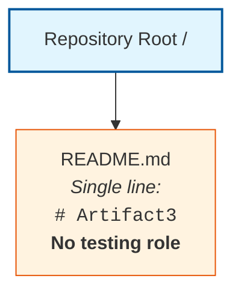

The single `README.md` artifact is documentation only and does not participate in any unit test invocation, integration test orchestration, end-to-end scenario execution, mock activation, fixture loading, factory instantiation, fake/stub injection, dependency-injection container resolution, container test environment provisioning, ephemeral database setup, contract test verification, performance load injection, security scan execution, coverage measurement, mutation testing pass, snapshot comparison, property-based generation, browser-driver session, CI test stage, parallel test partition, test report aggregation, failure notification, retry attempt, quarantine assignment, flaky-test classification, coverage gate evaluation, or quality gate enforcement. No runtime process, test runner, mocking server, virtualized service, container test stack, ephemeral environment, CI executor, parallel worker, report aggregator, alert manager, retry orchestrator, quarantine registry, coverage collector, mutation engine, or quality gate enforcer exists in the repository to host or coordinate testing-strategy elements.

#### 6.6.8.3 Deferred Diagram Templates for Future Revisions

When the artifact prerequisites enumerated in Section 6.6.10 are introduced into the repository, the three deferred diagrams should be drawn against the established Mermaid syntax conventions used elsewhere in this Technical Specification. The diagram families and their producibility preconditions are:

| Diagram Family | Producibility Precondition |
|----------------|-----------------------------|
| Test Execution Flow | Test runner declarations; CI workflow YAML defining test stages; test discovery patterns; parallel partition declarations; pre/post-step lifecycle hooks |
| Test Environment Architecture | Docker Compose test stacks; Testcontainers configurations; Kubernetes namespace manifests for ephemeral environments; CI environment-provisioning scripts; service virtualization deployment definitions |
| Test Data Flow | Fixture loader declarations; factory definitions (Factory Boy, FactoryBot, fishery); seed script source; database snapshot tools; data-builder source code; mocked external service stub catalogs |

---

### 6.6.9 Basic Unit Testing Practices Disclosure

#### 6.6.9.1 Disclosure Constraint

The Section 6.6 prompt's guard clause instructs the author to "document only the basic unit testing approach that will be used" when declaring non-applicability. The binding evidence-based authoring standard articulated in Section 1.4.1 and reaffirmed in Sections 2.1, 3.1, 4.1, 5.1, 6.1.2, 6.2.2, 6.3.2, 6.4.2, and 6.5.2 precludes prescriptive declarations about future implementations. No source code, programming language declaration, package manifest, test runner configuration, mocking library binding, coverage tool configuration, CI pipeline definition, or pre-commit hook exists in the repository from which any specific basic unit testing approach could be claimed as adopted by this system. Furthermore, because Section 1.2.2 and Section 3.3 both confirm that no programming language is declared, the appropriate xUnit-family framework — which is inherently language-bound (pytest for Python, JUnit for Java, Jest for JavaScript, RSpec for Ruby, Go test for Go, NUnit/xUnit.net for .NET, etc.) — cannot itself be prescriptively selected without violating the evidence-based standard.

Consistent with the deferred-content treatment used in Sections 6.1.6.3, 6.2.7.3, 6.3.6.3, 6.4.7, and 6.5.7, the enumeration below is provided strictly as a reference checklist of basic unit testing practice categories that future implementations may consider — not as a declaration that any specific practice has been or will be adopted by this system.

#### 6.6.9.2 Reference Checklist of Basic Unit Testing Practice Categories

The following reference checklist enumerates widely recognized categories of basic unit testing practice that future contributors may evaluate when the repository is populated with implementation, configuration, or deployment artifacts. Each entry identifies the practice category and the artifact class whose introduction would enable a substantive determination in future revisions of this section.

#### Unit Testing Framework Categories

| Practice Category | Enabling Artifact Class |
|-------------------|--------------------------|
| xUnit-family test runners | pytest, JUnit, Jest, Mocha, RSpec, NUnit, xUnit.net, Go test installations and configuration files |
| Behavior-driven specifications | Cucumber `.feature` files, SpecFlow specifications, Behave step definitions, Gherkin scenario libraries |
| Property-based testing | Hypothesis, fast-check, QuickCheck, jqwik library declarations and strategy definitions |
| Snapshot testing | Jest snapshot files (`__snapshots__/`), syrupy snapshot directories, approval test artifacts |

#### Mocking and Test Double Categories

| Practice Category | Enabling Artifact Class |
|-------------------|--------------------------|
| In-process mock libraries | unittest.mock (Python), Mockito (Java), Sinon (JavaScript), Jasmine spies, gomock (Go), moq (.NET) declarations |
| Service virtualization | WireMock, Mountebank, MSW (Mock Service Worker), nock, Hoverfly stub catalogs and handler definitions |
| Fake / stub implementations | Hand-written fake implementations of dependency interfaces; in-memory substitutes for external collaborators |
| Dependency injection for test isolation | DI container test configurations (Spring `@MockBean`, Angular TestBed, NestJS testing module declarations) |

#### Coverage and Quality Categories

| Practice Category | Enabling Artifact Class |
|-------------------|--------------------------|
| Line / branch coverage tools | coverage.py (`.coveragerc`), Istanbul/nyc (`nyc.config.js`), JaCoCo descriptors, simplecov configurations |
| Mutation testing | Stryker, mutmut, PIT, Pitest configuration files and mutator declarations |
| Static analysis and linting | ESLint, Pylint, ruff, flake8, RuboCop, SpotBugs, golangci-lint configuration files |
| Coverage thresholds in CI | Coverage gate declarations in `.coveragerc`, `jest.config.js`, `nyc.config.js`, or CI YAML enforcement steps |

#### Integration and Contract Testing Categories

| Practice Category | Enabling Artifact Class |
|-------------------|--------------------------|
| API testing harnesses | Postman/Newman collections, supertest test suites, REST Assured tests, Karate `.feature` files |
| Database integration testing | Testcontainers configurations; embedded H2/SQLite bindings; transactional rollback patterns |
| Contract testing | Pact consumer/provider tests, Spring Cloud Contract definitions, OpenAPI conformance suites |
| End-to-end UI automation | Cypress (`cypress/e2e/`), Playwright (`tests/e2e/`), Selenium WebDriver suites, Puppeteer scripts |

#### Performance and Security Testing Categories

| Practice Category | Enabling Artifact Class |
|-------------------|--------------------------|
| Load and stress testing | k6 scripts (`.js`), JMeter (`.jmx`), Locust (`locustfile.py`), Gatling (`.scala`) scenario files |
| Security testing | OWASP ZAP scan configurations, Bandit/Semgrep rule sets, `npm audit` / `pip-audit` CI invocations, Snyk integrations |
| Dependency vulnerability scanning | Dependabot configurations (`.github/dependabot.yml`), Renovate (`renovate.json`), Snyk policies |
| Chaos and resilience testing | Chaos Monkey, Litmus, Gremlin experiment manifests; fault-injection test suites |

#### 6.6.9.3 Application of the Checklist

The checklist in Section 6.6.9.2 should be interpreted as a forward-looking inventory of practice categories whose adoption status will become determinable once corresponding artifacts are committed to the repository. Until such artifacts exist, no row in any inventory of this section can be transitioned from `*(none)*` to a populated value without violating the evidence-based authoring standard. Reaffirmation of this constraint is provided in Section 6.6.10.3 below.

---

### 6.6.10 Anticipated Evolution and Future Population Triggers

#### 6.6.10.1 Artifact-to-Subsection Mapping

Consistent with the future-population mapping patterns established in Sections 1.4, 2.7, 3.9, 4.7, 5.8, 6.1.7.1, 6.2.8.1, 6.3.7.1, 6.4.8.1, and 6.5.8.1, this section will be revised as subsequent contributions populate the repository with the artifacts necessary to derive each Testing Strategy sub-topic. The following tables enumerate, by sub-topic area, the artifact categories whose introduction would unlock substantive population.

#### Unit Testing Triggers

| Sub-Topic | Artifact Category That Would Enable Population |
|-----------|------------------------------------------------|
| Testing Frameworks and Tools | Test framework dependency declarations in `package.json`, `requirements.txt`, `pyproject.toml`, `pom.xml`, `build.gradle`, `Cargo.toml`, `go.mod`; test runner configuration files (`pytest.ini`, `jest.config.js`, `mocharc.yml`, `karma.conf.js`) |
| Test Organization Structure | Test directories (`tests/`, `__tests__/`, `spec/`, `src/test/`, `test/`); test file naming patterns; discovery configurations |
| Mocking Strategy | Mocking library dependency declarations (unittest.mock, Mockito, Sinon, MSW, nock, WireMock); service virtualization manifests; fake/stub source files |
| Code Coverage Requirements | Coverage tool configurations (`.coveragerc`, `nyc.config.js`, JaCoCo descriptors); coverage threshold declarations; codecov/coveralls integration files |
| Test Naming Conventions | `CONTRIBUTING.md`, style guides, linter rules, naming-convention documentation |
| Test Data Management | Fixture directories (`fixtures/`, `factories/`); Factory Boy, FactoryBot, fishery, AutoFixture declarations; seed scripts; test-data builder source code |

#### Integration Testing Triggers

| Sub-Topic | Artifact Category That Would Enable Population |
|-----------|------------------------------------------------|
| Service Integration Test Approach | Integration test suites; cross-service test harnesses; ephemeral environment provisioning scripts; service-mesh test configurations |
| API Testing Strategy | Postman/Newman collections; supertest test suites; REST Assured tests; Karate features; OpenAPI conformance test suites; gRPC test harnesses |
| Database Integration Testing | Testcontainers configurations; embedded database bindings (H2, SQLite, in-memory PostgreSQL); transaction rollback patterns; database fixture loaders |
| External Service Mocking | WireMock stub catalogs; MSW handler definitions; nock interceptor scripts; VCR cassette files; Hoverfly simulation files |
| Test Environment Management | Docker Compose test stacks (`docker-compose.test.yml`); Testcontainers manifests; CI environment manifests; Kubernetes test namespace definitions |

#### End-to-End Testing Triggers

| Sub-Topic | Artifact Category That Would Enable Population |
|-----------|------------------------------------------------|
| E2E Test Scenarios | Cypress specs (`cypress/e2e/`); Playwright tests (`tests/e2e/`, `playwright/`); Selenium suites; user-journey scripts; Gherkin scenario libraries |
| UI Automation Approach | Cypress/Playwright/Selenium/Puppeteer installations; Page Object Model files; webdriver configurations; visual regression tools (Percy, Applitools, Chromatic) |
| Test Data Setup and Teardown | Fixture loaders; seed scripts; database snapshot tools; transactional rollback patterns; before/afterEach lifecycle hooks |
| Performance Testing Requirements | k6 scripts, JMeter `.jmx` files, Locust `locustfile.py`, Gatling `.scala` scenarios; performance threshold declarations; SLO definitions for load tests |
| Cross-Browser Testing Strategy | BrowserStack/Sauce Labs/LambdaTest configurations; Playwright multi-browser configs; Selenium Grid setups; cross-browser CI matrix definitions |

#### Test Automation Triggers

| Sub-Topic | Artifact Category That Would Enable Population |
|-----------|------------------------------------------------|
| CI/CD Integration | `.github/workflows/*.yml`, `.gitlab-ci.yml`, `Jenkinsfile`, `azure-pipelines.yml`, `bitbucket-pipelines.yml`, `circleci/config.yml` with test stages |
| Automated Test Triggers | Git hooks (`husky`, `.pre-commit-config.yaml`, `lefthook.yml`); CI event triggers (push, pull_request, schedule, workflow_dispatch); branch protection rules |
| Parallel Test Execution | pytest-xdist configurations; Jest `--maxWorkers` declarations; CI matrix job definitions; parallel test runner manifests (Knapsack Pro, CircleCI parallelism) |
| Test Reporting Requirements | JUnit XML report configurations; Allure, ReportPortal, TestRail integrations; CI artifact-upload steps; test result dashboard declarations |
| Failed Test Handling | Retry plugins (pytest-retry, jest-retry, jest-circus retry, Maven Surefire rerunFailingTestsCount); failure-notification webhooks; PagerDuty/Slack integrations |
| Flaky Test Management | Flaky test tracking issues; test stability metrics; quarantine policies; retry policy declarations; flake-detection tooling (BuildPulse, Trunk Flaky Tests) |

#### Quality Metrics Triggers

| Sub-Topic | Artifact Category That Would Enable Population |
|-----------|------------------------------------------------|
| Code Coverage Targets | `.coveragerc` thresholds; `jest.config.js` coverage gates; CI coverage enforcement steps; codecov/coveralls configurations |
| Test Success Rate Requirements | SLO declarations for test pass rates; CI failure-threshold configurations; error-budget policies for test stability |
| Performance Test Thresholds | k6 threshold declarations; JMeter assertions; Locust SLO definitions; performance budget configurations (`lighthouse-ci`, `webpagetest`) |
| Quality Gates | SonarQube quality gate configurations; Codacy policies; Code Climate maintainability thresholds; branch protection rules requiring test passes |
| Documentation Requirements | `CONTRIBUTING.md` test documentation sections; test plan templates; coverage report publication workflows; testing handbook documents |

#### Required Diagram Triggers

| Diagram | Artifact Category That Would Enable Production |
|---------|--------------------------------------------------|
| Test Execution Flow | Test runner declarations; CI workflow YAML defining test stages; pre/post-step lifecycle hooks; parallel partition configurations |
| Test Environment Architecture | Docker Compose test stacks; Testcontainers configurations; Kubernetes namespace manifests; service virtualization deployments |
| Test Data Flow | Fixture loader declarations; factory definitions; seed scripts; mocked external service stub catalogs; database snapshot tools |

#### 6.6.10.2 Future Population Triggers

When any artifact in the tables above is introduced into the repository, this Section 6.6 should be revisited and populated using the established Determinability Matrix pattern:

1. The relevant Determinability Matrix row in Sections 6.6.3.1, 6.6.4.1, 6.6.5.1, 6.6.6.1, or 6.6.7.1 should be updated from "No" to "Yes" with the new authoritative source citation.
2. The Empty Inventory placeholder rows (`*(none)*` markers) in Sections 6.6.3.2, 6.6.4.2, 6.6.5.2, 6.6.6.2, and 6.6.7.2 should be replaced with factually grounded entries derived from the introduced artifacts, with each Markdown table preserving the four-column limit prescribed by the Section 6.6 output format.
3. The Test Strategy Matrix in Section 6.6.7.3 should be populated with concrete test types, coverage targets, success thresholds, and execution triggers derived from the introduced test framework declarations and CI workflow definitions.
4. The Diagram Producibility Matrix in Section 6.6.8.1 should be updated to reflect newly producible test execution flow, test environment architecture, and test data flow diagrams.
5. New Mermaid diagrams should be drawn using nodes and edges that correspond to test runners, parallel workers, CI stages, ephemeral environments, service virtualization endpoints, fixture loaders, factories, mocked counterparties, coverage collectors, and quality gates evidenced in the introduced artifacts, with coverage threshold, success rate, latency budget, and quality gate annotations sourced directly from the introduced specifications and configuration files.
6. The Applicability Determination in Section 6.6.1.1 should be revisited; if any of the criteria therein transitions to "Criterion met," the non-applicability finding should be retracted and substantive content should replace this boundary statement.
7. The Basic Unit Testing Practices Disclosure in Section 6.6.9 should be revised to declare which specific practice categories have been adopted (with citations to the introduced artifacts), and the reference checklist in Section 6.6.9.2 should be updated to distinguish adopted from non-adopted categories.
8. Sections 1.3 (Scope — for the "Test suites or fixtures" entry), 3.4 (Frameworks and Libraries — for the test framework entry), 3.8 (Development and Deployment — for the CI/CD pipeline and pre-commit hook entries), 4.5 (Technical Implementation Determinability — for error-notification and recovery procedure entries), 5.6 (Cross-Cutting Concerns — for logging/tracing and performance SLA entries), and 6.5 (Monitoring and Observability — for test reporting destinations) should be updated in lockstep so that the sections remain consistent across the Technical Specification.

#### 6.6.10.3 Reader Guidance

Readers consulting this section should treat its current form as a faithful reflection of the repository at the time of authoring, consistent with the guidance in Sections 1.4, 2.7, 3.9, 4.7, 5.8, 6.1.7.3, 6.2.8.3, 6.3.7.3, 6.4.8.3, and 6.5.8.3. Entries marked "No," "Not determinable," "None," or `*(none)*` indicate the absence of repository evidence and not a negative scoping decision against any candidate test framework, runner, harness, mocking library, fake/stub strategy, coverage tool, mutation tool, snapshot tool, property-based library, contract platform, performance tool, load tool, security scanner, UI automation framework, page-object library, fixture/factory framework, container test infrastructure, CI/CD platform, build system, parallel executor, test reporter, retry/quarantine plugin, flaky-test tracker, code coverage target, test success rate requirement, performance budget, quality gate, or documentation standard. Project owners are encouraged to introduce the corresponding test framework dependencies, test runner configurations, test directory structures, mocking library bindings, service virtualization manifests, coverage tool configurations, mutation testing setups, contract testing harnesses, E2E framework installations, load testing scripts, security testing pipelines, CI workflow definitions, parallel test partition declarations, test reporter integrations, retry plugins, flaky-test tracking dashboards, coverage thresholds, performance budgets, quality gate declarations, and test documentation templates into the repository to enable a fully populated Testing Strategy section in future revisions of this Technical Specification.

---

### 6.6.11 References

#### 6.6.11.1 Files Examined

- `README.md` — The repository's sole artifact; single-line content `# Artifact3`; confirmed to bear no testing role, declare no test framework, hold no test runner or mocking library, reference no coverage tool, CI/CD pipeline, or quality gate, and contain no test fixture, factory, seed script, page object, contract definition, load profile, or security scan configuration.

#### 6.6.11.2 Folders Explored

- `/` (repository root, depth 0) — Confirmed to contain exactly one child (`README.md`) and zero subdirectories; provides no `tests/`, `__tests__/`, `spec/`, `src/test/`, `test/`, `e2e/`, `cypress/`, `playwright/`, `fixtures/`, `factories/`, `mocks/`, `__mocks__/`, `stubs/`, `coverage/`, `.github/workflows/`, or any testing-related substructure.

#### 6.6.11.3 Technical Specification Sections Referenced

- **Section 1.1 Executive Summary** — Established the pre-implementation, documentation-only state of the repository and the project identification as `Artifact3`.
- **Section 1.2 System Overview** — Provided the canonical Repository Contents Inventory and the explicit statements that "No external system dependencies, third-party services, or inter-system data flows have been declared" (Section 1.2.1), that no programming language or framework is declared (Section 1.2.2), and that "No KPI definitions, metrics catalogs, dashboards, telemetry plans, instrumentation specifications, or measurement frameworks are present" and "No measurable objectives, target metrics, service-level objectives, or quantitative goals are documented in the repository" (Section 1.2.3) — directly informing the Code Coverage Targets, Test Success Rate Requirements, and Performance Test Thresholds rows in Section 6.6.7.1.
- **Section 1.3 Scope** — Established the catalogue of nine confirmed-absent artifact categories — most directly the explicit "**Test suites or fixtures: Absent**" entry — which constitutes the foundational evidentiary baseline for the entire Section 6.6 non-applicability determination.
- **Section 1.4 Document Status and Specification Boundary** — Established the evidence-based authoring standard and reader-guidance conventions inherited by this Section 6.6.
- **Section 1.5 References** — Verified 100% repository coverage (1 of 1 files; 1 of 1 folders) at hierarchy depth 0.
- **Section 2.2 Feature Catalog** — Confirmed that no features, capabilities, or use cases are declared, directly informing the E2E Test Scenarios row in Section 6.6.5.1.
- **Section 2.5 Implementation Considerations** — Recorded "No" for Performance Requirements ("No performance criteria or SLO documentation") and Maintenance Requirements ("No operational runbooks, lifecycle documentation, or support models"), directly informing the Performance Test Thresholds row in Section 6.6.7.1 and the Performance Testing Requirements row in Section 6.6.5.1.
- **Section 3.1 Section Authoring Basis and Evidence Constraint** — Formally rejected all sixteen Default Technology Stack components as "Not adopted — no evidence," establishing that no test framework, runner, mocking library, coverage tool, or contract-testing platform is evidenced.
- **Section 3.3 Programming Languages** — Confirmed no programming language is declared, directly precluding the prescriptive selection of any language-bound xUnit-family framework in Section 6.6.9.
- **Section 3.4 Frameworks and Libraries** — Recorded the absence of declared frameworks and libraries — directly informing the Testing Frameworks and Tools row in Section 6.6.3.1.
- **Section 3.6 Third-Party Services** — Confirmed the absence of external APIs, identity providers, monitoring tools, cloud services, and environment variable templates — directly informing the External Service Mocking row in Section 6.6.4.1.
- **Section 3.7 Databases and Storage** — Confirmed the absence of persistence, caching, and transaction artifacts that could underpin database integration testing or test data setup/teardown.
- **Section 3.8 Development and Deployment** — **Primary authoritative source for Test Automation**: confirmed the absence of containerization (`Dockerfile`, `docker-compose.yml`), CI/CD pipelines (`.github/workflows/`, `.gitlab-ci.yml`, `Jenkinsfile`, `azure-pipelines.yml`, `bitbucket-pipelines.yml`, CircleCI), infrastructure-as-code, deployment environments, Kubernetes manifests, build descriptors, and pre-commit hooks — directly informing all six rows of Section 6.6.6.1 and the Quality Gates row in Section 6.6.7.1.
- **Section 4.3 System Workflows Determinability** — Recorded "No" for Data Flow Between Systems, API Interactions, Event Processing Flows, and Batch Processing Sequences — directly informing the Service Integration Test Approach row in Section 6.6.4.1 and the E2E Test Scenarios row in Section 6.6.5.1.
- **Section 4.5 Technical Implementation Determinability** — **Primary authoritative source for Failed Test Handling and Flaky Test Management**: recorded "No" for Error Notification Flows ("No alerting configurations, paging integrations, or monitoring service bindings") and "No" for Recovery Procedures ("No operational runbooks, disaster-recovery documentation, or incident-response playbooks") — directly informing the Failed Test Handling and Flaky Test Management rows in Section 6.6.6.1.
- **Section 4.6 Required Diagrams Determinability** — Established the Mermaid Diagram Producibility Matrix pattern reused in Section 6.6.8.1.
- **Section 5.3 High-Level Architecture Determinability** — Recorded the empty Data Flow Inventory (Section 5.3.3) and the empty External Integration Points Inventory (Section 5.3.4) with the explicit finding that "No protocol bindings (REST/gRPC/AMQP/Kafka/etc.) declared," directly informing the API Testing Strategy row in Section 6.6.4.1 and the Test Data Flow Diagrams row in Section 6.6.8.1.
- **Section 5.6 Cross-Cutting Concerns Determinability** — Recorded "No" for Monitoring and Observability, Logging and Tracing Strategy, Performance Requirements and SLAs, and Disaster Recovery Procedures — directly informing the Test Reporting Requirements row in Section 6.6.6.1 and the Performance Test Thresholds row in Section 6.6.7.1.
- **Section 5.7 Required Diagrams Determinability** — Established the Mermaid Diagram Producibility precedent reused in Section 6.6.8.1.
- **Section 5.8 Anticipated Evolution and Future Population Triggers** — Provided the artifact-to-subsection mapping template reused in Section 6.6.10.1.
- **Section 6.1 Core Services Architecture** — **First critical structural precedent**: established the complete template for handling non-applicability determinations in Section 6.x, including Applicability Statement, Authoring Basis, Determinability Matrices, Empty Inventories, Diagram Producibility Matrix, Canonical Repository Topology Diagram, Anticipated Evolution Mapping, and References sub-structure. Sections 6.1.4.1 and 6.1.5.1 specifically recorded "No" for Performance Optimization Techniques, Capacity Planning Guidelines, Fault Tolerance Mechanisms, and Disaster Recovery Procedures, directly corroborating the Section 6.6 non-applicability finding for Performance Testing Requirements and Failed Test Handling.
- **Section 6.2 Database Design** — **Second critical structural precedent**: provided the multi-table Empty Inventory pattern reused in Sections 6.6.3.2, 6.6.4.2, 6.6.5.2, 6.6.6.2, and 6.6.7.2. The non-applicability of Database Design directly precludes Database Integration Testing in Section 6.6.4.1.
- **Section 6.3 Integration Architecture** — **Third critical structural precedent**: provided the multi-table empty inventory and reference-checklist pattern. The non-applicability of Integration Architecture directly precludes Service Integration Test Approach, API Testing Strategy, and External Service Mocking in Section 6.6.4.1.
- **Section 6.4 Security Architecture** — **Most directly applicable structural precedent (alongside 6.5)**: provided the canonical pattern for handling a Section 6.x prompt with a guard clause that includes "explain which standard practices will be followed instead" (Section 6.4.7), reused as the template for Section 6.6.9's Basic Unit Testing Practices Disclosure. The non-applicability of Security Architecture also directly precludes the derivation of security testing requirements (SAST, DAST, dependency scanning, secrets detection) in the Section 6.6.9.2 Performance and Security Testing Categories checklist.
- **Section 6.5 Monitoring and Observability** — **Most directly applicable structural precedent (alongside 6.4)**: provided the canonical pattern for handling a Section 6.x prompt with a guard clause that includes "explain which basic practices will be followed instead" (Section 6.5.7), reused as the structural template for Section 6.6.9's Basic Unit Testing Practices Disclosure. The non-applicability of Monitoring and Observability also directly precludes the derivation of test reporting destinations (Section 6.6.6.1), failed test alerting routing (Section 6.6.6.1), and dashboard integration of test metrics (Section 6.6.7.1).

# 7. User Interface Design

**No user interface required.**

## 7.1 Applicability Statement

### 7.1.1 Determination — No User Interface Required

The Section 7 prompt provides an explicit guard clause directing the author to record the note "No user interface required" when the project does not define a user interface. Application of that guard clause to the present repository evidence produces an unambiguous non-applicability determination on the following grounds:

| Applicability Criterion | Repository Evidence | Determination |
|-------------------------|---------------------|---------------|
| User-facing source files exist | No `.html`, `.jsx`, `.tsx`, `.vue`, `.svelte`, `.css`, or `.scss` files present in repository (Section 1.2.2; Section 1.3.2) | Criterion not met |
| Frontend project manifest exists | No `package.json`, `tsconfig.json`, `tailwind.config.js`, or equivalent frontend manifest present (Section 3.1.3) | Criterion not met |
| Frontend framework adopted | All seven UI/frontend candidates in the Default Technology Stack (React, TailwindCSS, React-Native, Swift, Kotlin, Objective-C, ElectronJS) formally rejected as "Not adopted — no evidence" (Section 3.1.3) | Criterion not met |
| Static assets or templates exist | "Frontend assets or templates: Absent" formally catalogued (Section 1.3.2) | Criterion not met |
| User personas or journeys declared | "End-to-End User Journeys: No — No user personas, journey maps, or user-facing artifacts" (Section 4.3.1) | Criterion not met |
| User-facing features declared | "No features have been identified, declared, specified, or implemented within the repository" (Section 2.2.1) | Criterion not met |
| Backend interaction surface exists | No backend, no API contracts, no service interfaces present (Section 3.4; Section 6.3.1.1) | Criterion not met |

Because none of the necessary preconditions for a User Interface Design exist in the repository, the substantive content prescribed by the Section 7 prompt — core UI technologies involved, UI use cases, UI/backend interaction boundaries, UI schemas, screens required, user interactions, and visual design considerations — cannot be derived from repository evidence and is therefore deferred until corresponding artifacts are introduced.

### 7.1.2 Evidentiary Basis for the Non-Applicability Finding

The repository's complete inventory consists of one artifact and bears no user interface role:

| Path | Type | Content | UI Role |
|------|------|---------|---------|
| `/` | Directory (root) | Contains only `README.md`; zero subdirectories | Container only — no UI role |
| `README.md` | Markdown file | Single line: `# Artifact3` | None — not a UI artifact, not consumed by any rendering pipeline |

This baseline is identical to the canonical Repository Contents Inventory established in Section 1.2.2 and verified at 100% coverage in Section 1.5 (1 of 1 files examined; 1 of 1 folders explored; hierarchy depth achieved: 0). The categorical absence of UI artifacts — including HTML markup, component libraries, stylesheets, template files, frontend project manifests, mobile project structures, desktop UI manifests, static asset directories, design files, and UI documentation — is formally catalogued across the prior sections of this Technical Specification.

The non-applicability determination is consistent with — and required by — prior findings established in:

- **Section 1.1.1**, which characterizes the repository as being in a "pre-implementation, documentation-only state" containing "no executable source code, no build manifests, no configuration artifacts."
- **Section 1.2.2**, which states: "The repository contains no component diagrams, module structures, service definitions, package boundaries, or architectural artifacts that would identify major system components" and confirms zero subdirectories exist below the repository root.
- **Section 1.3.1**, which records: "User Groups Covered: Undefined — No user-facing artifacts present."
- **Section 1.3.2**, which records "Frontend assets or templates: Absent" within the catalogue of confirmed-absent artifact categories.
- **Section 2.2.1**, which states: "No features have been identified, declared, specified, or implemented within the repository."
- **Section 3.1.3**, the **primary authoritative source for the rejection of UI technologies**, which formally rejects all seven UI/frontend default stack candidates (React with TypeScript, TailwindCSS, React-Native with TypeScript, Swift, Kotlin, Objective-C, ElectronJS) as "Not adopted — no evidence."
- **Section 3.4.1**, which records "Frontend Framework(s): No — No frontend project structure or web framework manifests present."
- **Section 4.3.1**, which records "End-to-End User Journeys: No — No user personas, journey maps, or user-facing artifacts."
- **Section 5.3.3**, which records the empty Core Components inventory, confirming no UI components are present.
- **Section 6.3.1.1**, which records "API Gateway Configuration: No" and the broader absence of any UI/backend interaction surface.

---

## 7.2 Section Authoring Basis and Evidence Constraint

### 7.2.1 Inheritance of Evidence-Based Standard

This Section 7 has been authored under the same evidence-based standard articulated in Section 1.4 and reaffirmed in Sections 2.1, 3.1, 4.1, 5.1, 6.1.2, and 6.3.2 of this Technical Specification: each factual assertion is traceable to an observed file, folder, or confirmed-absence finding in the repository, and where evidence is unavailable the section discloses the gap rather than supplying conjecture.

Per Section 1.4 reader guidance, all entries marked "No," "Not determinable," "None," "Undefined," or `*(none)*` in the matrices and inventories that follow indicate the absence of repository evidence and **do not constitute negative scoping decisions** against any future user interface technology, design system, interaction pattern, accessibility standard, or screen catalog. Speculative population of these subsections with conjectural wireframes, component hierarchies, screen flows, design tokens, accessibility annotations, responsive breakpoints, or interaction handlers would violate the binding authoring standard and is therefore deferred to future revisions triggered by repository artifact contributions enumerated in Section 7.5 below.

### 7.2.2 Application of the Section Prompt's Directive

The Section 7 prompt issues a directly applicable instruction: *"If the project doesn't define a user interface (UI), leave the section empty with the note 'No user interface required'."* This directive has been honored at the head of this section. The supplementary subsections that follow are not substantive UI design content; rather, they provide evidentiary corroboration of the non-applicability finding using the established Determinability Matrix, Empty Inventory, Canonical Repository Topology Diagram, and Anticipated Evolution patterns reused across Sections 6.1 and 6.3 of this Technical Specification.

---

## 7.3 UI Sub-Element Determinability

### 7.3.1 UI Sub-Element Determinability Matrix

The Section 7 prompt enumerates seven UI documentation sub-elements that would otherwise require population: core UI technologies, UI use cases, UI/backend interaction boundaries, UI schemas, screens required, user interactions, and visual design considerations. Application of the evidence-based authoring standard produces the following determinability disposition for each sub-element:

| UI Sub-Element | Determinable | Authoritative Source |
|----------------|--------------|----------------------|
| Core UI Technologies | No | All seven UI/frontend candidates in the Default Technology Stack formally rejected as "Not adopted — no evidence" (Section 3.1.3); "Frontend Framework(s): No" (Section 3.4.1) |
| UI Use Cases | No | No features cataloged (Section 2.2.1); "End-to-End User Journeys: No" (Section 4.3.1); no user personas or journey maps present |
| UI / Backend Interaction Boundaries | No | No backend framework, API contracts, or service interfaces present (Section 3.4; Section 6.3.1.1); "Integration Architecture is not applicable for this system" (Section 6.3.1.1) |
| UI Schemas | No | No schemas, types, data models, or component prop definitions present (Section 5.3.3); no GraphQL SDL, TypeScript interfaces, or JSON Schema artifacts |
| Screens Required | No | Zero UI files exist in the repository; no `.html`, `.jsx`, `.tsx`, `.vue`, or `.svelte` files present (Section 1.3.2) |
| User Interactions | No | No event handlers, controllers, state management code, or interaction artifacts present in the repository |
| Visual Design Considerations | No | No style guides, design tokens, CSS files, brand documentation, or design system artifacts present (Section 1.3.2; Section 3.1.3) |

### 7.3.2 UI Technology Stack Disposition

The Section 3.1.3 Default Technology Stack disposition formally rejects every candidate UI technology against repository evidence. The following table extracts the UI-relevant subset for direct reference within this Section 7:

| UI Layer | Default Candidate | Repository Evidence | Disposition |
|----------|--------------------|---------------------|-------------|
| Web Frontend | React with TypeScript | No `package.json`, `tsconfig.json`, `.tsx`, or `.jsx` files | Not adopted — no evidence |
| CSS Framework | TailwindCSS | No `tailwind.config.js` or stylesheet artifacts | Not adopted — no evidence |
| Cross-Platform Mobile | React-Native with TypeScript | No mobile project structure or React-Native manifests | Not adopted — no evidence |
| iOS Native | Swift | No `.swift` files, Xcode project, or `Package.swift` | Not adopted — no evidence |
| Android Native | Kotlin | No `.kt` files, Gradle scripts, or Android manifests | Not adopted — no evidence |
| macOS Native | Objective-C | No `.m`, `.mm`, or `.h` files | Not adopted — no evidence |
| Desktop | ElectronJS | No Electron-related manifests or main process scripts | Not adopted — no evidence |

Adopting any item from this UI-relevant subset without supporting repository evidence would constitute a violation of the evidence-based authoring standard binding this specification and is therefore explicitly excluded from the operative content of Section 7.

### 7.3.3 Cross-Reference Summary for UI Sub-Elements

| Sub-Element | Primary Source | Corroborating Source |
|-------------|----------------|----------------------|
| Core UI Technologies | Section 3.1.3 | Section 3.4.1 |
| UI Use Cases | Section 2.2.1 | Section 4.3.1 |
| UI / Backend Interaction Boundaries | Section 6.3.1.1 | Section 3.4 |
| UI Schemas | Section 5.3.3 | Section 1.3.2 |
| Screens Required | Section 1.2.2 | Section 1.3.2 |
| User Interactions | Section 1.2.2 | Section 4.3.1 |
| Visual Design Considerations | Section 1.3.2 | Section 3.1.3 |

---

## 7.4 Required Artifacts Disposition

### 7.4.1 UI Screen Inventory

The Section 7 prompt requires identification and referencing of actual UI screens in the repository. Consistent with the Empty Inventory pattern established in Sections 3.6.2, 4.3.2, 5.3.4, 6.1.3.2, 6.1.4.2, 6.1.5.2, 6.3.3.2, 6.3.4.2, and 6.3.5.2, the screen-level inventory derivable from current repository evidence is empty across all dimensions:

#### Screen Catalog

| Screen Name | File Path | Route / URL | Primary Purpose |
|-------------|-----------|-------------|-----------------|
| *(none)* | *(none)* | *(none)* | *Not determinable from repository evidence* |

#### User Interaction Catalog

| Interaction | Triggering Element | Backend Operation | State Change |
|-------------|--------------------|-----------------|---------------|
| *(none)* | *(none)* | *(none)* | *Not determinable from repository evidence* |

#### Visual Design Token Catalog

| Token Category | Token Name | Value | Usage Surface |
|----------------|------------|-------|---------------|
| *(none)* | *(none)* | *(none)* | *Not determinable from repository evidence* |

#### UI Schema Catalog

| Schema Name | Schema Type | Consumer Component | Validation Library |
|-------------|-------------|--------------------|--------------------|
| *(none)* | *(none)* | *(none)* | *Not determinable from repository evidence* |

### 7.4.2 Canonical Repository Topology Diagram

The single valid Mermaid diagram producible against current evidence is the canonical Repository Topology Diagram reproduced from Sections 1.2.2, 6.1.6.2, and 6.3.6.2. It is included here, annotated with UI-design-specific framing, to visually corroborate the absence of any user interface artifacts:

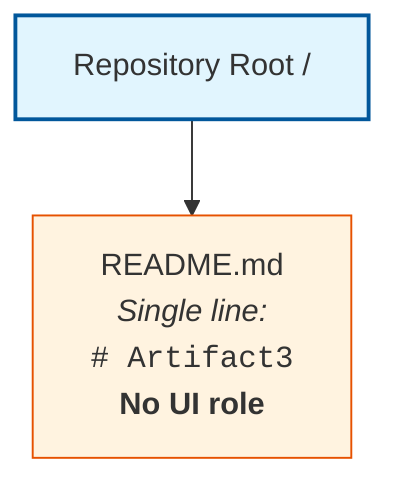

The single `README.md` artifact is documentation only and does not participate in any rendered view, route, navigation graph, component tree, style cascade, state store, event handler chain, accessibility tree, design system, or UI/backend data contract. No web browser, mobile runtime, desktop shell, or rendering engine exists in the repository to host or coordinate user interface elements.

### 7.4.3 Diagram Producibility Disposition

| Required Diagram | Producible | Rationale |
|------------------|------------|-----------|
| Screen Flow Diagram | No | Zero screens declared; no navigation graph derivable from repository evidence |
| Component Hierarchy Diagram | No | Zero components declared (Section 5.3.3); no parent-child relationships derivable |
| UI/Backend Sequence Diagram | No | No backend present (Section 3.4); no API contracts (Section 6.3.1.1); "no sequence diagram can be drawn because no message-passing contracts or service interactions are declared" (Section 4.6.2) |
| Wireframe / Mockup | No | No design files, sketches, Figma exports, or wireframe artifacts present in repository |
| Style Guide / Design System Diagram | No | No design tokens, color palettes, typography scales, or spacing systems declared |

Producing any of these diagrams without supporting repository evidence would constitute a violation of the binding evidence-based authoring standard, consistent with the disposition recorded in Sections 4.6.2, 5.7.2, 6.1.6.1, and 6.3.6.1. The diagrams are retained only as a reference checklist for future revisions.

---

## 7.5 Anticipated Evolution and Future Population Triggers

### 7.5.1 Artifact-to-Subsection Mapping

Consistent with the future-population mapping patterns established in Sections 1.4, 2.7, 3.9, 4.7, 5.8, 6.1.7.1, and 6.3.7.1, this section will be revised as subsequent contributions populate the repository with the artifacts necessary to derive each User Interface Design sub-element. The following table enumerates the artifact categories whose introduction would unlock substantive population of each sub-element:

| Sub-Element | Artifact Category That Would Enable Population |
|-------------|------------------------------------------------|
| Core UI Technologies | Frontend project manifest (`package.json`, `pubspec.yaml`); framework manifests (Next.js config, Nuxt config, Angular CLI workspace); `tsconfig.json`; mobile project structures (Xcode project, Gradle scripts) |
| UI Use Cases | User story documentation; feature specifications; user persona catalogs; journey maps; acceptance criteria definitions |
| UI / Backend Interaction Boundaries | API client code (Axios, Fetch wrappers, React Query, SWR, Apollo Client); OpenAPI/AsyncAPI specifications; GraphQL SDL; tRPC contracts; gRPC-web client modules |
| UI Schemas | TypeScript interface declarations; Zod / Yup / Joi validation schemas; JSON Schema files; GraphQL SDL; Protobuf schemas; component prop type definitions |
| Screens Required | Route declarations (React Router, Vue Router, Next.js pages, SvelteKit routes); page-level components (`.tsx`, `.jsx`, `.vue`, `.svelte` files); mobile screen classes (`UIViewController`, `Activity`, `Fragment`, `Scaffold`) |
| User Interactions | Event handler source code; state management declarations (Redux, Zustand, Pinia, MobX); form libraries (React Hook Form, Formik, VeeValidate); gesture recognizers |
| Visual Design Considerations | Stylesheets (`.css`, `.scss`, `.less`); CSS-in-JS modules; Tailwind configuration; design token files (Style Dictionary, Theo); Figma exports; brand guideline documents; accessibility annotations (ARIA, semantic HTML) |
| Screen Flow Diagrams | Navigation graph declarations; deep-link configurations; routing tables; user flow maps |
| Component Hierarchy Diagrams | Component composition source code; storybook stories; component library declarations |
| UI/Backend Sequence Diagrams | API client source code; mutation/query declarations; webhook subscription handlers |
| Wireframes / Mockups | Figma, Sketch, Adobe XD, or InVision design files; static image mockups; HTML prototypes |
| Style Guide / Design System | Design token catalogs; component library declarations (Material-UI, Chakra UI, Ant Design configurations); brand guideline documents |

### 7.5.2 Future Population Triggers

When any artifact in the table above is introduced into the repository, this Section 7 should be revisited and populated using the established Determinability Matrix pattern:

1. The relevant Determinability Matrix row in Section 7.3.1 should be updated from "No" to "Yes" with the new authoritative source citation.
2. The Empty Inventory placeholder rows (`*(none)*` markers) in Section 7.4.1 should be replaced with factually grounded entries derived from the introduced artifacts.
3. The Diagram Producibility Matrix in Section 7.4.3 should be updated to reflect newly producible screen flow, component hierarchy, UI/backend sequence, wireframe, and style guide diagrams.
4. New Mermaid diagrams should be drawn using nodes and edges that correspond to screens, components, routes, state nodes, and backend endpoints evidenced in the introduced artifacts, with style, accessibility, and interaction annotations sourced directly from the introduced design system files and component declarations.
5. The Applicability Determination in Section 7.1.1 should be revisited; if any of the criteria therein transitions to "Criterion met," the non-applicability finding should be retracted and substantive content (core UI technologies, UI use cases, UI/backend interaction boundaries, UI schemas, screens required, user interactions, and visual design considerations) should replace this boundary statement.
6. Section 3.1.3 (the primary authoritative source for UI technology disposition) and Section 3.4.1 (the primary authoritative source for frontend framework determinability) should be updated in lockstep so that the sections remain consistent across the Technical Specification.

### 7.5.3 Reader Guidance

Readers consulting this section should treat its current form as a faithful reflection of the repository at the time of authoring, consistent with the guidance in Sections 1.4, 2.7, 3.9, 4.7, 5.8, 6.1.7.3, and 6.3.7.3. Entries marked "No," "Not determinable," "None," or `*(none)*` indicate the absence of repository evidence and not a negative scoping decision against any candidate user interface framework, design system, interaction pattern, screen catalog, or accessibility standard.

Project owners are encouraged to introduce the corresponding frontend project manifests, framework declarations, page-level components, route definitions, API client modules, state management declarations, validation schemas, design system files, stylesheet artifacts, accessibility annotations, and user journey documentation into the repository to enable a fully populated User Interface Design section in future revisions of this Technical Specification.

---

## 7.6 References

### 7.6.1 Files Examined

- `README.md` — The repository's sole artifact; single-line content `# Artifact3`; confirmed to bear no UI role, contain no markup beyond the heading, embed no UI assets, reference no design system, and declare no screens, components, routes, or interaction handlers.

### 7.6.2 Folders Explored

- `/` (repository root, depth 0) — Confirmed to contain exactly one child (`README.md`) and zero subdirectories; provides no `src/`, `app/`, `components/`, `pages/`, `views/`, `screens/`, `ui/`, `frontend/`, `client/`, `public/`, `assets/`, `styles/`, or `static/` directories that would host user interface artifacts.

### 7.6.3 Technical Specification Sections Referenced

- **Section 1.1 Executive Summary** — Established the pre-implementation, documentation-only state of the repository and the project identification as `Artifact3`.
- **Section 1.2 System Overview** — Provided the canonical Repository Contents Inventory; confirmed zero subdirectories below repository root; established the Current Repository Structure diagram reused in Section 7.4.2.
- **Section 1.3 Scope** — Established "User Groups Covered: Undefined — No user-facing artifacts present" and confirmed "Frontend assets or templates: Absent" within the catalogue of nine confirmed-absent artifact categories.
- **Section 1.4 Document Status and Specification Boundary** — Established the evidence-based authoring standard and reader-guidance conventions inherited by this Section 7.
- **Section 1.5 References** — Verified 100% repository coverage (1 of 1 files; 1 of 1 folders) at hierarchy depth 0.
- **Section 2.2 Feature Catalog** — Confirmed "No features have been identified, declared, specified, or implemented within the repository," including no UI features, which directly informs Section 7.3.1's UI Use Cases row.
- **Section 3.1 Section Authoring Basis and Evidence Constraint** — **Primary authoritative source for UI technology disposition**: formally rejected all seven UI/frontend Default Technology Stack candidates (React with TypeScript, TailwindCSS, React-Native with TypeScript, Swift, Kotlin, Objective-C, ElectronJS) as "Not adopted — no evidence," directly underpinning Sections 7.1.1, 7.3.1, and 7.3.2.
- **Section 3.4 Frameworks and Libraries** — Recorded "Frontend Framework(s): No — No frontend project structure or web framework manifests present," directly informing Section 7.3.1's Core UI Technologies row.
- **Section 4.3 System Workflows Determinability** — Recorded "End-to-End User Journeys: No — No user personas, journey maps, or user-facing artifacts," directly informing Section 7.3.1's UI Use Cases row.
- **Section 4.6 Required Diagrams Determinability** — Established the Mermaid Diagram Producibility Matrix pattern reused in Section 7.4.3, including the precedent that "no sequence diagram can be drawn because no message-passing contracts or service interactions are declared."
- **Section 5.3 High-Level Architecture Determinability** — Confirmed the empty Core Components inventory, directly informing Section 7.3.1's UI Schemas and User Interactions rows.
- **Section 5.7 Required Diagrams Determinability** — Established the Mermaid Diagram Producibility precedent that no UI flow, component hierarchy, or interaction sequence diagrams can be drawn against the current repository.
- **Section 6.1 Core Services Architecture** — **Critical structural precedent**: established the complete template for handling "Not applicable" determinations, including Applicability Statement, Authoring Basis, Determinability Matrices, Empty Inventories, Diagram Producibility Matrix, Canonical Repository Topology Diagram, Anticipated Evolution Mapping, and References sub-structure reused throughout Section 7.
- **Section 6.3 Integration Architecture** — **Second critical structural precedent**: provided the formal finding that no UI/backend interaction surface exists ("Integration Architecture is not applicable for this system"), directly underpinning Section 7.3.1's UI/Backend Interaction Boundaries row; refined the multi-table Empty Inventory pattern reused in Section 7.4.1.

# 8. Infrastructure

## 8.1 Applicability Statement

### 8.1.1 Applicability Determination

**Detailed Infrastructure Architecture is not applicable for this system.**

The Section 8 prompt provides an explicit guard clause directing the author to declare non-applicability when "the system is a standalone application or library that does not require deployment infrastructure." Application of that guard clause to the present repository evidence produces an unambiguous non-applicability determination on grounds even more constrained than the prompt anticipates: the repository is not yet a standalone application or library at all — it is a pre-implementation, documentation-only artifact whose entire contents consist of a single Markdown file with one line of text. The necessary preconditions for any infrastructure architecture are categorically absent:

| Applicability Criterion | Repository Evidence | Determination |
|-------------------------|---------------------|---------------|
| Deployable runtime surface exists | No source code, build artifacts, container images, or executable surface present (Section 1.3.2; Section 3.8.1) | Criterion not met |
| Infrastructure-as-Code artifacts exist | "No Terraform (`.tf`), Pulumi, AWS CDK, CloudFormation, ARM, or Bicep files present" (Section 3.8.1) | Criterion not met |
| Containerization artifacts exist | "No `Dockerfile`, `docker-compose.yml`, `Containerfile`, or OCI image manifests present" (Section 3.8.1) | Criterion not met |
| CI/CD pipeline artifacts exist | "No `.github/workflows/`, `.gitlab-ci.yml`, `Jenkinsfile`, `azure-pipelines.yml`, `bitbucket-pipelines.yml`, or CircleCI configuration present" (Section 3.8.1) | Criterion not met |
| Cloud service bindings exist | "No APM agents, logging shippers, metrics exporters, or observability configurations present" (Section 3.6.1); Cloud Platform (AWS) formally rejected as "Not adopted — no evidence" (Section 3.1.3) | Criterion not met |
| Deployment environment manifests exist | "No environment manifests, Kubernetes YAML, Helm charts, or environment-specific configurations present" (Section 3.8.1) | Criterion not met |
| Resource, capacity, or scaling artifacts exist | "No deployment, capacity, or scaling artifacts present" (Section 2.5.2); "Capacity Planning Guidelines: No" (Section 6.1.4.1) | Criterion not met |

Because none of the necessary preconditions for an Infrastructure Architecture exist in the repository, the substantive content prescribed by the Section 8 prompt — target environment assessment, IaC approach, configuration management, environment promotion strategy, backup and disaster recovery, cloud provider selection, core cloud services, high availability design, cost optimization, container platform selection, base image strategy, image versioning, build optimization, image security scanning, orchestration platform selection, cluster architecture, service deployment, auto-scaling, resource allocation policies, source control triggers, build environment requirements, dependency management, artifact generation and storage, quality gates, deployment strategy, environment promotion workflow, rollback procedures, post-deployment validation, release management, resource monitoring, performance metrics collection, cost monitoring, security monitoring, and compliance auditing — cannot be derived from repository evidence and is therefore deferred until corresponding artifacts are introduced.

Regarding the prompt's secondary instruction to "document only the minimal build and distribution requirements," the binding evidence-based authoring standard precludes prescriptive declarations about future implementations. No source code, package manifests, build descriptors, distribution targets, or release artifacts exist in the repository from which any specific build or distribution requirement could be claimed as adopted by this system. A reference checklist of standard infrastructure practice categories that future implementations may consider is provided in Section 8.10 below, consistent with the deferred-content treatment used in Sections 6.1.6.3, 6.2.7.3, 6.3.6.3, 6.4.7, 6.5.7, and 6.6.9.

### 8.1.2 Evidentiary Basis for the Non-Applicability Finding

The repository's complete inventory consists of one artifact and bears no infrastructure role:

| Path | Type | Content | Infrastructure Role |
|------|------|---------|---------------------|
| `/` | Directory (root) | Contains only `README.md`; zero subdirectories | Container only — no role |
| `README.md` | Markdown file | Single line: `# Artifact3` | None — not an infrastructure artifact |

This baseline is identical to the canonical Repository Contents Inventory established in Section 1.2.2 and verified at 100% coverage in Section 1.5 (1 of 1 files examined; 1 of 1 folders explored; hierarchy depth achieved: 0). The categorical absence of source code, package or dependency manifests, configuration files, build/CI/deployment scripts, test suites, database schemas or migrations, frontend assets or templates, infrastructure-as-code definitions, and architectural or design documentation — all of which are direct prerequisites for any infrastructure artifact — is formally catalogued in Section 1.3.2 and reaffirmed throughout this Technical Specification.

The non-applicability determination is consistent with — and required by — prior findings established in:

- **Section 1.1**, which characterizes the repository as being in a pre-implementation, documentation-only state.
- **Section 1.2.1**, which states: "No external system dependencies, third-party services, or inter-system data flows have been declared in the repository," establishing that no external infrastructure surface (cloud endpoints, message brokers, managed databases, CDN edges, ingress gateways) exists.
- **Section 1.2.3**, which records: "No KPI definitions, metrics catalogs, dashboards, telemetry plans, instrumentation specifications, or measurement frameworks are present" and "No measurable objectives, target metrics, service-level objectives, or quantitative goals are documented in the repository," eliminating the basis for SLA-driven capacity, cost, and availability targets.
- **Section 1.3.2**, which lists nine confirmed-absent artifact categories — explicitly including **"Build, CI, or deployment scripts: Absent"** and **"Infrastructure-as-code definitions: Absent"** — both of which are direct prerequisites for Section 8 content.
- **Section 2.5.2**, which records "No" for Technical Constraints, Performance Requirements, Scalability Considerations, Security Implications, and Maintenance Requirements with the rationale "No deployment, capacity, or scaling artifacts present."
- **Section 3.1.3**, which formally rejects all sixteen Default Technology Stack components as "Not adopted — no evidence," explicitly including the infrastructure-relevant components: **Cloud Platform (AWS), Containerization (Docker), Infrastructure as Code (Terraform), and CI/CD (GitHub Actions)**.
- **Section 3.6.1**, which records "No" for Cloud Services, Monitoring Tools, Email/Notification Services, and Authentication Services with the rationale "No APM agents, logging shippers, metrics exporters, or observability configurations present" and "No cloud SDK initializations, IAM policies, or service bindings."
- **Section 3.6.3**, which records the absence of integration topology, service mesh configuration, API gateway specifications, webhook receivers, and message broker bindings.
- **Section 3.8.1**, the **primary authoritative source for infrastructure**, whose Development and Deployment Determinability Matrix records "No" for Development Tools, Build System, Containerization, CI/CD Pipelines, Infrastructure as Code, Deployment Environments, Version Control Conventions, Pre-commit / Quality Gates, and Local Development Bootstrapping.
- **Section 4.5.2**, which records "No" for Error Notification Flows ("No alerting configurations, paging integrations, or monitoring service bindings") and Recovery Procedures ("No operational runbooks, disaster-recovery documentation, or incident-response playbooks").
- **Section 5.6.1**, which records "No" for Monitoring and Observability, Logging and Tracing Strategy, Performance Requirements and SLAs, and Disaster Recovery Procedures.
- **Section 6.1.4** and **Section 6.1.5**, which jointly record "No" for Horizontal/Vertical Scaling Approach, Auto-Scaling Triggers and Rules, Resource Allocation Strategy, Performance Optimization Techniques, Capacity Planning Guidelines, Fault Tolerance Mechanisms, Disaster Recovery Procedures, Data Redundancy Approach, Failover Configurations, and Service Degradation Policies.
- **Section 6.4.5.1**, which records "No" for Encryption Standards, Key Management, Secure Communication, and Compliance Controls — eliminating the basis for security-driven infrastructure decisions.
- **Section 6.5**, which records the complete non-applicability of Monitoring and Observability infrastructure.
- **Section 6.6**, which records the complete non-applicability of Testing Strategy infrastructure including CI integration and quality gate enforcement.

---

## 8.2 Section Authoring Basis and Evidence Constraint

### 8.2.1 Evidence-Based Authoring Standard

This Section 8 has been authored under the same evidence-based standard articulated in Section 1.4.1 and reaffirmed in Sections 2.1, 3.1, 4.1, 5.1, 6.1.2, 6.2.2, 6.3.2, 6.4.2, 6.5.2, and 6.6.2 of this Technical Specification: each factual assertion is traceable to an observed file, folder, or confirmed-absence finding in the repository, and where evidence is unavailable the section discloses the gap rather than supplying conjecture.

### 8.2.2 Reader Guidance Convention

Per Section 1.4.3 reader guidance, all entries marked "No," "Not determinable," "None," "Undefined," or `*(none)*` in the matrices and inventories that follow indicate the absence of repository evidence and **do not constitute negative scoping decisions** against any future cloud provider, region, availability zone, IaC tool, container runtime, image registry, orchestrator, service mesh, ingress controller, CI/CD platform, artifact repository, deployment strategy, monitoring stack, log aggregator, alert manager, cost-optimization control, compliance attestation framework, or disaster-recovery topology. Speculative population of these subsections with conjectural AWS/GCP/Azure provider configurations, Terraform/Pulumi/CDK modules, Dockerfile multi-stage builds, Kubernetes Deployment/Service/Ingress manifests, Helm chart values, ArgoCD/Flux Application manifests, GitHub Actions workflows, Jenkinsfile pipelines, blue-green/canary/rolling strategy declarations, CloudWatch/Datadog/New Relic agent bindings, AWS Config rules, GCP Policy Library entries, or RPO/RTO specifications would violate the binding authoring standard and is therefore deferred to future revisions triggered by repository artifact contributions enumerated in Section 8.12 below.

### 8.2.3 Output Format Conformance

Tables in this section conform to the Section 8 output format requirement of no more than four columns and provide clear cross-references to the authoritative findings established in prior sections, particularly Sections 3.1 (Section Authoring Basis), 3.6 (Third-Party Services), 3.8 (Development and Deployment), 4.5 (Technical Implementation Determinability), 5.6 (Cross-Cutting Concerns Determinability), 6.1.4 (Scalability Design Determinability), 6.1.5 (Resilience Patterns Determinability), 6.4.5 (Data Protection Determinability), 6.5 (Monitoring and Observability), and 6.6 (Testing Strategy), which collectively serve as the primary authoritative sources for the non-applicability determination.

The infrastructure cost estimates, resource sizing guidelines, and external dependencies tables required by the Section 8 prompt are present in this section as structural artifacts populated with the `*(none)*` placeholder convention established in Sections 3.6.2, 4.5.2, 5.3.4, 5.6.1, 6.1.3.2, 6.1.4.2, 6.1.5.2, 6.2.3.2, 6.3.3.2, 6.4.3.2, 6.4.4.2, 6.4.5.2, 6.5.3.2, 6.5.4.2, 6.5.5.2, and 6.6.5.2.

---

## 8.3 Deployment Environment Determinability

### 8.3.1 Target Environment Determinability Matrix

The Section 8 prompt's DEPLOYMENT ENVIRONMENT area's TARGET ENVIRONMENT ASSESSMENT sub-area prescribes documentation of four sub-topics: environment type, geographic distribution, resource requirements, and compliance/regulatory requirements. Section 3.1.3 has already formally rejected all sixteen Default Technology Stack components — including Cloud Platform (AWS) — as "Not adopted — no evidence." Section 3.8.1 has formally established that "No environment manifests, Kubernetes YAML, Helm charts, or environment-specific configurations" exist. The following matrix restates these findings specifically against the Target Environment Assessment sub-topics:

| Target Environment Element | Determinable | Authoritative Source |
|----------------------------|--------------|----------------------|
| Environment Type (on-premises/cloud/hybrid/multi-cloud) | No | Cloud Platform (AWS) formally rejected as "Not adopted — no evidence" (Section 3.1.3); "No cloud SDK initializations, IAM policies, or service bindings" (Section 3.6.1) |
| Geographic Distribution Requirements | No | "No measurable objectives, target metrics, service-level objectives, or quantitative goals are documented" (Section 1.2.3); no region/AZ declarations, latency targets, or geo-fencing artifacts present (Section 3.8.1) |
| Resource Requirements (compute/memory/storage/network) | No | "No deployment, capacity, or scaling artifacts present" (Section 2.5.2); "Resource Allocation Strategy: No" (Section 6.1.4.1); no instance-type declarations, CPU/memory limits, storage classes, or network bandwidth specifications present |
| Compliance and Regulatory Requirements | No | "No regulatory, legal, or compliance documentation" (Section 4.4.2); "Compliance Controls: No" with the rationale "No PCI-DSS, HIPAA, SOC 2, ISO 27001, or DPIA artifacts present" (Section 6.4.5.1) |

### 8.3.2 Environment Management Determinability Matrix

The Section 8 prompt's DEPLOYMENT ENVIRONMENT area's ENVIRONMENT MANAGEMENT sub-area prescribes documentation of four sub-topics: Infrastructure as Code approach, configuration management strategy, environment promotion strategy, and backup and disaster recovery plans. Section 3.8.1 has already formally established the absence of every IaC artifact, configuration file, environment manifest, and deployment script. The following matrix restates these findings specifically against the Environment Management sub-topics:

| Environment Management Element | Determinable | Authoritative Source |
|--------------------------------|--------------|----------------------|
| Infrastructure as Code (IaC) Approach | No | "No Terraform (`.tf`), Pulumi, AWS CDK, CloudFormation, ARM, or Bicep files present" (Section 3.8.1); Infrastructure as Code (Terraform) formally rejected as "Not adopted — no evidence" (Section 3.1.3) |
| Configuration Management Strategy | No | "Configuration files: Absent" (Section 1.3.2); no Ansible playbooks, Chef cookbooks, Puppet manifests, Salt states, or environment variable templates present (Section 3.6.1 records "No `.env.example`, `.env.sample`, or similar template files present") |
| Environment Promotion Strategy (dev/staging/prod) | No | "No environment manifests, Kubernetes YAML, Helm charts, or environment-specific configurations present" (Section 3.8.1); no ArgoCD Applications, Flux Kustomizations, or GitOps repository structures present |
| Backup and Disaster Recovery Plans | No | "No operational runbooks, disaster-recovery documentation, or incident-response playbooks" (Section 4.5.2); "Disaster Recovery Procedures: No" (Section 5.6.1); "Failover Configurations: No" (Section 6.1.5.1); no RPO/RTO declarations, backup automation scripts, or cross-region replication configurations present |

### 8.3.3 Empty Deployment Environment Inventory

Consistent with the Empty Inventory pattern established in Sections 3.6.2, 4.5.2, 5.6.1, 6.1.3.2, 6.1.4.2, 6.1.5.2, 6.2.3.2, 6.3.3.2, 6.4.3.2, 6.4.5.2, 6.5.3.2, 6.5.4.2, and 6.6.5.2, the deployment-environment inventory derivable from current repository evidence is empty across all operational dimensions.

#### Target Environment Inventory

| Environment Tier | Region / Zone | Resource Profile | Compliance Scope |
|------------------|---------------|------------------|------------------|
| *(none)* | *(none)* | *(none)* | *Not determinable from repository evidence* |

#### Infrastructure as Code Inventory

| IaC Tool | Module / Stack | State Backend | Promotion Mechanism |
|----------|----------------|---------------|---------------------|
| *(none)* | *(none)* | *(none)* | *Not determinable from repository evidence* |

#### Configuration Management Inventory

| Configuration Domain | Management Tool | Source of Truth | Drift Detection |
|----------------------|-----------------|------------------|------------------|
| *(none)* | *(none)* | *(none)* | *Not determinable from repository evidence* |

#### Backup and Disaster Recovery Inventory

| Data / Service Class | Backup Mechanism | RPO Target | RTO Target |
|----------------------|------------------|------------|------------|
| *(none)* | *(none)* | *(none)* | *Not determinable from repository evidence* |

### 8.3.4 Cross-Reference Summary for Deployment Environment

| Sub-Topic | Primary Source | Corroborating Source |
|-----------|----------------|-----------------------|
| Environment Type | Section 3.1.3 | Section 3.6.1 |
| Geographic Distribution | Section 1.2.3 | Section 3.8.1 |
| Resource Requirements | Section 2.5.2 | Section 6.1.4.1 |
| Compliance Requirements | Section 4.4.2 | Section 6.4.5.1 |
| Infrastructure as Code | Section 3.8.1 | Section 3.1.3 |
| Configuration Management | Section 1.3.2 | Section 3.6.1 |
| Environment Promotion | Section 3.8.1 | Section 1.3.2 |
| Backup and DR | Section 4.5.2 | Section 6.1.5.1 |

---

## 8.4 Cloud Services Determinability

### 8.4.1 Cloud Services Determinability Matrix

The Section 8 prompt's CLOUD SERVICES area provides an explicit guard clause: "If the system does not use cloud services, clearly state why and skip this section." Application of that guard clause to the present repository evidence produces an unambiguous "does not use cloud services" determination. Section 3.1.3 has formally rejected Cloud Platform (AWS) as "Not adopted — no evidence." Section 3.6.1 has formally recorded "No" for Cloud Services with the rationale "No cloud SDK initializations, IAM policies, or service bindings." The following matrix restates these findings specifically against the Cloud Services sub-topics required by the Section 8 prompt:

| Cloud Services Element | Determinable | Authoritative Source |
|------------------------|--------------|----------------------|
| Cloud Provider Selection and Justification | No | Cloud Platform (AWS) formally rejected as "Not adopted — no evidence" (Section 3.1.3); "No cloud SDK initializations, IAM policies, or service bindings" (Section 3.6.1) |
| Core Services Required (with versions) | No | "Cloud Services: No" (Section 3.6.1); "No external system dependencies, third-party services, or inter-system data flows have been declared" (Section 1.2.1); empty External Service Inventory (Section 3.6.2) |
| High Availability Design | No | "Failover Configurations: No" (Section 6.1.5.1); "Disaster Recovery Procedures: No" (Section 5.6.1); no multi-AZ/multi-region deployment configurations, no load-balancer declarations present |
| Cost Optimization Strategy | No | "No measurable objectives, target metrics, service-level objectives, or quantitative goals are documented" (Section 1.2.3); no cost allocation tags, budget alerts, instance-rightsizing policies, or spot/preemptible instance configurations present |
| Security and Compliance Considerations | No | "Compliance Controls: No" (Section 6.4.5.1); "No identity provider configuration, OAuth/OIDC clients, or auth-related secrets present" (Section 3.6.1); no AWS Security Hub, GCP Security Command Center, or Azure Security Center configurations present |

### 8.4.2 Cloud Services Non-Use Declaration

Per the Section 8 prompt's guard clause for the CLOUD SERVICES area, the formal declaration is recorded here: **The system does not use cloud services.** No cloud provider has been selected, no cloud SDK has been initialized, no IaC artifact targeting any cloud provider has been authored, no cloud service bindings exist, and no inter-system data flow with any cloud endpoint has been declared. The substantive cloud-services content prescribed by the prompt is therefore skipped, and the structurally complete inventory below is provided strictly to maintain documentation symmetry with the other Section 8 sub-areas.

### 8.4.3 Empty Cloud Services Inventory

Consistent with the Empty Inventory pattern established across Section 6, the cloud-services inventory derivable from current repository evidence is empty across all operational dimensions.

#### Cloud Provider and Core Services Inventory

| Cloud Provider | Service Family | Service Name / Version | Service Role |
|----------------|----------------|------------------------|--------------|
| *(none)* | *(none)* | *(none)* | *Not determinable from repository evidence* |

#### High Availability Design Inventory

| HA Dimension | Topology / Pattern | Failover Trigger | Recovery Objective |
|--------------|---------------------|------------------|--------------------|
| *(none)* | *(none)* | *(none)* | *Not determinable from repository evidence* |

#### Cost Optimization Inventory

| Cost Dimension | Optimization Control | Target Reduction | Monitoring Mechanism |
|----------------|----------------------|------------------|----------------------|
| *(none)* | *(none)* | *(none)* | *Not determinable from repository evidence* |

#### Cloud Security and Compliance Inventory

| Security Domain | Control Mechanism | Compliance Framework | Attestation Evidence |
|-----------------|-------------------|----------------------|----------------------|
| *(none)* | *(none)* | *(none)* | *Not determinable from repository evidence* |

### 8.4.4 Cross-Reference Summary for Cloud Services

| Sub-Topic | Primary Source | Corroborating Source |
|-----------|----------------|-----------------------|
| Cloud Provider Selection | Section 3.1.3 | Section 3.6.1 |
| Core Services Required | Section 3.6.1 | Section 1.2.1 |
| High Availability Design | Section 6.1.5.1 | Section 5.6.1 |
| Cost Optimization | Section 1.2.3 | Section 6.1.4.1 |
| Security and Compliance | Section 6.4.5.1 | Section 3.6.1 |

---

## 8.5 Containerization Determinability

### 8.5.1 Containerization Determinability Matrix

The Section 8 prompt's CONTAINERIZATION area provides an explicit guard clause: "If the system does not use containers, clearly state why and skip this section." Application of that guard clause to the present repository evidence produces an unambiguous "does not use containers" determination. Section 3.1.3 has formally rejected Containerization (Docker) as "Not adopted — no evidence." Section 3.8.1 has formally recorded "No" for Containerization with the rationale "No `Dockerfile`, `docker-compose.yml`, `Containerfile`, or OCI image manifests present." The following matrix restates these findings specifically against the Containerization sub-topics required by the Section 8 prompt:

| Containerization Element | Determinable | Authoritative Source |
|--------------------------|--------------|----------------------|
| Container Platform Selection | No | Containerization (Docker) formally rejected as "Not adopted — no evidence" (Section 3.1.3); "No `Dockerfile`, `docker-compose.yml`, `Containerfile`, or OCI image manifests present" (Section 3.8.1) |
| Base Image Strategy | No | No OCI image manifests present (Section 3.8.1); no Distroless, Alpine, scratch, Debian-slim, or UBI base image declarations present (Section 1.3.2 lists Configuration files as Absent) |
| Image Versioning Approach | No | No image tagging conventions, no semantic versioning declarations, no Git SHA tagging strategy, no immutable tag policies declared (Section 3.8.1) |
| Build Optimization Techniques | No | "No `Makefile`, `build.gradle`, `pom.xml`, `webpack.config.js`, `vite.config.ts`, or equivalent build descriptors present" (Section 3.8.1); no multi-stage `Dockerfile` declarations, layer-caching strategies, or `.dockerignore` files present |
| Security Scanning Requirements | No | No Trivy, Snyk Container, Clair, Anchore, Grype, or other image-scanning tool configurations present (Section 3.8.1); "Compliance Controls: No" (Section 6.4.5.1) |

### 8.5.2 Containerization Non-Use Declaration

Per the Section 8 prompt's guard clause for the CONTAINERIZATION area, the formal declaration is recorded here: **The system does not use containers.** No container runtime, container image, container manifest, container registry binding, or container-build descriptor exists in the repository. The substantive containerization content prescribed by the prompt is therefore skipped, and the structurally complete inventory below is provided strictly to maintain documentation symmetry with the other Section 8 sub-areas.

### 8.5.3 Empty Containerization Inventory

#### Container Platform and Base Image Inventory

| Container Platform | Base Image | Image Size Target | Hardening Profile |
|--------------------|------------|---------------------|--------------------|
| *(none)* | *(none)* | *(none)* | *Not determinable from repository evidence* |

#### Image Versioning and Registry Inventory

| Image Repository | Tagging Convention | Registry Backend | Retention Policy |
|------------------|---------------------|---------------------|--------------------|
| *(none)* | *(none)* | *(none)* | *Not determinable from repository evidence* |

#### Build Optimization Inventory

| Build Technique | Implementation Mechanism | Cache Backend | Verification Step |
|-----------------|--------------------------|---------------|-------------------|
| *(none)* | *(none)* | *(none)* | *Not determinable from repository evidence* |

#### Image Security Scanning Inventory

| Scanning Tool | Scan Trigger | Severity Threshold | Remediation Workflow |
|---------------|--------------|---------------------|-----------------------|
| *(none)* | *(none)* | *(none)* | *Not determinable from repository evidence* |

### 8.5.4 Cross-Reference Summary for Containerization

| Sub-Topic | Primary Source | Corroborating Source |
|-----------|----------------|-----------------------|
| Container Platform | Section 3.1.3 | Section 3.8.1 |
| Base Image Strategy | Section 3.8.1 | Section 1.3.2 |
| Image Versioning | Section 3.8.1 | Section 1.3.2 |
| Build Optimization | Section 3.8.1 | Section 1.3.2 |
| Security Scanning | Section 3.8.1 | Section 6.4.5.1 |

---

## 8.6 Orchestration Determinability

### 8.6.1 Orchestration Determinability Matrix

The Section 8 prompt's ORCHESTRATION area provides an explicit guard clause: "If the system does not require orchestration, clearly state why and skip this section." Application of that guard clause to the present repository evidence produces an unambiguous "does not require orchestration" determination. Section 3.8.1 has formally recorded "No" for Deployment Environments with the rationale "No environment manifests, Kubernetes YAML, Helm charts, or environment-specific configurations present." Section 6.1.4.1 has formally recorded "No" for Auto-Scaling Triggers and Resource Allocation Strategy. The following matrix restates these findings specifically against the Orchestration sub-topics required by the Section 8 prompt:

| Orchestration Element | Determinable | Authoritative Source |
|-----------------------|--------------|----------------------|
| Orchestration Platform Selection | No | "No environment manifests, Kubernetes YAML, Helm charts, or environment-specific configurations present" (Section 3.8.1); no Nomad, Docker Swarm, ECS Task Definitions, or Cloud Run service declarations present |
| Cluster Architecture | No | No control-plane configuration, no node group declarations, no networking CNI selection (Calico, Cilium, Flannel), no node-pool autoscaler configurations present (Section 3.8.1) |
| Service Deployment Strategy | No | "No service interactions or message contracts declared" (Section 6.1.3.1); no Kubernetes Deployment/StatefulSet/DaemonSet manifests, no Argo Rollouts, no Flagger configurations present |
| Auto-Scaling Configuration | No | "Auto-Scaling Triggers and Rules: No" with the rationale "No HPA/VPA manifests, KEDA configs, or cloud autoscaling policies" (Section 6.1.4.1) |
| Resource Allocation Policies | No | "Resource Allocation Strategy: No" with the rationale "No CPU/memory limits, resource quotas, or container specifications" (Section 6.1.4.1); no Kubernetes ResourceQuota, LimitRange, or PriorityClass objects present |

### 8.6.2 Orchestration Non-Use Declaration

Per the Section 8 prompt's guard clause for the ORCHESTRATION area, the formal declaration is recorded here: **The system does not require orchestration.** No orchestration platform has been selected, no cluster topology has been declared, no workload manifest exists, no scheduling policy has been authored, and no service-deployment strategy has been documented. The substantive orchestration content prescribed by the prompt is therefore skipped, and the structurally complete inventory below is provided strictly to maintain documentation symmetry with the other Section 8 sub-areas.

### 8.6.3 Empty Orchestration Inventory

#### Orchestration Platform and Cluster Inventory

| Orchestration Platform | Cluster Topology | Control Plane | Worker Node Profile |
|------------------------|-------------------|---------------|---------------------|
| *(none)* | *(none)* | *(none)* | *Not determinable from repository evidence* |

#### Service Deployment Inventory

| Workload Class | Deployment Strategy | Replica Count | Rollout Mechanism |
|----------------|---------------------|---------------|--------------------|
| *(none)* | *(none)* | *(none)* | *Not determinable from repository evidence* |

#### Auto-Scaling Configuration Inventory

| Workload | Scaling Metric | Min/Max Replicas | Scaling Cooldown |
|----------|----------------|---------------------|--------------------|
| *(none)* | *(none)* | *(none)* | *Not determinable from repository evidence* |

#### Resource Allocation Policy Inventory

| Resource Domain | Quota / Limit | Namespace Scope | Enforcement Mechanism |
|-----------------|---------------|-------------------|-------------------------|
| *(none)* | *(none)* | *(none)* | *Not determinable from repository evidence* |

### 8.6.4 Cross-Reference Summary for Orchestration

| Sub-Topic | Primary Source | Corroborating Source |
|-----------|----------------|-----------------------|
| Orchestration Platform | Section 3.8.1 | Section 3.1.3 |
| Cluster Architecture | Section 3.8.1 | Section 5.3.4 |
| Service Deployment Strategy | Section 6.1.3.1 | Section 3.8.1 |
| Auto-Scaling Configuration | Section 6.1.4.1 | Section 3.8.1 |
| Resource Allocation Policies | Section 6.1.4.1 | Section 3.8.1 |

---

## 8.7 CI/CD Pipeline Determinability

### 8.7.1 Build Pipeline Determinability Matrix

The Section 8 prompt's CI/CD PIPELINE area's BUILD PIPELINE sub-area prescribes documentation of five sub-topics: source control triggers, build environment requirements, dependency management, artifact generation and storage, and quality gates. Section 3.8.1 has already formally established the absence of every CI/CD configuration file, build descriptor, and pre-commit/quality-gate artifact. Section 3.1.3 has formally rejected CI/CD (GitHub Actions) as "Not adopted — no evidence." The following matrix restates these findings specifically against the Build Pipeline sub-topics:

| Build Pipeline Element | Determinable | Authoritative Source |
|------------------------|--------------|----------------------|
| Source Control Triggers | No | "No `.github/workflows/`, `.gitlab-ci.yml`, `Jenkinsfile`, `azure-pipelines.yml`, `bitbucket-pipelines.yml`, or CircleCI configuration present" (Section 3.8.1); no push/PR/tag/schedule trigger declarations present |
| Build Environment Requirements | No | "No `Makefile`, `build.gradle`, `pom.xml`, `webpack.config.js`, `vite.config.ts`, or equivalent build descriptors present" (Section 3.8.1); no build agent specifications, runner labels, or container build environment declarations present |
| Dependency Management | No | Open Source Dependencies category recorded as not present in Section 3.5; no `package.json`, `requirements.txt`, `go.mod`, `Cargo.toml`, `pom.xml`, or `Gemfile` manifests; no lockfiles (`package-lock.json`, `poetry.lock`, `go.sum`); no SBOM (CycloneDX, SPDX) artifacts present (Section 1.3.2) |
| Artifact Generation and Storage | No | No build outputs, no artifact upload steps, no Nexus/Artifactory/GitHub Packages/JFrog bindings, no container registry push declarations present (Section 3.8.1) |
| Quality Gates | No | "No `.pre-commit-config.yaml`, `husky` configuration, or commit hooks present" (Section 3.8.1); no SonarQube, Codacy, CodeClimate, or branch protection metadata present; "Testing Strategy: No" (Section 6.6) |

### 8.7.2 Deployment Pipeline Determinability Matrix

The Section 8 prompt's CI/CD PIPELINE area's DEPLOYMENT PIPELINE sub-area prescribes documentation of five sub-topics: deployment strategy, environment promotion workflow, rollback procedures, post-deployment validation, and release management process. The following matrix restates the established absence findings against these sub-topics:

| Deployment Pipeline Element | Determinable | Authoritative Source |
|-----------------------------|--------------|----------------------|
| Deployment Strategy (blue-green/canary/rolling) | No | No Argo Rollouts manifests, Flagger configurations, Kubernetes strategy declarations, or AWS CodeDeploy DeploymentGroup configurations present (Section 3.8.1) |
| Environment Promotion Workflow | No | "No environment manifests, Kubernetes YAML, Helm charts, or environment-specific configurations present" (Section 3.8.1); no ArgoCD ApplicationSet, Flux Kustomization, or Spinnaker pipeline JSON present |
| Rollback Procedures | No | "Recovery Procedures: No" with the rationale "No operational runbooks, disaster-recovery documentation, or incident-response playbooks" (Section 4.5.2); no automated rollback policies, deployment-revision retention configurations, or rollback runbooks present |
| Post-Deployment Validation | No | "Health Checks: No" (Section 6.5.4.1); no smoke tests, synthetic probe definitions, deployment-verification scripts, or canary analysis configurations present (Section 6.6) |
| Release Management Process | No | No release notes templates, changelogs, semantic-release configurations, milestone documents, or roadmaps present (Section 2.7); "No `CONTRIBUTING.md`, branch protection metadata, or commit-message conventions documented" (Section 3.8.1) |

### 8.7.3 Empty CI/CD Inventory

Consistent with the Empty Inventory pattern established across Section 6, the CI/CD inventory derivable from current repository evidence is empty across all operational dimensions.

#### Source Control and Build Trigger Inventory

| Trigger Event | Target Branch / Tag | Pipeline Name | Concurrency Policy |
|---------------|---------------------|---------------|--------------------|
| *(none)* | *(none)* | *(none)* | *Not determinable from repository evidence* |

#### Build Environment Inventory

| Build Stage | Runner / Agent | Toolchain Version | Cache Strategy |
|-------------|----------------|---------------------|------------------|
| *(none)* | *(none)* | *(none)* | *Not determinable from repository evidence* |

#### Dependency Management Inventory

| Dependency Manifest | Lockfile | Vulnerability Scanner | Update Cadence |
|---------------------|----------|------------------------|------------------|
| *(none)* | *(none)* | *(none)* | *Not determinable from repository evidence* |

#### Artifact Storage Inventory

| Artifact Type | Storage Backend | Retention Policy | Access Control |
|---------------|-----------------|------------------|----------------|
| *(none)* | *(none)* | *(none)* | *Not determinable from repository evidence* |

#### Quality Gate Inventory

| Gate Stage | Quality Check | Pass/Fail Criterion | Bypass Policy |
|------------|---------------|---------------------|----------------|
| *(none)* | *(none)* | *(none)* | *Not determinable from repository evidence* |

#### Deployment Strategy Inventory

| Workload | Strategy Pattern | Traffic Shift Steps | Validation Gate |
|----------|------------------|---------------------|------------------|
| *(none)* | *(none)* | *(none)* | *Not determinable from repository evidence* |

#### Environment Promotion Inventory

| Promotion Step | Source Environment | Target Environment | Approval Mechanism |
|----------------|---------------------|---------------------|---------------------|
| *(none)* | *(none)* | *(none)* | *Not determinable from repository evidence* |

#### Rollback and Post-Deployment Validation Inventory

| Validation Type | Trigger Condition | Success Criterion | Rollback Action |
|-----------------|--------------------|---------------------|------------------|
| *(none)* | *(none)* | *(none)* | *Not determinable from repository evidence* |

#### Release Management Inventory

| Release Class | Versioning Scheme | Approval Workflow | Release Notes Source |
|---------------|---------------------|---------------------|------------------------|
| *(none)* | *(none)* | *(none)* | *Not determinable from repository evidence* |

### 8.7.4 Cross-Reference Summary for CI/CD Pipeline

| Sub-Topic | Primary Source | Corroborating Source |
|-----------|----------------|-----------------------|
| Source Control Triggers | Section 3.8.1 | Section 3.1.3 |
| Build Environment | Section 3.8.1 | Section 1.3.2 |
| Dependency Management | Section 3.5 | Section 1.3.2 |
| Artifact Generation | Section 3.8.1 | Section 1.3.2 |
| Quality Gates | Section 3.8.1 | Section 6.6 |
| Deployment Strategy | Section 3.8.1 | Section 3.1.3 |
| Environment Promotion | Section 3.8.1 | Section 1.3.2 |
| Rollback Procedures | Section 4.5.2 | Section 6.1.5.1 |
| Post-Deployment Validation | Section 6.5.4.1 | Section 6.6 |
| Release Management | Section 2.7 | Section 3.8.1 |

---

## 8.8 Infrastructure Monitoring Determinability

### 8.8.1 Infrastructure Monitoring Determinability Matrix

The Section 8 prompt's INFRASTRUCTURE MONITORING area prescribes documentation of five sub-topics: resource monitoring approach, performance metrics collection, cost monitoring and optimization, security monitoring, and compliance auditing. This sub-area substantially overlaps with Section 6.5 (Monitoring and Observability), and the non-applicability determinations established therein apply directly. The following matrix restates the established absence findings specifically against the Section 8 Infrastructure Monitoring sub-topics:

| Infrastructure Monitoring Element | Determinable | Authoritative Source |
|-----------------------------------|--------------|----------------------|
| Resource Monitoring Approach | No | "Metrics Collection: No" (Section 6.5.3.1); "No APM agents, logging shippers, metrics exporters, or observability configurations present" (Section 3.6.1); no CloudWatch, Stackdriver, Azure Monitor, Prometheus node-exporter, cAdvisor, or kube-state-metrics configurations present |
| Performance Metrics Collection | No | "Performance Metrics: No" (Section 6.5.4.1); "No KPI definitions, metrics catalogs, dashboards, telemetry plans, instrumentation specifications, or measurement frameworks are present" (Section 1.2.3) |
| Cost Monitoring and Optimization | No | "No measurable objectives, target metrics, service-level objectives, or quantitative goals are documented" (Section 1.2.3); no CloudHealth, Apptio, AWS Cost Explorer dashboard configurations, no FinOps tooling, no cost allocation tags or budget alerts present |
| Security Monitoring | No | "Audit Logging: No" with the rationale "No audit log table definitions, audit event handlers, or compliance reports" (Section 6.4.4.1); no AWS Security Hub, GCP Security Command Center, Azure Defender, or SIEM integrations present |
| Compliance Auditing | No | "Compliance Controls: No" with the rationale "No PCI-DSS, HIPAA, SOC 2, ISO 27001, or DPIA artifacts present" (Section 6.4.5.1); no AWS Config rules, GCP Policy Library entries, Azure Policy definitions, or CIS benchmark scanner configurations present |

### 8.8.2 Empty Infrastructure Monitoring Inventory

#### Resource Monitoring Inventory

| Resource Class | Monitoring Agent | Metric Source | Aggregation Backend |
|----------------|------------------|---------------|----------------------|
| *(none)* | *(none)* | *(none)* | *Not determinable from repository evidence* |

#### Performance Metrics Inventory

| Metric Domain | Collection Mechanism | Sample Rate | Storage Backend |
|---------------|----------------------|-------------|------------------|
| *(none)* | *(none)* | *(none)* | *Not determinable from repository evidence* |

#### Cost Monitoring Inventory

| Cost Dimension | Tagging Strategy | Budget Alert | Reporting Cadence |
|----------------|------------------|--------------|---------------------|
| *(none)* | *(none)* | *(none)* | *Not determinable from repository evidence* |

#### Security Monitoring Inventory

| Security Signal | Detection Source | Response Workflow | Severity Classification |
|-----------------|-------------------|----------------------|---------------------------|
| *(none)* | *(none)* | *(none)* | *Not determinable from repository evidence* |

#### Compliance Auditing Inventory

| Compliance Framework | Control Identifier | Auditing Mechanism | Evidence Repository |
|----------------------|---------------------|-----------------------|----------------------|
| *(none)* | *(none)* | *(none)* | *Not determinable from repository evidence* |

### 8.8.3 Cross-Reference Summary for Infrastructure Monitoring

| Sub-Topic | Primary Source | Corroborating Source |
|-----------|----------------|-----------------------|
| Resource Monitoring | Section 6.5.3.1 | Section 3.6.1 |
| Performance Metrics | Section 6.5.4.1 | Section 1.2.3 |
| Cost Monitoring | Section 1.2.3 | Section 6.1.4.1 |
| Security Monitoring | Section 6.4.4.1 | Section 6.5.3.1 |
| Compliance Auditing | Section 6.4.5.1 | Section 4.4.2 |

---

## 8.9 Required Diagrams Disposition

### 8.9.1 Diagram Producibility Matrix

The Section 8 prompt prescribes four Mermaid diagram families: infrastructure architecture diagram, deployment workflow diagram, environment promotion flow, and network architecture (conditional). Application of the evidence-based authoring standard — and consistency with the Mermaid Diagram Producibility Matrix established in Sections 4.6.1, 5.7.1, 6.1.6.1, 6.2.7.1, 6.3.6.1, 6.4.6.1, 6.5.6.1, and 6.6.8.1 — produces the following formal disposition:

| Required Diagram | Producible | Rationale |
|------------------|------------|-----------|
| Infrastructure Architecture Diagram | No | "No environment manifests, Kubernetes YAML, Helm charts, or environment-specific configurations present" (Section 3.8.1); "No `Dockerfile`, `docker-compose.yml`, `Containerfile`, or OCI image manifests present"; "No Terraform (`.tf`), Pulumi, AWS CDK, CloudFormation, ARM, or Bicep files present"; no deployment topology, capacity model, or compute fabric declarations from which infrastructure nodes/edges could be derived |
| Deployment Workflow Diagram | No | "No `.github/workflows/`, `.gitlab-ci.yml`, `Jenkinsfile`, `azure-pipelines.yml`, `bitbucket-pipelines.yml`, or CircleCI configuration present" (Section 3.8.1); no build/deploy stage definitions, no artifact promotion paths, no approval gates declared |
| Environment Promotion Flow | No | "No environment manifests, Kubernetes YAML, Helm charts, or environment-specific configurations present" (Section 3.8.1); no dev/staging/prod environment declarations, no ArgoCD ApplicationSet, no Flux Kustomization promotion configurations present |
| Network Architecture Diagram | No | "Security Zone Diagram: No" with the rationale "no network segmentation, VPC/subnet definitions, DMZ boundaries, or security-group declarations present" (Section 6.4.6.1); "No integration topology, service mesh configuration, API gateway specifications, webhook receivers, or message broker bindings are present" (Section 3.6.3); no CNI selection, no DNS topology, no load balancer declarations present |

Producing any of these four diagrams without supporting repository evidence would constitute a violation of the binding evidence-based authoring standard, consistent with the disposition recorded in Sections 5.7.2, 6.1.6.1, 6.2.7.1, 6.3.6.1, 6.4.6.1, 6.5.6.1, and 6.6.8.1. The diagrams are retained only as a reference checklist for future revisions and are explicitly deferred until the corresponding implementation, specification, or design artifacts are introduced into the repository.

### 8.9.2 Canonical Repository Topology Diagram

The single valid Mermaid diagram producible against current evidence is the canonical Repository Topology Diagram reproduced from Sections 1.2.2, 2.4.3, 3.2.3, 4.2.3, 5.2.3, 6.1.6.2, 6.2.7.2, 6.3.6.2, 6.4.6.2, 6.5.6.2, and 6.6.8.2. It is included here, annotated with infrastructure-specific framing, to visually corroborate the absence of any infrastructure architecture artifacts:

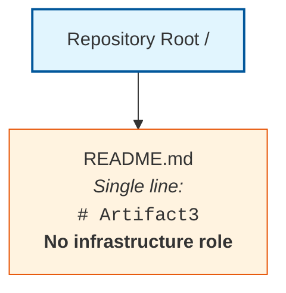

The single `README.md` artifact is documentation only and does not participate in any deployment target, infrastructure-as-code module, container image build, image registry push, orchestrator workload, service-mesh sidecar, ingress route, persistent-volume claim, secret rotation, certificate issuance, CI/CD trigger, build stage, artifact upload, environment promotion, deployment rollout, rollback action, post-deployment probe, release tag, resource-monitoring agent, cost-tag aggregation, security-monitoring signal, or compliance-auditing rule evaluation. No runtime compute environment, container runtime, orchestrator, virtual private cloud, subnet, security group, load balancer, DNS zone, certificate authority, secret store, image registry, artifact repository, CI/CD platform, monitoring backend, log aggregator, alert manager, or compliance reporting facility exists in the repository to host or coordinate infrastructure elements. Accordingly, no infrastructure architecture topology, deployment workflow sequence, environment promotion flow, or network architecture topology can be drawn from the evidence currently available.

### 8.9.3 Deferred Diagram Templates for Future Revisions

When the artifact prerequisites enumerated in Section 8.12 are introduced into the repository, the four deferred diagrams should be drawn against the established Mermaid syntax conventions used elsewhere in this Technical Specification. The diagram families and their producibility preconditions are:

| Diagram Family | Producibility Precondition |
|----------------|-----------------------------|
| Infrastructure Architecture | Terraform/Pulumi/CDK modules; Kubernetes Deployment/Service/Ingress manifests; cloud provider resource declarations; compute/storage/network topology artifacts |
| Deployment Workflow | `.github/workflows/`, `.gitlab-ci.yml`, `Jenkinsfile`, or `azure-pipelines.yml` definitions; build stage declarations; artifact promotion paths; approval gate configurations |
| Environment Promotion | ArgoCD ApplicationSet/Application manifests; Flux Kustomization promotion configurations; Helm chart values per environment; Kustomize overlays; environment-specific configuration files |
| Network Architecture | VPC/subnet declarations; security group rules; CNI configurations (Calico, Cilium, Flannel); DNS topology; load balancer/Ingress controller manifests; service mesh (Istio, Linkerd) configurations |

---

## 8.10 Reference Checklist of Standard Infrastructure Practices

### 8.10.1 Disclosure Constraint

The Section 8 prompt's guard clause instructs the author to "document only the minimal build and distribution requirements" when declaring non-applicability. The binding evidence-based authoring standard articulated in Section 1.4.1 and reaffirmed in Sections 2.1, 3.1, 4.1, 5.1, 6.1.2, 6.2.2, 6.3.2, 6.4.2, 6.5.2, and 6.6.2 precludes prescriptive declarations about future implementations. No source code, package manifests, build descriptors, container files, IaC artifacts, CI/CD configuration, deployment manifests, monitoring agent bindings, or compliance documentation exist in the repository from which any specific build or distribution requirement could be claimed as adopted by this system. Consistent with the deferred-content treatment used in Sections 6.1.6.3, 6.2.7.3, 6.3.6.3, 6.4.7, 6.5.7, and 6.6.9, the enumeration below is provided strictly as a reference checklist of standard infrastructure practice categories that future implementations may consider — not as a declaration that any specific practice has been or will be adopted by this system.

### 8.10.2 Reference Checklist of Standard Infrastructure Practice Categories

The following reference checklist enumerates widely recognized categories of standard infrastructure practice that future contributors may evaluate when the repository is populated with implementation, configuration, or deployment artifacts. Each entry identifies the practice category and the artifact class whose introduction would enable a substantive determination in future revisions of this section.

#### Deployment Environment Practice Categories

| Practice Category | Enabling Artifact Class |
|-------------------|--------------------------|
| Cloud-native deployment | Cloud provider SDK initializations (AWS SDK, GCP SDK, Azure SDK); cloud provider IaC artifacts (Terraform AWS/GCP/Azure provider, CDK, Deployment Manager, ARM/Bicep) |
| On-premises deployment | Bare-metal provisioning scripts; PXE/iPXE configurations; Ansible/Chef/Puppet/Salt configurations targeting on-premises hosts |
| Hybrid / multi-cloud deployment | Multi-cloud abstraction layers; Terraform multi-provider configurations; Crossplane manifests; Anthos/Arc configurations |
| Infrastructure as Code | Terraform `.tf` files; Pulumi programs; AWS CDK constructs; CloudFormation/ARM/Bicep templates; Deployment Manager YAML |

#### Environment Management Practice Categories

| Practice Category | Enabling Artifact Class |
|-------------------|--------------------------|
| Configuration management | Ansible playbooks; Chef cookbooks; Puppet manifests; Salt states; SaltStack pillars |
| Environment promotion | GitOps repositories (ArgoCD, Flux); Helm chart values per-environment; Kustomize overlays; Spinnaker pipeline JSON |
| Secret management | HashiCorp Vault bindings; AWS Secrets Manager/Parameter Store integrations; Sealed Secrets; SOPS-encrypted files; External Secrets Operator |
| Backup and disaster recovery | RPO/RTO declarations; backup automation scripts; Velero/Restic/Borg configurations; cross-region replication configurations |

#### Cloud Services Practice Categories

| Practice Category | Enabling Artifact Class |
|-------------------|--------------------------|
| AWS services | AWS SDK initialization; CloudFormation/CDK/Terraform AWS provider; AWS IAM policies; AWS service bindings (Lambda, ECS, EKS, RDS, S3, etc.) |
| GCP services | GCP SDK initialization; Deployment Manager/Terraform GCP provider; GCP IAM policies; GCP service bindings (GKE, Cloud Run, Cloud SQL, GCS, etc.) |
| Azure services | Azure SDK initialization; ARM/Bicep/Terraform Azure provider; Azure RBAC policies; Azure service bindings (AKS, App Service, Cosmos DB, Blob Storage, etc.) |
| High availability | Multi-AZ/multi-region deployment configurations; load-balancer declarations; cross-region replication configurations; global DNS failover policies |
| Cost optimization | Cost-allocation tags; budget alerts; instance-rightsizing policies; spot/preemptible instance configurations; reserved instance commitments; savings plan declarations |

#### Containerization Practice Categories

| Practice Category | Enabling Artifact Class |
|-------------------|--------------------------|
| Docker / OCI containers | `Dockerfile`, `Containerfile`, `docker-compose.yml`, `.dockerignore` files |
| Container registries | Registry configuration (ECR, GCR, ACR, Harbor, Docker Hub, Quay); image-tagging conventions; registry-replication policies |
| Multi-stage builds | `Dockerfile` with FROM directives for builder/runtime stages; BuildKit features; distroless final stages |
| Base image strategy | Distroless, Alpine, scratch, Debian-slim, UBI base image declarations; image-pinning by digest |
| Image security scanning | Trivy, Snyk Container, Clair, Anchore, Grype configuration files; admission controllers enforcing scan policy (Kyverno, OPA Gatekeeper) |

#### Orchestration Practice Categories

| Practice Category | Enabling Artifact Class |
|-------------------|--------------------------|
| Kubernetes | Kubernetes manifests (Deployment, StatefulSet, DaemonSet, Service, Ingress, ConfigMap, Secret); Helm charts; Kustomize bases |
| Service mesh | Istio/Linkerd/Consul Connect/Cilium Service Mesh configurations; sidecar injection policies; mTLS PeerAuthentication policies |
| Auto-scaling | HPA/VPA YAML; KEDA ScaledObject configurations; Cluster Autoscaler manifests; Karpenter Provisioner configurations |
| Resource quotas | Kubernetes ResourceQuota, LimitRange, PriorityClass objects; namespace declarations; PodDisruptionBudget manifests |
| Storage orchestration | StorageClass, PersistentVolumeClaim manifests; CSI driver configurations; Velero backup schedules |

#### CI/CD Pipeline Practice Categories

| Practice Category | Enabling Artifact Class |
|-------------------|--------------------------|
| Source control triggers | `.github/workflows/*.yml`, `.gitlab-ci.yml`, `Jenkinsfile`, `azure-pipelines.yml`, `bitbucket-pipelines.yml`, CircleCI `config.yml` with push/PR/tag/schedule triggers |
| Build pipelines | Build descriptors (`Makefile`, `build.gradle`, `pom.xml`, `package.json` scripts, `Cargo.toml`); CI build stage definitions |
| Deployment pipelines | ArgoCD Applications; Flux Kustomizations; Spinnaker pipeline JSON; Jenkins deploy stages; AWS CodeDeploy DeploymentGroup configurations |
| Quality gates | SonarQube; Codacy; CodeClimate configurations; branch protection rules; pre-commit hook configurations; required-status-check policies |
| Artifact storage | Nexus/Artifactory/GitHub Packages/JFrog/AWS CodeArtifact; container registries; build artifact uploads with retention policies |
| Progressive delivery | Argo Rollouts manifests; Flagger configurations; Kubernetes Deployment strategy declarations; AWS CodeDeploy traffic-shift policies |

#### Infrastructure Monitoring Practice Categories

| Practice Category | Enabling Artifact Class |
|-------------------|--------------------------|
| Resource monitoring | Cloud provider native monitoring (CloudWatch, Stackdriver/Cloud Monitoring, Azure Monitor); Prometheus node-exporter, cAdvisor, kube-state-metrics |
| Cost monitoring | CloudHealth, Apptio, AWS Cost Explorer dashboard configurations; FinOps tooling; OpenCost/Kubecost configurations; cost allocation tags |
| Security monitoring | AWS Security Hub, GCP Security Command Center, Azure Defender configurations; Falco rules; CSPM tools (Wiz, Prisma Cloud, Lacework) |
| Compliance auditing | AWS Config rules; GCP Policy Library entries; Azure Policy definitions; CIS benchmark scanners; Open Policy Agent constraint templates |
| Maintenance procedures | Operational runbooks; patching schedules; certificate rotation policies; backup verification scripts; failover drill schedules |

### 8.10.3 Application of the Checklist

The checklist in Section 8.10.2 should be interpreted as a forward-looking inventory of practice categories whose adoption status will become determinable once corresponding artifacts are committed to the repository. Until such artifacts exist, no row in any inventory of this section can be transitioned from `*(none)*` to a populated value without violating the evidence-based authoring standard. Reaffirmation of this constraint is provided in Section 8.12.3 below.

---

## 8.11 Resource Sizing, Cost, and External Dependencies Disposition

### 8.11.1 Resource Sizing Guidelines Determinability

The Section 8 prompt requires that resource sizing guidelines be provided. Section 2.5.2 has formally established "No" for Scalability Considerations with the rationale "No deployment, capacity, or scaling artifacts present." Section 6.1.4.1 has formally established "No" for Horizontal/Vertical Scaling Approach, Resource Allocation Strategy, and Capacity Planning Guidelines. No CPU/memory/storage/network sizing baselines, t-shirt size (small/medium/large) profiles, instance-type recommendations, or right-sizing models can be derived from repository evidence.

| Sizing Dimension | Baseline Profile | Burst Profile | Scaling Trigger |
|------------------|-------------------|-----------------|-------------------|
| *(none)* | *(none)* | *(none)* | *Not determinable from repository evidence* |

### 8.11.2 Infrastructure Cost Estimates Determinability

The Section 8 prompt requires that infrastructure cost estimates be provided. Section 1.2.3 has formally established that "No measurable objectives, target metrics, service-level objectives, or quantitative goals are documented in the repository." Section 3.6.1 has formally established the absence of all cloud service bindings from which on-demand, reserved, or savings-plan pricing could be calculated. No usage forecasts, traffic projections, storage growth models, egress estimates, or third-party SaaS subscription declarations exist in the repository. Cost estimates are therefore not determinable from current repository evidence.

| Cost Component | Pricing Model | Monthly Estimate | Annual Estimate |
|----------------|----------------|---------------------|--------------------|
| *(none)* | *(none)* | *(none)* | *Not determinable from repository evidence* |

### 8.11.3 External Dependencies Determinability

The Section 8 prompt requires that all external dependencies be documented. Section 1.2.1 has formally established that "No external system dependencies, third-party services, or inter-system data flows have been declared in the repository." Section 3.6.2 has presented the empty External Service Inventory. Section 3.5 has confirmed the absence of any Open Source Dependencies category. The external dependencies inventory is therefore empty across all dimensions.

| Dependency Category | Provider / Vendor | Service Tier | SLA Commitment |
|---------------------|---------------------|----------------|------------------|
| *(none)* | *(none)* | *(none)* | *Not determinable from repository evidence* |

### 8.11.4 Maintenance Procedures Determinability

The Section 8 prompt's notes call for documentation of maintenance procedures. Section 2.5.2 has formally established "No" for Maintenance Requirements with the rationale "No operational runbooks, lifecycle documentation, or support models." Section 4.5.2 has formally established "No" for Recovery Procedures. No patching schedule, certificate-rotation policy, backup-verification procedure, or operational maintenance window declaration exists in the repository.

| Maintenance Domain | Procedure / Runbook | Cadence | Responsible Role |
|--------------------|----------------------|------------|---------------------|
| *(none)* | *(none)* | *(none)* | *Not determinable from repository evidence* |

---

## 8.12 Anticipated Evolution and Future Population Triggers

### 8.12.1 Artifact-to-Subsection Mapping

Consistent with the future-population mapping patterns established in Sections 1.4, 2.7, 3.9, 4.7, 5.8, 6.1.7.1, 6.2.8.1, 6.3.7.1, 6.4.8.1, 6.5.8.1, and 6.6.10.1, this section will be revised as subsequent contributions populate the repository with the artifacts necessary to derive each Infrastructure sub-topic. The following tables enumerate, by sub-topic area, the artifact categories whose introduction would unlock substantive population.

#### Deployment Environment Triggers

| Sub-Topic | Artifact Category That Would Enable Population |
|-----------|------------------------------------------------|
| Target Environment Assessment | Cloud provider IaC artifacts; deployment topology documents; capacity planning models; region/AZ selection rationale documents |
| Environment Management — IaC | Terraform `.tf` files; Pulumi programs; AWS CDK constructs; CloudFormation/ARM/Bicep templates; Crossplane manifests |
| Environment Management — Configuration | Ansible playbooks; Chef cookbooks; Puppet manifests; Salt states; environment variable templates (`.env.example`) |
| Environment Promotion | ArgoCD ApplicationSet/Application manifests; Flux Kustomizations; Helm chart values per environment; Kustomize overlays |
| Backup and Disaster Recovery | RPO/RTO declarations; Velero/Restic backup configurations; cross-region replication policies; disaster-recovery runbooks |

#### Cloud Services Triggers

| Sub-Topic | Artifact Category That Would Enable Population |
|-----------|------------------------------------------------|
| Cloud Provider Selection | Cloud SDK initializations (AWS, GCP, Azure); provider-specific IaC artifacts; cloud account/subscription metadata |
| Core Services Required | Service binding manifests (Lambda, GKE, AKS, RDS, Cloud SQL, Cosmos DB, S3, GCS, Blob Storage, etc.); SDK client initializations |
| High Availability Design | Multi-AZ/multi-region deployment configurations; load-balancer declarations; cross-region replication configurations; global DNS failover policies |
| Cost Optimization | Cost-allocation tag policies; budget-alert configurations; rightsizing recommendations; reserved instance/savings plan declarations |
| Cloud Security and Compliance | Cloud IAM policies; KMS integrations; AWS Config rules; GCP Policy Library entries; Azure Policy definitions |

#### Containerization Triggers

| Sub-Topic | Artifact Category That Would Enable Population |
|-----------|------------------------------------------------|
| Container Platform | `Dockerfile`, `Containerfile`, `docker-compose.yml`, `.dockerignore` files |
| Base Image Strategy | FROM directive declarations referencing distroless, Alpine, scratch, Debian-slim, or UBI bases |
| Image Versioning | Semantic versioning tag conventions; Git SHA tagging; immutable digest pinning; registry-tag retention policies |
| Build Optimization | Multi-stage `Dockerfile` declarations; BuildKit cache mounts; layer-caching strategies; `.dockerignore` files |
| Image Security Scanning | Trivy, Snyk Container, Clair, Anchore, Grype configurations; admission controller policies (Kyverno, OPA Gatekeeper) |

#### Orchestration Triggers

| Sub-Topic | Artifact Category That Would Enable Population |
|-----------|------------------------------------------------|
| Orchestration Platform | Kubernetes cluster declarations (EKS, GKE, AKS, k3s, kind); Nomad job specifications; ECS Task Definitions; Cloud Run services |
| Cluster Architecture | Control-plane configurations; node-group declarations; CNI selections (Calico, Cilium, Flannel); node-pool autoscaler configurations |
| Service Deployment Strategy | Kubernetes Deployment/StatefulSet/DaemonSet manifests; Argo Rollouts; Flagger configurations; AWS CodeDeploy declarations |
| Auto-Scaling Configuration | HPA/VPA YAML; KEDA ScaledObject configurations; Cluster Autoscaler manifests; Karpenter Provisioner configurations |
| Resource Allocation Policies | Kubernetes ResourceQuota, LimitRange, PriorityClass; PodDisruptionBudget manifests; namespace declarations |

#### CI/CD Pipeline Triggers

| Sub-Topic | Artifact Category That Would Enable Population |
|-----------|------------------------------------------------|
| Source Control Triggers | `.github/workflows/`, `.gitlab-ci.yml`, `Jenkinsfile`, `azure-pipelines.yml`, `bitbucket-pipelines.yml`, CircleCI `config.yml` files |
| Build Environment | Build descriptors (`Makefile`, `build.gradle`, `pom.xml`, `package.json`); CI runner specifications; build container declarations |
| Dependency Management | Package manifests (`package.json`, `requirements.txt`, `go.mod`, `Cargo.toml`, `pom.xml`, `Gemfile`); lockfiles; SBOM artifacts |
| Artifact Generation and Storage | Build output declarations; Nexus/Artifactory/GitHub Packages bindings; container registry push declarations |
| Quality Gates | SonarQube/Codacy/CodeClimate configurations; branch protection rules; pre-commit hook configurations; required status check policies |
| Deployment Strategy | Argo Rollouts manifests; Flagger configurations; Kubernetes Deployment strategy declarations; AWS CodeDeploy DeploymentGroup configurations |
| Environment Promotion Workflow | ArgoCD ApplicationSet/Application manifests; Flux Kustomization configurations; Spinnaker pipeline JSON |
| Rollback Procedures | Automated rollback policies; deployment-revision retention configurations; rollback runbooks |
| Post-Deployment Validation | Smoke test scripts; synthetic probe definitions; deployment-verification scripts; canary analysis configurations |
| Release Management | Release notes templates; changelogs; semantic-release configurations; milestone documents; roadmaps |

#### Infrastructure Monitoring Triggers

| Sub-Topic | Artifact Category That Would Enable Population |
|-----------|------------------------------------------------|
| Resource Monitoring | Cloud provider native monitoring (CloudWatch, Stackdriver, Azure Monitor) configurations; Prometheus node-exporter, cAdvisor, kube-state-metrics |
| Performance Metrics Collection | APM agents; custom metric declarations; RED/USE method dashboards; HTTP middleware timing instrumentation |
| Cost Monitoring and Optimization | CloudHealth, Apptio, AWS Cost Explorer dashboards; OpenCost/Kubecost configurations; cost allocation tag policies |
| Security Monitoring | AWS Security Hub, GCP Security Command Center, Azure Defender configurations; Falco rules; CSPM tool configurations |
| Compliance Auditing | AWS Config rules; GCP Policy Library entries; Azure Policy definitions; CIS benchmark scanner configurations; OPA constraint templates |

#### Required Diagram Triggers

| Diagram | Artifact Category That Would Enable Production |
|---------|------------------------------------------------|
| Infrastructure Architecture | Terraform/Pulumi/CDK modules; Kubernetes manifests; cloud provider resource declarations; compute/storage/network topology artifacts |
| Deployment Workflow | CI/CD platform configuration files; build stage declarations; artifact promotion paths; approval gate configurations |
| Environment Promotion | ArgoCD/Flux GitOps manifests; Helm chart values per environment; Kustomize overlays; environment-specific configuration files |
| Network Architecture | VPC/subnet declarations; security group rules; CNI configurations; DNS topology; load balancer/Ingress controller manifests; service mesh configurations |

### 8.12.2 Future Population Triggers

When any artifact in the tables above is introduced into the repository, this Section 8 should be revisited and populated using the established Determinability Matrix pattern:

1. The relevant Determinability Matrix row in Sections 8.3.1, 8.3.2, 8.4.1, 8.5.1, 8.6.1, 8.7.1, 8.7.2, or 8.8.1 should be updated from "No" to "Yes" with the new authoritative source citation.
2. The Empty Inventory placeholder rows (`*(none)*` markers) in Sections 8.3.3, 8.4.3, 8.5.3, 8.6.3, 8.7.3, 8.8.2, and 8.11 should be replaced with factually grounded entries derived from the introduced artifacts, with each Markdown table preserving the four-column limit prescribed by the Section 8 output format.
3. The Cloud Services Non-Use Declaration in Section 8.4.2, the Containerization Non-Use Declaration in Section 8.5.2, and the Orchestration Non-Use Declaration in Section 8.6.2 should be retracted when corresponding cloud, container, or orchestration artifacts are introduced.
4. The Diagram Producibility Matrix in Section 8.9.1 should be updated to reflect newly producible infrastructure architecture, deployment workflow, environment promotion flow, and network architecture diagrams.
5. New Mermaid diagrams should be drawn using nodes and edges that correspond to compute environments, container images, orchestrator workloads, ingress routes, persistent volumes, secret stores, CI/CD stages, artifact repositories, environment promotion paths, monitoring agents, alert routes, cost-allocation hierarchies, and compliance scopes evidenced in the introduced artifacts, with sizing, cost, RPO/RTO, and SLO annotations sourced directly from the introduced specifications and configuration files.
6. The Applicability Determination in Section 8.1.1 should be revisited; if any of the criteria therein transitions to "Criterion met," the non-applicability finding should be retracted and substantive content should replace this boundary statement.
7. The Reference Checklist of Standard Infrastructure Practices in Section 8.10 should be revised to declare which specific practice categories have been adopted (with citations to the introduced artifacts), and the reference checklist in Section 8.10.2 should be updated to distinguish adopted from non-adopted categories.
8. The Resource Sizing, Cost, and External Dependencies tables in Section 8.11 should be populated with concrete sizing baselines, pricing estimates, and external dependency declarations derived from the introduced artifacts.
9. Section 3.6 (the primary authoritative source for cloud services and third-party services), Section 3.8 (the primary authoritative source for development and deployment), Section 4.5 (the primary authoritative source for error notification flows and recovery procedures), Section 5.6 (the primary authoritative source for cross-cutting observability concerns), Section 6.1.4 / 6.1.5 (the primary authoritative sources for scalability and resilience), Section 6.4 (the primary authoritative source for security), Section 6.5 (the primary authoritative source for monitoring and observability), and Section 6.6 (the primary authoritative source for testing strategy) should be updated in lockstep so that the sections remain consistent across the Technical Specification.

### 8.12.3 Reader Guidance

Readers consulting this section should treat its current form as a faithful reflection of the repository at the time of authoring, consistent with the guidance in Sections 1.4, 2.7, 3.9, 4.7, 5.8, 6.1.7.3, 6.2.8.3, 6.3.7.3, 6.4.8.3, 6.5.8.3, and 6.6.10.3. Entries marked "No," "Not determinable," "None," or `*(none)*` indicate the absence of repository evidence and not a negative scoping decision against any candidate cloud provider, region, availability zone, IaC tool, container runtime, image registry, orchestrator, service mesh, ingress controller, CI/CD platform, artifact repository, deployment strategy, monitoring stack, log aggregator, alert manager, cost optimization control, compliance attestation framework, or disaster-recovery topology. Project owners are encouraged to introduce the corresponding cloud provider IaC artifacts, Terraform/Pulumi/CDK modules, Ansible/Chef/Puppet/Salt configurations, ArgoCD/Flux GitOps manifests, RPO/RTO declarations, `Dockerfile` and `docker-compose.yml` files, image registry bindings, multi-stage build descriptors, image-scanning tool configurations, Kubernetes manifests, Helm charts, Kustomize overlays, HPA/VPA/KEDA configurations, ResourceQuota/LimitRange/PriorityClass objects, CI/CD platform workflow files, build descriptors, dependency manifests, lockfiles, SBOM artifacts, quality gate configurations, deployment strategy declarations, environment promotion configurations, rollback policies, post-deployment validation scripts, release management documents, APM agent bindings, metrics exporters, log shippers, tracing instrumentation, alerting configurations, cost-monitoring dashboards, security-monitoring integrations, and compliance-auditing rule sets into the repository to enable a fully populated Infrastructure section in future revisions of this Technical Specification.

The author also draws explicit attention to two cross-section consistency requirements that any future infrastructure work must observe:

- **Security consistency requirement**: Per the Section 8 prompt's note "Maintain consistency with security requirements," any future infrastructure artifact must be authored in lockstep with the Section 6.4 Security Architecture findings — particularly the Authentication Framework Determinability (6.4.3), Authorization System Determinability (6.4.4), and Data Protection Determinability (6.4.5) matrices, whose non-applicability findings will need to be revisited when IAM policies, KMS integrations, TLS certificate declarations, mTLS configurations, secret-management bindings, or compliance documents are introduced.
- **Monitoring consistency requirement**: Per the Section 8 prompt's note "Specify monitoring requirements," any future infrastructure artifact must be authored in lockstep with the Section 6.5 Monitoring and Observability findings — particularly the Monitoring Infrastructure Determinability (6.5.3), Observability Patterns Determinability (6.5.4), and Incident Response Determinability (6.5.5) matrices, whose non-applicability findings will need to be revisited when APM agent configurations, metrics exporters, log shippers, tracing instrumentation, alert rule files, or operational runbooks are introduced.

---

## 8.13 References

### 8.13.1 Files Examined

- `README.md` — The repository's sole artifact; single-line content `# Artifact3`; confirmed to bear no infrastructure role, declare no cloud provider, hold no IaC module, container manifest, Kubernetes specification, Helm chart, CI/CD workflow, build descriptor, artifact repository binding, deployment strategy declaration, environment promotion configuration, rollback policy, post-deployment validation script, monitoring agent configuration, cost-tag policy, security-monitoring integration, or compliance-auditing rule.

### 8.13.2 Folders Explored

- `/` (repository root, depth 0) — Confirmed to contain exactly one child (`README.md`) and zero subdirectories; provides no `infra/`, `infrastructure/`, `terraform/`, `pulumi/`, `cdk/`, `cloudformation/`, `k8s/`, `kubernetes/`, `helm/`, `kustomize/`, `manifests/`, `deploy/`, `deployment/`, `ci/`, `cicd/`, `.github/`, `.gitlab/`, `pipelines/`, `scripts/`, `ops/`, `operations/`, `monitoring/`, `observability/`, `dashboards/`, `alerts/`, `runbooks/`, or any infrastructure-related substructure.

### 8.13.3 Technical Specification Sections Referenced

- **Section 1.1 Executive Summary** — Established the pre-implementation, documentation-only state of the repository and the project identification as `Artifact3`.
- **Section 1.2 System Overview** — Provided the canonical Repository Contents Inventory and the explicit statements that "No external system dependencies, third-party services, or inter-system data flows have been declared in the repository" (Section 1.2.1) and that "No KPI definitions, metrics catalogs, dashboards, telemetry plans, instrumentation specifications, or measurement frameworks are present" and "No measurable objectives, target metrics, service-level objectives, or quantitative goals are documented in the repository" (Section 1.2.3), directly informing the Geographic Distribution, Resource Requirements, Cost Optimization, and Performance Metrics rows of this Section 8.
- **Section 1.3 Scope** — Established the catalogue of nine confirmed-absent artifact categories (including "Build, CI, or deployment scripts: Absent" and "Infrastructure-as-code definitions: Absent"), which are direct prerequisites for substantive Section 8 content.
- **Section 1.4 Document Status and Specification Boundary** — Established the evidence-based authoring standard and reader-guidance conventions inherited by this Section 8.
- **Section 1.5 References** — Verified 100% repository coverage (1 of 1 files; 1 of 1 folders) at hierarchy depth 0.
- **Section 2.5 Implementation Considerations** — Recorded "No" for Technical Constraints, Performance Requirements, Scalability Considerations, Security Implications, and Maintenance Requirements, directly informing Sections 8.3.1, 8.3.2, 8.11.1, and 8.11.4.
- **Section 2.7 Assumptions, Constraints, and Anticipated Evolution** — Provided the reader guidance and constraint template reused in Section 8.12.3.
- **Section 3.1 Section Authoring Basis and Evidence Constraint** — Formally rejected all sixteen Default Technology Stack components as "Not adopted — no evidence," explicitly including Cloud Platform (AWS), Containerization (Docker), Infrastructure as Code (Terraform), and CI/CD (GitHub Actions), directly informing the Applicability Determination in Section 8.1.1 and the Cloud Services Non-Use, Containerization Non-Use, and CI/CD Pipeline determinations.
- **Section 3.2 Technology Stack Determinability Status** — Provided the canonical Repository Topology Diagram reproduced in Section 8.9.2.
- **Section 3.5 Open Source Dependencies** — Confirmed the absence of any package manifest, lockfile, or SBOM artifact, directly informing the Dependency Management row in Section 8.7.1.
- **Section 3.6 Third-Party Services** — Confirmed the absence of Cloud Services, Monitoring Tools, Authentication Services, and Email/Notification Services with the rationale "No APM agents, logging shippers, metrics exporters, or observability configurations present" and "No cloud SDK initializations, IAM policies, or service bindings," directly informing Sections 8.4.1 and 8.11.3.
- **Section 3.8 Development and Deployment** — **PRIMARY authoritative source for infrastructure**: established the absence of Development Tools, Build System, Containerization, CI/CD Pipelines, Infrastructure as Code, Deployment Environments, Version Control Conventions, Pre-commit / Quality Gates, and Local Development Bootstrapping, directly informing every Determinability Matrix in Sections 8.3 through 8.8.
- **Section 3.9 Anticipated Evolution and Future Population Triggers** — Provided the artifact-to-subsection mapping template reused in Section 8.12.1.
- **Section 4.4 Flowchart Requirements Determinability** — Recorded "No" for Authorization Checkpoints, Data Validation Requirements, and Regulatory Compliance Checks, directly informing the Compliance Requirements row in Section 8.3.1 and the Compliance Auditing row in Section 8.8.1.
- **Section 4.5 Technical Implementation Determinability** — Recorded "No" for Error Notification Flows ("No alerting configurations, paging integrations, or monitoring service bindings") and Recovery Procedures ("No operational runbooks, disaster-recovery documentation, or incident-response playbooks"), directly informing the Backup and Disaster Recovery row in Section 8.3.2, the Rollback Procedures row in Section 8.7.2, and the Maintenance Procedures table in Section 8.11.4.
- **Section 4.7 Anticipated Evolution and Future Population Triggers** — Provided the future-population trigger template reused in Section 8.12.2.
- **Section 5.2 System Architecture Determinability Status** — Provided the canonical Repository Topology Diagram pattern reproduced in Section 8.9.2.
- **Section 5.3 High-Level Architecture Determinability** — Provided the Empty Inventory pattern reused in Sections 8.3.3, 8.4.3, 8.5.3, 8.6.3, 8.7.3, and 8.8.2.
- **Section 5.6 Cross-Cutting Concerns Determinability** — Recorded "No" for Monitoring and Observability, Logging and Tracing Strategy, Performance Requirements and SLAs, and Disaster Recovery Procedures, directly informing Sections 8.3.2, 8.4.1, and 8.8.1.
- **Section 5.7 Required Diagrams Determinability** — Established the Mermaid Diagram Producibility precedent reused in Section 8.9.1.
- **Section 5.8 Anticipated Evolution and Future Population Triggers** — Provided the artifact-to-subsection mapping template reused in Section 8.12.1.
- **Section 6.1 Core Services Architecture** — **First critical structural precedent**: established the complete template for handling non-applicability determinations including Applicability Statement, Authoring Basis, Determinability Matrices, Empty Inventories, Diagram Producibility Matrix, Canonical Repository Topology Diagram, Anticipated Evolution Mapping, and References sub-structure. Sections 6.1.4.1 and 6.1.5.1 specifically recorded "No" for Horizontal/Vertical Scaling Approach, Auto-Scaling Triggers and Rules, Resource Allocation Strategy, Performance Optimization Techniques, Capacity Planning Guidelines, Fault Tolerance Mechanisms, Disaster Recovery Procedures, Data Redundancy Approach, Failover Configurations, and Service Degradation Policies, directly corroborating the Section 8 non-applicability finding and informing the Resource Requirements, Resource Allocation, Auto-Scaling, and High Availability rows.
- **Section 6.4 Security Architecture** — Provided the canonical guard-clause pattern with the "reference checklist of standard practices" disclosure reused in Section 8.10. Section 6.4.5.1 specifically recorded "No" for Encryption Standards, Key Management, Secure Communication, and Compliance Controls, directly informing the Compliance Requirements row in Section 8.3.1 and the Security Monitoring/Compliance Auditing rows in Section 8.8.1. Section 6.4.6.1 specifically recorded "No" for the Security Zone Diagram, directly informing the Network Architecture diagram disposition in Section 8.9.1.
- **Section 6.5 Monitoring and Observability** — **Most directly adjacent structural precedent**: provided the multi-matrix, multi-inventory pattern reused throughout this Section 8 and recorded "No" for every Monitoring Infrastructure, Observability Patterns, and Incident Response sub-topic, directly informing every row of Section 8.8.1.
- **Section 6.6 Testing Strategy** — Reaffirmed the non-applicability pattern with build and CI dependencies and provided the Quality Gates row context reused in Section 8.7.1.

# 9. Appendices

## 9.1 Section Authoring Basis and Evidence Constraint

### 9.1.1 Applicability Statement

This Appendices section is authored against the binding evidence-based authoring standard established in Section 1.4.1 and reaffirmed across Sections 2.1, 3.1, 4.1, 5.1, 6.1.2, 6.2.2, 6.3.2, 6.4.2, 6.5.2, 6.6.2, 7.2, and 8.2. The repository under documentation contains exactly one artifact (`README.md`) whose sole content is the single line `# Artifact3`, and no source code, package manifests, build descriptors, container files, IaC artifacts, CI/CD configuration, deployment manifests, monitoring agent bindings, compliance documentation, or other technical artifacts. Accordingly, the supplementary technical information that this Appendices section can substantively contribute is limited to:

1. **Consolidation of conventions** that are already documented across the preceding sections and that benefit from being indexed in one place for the reader.
2. **Glossary entries** for terms that are actually used in the preceding sections of this Technical Specification.
3. **Acronym expansions** for acronyms that are actually used in the preceding sections of this Technical Specification.

The Appendices section explicitly does **not** introduce new technical claims, prescriptive declarations, candidate technologies, candidate cloud providers, candidate frameworks, or any other content that is not already supported by repository evidence or previously documented in Sections 1 through 8. Doing so would constitute a violation of the binding evidence-based authoring standard.

### 9.1.2 Authoring Basis

The Appendices section is composed by aggregating terms and acronyms that have appeared in Sections 1 through 8 of this Technical Specification. Every glossary entry and every acronym entry in this section has a corresponding usage in at least one preceding section. No definition is fabricated; no acronym is invented; no term is introduced that does not already appear in the preceding sections. The reader-guidance conventions and forward-looking patterns established in Sections 1.4.3, 2.7, 3.9, 4.7, 5.8, 6.1.7.3, 6.2.8.3, 6.3.7.3, 6.4.8.3, 6.5.8.3, 6.6.10.3, 7.5, and 8.12.3 are reaffirmed below.

### 9.1.3 Appendices Determinability Matrix

The standard appendices content prescribed by the Section 9 prompt is enumerated below alongside its determinability against current repository evidence:

| Appendix Sub-Topic | Determinable | Authoritative Source |
|---|---|---|
| Additional Technical Information not captured elsewhere | Partial — consolidation only | Sections 1.2.2, 1.3, 1.4, and the canonical conventions reproduced across 11+ sections |
| Glossary of terms used in this document | Yes — limited to terms actually used | Aggregated across Sections 1 through 8 |
| Acronym expansions used in this document | Yes — limited to acronyms actually used | Aggregated across Sections 1 through 8 |
| Cross-Reference Index of canonical artifacts and patterns | Yes — limited to patterns actually established | Sections 1.2.2, 1.3.2, 1.4.1, 3.1.3, 5.7, 6.1.2, 8.10, and others |

---

## 9.2 Additional Technical Information

### 9.2.1 Consolidated Repository Inventory

The single artifact and the single folder evidenced by the repository, as established in Section 1.2.2 and Section 1.5, are reproduced here for ease of reference:

| Path | Type | Content | Role |
|---|---|---|---|
| `/` | Folder | One child; zero subdirectories | Repository root (depth 0) |
| `README.md` | File | Single line: `# Artifact3` | Documentation only |

### 9.2.2 Canonical Repository Topology Diagram

The canonical Repository Topology Diagram is reproduced across Sections 1.2.2, 2.4.3, 3.2.3, 4.2.3, 5.2.3, 6.1.6.2, 6.2.7.2, 6.3.6.2, 6.4.6.2, 6.5.6.2, 6.6.8.2, and 8.9.2. It is reproduced here as the single Mermaid diagram producible against current evidence:

### 9.2.3 Confirmed-Absent Artifact Categories

The catalog of nine confirmed-absent artifact categories established in Section 1.3.2 is reproduced here as the canonical scope-absence inventory referenced throughout this Technical Specification:

| # | Artifact Category | Status |
|---|---|---|
| 1 | Source code | Absent |
| 2 | Package / dependency manifests | Absent |
| 3 | Configuration files | Absent |
| 4 | Build, CI, or deployment scripts | Absent |
| 5 | Test suites or test fixtures | Absent |
| 6 | Database schemas or migrations | Absent |
| 7 | Frontend assets or templates | Absent |
| 8 | Infrastructure-as-code definitions | Absent |
| 9 | Architectural or design documentation | Absent |

### 9.2.4 Sixteen Default Technology Stack Components Formally Rejected

Per Section 3.1.3, every component of the Default Technology Stack was formally rejected as "Not adopted — no evidence" — a finding which is the most-cited authority across this Technical Specification. The sixteen rejected components are tabulated below:

| Stack Layer | Component | Section 3.1.3 Disposition |
|---|---|---|
| Cloud / Infrastructure | AWS | Not adopted — no evidence |
| Containerization | Docker | Not adopted — no evidence |
| Infrastructure as Code | Terraform | Not adopted — no evidence |
| CI/CD | GitHub Actions | Not adopted — no evidence |
| Backend Language | Python | Not adopted — no evidence |
| Backend Framework | Flask | Not adopted — no evidence |
| Authentication | Auth0 | Not adopted — no evidence |
| Database | MongoDB | Not adopted — no evidence |
| AI / Orchestration | Langchain | Not adopted — no evidence |
| Frontend Framework | React with TypeScript | Not adopted — no evidence |
| Frontend Styling | TailwindCSS | Not adopted — no evidence |
| Mobile (cross-platform) | React-Native | Not adopted — no evidence |
| Mobile (iOS) | Swift | Not adopted — no evidence |
| Mobile (Android) | Kotlin | Not adopted — no evidence |
| Mobile (legacy macOS) | Objective-C | Not adopted — no evidence |
| Desktop | ElectronJS | Not adopted — no evidence |

### 9.2.5 Document Conventions Established in Sections 1–8

The following conventions, established in earlier sections, govern the entire Technical Specification and are restated here for reader convenience:

| # | Convention | First Established In |
|---|---|---|
| 1 | Evidence-based authoring standard with disclosure-over-conjecture principle | Section 1.4.1 |
| 2 | Determinability Matrix pattern (Element / Determinable / Authoritative Source) | Section 3.2 |
| 3 | Empty Inventory pattern with `*(none)*` placeholders | Section 2.2, generalized in Section 6.1 |
| 4 | Cross-Reference Summary pattern | Section 6.1.8 |
| 5 | Diagram Producibility Matrix pattern | Sections 4.6.1, 5.7.1 |
| 6 | Reference Checklist of Standard Practices pattern | Sections 6.4.7, 6.5.7, 8.10 |
| 7 | Anticipated Evolution and Future Population Triggers pattern | Sections 1.4, 2.7, 3.9 |
| 8 | Files Examined / Folders Explored / Sections Referenced / Repository Coverage subdivisions | Section 1.5 |
| 9 | Canonical Repository Topology Diagram reused as the only valid Mermaid diagram | Section 1.2.2 |
| 10 | Four-column Markdown table limit | Section authoring prompts (1, 2, 3, 4, 5, 6, 7, 8) |

### 9.2.6 No Additional Technical Information Beyond Consolidation

Beyond the consolidations enumerated in Sections 9.2.1 through 9.2.5, no additional technical information that has not already been captured in Sections 1 through 8 is determinable from the repository's current state. Any introduction of further technical content in this Appendices section without supporting repository evidence or supporting prior-section citation would violate the binding evidence-based authoring standard articulated in Section 1.4.1.

---

## 9.3 Glossary

### 9.3.1 Glossary Authoring Constraint

This glossary contains definitions only for terms that are actually used in Sections 1 through 8 of this Technical Specification. Terms not used in the preceding sections are deliberately omitted. The definitions provided are general, industry-standard meanings of the terms as they are used in this Technical Specification; they are not assertions that any feature, capability, or implementation associated with the term exists in the repository.

### 9.3.2 Project and Document Terms

| Term | Definition |
|---|---|
| Artifact3 | The project name as evidenced by the single first-level heading in `README.md`; per Section 1.1, the only repository-evidenced identifier for this system. |
| Repository | The single folder (depth 0) containing `README.md` and zero subdirectories, as inventoried in Section 1.2.2. |
| Pre-implementation, documentation-only state | The condition described in Section 1.1 in which the repository contains only documentation (`README.md`) and no source code, configuration, manifests, or other implementation artifacts. |
| Evidence-based authoring standard | The binding principle articulated in Section 1.4.1 that every claim in this Technical Specification must be supported by repository evidence; absences are disclosed rather than supplied by conjecture. |
| Disclosure-over-conjecture principle | The reader-guidance principle introduced in Section 1.4.1 directing that gaps be disclosed rather than filled by inference, candidate technology, or default-stack assumption. |
| Determinability | The property recorded in matrices throughout Sections 3–8 indicating whether a sub-topic can be substantively populated from repository evidence (Yes/No/Partial). |
| Determinability Matrix | The 3-column or 4-column table pattern, established in Section 3.2, listing each prescribed sub-topic alongside its determinability status and authoritative source. |
| Empty Inventory | The placeholder pattern, established in Section 2.2 and generalized in Section 6.1, in which inventory tables retain their column structure but populate rows with `*(none)*` markers to indicate no qualifying entries exist in the repository. |
| Empty Inventory placeholder `*(none)*` | The literal Markdown placeholder string used as the row value in Empty Inventory tables to indicate the absence of a qualifying entry. |
| Repository Topology Diagram | The Mermaid `graph TD` diagram introduced in Section 1.2.2 depicting the repository as `Root → README.md`; reproduced across at least 10 sections as the only valid Mermaid diagram producible against current evidence. |
| Reference Checklist of Standard Practices | The forward-looking enumeration pattern, established in Sections 6.4.7, 6.5.7, and 8.10, providing categories of widely recognized practice that future implementations may consider without claiming adoption. |
| Anticipated Evolution | The forward-looking section, present in Sections 1.4, 2.7, 3.9, 4.7, 5.8, 6.1.7, 6.2.8, 6.3.7, 6.4.8, 6.5.8, 6.6.10, 7.5, and 8.12, that maps artifact introductions to subsections that would become populatable in future revisions. |
| Future Population Trigger | The artifact category whose introduction into the repository would enable substantive population of a specific subsection in future revisions of this Technical Specification. |
| Default Technology Stack | The set of sixteen candidate technology components enumerated and formally rejected in Section 3.1.3 as "Not adopted — no evidence." |
| Non-Use Declaration | The formal statement, established in Sections 8.4.2 (Cloud Services), 8.5.2 (Containerization), and 8.6.2 (Orchestration), recording that a specific infrastructure capability is not present in the system. |
| Boundary Statement | A subsection that records the limit of substantive determinability for an area, while preserving structural symmetry with the prescribed section format. |
| Greenfield initiative | A new project undertaken without constraints from prior work; referenced in Section 1.2.1 as one of several possibilities that cannot be determined from repository evidence. |

### 9.3.3 Engineering Discipline Terms (Used in Sections 1–8)

| Term | Definition |
|---|---|
| Authentication | The process of verifying the identity of a user, service, or device; referenced in Sections 5.6 and 6.4 as "Not determinable." |
| Authorization | The process of determining what actions an authenticated principal is permitted to perform; referenced in Section 6.4 as "Not determinable." |
| Audit Logging | The practice of recording security-relevant events for later review; referenced in Section 6.4.4.1 as "Not determinable." |
| Auto-Scaling | The automatic adjustment of compute or service capacity in response to load; referenced in Sections 6.1.4 and 8.6 as "Not determinable." |
| Backup | The creation of recoverable copies of data; referenced in Section 8.3.2 as "Not determinable." |
| Blue-Green Deployment | A deployment strategy in which two production-like environments alternate to serve traffic; referenced in Section 8.7.2 as "Not determinable." |
| Canary Deployment | A progressive-delivery strategy in which a new release is exposed to a small subset of traffic before broader rollout; referenced in Sections 8.7.2 and 8.10.2 as "Not determinable." |
| Capacity Planning | The discipline of forecasting and provisioning sufficient compute, storage, and network resources; referenced in Sections 6.1.4.1 and 8.11.1 as "Not determinable." |
| Compliance Controls | The technical and procedural mechanisms that satisfy regulatory or contractual obligations; referenced in Sections 6.4.5.1 and 8.8.1 as "Not determinable." |
| Configuration Management | The discipline of declaratively defining and applying system configuration; referenced in Section 8.10.2 as a reference checklist category. |
| Containerization | The packaging of an application together with its runtime dependencies into a container image; referenced in Sections 3.1.3 and 8.5 as "Not adopted — no evidence." |
| Cross-Cutting Concerns | Aspects of a system that span multiple components (e.g., logging, security, monitoring); referenced in Section 5.6 as "Not determinable." |
| Dead-Letter Queue | A queue that receives messages a primary consumer cannot process; referenced in Section 6.3 as part of standard message-processing practice. |
| Disaster Recovery | The set of procedures and capabilities that restore service after a major outage; referenced in Sections 5.6 and 8.3.2 as "Not determinable." |
| Failover | The automated transition from a failed component to a healthy replica; referenced in Sections 6.1.5.1 and 8.4.1 as "Not determinable." |
| Fault Tolerance | The ability of a system to continue operating despite component failures; referenced in Section 6.1.5.1 as "Not determinable." |
| GitOps | A deployment pattern in which a Git repository is the source of truth for environment state; referenced in Sections 8.7.2, 8.10.2, and 8.12 as reference-checklist context. |
| Health Check | An endpoint or probe used to determine whether a service is operating correctly; referenced in Section 6.5.4.1 as "Not determinable." |
| High Availability | An operational property indicating that a system continues to operate during component failures; referenced in Sections 8.4.1 and 8.10.2 as "Not determinable." |
| Horizontal Scaling | Adding more instances of a workload to increase capacity; referenced in Section 6.1.4.1 as "Not determinable." |
| Identity Provider | A system that authenticates principals and issues authentication assertions; referenced in Sections 3.6.1 and 6.4 as "Not determinable." |
| Infrastructure as Code | The practice of declaratively defining infrastructure in version-controlled files; referenced in Sections 3.1.3 and 8.10.2 as "Not adopted — no evidence." |
| Ingress | The Kubernetes resource exposing HTTP/HTTPS routes to in-cluster services; referenced in Sections 8.9.1 and 8.10.2 as part of orchestration reference-checklist categories. |
| Key Management | The lifecycle handling of cryptographic keys (generation, rotation, storage, destruction); referenced in Section 6.4.5.1 as "Not determinable." |
| Lockfile | A dependency-manifest companion file that pins exact resolved versions; referenced in Sections 3.5 and 8.7.1 as "absent." |
| Maintenance Window | A scheduled time during which planned operational changes occur; referenced in Sections 2.5.2 and 8.11.4 as "Not determinable." |
| Message Broker | A middleware system that mediates asynchronous message exchange; referenced in Section 6.3 as "Not determinable." |
| Monitoring | The collection, storage, and analysis of operational telemetry; referenced in Sections 3.6.1, 6.5, and 8.8 as "Not determinable." |
| Observability | The property of a system that operational state can be inferred from its outputs (metrics, logs, traces); referenced in Section 6.5 as "Not determinable." |
| Orchestration | The coordination of container workloads across compute resources; referenced in Section 8.6 as the basis for the formal Non-Use Declaration. |
| Performance Metrics | Numeric indicators of system behavior (latency, throughput, error rate); referenced in Sections 1.2.3 and 6.5.4.1 as "Not determinable." |
| Progressive Delivery | A family of deployment strategies (canary, blue-green, traffic-shifting) that incrementally expose changes; referenced in Section 8.10.2 as reference-checklist context. |
| Quality Gate | A pass/fail check applied at a defined stage of a CI/CD pipeline; referenced in Section 8.7.1 as "Not determinable." |
| Rollback | The reversion of a deployment to a prior known-good state; referenced in Section 8.7.2 as "Not determinable." |
| Rolling Deployment | A deployment strategy in which instances are replaced in batches; referenced in Section 8.7.2 as "Not determinable." |
| Runbook | A documented procedure for an operational task or incident response; referenced in Sections 4.5.2 and 8.11.4 as "absent." |
| Sandbox / Staging / Production | Deployment environment labels referenced in Sections 8.3, 8.7.2, and 8.12 in the context of environment promotion. |
| Scalability | The capacity of a system to handle increased load through resource changes; referenced in Sections 2.5.2 and 6.1.4 as "Not determinable." |
| Secret Management | The lifecycle handling of sensitive configuration values (credentials, tokens, certificates); referenced in Section 8.10.2 as reference-checklist context. |
| Service Level Agreement | A contractual specification of operational guarantees between a provider and a consumer; referenced in Section 5.6 as "Not determinable." |
| Service Mesh | A dedicated infrastructure layer for service-to-service communication; referenced in Sections 8.9.1 and 8.10.2 as reference-checklist context. |
| Software Bill of Materials | A formal inventory of components contained in a software artifact; referenced in Sections 3.5 and 8.7.1 as "absent" (no `SBOM`, CycloneDX, or SPDX artifacts present). |
| Source Control Trigger | An event in a version-control system (push, pull request, tag, schedule) that initiates a pipeline; referenced in Sections 8.7.1 and 8.10.2 as "Not determinable." |
| Telemetry | The collected output of an instrumented system (metrics, logs, traces, events); referenced in Section 1.2.3 as "Not determinable." |
| Testing Strategy | The plan describing the kinds, scopes, and coverage of tests; referenced in Section 6.6 as "Not determinable." |
| Vertical Scaling | Increasing the capacity of an instance by allocating more compute or memory; referenced in Section 6.1.4.1 as "Not determinable." |

---

## 9.4 Acronyms

### 9.4.1 Acronym Authoring Constraint

This acronyms appendix contains expansions only for acronyms that are actually used in Sections 1 through 8 of this Technical Specification. Acronyms not used in the preceding sections are deliberately omitted. The expansions are the canonical industry-standard expansions; the inclusion of an acronym here is not a claim that any feature, technology, or capability associated with the acronym is present in the repository.

### 9.4.2 Standards, Compliance, and Documentation Acronyms

| Acronym | Expansion | First Used In |
|---|---|---|
| ADR | Architecture Decision Record | Section 5.7 |
| BAA | Business Associate Agreement | Section 6.4 |
| BPMN | Business Process Model and Notation | Section 4 |
| BRD | Business Requirements Document | Section 2 |
| CCPA | California Consumer Privacy Act | Section 6.4 |
| CIS | Center for Internet Security | Sections 6.4, 8.8, 8.10 |
| DPIA | Data Protection Impact Assessment | Section 6.4.5.1 |
| DSAR | Data Subject Access Request | Section 6.4 |
| GDPR | General Data Protection Regulation | Section 6.4 |
| HIPAA | Health Insurance Portability and Accountability Act | Section 6.4.5.1 |
| ISO | International Organization for Standardization | Section 6.4.5.1 |
| KPI | Key Performance Indicator | Sections 1.2.3, 6.5 |
| MADR | Markdown Architecture Decision Records | Section 5.7 |
| OWASP | Open Web Application Security Project | Section 6.4 |
| PCI-DSS | Payment Card Industry Data Security Standard | Section 6.4.5.1 |
| PII | Personally Identifiable Information | Section 6.4 |
| PRD | Product Requirements Document | Section 2 |
| RCA | Root Cause Analysis | Section 6.5 |
| RFC | Request for Comments | Sections 1.5, 6.3 |
| RPO | Recovery Point Objective | Sections 8.3.2, 8.10, 8.12 |
| RTO | Recovery Time Objective | Sections 8.3.2, 8.10, 8.12 |
| SLA | Service Level Agreement | Sections 5.6, 8.11.3 |
| SLI | Service Level Indicator | Section 6.5 |
| SLO | Service Level Objective | Sections 1.2.3, 6.5 |
| SOC 2 | System and Organization Controls 2 | Section 6.4.5.1 |
| SPDX | Software Package Data Exchange | Sections 3.5, 8.7.1 |

### 9.4.3 Authentication, Authorization, and Security Acronyms

| Acronym | Expansion | First Used In |
|---|---|---|
| ABAC | Attribute-Based Access Control | Section 6.4 |
| ACL | Access Control List | Section 6.4 |
| CSP | Content Security Policy | Section 6.4 |
| CSPM | Cloud Security Posture Management | Sections 8.8.1, 8.10.2 |
| CSRF | Cross-Site Request Forgery | Section 6.4 |
| DAST | Dynamic Application Security Testing | Section 6.4 |
| DMZ | Demilitarized Zone | Section 6.4.6.1 |
| FIDO2 | Fast IDentity Online 2 | Section 6.4 |
| HSTS | HTTP Strict Transport Security | Section 6.4 |
| IAM | Identity and Access Management | Sections 3.6.1, 8.4 |
| JWT | JSON Web Token | Section 6.4 |
| KMS | Key Management Service | Sections 6.4, 8.4 |
| LDAP | Lightweight Directory Access Protocol | Section 6.4 |
| MFA | Multi-Factor Authentication | Section 6.4 |
| mTLS | Mutual Transport Layer Security | Section 6.4 |
| OAuth | Open Authorization | Sections 3.6.1, 6.4 |
| OIDC | OpenID Connect | Sections 3.6.1, 6.4 |
| OPA | Open Policy Agent | Sections 6.4, 8.5.1, 8.10.2 |
| OTP | One-Time Password | Section 6.4 |
| RBAC | Role-Based Access Control | Section 6.4 |
| SAML | Security Assertion Markup Language | Section 6.4 |
| SAST | Static Application Security Testing | Section 6.4 |
| SCA | Software Composition Analysis | Section 6.4 |
| SIEM | Security Information and Event Management | Section 8.8.1 |
| SSE | Server-Side Encryption | Section 6.4 |
| SSO | Single Sign-On | Section 6.4 |
| TDE | Transparent Data Encryption | Section 6.2 |
| TLS | Transport Layer Security | Sections 6.4, 8.12 |
| TOTP | Time-based One-Time Password | Section 6.4 |
| VPC | Virtual Private Cloud | Sections 6.4.6.1, 8.9.1, 8.12 |
| WAF | Web Application Firewall | Section 6.4 |
| WebAuthn | Web Authentication | Section 6.4 |
| XSS | Cross-Site Scripting | Section 6.4 |

### 9.4.4 Architecture, Engineering, and Operations Acronyms

| Acronym | Expansion | First Used In |
|---|---|---|
| API | Application Programming Interface | Sections 3.6, 6.3 |
| APM | Application Performance Monitoring | Sections 3.6.1, 6.5, 8.8.1 |
| ARM | Azure Resource Manager | Sections 8.5.1, 8.9.1, 8.10.2 |
| AsyncAPI | Asynchronous API specification | Section 6.3 |
| CDK | Cloud Development Kit | Sections 8.5.1, 8.9.1, 8.10.2 |
| CDN | Content Delivery Network | Section 6.1 |
| CD | Continuous Delivery / Continuous Deployment | Sections 3.1.3, 8.7 |
| CI | Continuous Integration | Sections 1.3.2, 3.1.3, 8.7 |
| CI/CD | Continuous Integration / Continuous Delivery | Sections 3.1.3, 8.7 |
| CNI | Container Network Interface | Sections 8.6.1, 8.9.1, 8.10.2, 8.12 |
| CQRS | Command Query Responsibility Segregation | Section 6.2 |
| CRUD | Create, Read, Update, Delete | Section 6.3 |
| CSI | Container Storage Interface | Section 8.10.2 |
| DAG | Directed Acyclic Graph | Section 4 |
| DDL | Data Definition Language | Section 6.2 |
| DLQ | Dead-Letter Queue | Section 6.3 |
| DNS | Domain Name System | Sections 8.4.1, 8.9.1, 8.10.2 |
| E2E | End-to-End | Section 6.6 |
| ECS | Elastic Container Service | Sections 8.6.1, 8.10.2, 8.12 |
| EKS | Elastic Kubernetes Service | Sections 8.10.2, 8.12 |
| ELK | Elasticsearch, Logstash, Kibana | Section 6.5 |
| ERD | Entity Relationship Diagram | Section 6.2 |
| ETL | Extract, Transform, Load | Section 6.2 |
| GCS | Google Cloud Storage | Sections 8.10.2, 8.12 |
| gRPC | Google Remote Procedure Call | Section 6.3 |
| HPA | Horizontal Pod Autoscaler | Sections 6.1.4.1, 8.6.1, 8.10.2, 8.12 |
| HTTP | Hypertext Transfer Protocol | Sections 6.3, 8.8.1, 8.9.1 |
| IaC | Infrastructure as Code | Sections 3.1.3, 8.4.2, 8.10.2 |
| IDP | Identity Provider | Section 6.4 |
| KEDA | Kubernetes Event-Driven Autoscaling | Sections 6.1.4.1, 8.6.1, 8.10.2, 8.12 |
| OCI | Open Container Initiative | Sections 3.8.1, 8.5.1, 8.10.2 |
| ORM | Object-Relational Mapping | Section 6.2 |
| RED | Rate, Errors, Duration (monitoring method) | Sections 6.5, 8.8.1 |
| REST | Representational State Transfer | Section 6.3 |
| SaaS | Software as a Service | Section 8.11.2 |
| SBOM | Software Bill of Materials | Sections 3.5, 8.7.1, 8.12 |
| SDK | Software Development Kit | Sections 3.6.1, 8.4, 8.10.2 |
| SMS | Short Message Service | Section 3.6 |
| SPA | Single Page Application | Section 7 |
| SQS | Simple Queue Service | Section 6.3 |
| SRE | Site Reliability Engineering | Section 6.5 |
| TDD | Test-Driven Development | Section 6.6 |
| TTL | Time-To-Live | Section 6.1 |
| UBI | Universal Base Image | Sections 8.5.1, 8.10.2 |
| UI | User Interface | Section 7 |
| USE | Utilization, Saturation, Errors (monitoring method) | Sections 6.5, 8.8.1 |
| UX | User Experience | Section 7 |
| VPA | Vertical Pod Autoscaler | Sections 6.1.4.1, 8.6.1, 8.10.2, 8.12 |
| YAML | YAML Ain't Markup Language | Sections 3.8.1, 8.7 |

### 9.4.5 Project Name Disposition

The project name as evidenced by `README.md` is "Artifact3." This identifier is not an acronym and is not expanded; per Section 1.1, no etymology, derivation, or expansion of this name is documented in the repository.

---

## 9.5 Cross-Reference Index

### 9.5.1 Canonical Patterns and Their Anchor Sections

The following table indexes the canonical patterns established and reused across this Technical Specification. Each pattern's anchor section is the authoritative source; subsequent reproductions are noted where applicable.

| Canonical Pattern | Anchor Section | Reproduction Locations |
|---|---|---|
| Evidence-based authoring standard | Section 1.4.1 | Reaffirmed in Sections 2.1, 3.1, 4.1, 5.1, 6.1.2, 6.2.2, 6.3.2, 6.4.2, 6.5.2, 6.6.2, 7.2, 8.2, 9.1.1 |
| Confirmed-absent artifact categories (nine entries) | Section 1.3.2 | Cited in all Section 6.x non-applicability declarations and Section 8 |
| Default Technology Stack rejection (sixteen entries) | Section 3.1.3 | Cited in Sections 3.2–3.8, 5, 6, 7, 8 |
| Canonical Repository Topology Diagram | Section 1.2.2 | Reproduced in Sections 2.4.3, 3.2.3, 4.2.3, 5.2.3, 6.1.6.2, 6.2.7.2, 6.3.6.2, 6.4.6.2, 6.5.6.2, 6.6.8.2, 8.9.2, 9.2.2 |
| Determinability Matrix template | Section 3.2 | Reused in Sections 3.3–3.8, 4.3–4.6, 5.3–5.7, 6.1–6.6, 7.3, 8.3–8.8 |
| Empty Inventory pattern | Section 2.2 (initial), Section 6.1 (generalized) | Reused in 60+ tables across Sections 2, 3, 4, 5, 6, 7, 8 |
| Reference Checklist of Standard Practices | Sections 6.4.7, 6.5.7, 8.10 | Reused across Sections 6.1, 6.2, 6.3, 6.4, 6.5, 6.6, 8.10 |
| Anticipated Evolution and Future Population Triggers | Section 1.4 | Reused in Sections 2.7, 3.9, 4.7, 5.8, 6.1.7, 6.2.8, 6.3.7, 6.4.8, 6.5.8, 6.6.10, 7.5, 8.12, 9.7 |
| Cross-Reference Summary table pattern | Section 6.1.8 | Reused in Sections 6.2, 6.3, 6.4, 6.5, 6.6, 8.4.4, 8.5.4, 8.6.4, 8.7.4, 8.8.3 |
| Diagram Producibility Matrix pattern | Sections 4.6.1, 5.7.1 | Reused in Sections 6.1.6.1, 6.2.7.1, 6.3.6.1, 6.4.6.1, 6.5.6.1, 6.6.8.1, 8.9.1 |
| Files Examined / Folders Explored / Sections Referenced / Repository Coverage subdivisions | Section 1.5 | Reused in Sections 2.8, 3.10, 4.8, 5.9, 6.1.8, 6.2.9, 6.3.8, 6.4.9, 6.5.9, 6.6.11, 7.6, 8.13, 9.6 |
| `*(none)*` literal placeholder | Section 2.2 | Used in all Empty Inventory tables |
| Four-column Markdown table limit | All section authoring prompts | Honored throughout |

### 9.5.2 Primary Authoritative Sources by Topic

The following table identifies the primary authoritative source within this Technical Specification for each of the major topic areas, as established by the cross-reference patterns above. This index is intended to assist future readers and contributors in locating the canonical statement on each topic.

| Topic Area | Primary Authoritative Source |
|---|---|
| Project identity and repository state | Section 1.1, Section 1.2.2 |
| Scope and confirmed-absent artifact categories | Section 1.3.2 |
| Evidence-based authoring standard | Section 1.4.1 |
| Feature catalog and product requirements | Section 2.2 |
| Technology stack non-adoption | Section 3.1.3 |
| Open source dependencies | Section 3.5 |
| Third-party services | Section 3.6 |
| Development and deployment tooling | Section 3.8 |
| Process flowchart determinability | Sections 4.3–4.6 |
| System architecture determinability | Sections 5.3–5.7 |
| Core services architecture | Section 6.1 |
| Database design | Section 6.2 |
| Integration architecture | Section 6.3 |
| Security architecture | Section 6.4 |
| Monitoring and observability | Section 6.5 |
| Testing strategy | Section 6.6 |
| User interface design (non-applicability) | Section 7.1 |
| Infrastructure (non-applicability) | Section 8.1 |
| Cloud services non-use declaration | Section 8.4.2 |
| Containerization non-use declaration | Section 8.5.2 |
| Orchestration non-use declaration | Section 8.6.2 |
| Reference checklist of standard infrastructure practices | Section 8.10 |

---

## 9.6 References

### 9.6.1 Files Examined

- `README.md` — The repository's sole artifact; single-line content `# Artifact3`; the only file from which any glossary term, acronym usage, or technical content could be derived; confirmed across Sections 1.5.1, 2.8.1, 3.10.1, 4.8.1, 5.9.1, 6.1.8.1, 6.2.9.1, 6.3.8.1, 6.4.9.1, 6.5.9.1, 6.6.11.1, 7.6.1, and 8.13.1 to contain no glossary definitions, acronym expansions, supplementary technical information, or other content beyond its single first-level heading.

### 9.6.2 Folders Explored

- `/` (repository root, depth 0) — Confirmed to contain exactly one child (`README.md`) and zero subdirectories; provides no `docs/`, `documentation/`, `glossary/`, `terminology/`, `appendix/`, `appendices/`, `references/`, `bibliography/`, or any other directory from which supplementary technical content could be derived. Confirmed across Sections 1.5.2, 2.8.2, 3.10.2, 4.8.2, 5.9.2, 6.1.8.2, 6.2.9.2, 6.3.8.2, 6.4.9.2, 6.5.9.2, 6.6.11.2, 7.6.2, and 8.13.2.

### 9.6.3 Technical Specification Sections Referenced

- **Section 1.1 Executive Summary** — Provided the project identification ("Artifact3"), the pre-implementation documentation-only state characterization, and the absence of business problem, stakeholders, and value proposition statements. Source for the "Artifact3" glossary entry in Section 9.3.2.
- **Section 1.2 System Overview** — Provided the Repository Contents Inventory reproduced in Section 9.2.1 and the canonical Repository Topology Diagram reproduced in Section 9.2.2. Provided the statements that no external system dependencies, third-party services, or inter-system data flows are declared in the repository and that no measurable objectives, target metrics, service-level objectives, or quantitative goals are documented, directly informing the SLA, SLI, SLO, and KPI acronym entries in Section 9.4.2.
- **Section 1.3 Scope** — Provided the nine confirmed-absent artifact categories reproduced in Section 9.2.3.
- **Section 1.4 Document Status and Specification Boundary** — Provided the binding evidence-based authoring standard inherited by Section 9.1.1 and the disclosure-over-conjecture principle glossary entry in Section 9.3.2.
- **Section 1.5 References** — Provided the Files Examined / Folders Explored / Sections Referenced / Repository Coverage subdivision pattern reused in Section 9.6.
- **Section 2.5 Implementation Considerations** — Provided the "Not determinable" findings for Technical Constraints, Performance Requirements, Scalability Considerations, Security Implications, and Maintenance Requirements, directly informing the Scalability, Capacity Planning, and Maintenance Window glossary entries in Section 9.3.3.
- **Section 2.7 Assumptions, Constraints, and Anticipated Evolution** — Provided the Anticipated Evolution glossary entry in Section 9.3.2.
- **Section 3.1 Section Authoring Basis and Evidence Constraint** — Provided the sixteen-component Default Technology Stack rejection reproduced in Section 9.2.4 and the Default Technology Stack glossary entry in Section 9.3.2.
- **Section 3.5 Open Source Dependencies** — Provided the absence of any package manifest, lockfile, or SBOM artifact, directly informing the SBOM acronym entry in Section 9.4.4 and the Lockfile and Software Bill of Materials glossary entries in Section 9.3.3.
- **Section 3.6 Third-Party Services** — Provided the absence of Cloud Services, Monitoring Tools, Authentication Services, and Email/Notification Services, directly informing the IAM, OAuth, OIDC, APM, and SMS acronym entries in Section 9.4.
- **Section 3.8 Development and Deployment** — Provided the primary authoritative absence findings for development tooling, build systems, containerization, CI/CD pipelines, infrastructure as code, deployment environments, version control conventions, pre-commit / quality gates, and local development bootstrapping, directly informing the IaC, CI, CD, CI/CD, OCI, and YAML acronym entries in Section 9.4.4.
- **Section 4 Process Flowchart** — Provided the BPMN and DAG acronym entries in Section 9.4.4.
- **Section 5 System Architecture** — Provided the ADR, MADR, RFC, and SLA acronym entries.
- **Section 6.1 Core Services Architecture** — Provided the canonical Section 6.x non-applicability template, the Auto-Scaling, Horizontal Scaling, Vertical Scaling, Capacity Planning, Fault Tolerance, Disaster Recovery, and Failover glossary entries, and the HPA, VPA, KEDA, and CDN acronym entries.
- **Section 6.2 Database Design** — Provided the CQRS, DDL, ERD, ETL, ORM, and TDE acronym entries.
- **Section 6.3 Integration Architecture** — Provided the AsyncAPI, CRUD, DLQ, gRPC, HTTP, REST, and SQS acronym entries.
- **Section 6.4 Security Architecture** — Provided the canonical "reference checklist of standard practices" pattern reused in Section 8.10 and the bulk of the authentication, authorization, and security acronym entries in Section 9.4.3 (ABAC, ACL, CSP, CSRF, DAST, FIDO2, HSTS, IAM, JWT, KMS, LDAP, MFA, mTLS, OAuth, OIDC, OPA, OTP, PII, RBAC, SAML, SAST, SCA, SSO, TLS, TOTP, WAF, WebAuthn, XSS) and the standards/compliance acronym entries (BAA, CCPA, DPIA, DSAR, GDPR, HIPAA, ISO, OWASP, PCI-DSS, SOC 2).
- **Section 6.5 Monitoring and Observability** — Provided the multi-matrix Determinability template, the Monitoring, Observability, Telemetry, Health Check, and Performance Metrics glossary entries, and the APM, ELK, RCA, RED, SLI, SLO, SRE, and USE acronym entries.
- **Section 6.6 Testing Strategy** — Provided the Testing Strategy glossary entry and the E2E and TDD acronym entries.
- **Section 7 User Interface Design** — Provided the SPA, UI, and UX acronym entries and the formal non-applicability finding for user interface content.
- **Section 8 Infrastructure** — Provided the Cloud Services Non-Use Declaration, Containerization Non-Use Declaration, and Orchestration Non-Use Declaration glossary anchors, and the bulk of the infrastructure acronym entries (ARM, CDK, CNI, CSI, CSPM, DMZ, DNS, ECS, EKS, GCS, IaC, OCI, RPO, RTO, SIEM, UBI, VPC).
- **Section 8.10 Reference Checklist of Standard Infrastructure Practices** — Provided the Reference Checklist of Standard Practices glossary entry in Section 9.3.2.
- **Section 8.12 Anticipated Evolution and Future Population Triggers** — Provided the Future Population Trigger glossary entry in Section 9.3.2 and the canonical pattern for forward-looking artifact-to-subsection mappings.

### 9.6.4 Repository Coverage

| Coverage Dimension | Count | Total | Percentage |
|---|---|---|---|
| Files Examined | 1 | 1 | 100% |
| Folders Explored | 1 | 1 | 100% |
| Hierarchy Depth Achieved | 0 | 0 | Complete |

Coverage is identical to that recorded in Sections 1.5, 2.8, 3.10, 4.8, 5.9, 6.1.8, 6.2.9, 6.3.8, 6.4.9, 6.5.9, 6.6.11, 7.6, and 8.13. The single file (`README.md`) and the single folder (repository root) have been examined in their entirety; no portion of the repository remains unexplored.

---

## 9.7 Anticipated Evolution and Future Population Triggers

### 9.7.1 Artifact-to-Subsection Mapping for Appendices

Consistent with the future-population mapping patterns established in Sections 1.4, 2.7, 3.9, 4.7, 5.8, 6.1.7.1, 6.2.8.1, 6.3.7.1, 6.4.8.1, 6.5.8.1, 6.6.10.1, 7.5, and 8.12.1, this Appendices section will be revised as subsequent contributions populate the repository with the artifacts necessary to introduce new glossary terms, acronyms, or supplementary technical information.

| Appendices Sub-Topic | Artifact Category That Would Enable Expansion |
|---|---|
| New glossary entries (Section 9.3) | Source code, configuration files, design documents, or other artifacts introducing technical terms not currently used in this Technical Specification |
| New acronym entries (Section 9.4) | Source code, configuration files, design documents, or other artifacts introducing acronyms not currently used in this Technical Specification |
| New supplementary technical information (Section 9.2) | Any technical artifact whose nature is not adequately described by Sections 1 through 8 of this Technical Specification |
| Bibliography / external references | External standards documents, vendor specifications, or other normative references explicitly cited within new repository artifacts |
| Document conventions (Section 9.2.5) | New patterns introduced in revised section authoring that warrant addition to the canonical conventions index |

### 9.7.2 Future Population Triggers

When the repository is populated with artifacts that introduce new technical terminology, acronyms, or supplementary content, this Appendices section should be revised as follows:

1. Section 9.2 should be expanded to consolidate any additional technical information that has been added to the preceding sections but does not fit naturally into any one of them.
2. Section 9.3 should be expanded to include new glossary entries for any newly introduced terms; entries must remain limited to terms that are actually used in the preceding sections of the revised Technical Specification.
3. Section 9.4 should be expanded to include new acronym expansions for any newly introduced acronyms; entries must remain limited to acronyms that are actually used in the preceding sections of the revised Technical Specification.
4. Section 9.5 should be updated to reflect any new canonical patterns and authoritative sources established by revised section authoring.
5. Section 9.6 should be updated to reflect the expanded coverage of the repository as new files and folders are introduced.
6. The four-column Markdown table limit prescribed by the Section 9 authoring prompt must continue to be honored.
7. The binding evidence-based authoring standard articulated in Section 1.4.1 must continue to govern every addition to this section.

### 9.7.3 Reader Guidance

Readers consulting this Appendices section should treat its current form as a faithful reflection of the terminology, acronyms, and supplementary information actually used in Sections 1 through 8 of this Technical Specification at the time of authoring. The deliberate omission of acronyms, terms, technologies, frameworks, standards, and patterns not used in the preceding sections is not a negative judgement against any candidate concept; it is a direct consequence of the binding evidence-based authoring standard, which precludes the introduction of definitions for terms that are not actually used in the document. Project owners are encouraged to introduce repository artifacts (source code, configuration files, design documents, or other implementation evidence) so that the corresponding terms and acronyms may be added to this Appendices section in future revisions of this Technical Specification — at which point Sections 9.2, 9.3, 9.4, 9.5, and 9.6 should be expanded accordingly.

---

**End of Section 9. Appendices**